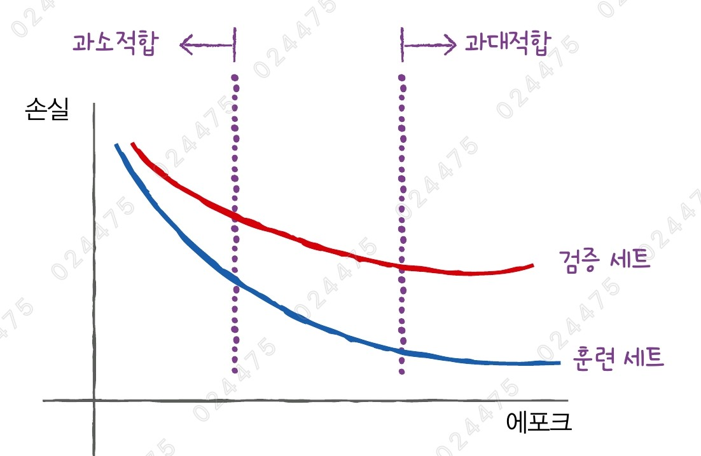

# ✔ 신경망 모델 훈련

> ['신경망 모델 훈련' 구글 코랩](https://colab.research.google.com/github/rickiepark/hg-mldl/blob/master/7-3.ipynb)

## 1️⃣ 손실 곡선

#### 1. 패션 MNIST 데이터를 가져와 전처리한 후, 훈련 세트와 검증 세트로 나누자

```py
from tensorflow import keras
from sklearn.model_selection import train_test_split

(train_input, train_target), (test_input, test_target) = keras.datasets.fashion_mnist.load_data()

train_scaled = train_input / 255.0

train_scaled, val_scaled, train_target, val_target = train_test_split(train_scaled, train_target, test_size=0.2, random_state=42)
```

#### 2. 신경망 모델을 만들자

```py
# 신경망 모델을 만드는 함수
def model_fn(a_layer=None):
    model = keras.Sequential()
    model.add(keras.layers.Flatten(input_shape=(28, 28)))
    model.add(keras.layers.Dense(100, activation='relu'))
    if a_layer:
        model.add(a_layer)
    model.add(keras.layers.Dense(10, activation='softmax'))
    return model
```

```py
model = model_fn()
model.summary()
```


#### 3. 신경망 모델을 컴파일하고 훈련하자

```py
model.compile(loss='sparse_categorical_crossentropy', metrics=['accuracy'])
history = model.fit(train_scaled, train_target, epochs=5, verbose=0)

print(history.history.keys())
# dict_keys(['accuracy', 'loss'])
```

- `verbose` 매개변수: 훈련 과정 출력을 조절
  - 1: 에포크마다 진행 막대와 함께 손실 등의 지표가 출력됨
  - 2: 진행 막대를 빼고 출력함
  - 0: 훈련 과정을 나타내지 않음
  - 기본값: 1
- 케라스의 fit() 메서드는 History 클래스 객체를 반환함
  - History 객체에는 훈련 과정에서 계산한 지표, 즉 손실과 정확도 값이 저장되어 있음
  - `history` 속성: 훈련 측정값이 담겨 있는 딕셔너리

#### 4. 손실, 정확도 그래프를 그려보자

```py
import matplotlib.pyplot as plt

plt.plot(history.history['loss'])
plt.xlabel('epoch')
plt.ylabel('loss')
plt.show()
```


```py
plt.plot(history.history['accuracy'])
plt.xlabel('epoch')
plt.ylabel('accuracy')
plt.show()
```


- 에포크마다 손실이 감소하고 정확도가 향상하는 것을 확인할 수 있음

#### 5. 에포크를 20으로 늘려 다시 손실, 정확도 그래프를 그려보자

```py
model = model_fn()
model.compile(loss='sparse_categorical_crossentropy', metrics=['accuracy'])
history = model.fit(train_scaled, train_target, epochs=20, verbose=0)
```

```py
plt.plot(history.history['loss'])
plt.xlabel('epoch')
plt.ylabel('loss')
plt.show()
```


- 마찬가지로, 손실이 잘 감소하는 것을 확인할 수 있음
- 문제점) 지금까지 훈련 세트의 손실만 그렸음

## 2️⃣ 검증 손실

- 에포크에 따른 과대적합과 과소적합을 파악하려면 훈련 세트에 대한 점수뿐만 아니라 검증 세트에 대한 점수도 필요함
  - 모델이 잘 훈련되었는지 판단하려면 정확도보다는 손실 함수의 값을 확인하는 것이 더 나음
  - 이유: 인공 신경망 모델이 최적화하는 대상은 정확도가 아닌 손실 함수일 뿐더러, 이따금 손실 감소에 비례하여 정확도가 높아지지 않는 경우가 있음
- 에포크에 따른 손실과 과소적합/과대적합

   

#### 1. 에포크마다 검증 손실을 확인해보자

```py
model = model_fn()
model.compile(loss='sparse_categorical_crossentropy', metrics=['accuracy'])
history = model.fit(train_scaled, train_target, epochs=20, verbose=0, validation_data=(val_scaled, val_target))

print(history.history.keys())
# dict_keys(['accuracy', 'loss', 'val_accuracy', 'val_loss'])
```

- fit() 메서드에 검증 데이터를 전달하면 에포크마다 검증 손실을 계산할 수 있음
- `validation_data` 매개변수: 검증에 사용할 입력과 타깃값을 튜플로 전달받음

#### 2. 훈련 손실과 검증 손실의 그래프를 그려보자

```py
plt.plot(history.history['loss'], label='train')
plt.plot(history.history['val_loss'], label='val')
plt.xlabel('epoch')
plt.ylabel('loss')
plt.legend()
plt.show()
```


- 초기에 검증 손실이 감소하다가 3번째 에포크 만에 다시 상승해 과대적합 모델이 만들어짐
- 검증 손실이 상승하는 시점을 가능한 뒤로 늦추면 검증 세트에 대한 손실이 늦춰질 뿐만 아니라 검증 세트에 대한 정확도도 증가할 것임

#### 3. Adam 옵티마이저를 사용해 다시 모델을 훈련하고 손실 그래프를 그려보자

```py
model = model_fn()
model.compile(optimizer='adam', loss='sparse_categorical_crossentropy', metrics=['accuracy'])
history = model.fit(train_scaled, train_target, epochs=20, verbose=0, validation_data=(val_scaled, val_target))
```

```py
plt.plot(history.history['loss'], label='train')
plt.plot(history.history['val_loss'], label='val')
plt.xlabel('epoch')
plt.ylabel('loss')
plt.legend()
plt.show()
```


- 일곱 번째 에포크까지 전반적인 감소 추세가 이어진 것을 보니, 과대적합이 훨씬 줄어들었음을 알 수 있음
- Adam 옵티마이저가 이 데이터셋에 잘 맞았음

## 3️⃣ 드롭아웃

- 훈련 과정에서 층에 있는 일부 뉴런을 랜덤하게 꺼서(즉 뉴런의 출력을 0으로 만들어) 과대적합을 막음
  - 얼마나 많은 뉴런을 드롭할지는 하이퍼파라미터임
- 드롭아웃이 과대적합을 막는 이유
  - 이전 층의 일부 뉴런이 랜덤하게 꺼지면 특정 뉴런에 과대하게 의존하는 것을 줄일 수 있고 모든 입력에 대해 주의를 기울어야 함
  - 드롭아웃이 적용된 2개의 신경망은 마치 2개의 신경망을 앙상블하는 것처럼 볼 수 있는데, 앙상블은 과대적합을 막는 아주 좋은 기법임

#### 1. 드롭아웃 층을 추가한 신경망 모델을 만들자

```py
model = model_fn(keras.layers.Dropout(0.3))
model.summary()
```


- `Dropout` 클래스: 어떤 층의 뒤에 드롭아웃을 두어 이 층의 출력을 랜덤하게 0으로 만듦
  - 훈련되는 모델 파라미터는 없음
  - 입력과 출력의 크기가 같음

#### 2. 모델을 컴파일하고 훈련한 후, 훈련 손실과 검증 손실 그래프를 그려보자

```py
model.compile(optimizer='adam', loss='sparse_categorical_crossentropy', metrics=['accuracy'])
history = model.fit(train_scaled, train_target, epochs=20, verbose=0, validation_data=(val_scaled, val_target))
```

```py
plt.plot(history.history['loss'], label='train')
plt.plot(history.history['val_loss'], label='val')
plt.xlabel('epoch')
plt.ylabel('loss')
plt.legend()
plt.show()
```


- 훈련이 끝난 뒤에 평가나 예측을 수행할 때는 드롭아웃을 적용하지 말아야 함
- 케라스는 모델을 평가와 예측을 사용할 때는 자동으로 드롭아웃을 적용하지 않음
- 열두 번째 에포크 정도에서 검증 손실의 감소가 멈추지만 과대적합이 확실히 줄었음
- 과대적합 되지 않은 모델을 얻기 위해 에포크 횟수를 11로 하고 다시 훈련해야함

## 4️⃣ 모델 저장과 복원

#### 1. 에포크 횟수를 11로 다시 지정하고 신경망 모델을 훈련하자

```py
model = model_fn(keras.layers.Dropout(0.3))
model.compile(optimizer='adam', loss='sparse_categorical_crossentropy', metrics=['accuracy'])
history = model.fit(train_scaled, train_target, epochs=10, verbose=0, validation_data=(val_scaled, val_target))
```

#### 2. 훈련한 모델을 저장하자

```py
model.save('model-whole.keras')
```

- `save()` 메서드: 모델 구조와 파라미터를 함께 저장함
  - '.keras' 확장자를 가진 파일에 필요한 정보를 모두 압축하여 저장함

```py
model.save_weights('model.weights.h5')
```

- `save_weights()` 메서드: 훈련된 모델의 파라미터만 저장함
  - HDF5 포맷으로 저장하며 파일의 확장자는 'weights.h5'로 끝나야 함

#### 3. 'model.weights.h5' 파일에서 훈련된 모델 파라미터를 읽어서 사용해보자

```py
model = model_fn(keras.layers.Dropout(0.3))
model.load_weights('model.weights.h5')
```

- 훈련하지 않은 새로운 모델을 만들고 이전에 저장했던 모델 파라미터를 적재함
- `load_weights()` 메서드: 모델에 모델 파라미터를 적재함
  - 이 메서드를 사용하려면 save_weights() 메서드로 저장했던 모델과 정확히 같은 구조를 가져야 함

#### 4. 모델의 검증 정확도를 확인해보자

```py
import numpy as np

val_labels = np.argmax(model.predict(val_scaled), axis=-1)
print(np.mean(val_labels == val_target))
```


- `predict()` 메서드: 예측을 수행
  - 패션 MNIST 데이터셋이 다중 분류 문제이기 때문에 샘플마다 10개의 클래스에 대한 확률을 반환함
  - 이진 분류 문제라면 양성 클래스에 대한 확률 하나만 반환함
- `argmax()` 함수: 배열에서 가장 큰 값의 인덱스를 반환함
  - axis=0: 행을 따라 최댓값의 인덱스를 선택함
  - axis=1: 열을 따라 최댓값의 인덱스를 선택함
  - axis=-1: 배열의 마지막 차원을 따라 최댓값을 고름
  - 이 검증 세트는 2차원 배열이기 때문에 마지막 차원은 1이 됨

#### 5. 'model-whole.keras'에서 훈련된 모델을 읽어서 검증 정확도를 확인해보자

```py
model = keras.models.load_model('model-whole.keras')
model.evaluate(val_scaled, val_target)
```


- `load_model()` 함수: 모델 파라미터뿐만 아니라 모델 구조와 옵티마이저 상태까지 모두 복원함

## 5️⃣ 콜백

- 훈련 과정 중간에 어떤 작업을 수행할 수 있게 하는 객체

### ModelCheckpoint 콜백

- 기본적으로 에포크마다 모델을 저장함
- `save_best_only` 매개변수: True로 지정하면 가장 낮은 검증 손실을 만드는 모델을 저장할 수 있음

#### 1. ModelCheckpoint 콜백을 사용해 신경망 모델을 훈련하자

```py
model = model_fn(keras.layers.Dropout(0.3))
model.compile(optimizer='adam', loss='sparse_categorical_crossentropy', metrics=['accuracy'])

checkpoint_cb = keras.callbacks.ModelCheckpoint('best-model.keras', save_best_only=True)

model.fit(train_scaled, train_target, epochs=20, verbose=0, validation_data=(val_scaled, val_target), callbacks=[checkpoint_cb])
```

- `callbacks` 매개변수: 여러 개의 콜백을 리스트 형태로 받음

#### 2. 'best-model.keras'에서 훈련된 모델을 읽어서 검증 정확도를 확인해보자

```py
model = keras.models.load_model('best-model.keras')
model.evaluate(val_scaled, val_target)
```


- ModelCheckpoint 콜백이 가장 낮은 검증 손실 모델을 자동으로 저장한 것을 알 수 있음

### EarlyStopping 콜백

- 사실 검증 점수가 상승하기 시작하면 그 이후에는 과대적합이 더 커지기 때문에 훈련을 계속할 필요가 없음
- 조기 종료(early stopping): 과대적합이 시작되기 전에 훈련을 미리 중지하는 것
- 훈련 에포크 횟수를 제한하는 역할이지만 모델이 과대적합되는 것을 막아 주기 때문에 규제 방법 중 하나로 생각할 수 있음
- 컴퓨터 자원과 시간을 아낄 수 있는 장점이 있음
- `patience` 매개변수: 검증 점수가 향상되지 않더라도 참을 에포크 횟수를 지정
- `restore_best_weights` 매개변수: True로 지정하면 가장 낮은 검증 손실을 낸 모델 파라미터로 되돌림

#### 1. ModelCheckpoint 콜백, EarlyStopping 콜백을 사용해 신경망 모델을 훈련하자

```py
model = model_fn(keras.layers.Dropout(0.3))
model.compile(optimizer='adam', loss='sparse_categorical_crossentropy', metrics=['accuracy'])

checkpoint_cb = keras.callbacks.ModelCheckpoint('best-model.keras', save_best_only=True)
early_stopping_cb = keras.callbacks.EarlyStopping(patience=2, restore_best_weights=True)

history = model.fit(train_scaled, train_target, epochs=20, verbose=0, validation_data=(val_scaled, val_target), callbacks=[checkpoint_cb, early_stopping_cb])
```

- 2번 연속 검증 점수가 향상되지 않으면 훈련을 중지하도록 했음

```py
print(early_stopping_cb.stopped_epoch)  # 16
```

- `stopped_epoch` 속성: 몇 번째 에포크에서 훈련이 중지되었는지 저장
- 열일곱 번째 에포크에서 훈련이 중지되었음
- patience=2이므로 최상의 모델은 열다섯 번째 에포크일 것임

#### 2. 훈련 손실과 검증 손실 그래프를 그려보자

```py
plt.plot(history.history['loss'], label='train')
plt.plot(history.history['val_loss'], label='val')
plt.xlabel('epoch')
plt.ylabel('loss')
plt.legend()
plt.show()
```


- 열다섯 번째 에포크(epoch=14)에서 가장 낮은 손실을 기록했고, 열일곱 번째 에포크(epoch=16)에서 훈련이 중지된 것을 알 수 있음

#### 3. 조기 종료로 얻은 모델을 사용해 검증 정확도를 확인해보자

```py
model.evaluate(val_scaled, val_target)
```


## cf) 핵심 패키지와 함수

### Keras

#### `Dropout` 층

- 드롭아웃 층
- 첫 번째 매개변수로 드롭아웃 할 비율(r)을 지정함
- 드롭아웃 하지 않는 뉴런의 출력은 1/(1-r)만큼 증가시켜 출력의 총합이 같도록 만듦

#### `save_weights()` 메서드

- 모든 층의 가중치와 절편을 파일에 저장
- 첫 번째 매개변수에 저장할 파일을 지정
- save_format 매개변수
  - 저장할 파일 포맷을 지정
  - 기본적으로 HDF5 포맷으로 저장
  - 파일 이름은 반드시 '.weights.h5'로 끝나야 함

#### `load_weights()` 메서드

- 모든 층의 가중치와 절편을 파일에서 읽음
- 첫 번째 매개변수에 읽을 파일을 지정

#### `save()` 메서드

- 모델 구조와 모든 가중치와 절편을 파일에 저장
- 첫 번째 매개변수에 저장할 파일을 지정
- save_format 매개변수
  - 저장할 파일 포맷을 지정
  - 기본적으로 케라스 3.x 포맷으로 저장
  - 파일 이름은 반드시 '.keras'로 끝나야 함

#### `load_model()` 메서드

- model.save()로 저장된 모델을 로드
- 첫 번째 매개변수에 읽을 파일을 지정

#### `ModelCheckpoint` 콜백

- 케라스 모델과 가중치를 일정 간격으로 저장
- 첫 번째 매개변수에 저장할 파일을 지정
- monitor 매개변수
  - 모니터링할 지표를 지정
  - 기본값: 'val_loss' (검증 손실을 관찰)
- save_weights_only 매개변수
  - 기본값: False (전체 모델을 저장)
  - True로 지정하면 모델의 가중치와 절편만 저장
- save_best_only 매개변수
  - True로 지정하면 가장 낮은 검증 점수를 만드는 모델을 저장

#### `EarlyStopping` 콜백

- 관심 지표가 더이상 향상하지 않으면 훈련을 중지함
- monitor 매개변수
  - 모니터링할 지표를 지정
  - 기본값: 'val_loss' (검증 손실을 관찰)
- patience 매개변수
  - 모델이 더 이상 향상되지 않고 지속할 수 있는 최대 에포크 횟수를 지정
- restore_best_weights 매개변수
  - 최상의 모델 가중치를 복원할지 지정
  - 기본값: False

### NumPy

#### `argmax` 함수

- 배열에서 축을 따라 최댓값의 인덱스를 반환
- axis 매개변수
  - 어떤 축을 따라 최댓값을 찾을지 지정
  - 기본값: None (전체 배열에서 최댓값을 찾음)
