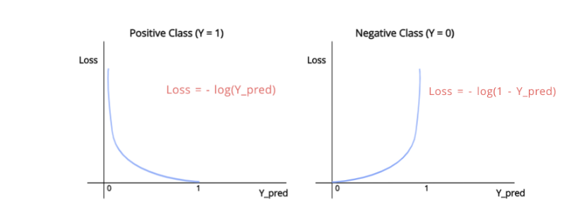
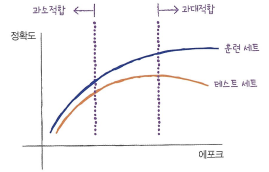
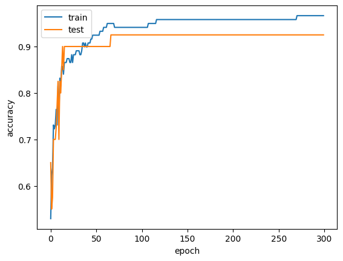

# ✔ 확률적 경사 하강법

> ['확률적 경사 하강법' 구글 코랩](https://colab.research.google.com/github/rickiepark/hg-mldl/blob/master/4-2.ipynb)

## 1️⃣ 점진적인 학습

- 점진적 학습(온라인 학습): 새로운 데이터에 대해서 조금씩 훈련하는 방식
- 확률적 경사 하강법(Stochastic Gradient Descent): 대표적인 점진적 학습 알고리즘

### 확률적 경사 하강법

- 확률적 경사 하강법: 훈련 세트에서 랜덤하게 하나의 샘플을 선택하여 가파른 경사를 조금씩 내려가는 방식
  - 전체 샘플을 모두 사용할 때까지 위 과정을 계속함
  - 모든 샘플을 다 사용해도 만족할만한 위치까지 도달하지 못하면 다시 위 과정을 처음부터 시작하면 됨
- 에포크(epoch): 확률적 경사 하강법에서 훈련 세트를 한 번 모두 사용하는 과정
  - 일반적으로 경사 하강법은 수십, 수백 번 이상 에포크를 수행함
- 미니 배치 경사 하강법: 랜덤하게 여러 개의 샘플을 선택해서 경사 하강법을 수행하는 방식
- 배치 경사 하강법: 전체 샘플을 사용해 경사 하강법을 수행하는 방식
  - 전체 데이터를 사용하면 그만큼 컴퓨터 자원을 많이 사용하게 됨
  - 데이터가 너무 많아 한 번에 전체 데이터를 모두 읽을 수 없을 수도 있음
- 신경망 모델은 일반적으로 많은 데이터를 사용하기 때문에, 확률적 경사 하강법이나 미니배치 경사 하강법을 사용함

### 손실 함수

- 확률적 경사 하강법이 최적화할 대상
- 손실 함수(loss function): 모델이 얼마나 엉터리인지를 측정하는 기준
  - 따라서, 손실 함수의 값이 작을수록 좋음
  - 사실 '손실 함수'는 샘플 하나에 대한 손실을 정의하고 '비용 함수'는 훈련 세트에 있는 모든 샘플에 대한 손실 함수의 합을 의미하지만, 둘을 엄격히 구분하지 않고 사용함
- 손실 함수는 연속적이어야 함
  - 정확도(= 맞힌 개수 / 전체 개수)는 연속적이지 않으므로 손실 함수로 사용하기엔 적절하지 않음
- 손실 함수 종류
  - 이진 분류에서는 **로지스틱 손실 함수**를 사용
  - 다중 분류에서는 **크로스엔트로피 손실 함수**를 사용
  - 회귀에서는 **평균 절댓값 오차** 또는 **평균 제곱 오차**를 사용
    - 평균 절댓값 오차: 타깃에서 예측을 뺀 절댓값을 모든 샘플에 평균한 값
    - 평균 제곱 오차: 타깃에서 예측을 뺀 값을 제곱한 다음 모든 샘플에 평균한 값

#### 로지스틱 손실 함수



- '이진 크로스엔트로피 손실 함수'라고도 부름
- 양성 클래스(타깃=1)인 경우
  - 손실 = - log(양성 클래스에 대한 예측 확률)
  - 예측 확률이 1에서 멀어져 0에 가까워질수록 손실은 아주 큰 양수가 됨
- 음성 클래스(타깃=0)인 경우
  - 손실 = - log(1 - 양성 클래스에 대한 예측 확률)
  - 예측 확률이 0에서 멀어져 1에 가까워질수록 손실은 아주 큰 양수가 됨

## 2️⃣ SDGClassifier

#### 1. 생선 데이터를 데이터프레임으로 저장하자

```py
import pandas as pd

fish = pd.read_csv('https://bit.ly/fish_csv_data')
```

#### 2. 입력 데이터와 타깃 데이터를 만들자

```py
fish_input = fish[['Weight','Length','Diagonal','Height','Width']]
fish_target = fish['Species']
```

#### 3. 훈련 세트와 테스트 세트로 나누자

```py
from sklearn.model_selection import train_test_split

train_input, test_input, train_target, test_target = train_test_split(
    fish_input, fish_target, random_state=42)
```

#### 4. 훈련 세트와 테스트 세트를 표준화 전처리하자

```py
from sklearn.preprocessing import StandardScaler

ss = StandardScaler()
ss.fit(train_input)
train_scaled = ss.transform(train_input)
test_scaled = ss.transform(test_input)
```

#### 5. 확률적 경사 하강 분류 모델을 훈련하고 테스트 해보자

```py
from sklearn.linear_model import SGDClassifier

sc = SGDClassifier(loss='log_loss', max_iter=10, random_state=42)
sc.fit(train_scaled, train_target)

print(sc.score(train_scaled, train_target))  # 0.773
print(sc.score(test_scaled, test_target))  # 0.775
```

- `loss`: 손실 함수의 종류 지정
  - 'log_loss': 로지스틱 손실 함수
  - 다중 분류에서 'log_loss'로 지정하면 클래스마다 이진 분류 모델을 만듦
- `max_iter`: 수행할 에포크 횟수 지정
- 결과를 보면, 훈련 세트와 테스트 세트 모두 정확도가 낮음

#### 6. 훈련한 모델을 추가로 1 에포크 이어서 훈련해보자

```py
sc.partial_fit(train_scaled, train_target)

print(sc.score(train_scaled, train_target))  # 0.798
print(sc.score(test_scaled, test_target))  # 0.775
```

- `partial_fit()`: 모델을 이어서 훈련할 때 사용하는 메서드
  - 호출할 때마다 1 에포크씩 이어서 훈련할 수 있음
- 에포크를 한번 더 실행하니 이전보다 정확도가 조금 향상되었음

## 3️⃣ 에포크와 과대/과소적합

- 확률적 경사 하강법을 사용한 모델은 에포크 횟수에 따라 과소적합이나 과대적합이 될 수 있음

  - 에포크 횟수가 적으면 모델이 훈련 세트를 덜 학습해 과소적합 될 가능성이 높음
  - 에포크 횟수가 많으면 모델이 훈련 세트를 완전히 학습해 과대적합 될 가능성이 높음

- 훈련 세트 점수는 에포크가 진행될수록 꾸준히 증가하지만, 테스트 세트 점수는 어느 순간 감소하기 시작함

  - 바로 이 지점이 모델이 과대적합되기 시작되는 곳임

  

- 조기 종료(early stopping): 과대적합이 시작되기 전에 훈련을 멈추는 것

#### 1. 확률적 경사 하강 분류 모델을 300번의 에포크 동안 반복해서 훈련하자

```py
import numpy as np

sc = SGDClassifier(loss='log_loss', random_state=42)
classes = np.unique(train_target)

train_score = []
test_score = []
for _ in range(0, 300):
    sc.partial_fit(train_scaled, train_target, classes=classes)
    train_score.append(sc.score(train_scaled, train_target))
    test_score.append(sc.score(test_scaled, test_target))
```

- partial_fit() 메서드만 사용하려면 훈련 세트에 있는 전체 클래스의 레이블을 partial_fit() 메서드에 전달해 주어야 함

#### 2. 각 에포크 동안 기록한 훈련 세트와 테스트 세트의 점수를 그래프로 그려보자

```py
import matplotlib.pyplot as plt

plt.plot(train_score)
plt.plot(test_score)
plt.xlabel('epoch')
plt.ylabel('accuracy')
plt.show()
```



- 에포크 초기에는 과소적합되어 훈련 세트와 테스트 세트의 점수가 낮음
- 100번째 에포크 이후에 훈련 세트와 테스트 세트의 점수가 조금씩 벌어지고 있음
- 즉, 100번 정도의 에포크가 적절한 반복 횟수임을 알 수 있음

#### 3. 반복 횟수를 100으로 설정하고 모델을 다시 훈련해 보자

```py
sc = SGDClassifier(loss='log_loss', max_iter=100, tol=None, random_state=42)
sc.fit(train_scaled, train_target)

print(sc.score(train_scaled, train_target))  # 0.958
print(sc.score(test_scaled, test_target))  # 0.925
```

- SGDClassifier는 일정 에포크 동안 성능이 향상되지 않으면 더 훈련하지 않고 자동으로 멈춤
- `tol` 매개변수: 향상될 최솟값을 지정
  - None으로 지정하면 자동으로 멈추지 않고 max_iter 횟수만큼 반복하게 됨

#### 번외) 힌지 손실을 사용해 모델을 훈련해 보자

```py
sc = SGDClassifier(loss='hinge', max_iter=100, tol=None, random_state=42)
sc.fit(train_scaled, train_target)

print(sc.score(train_scaled, train_target))  # 0.949
print(sc.score(test_scaled, test_target))  # 0.925
```

- SGDClassifier는 `loss` 매개변수에 다양한 종류의 손실 함수를 지정할 수 있음
- `loss` 매개변수의 기본값은 'hinge'(힌지 손실, 또는 서포트 벡터 머신)임

## cf) 핵심 패키지와 함수

### scikit-learn

#### `SDGClassifier` 클래스

- 확률적 경사 하강법을 사용한 분류 모델을 만듦
- loss 매개변수
  - 확률적 경사 하강법으로 최적화할 손실 함수를 지정함
  - 로지스틱 회귀를 위해서는 'log_loss'로 지정함
  - 기본값: (서포트 벡터 머신을 위한) 'hinge' 손실 함수
- penalty 매개변수
  - 규제의 종류를 지정
  - 'l1': L1 규제
  - 기본값: 'l2' (L2 규제)
- alpha 매개변수
  - 규제 강도를 지정
  - 기본값: 0.0001
- max_iter 매개변수
  - 에포크 횟수를 지정
  - 기본값: 100
- tol 매개변수
  - 반복을 멈출 조건
  - n_iter_no_change 매개변수에서 지정한 에포크 동안 손실이 tol만큼 줄어들지 않으면 알고리즘이 중단됨
  - 기본값: 0.001
- n_iter_no_change 매개변수
  - 기본값: 5

#### `SDGRegressor` 클래스

- 확률적 경사 하강법을 사용한 회귀 모델을 만듦
- loss 매개변수
  - 손실 함수를 지정
  - 기본값: 'squared_loss' (제곱 오차)
- 위에서 설명한 `SDGClassifier`의 매개변수 모두 `SDGRegressor`에서 동일하게 사용됨
