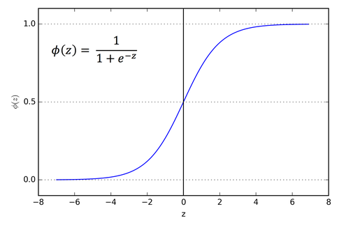
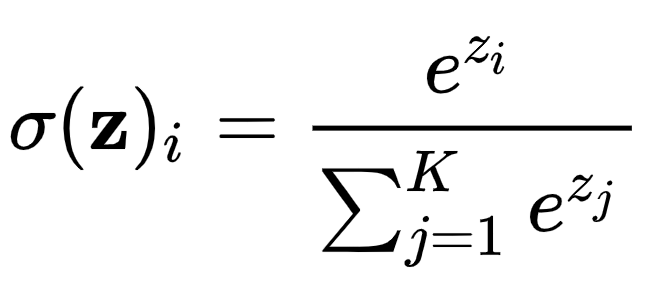

# ✔ 로지스틱 회귀

> ['로지스틱 회귀' 구글 코랩](https://colab.research.google.com/github/rickiepark/hg-mldl/blob/master/4-1.ipynb)

## 1️⃣ 럭키백의 확률

- 생선의 길이, 높이, 대각선 길이, 두께가 주어졌을 때 7개 생선에 대한 확률을 알아보자
- 일단, k-최근접 이웃 분류기로 럭키백에 들어간 생선의 확률을 계산해보자

### 데이터 준비하기

#### 1. 생선 데이터를 데이터프레임으로 저장하자

```py
import pandas as pd

fish = pd.read_csv('https://bit.ly/fish_csv_data')
fish.head()
```

- 데이터프레임: 판다스가 제공하는 2차원 표 형식의 주요 데이터 구조
  - 열과 행으로 이루어져 있음
  - 통계와 그래프를 위한 메서드를 제공함
  - 넘파이로 상호 전환이 쉽고 사이킷런과도 잘 호환됨

```py
print(pd.unique(fish['Species']))
# ['Bream' 'Roach' 'Whitefish' 'Parkki' 'Perch' 'Pike' 'Smelt']
```

- `unique()`: 고유한 값 추출

#### 2. 입력 데이터와 타깃 데이터를 만들자

```py
fish_input = fish[['Weight','Length','Diagonal','Height','Width']]
fish_target = fish['Species']
```

#### 3. 훈련 세트와 테스트 세트로 나누자

```py
from sklearn.model_selection import train_test_split

train_input, test_input, train_target, test_target = train_test_split(
    fish_input, fish_target, random_state=42)
```

#### 4. 훈련 세트와 테스트 세트를 표준화 전처리하자

```py
from sklearn.preprocessing import StandardScaler

ss = StandardScaler()
ss.fit(train_input)
train_scaled = ss.transform(train_input)
test_scaled = ss.transform(test_input)
```

### k-최근접 이웃 분류기의 확률 예측

#### 1. k-최근접 이웃 분류 모델을 훈련하고 테스트 해보자

```py
from sklearn.neighbors import KNeighborsClassifier

kn = KNeighborsClassifier(n_neighbors=3)
kn.fit(train_scaled, train_target)

print(kn.score(train_scaled, train_target))  # 0.89
print(kn.score(test_scaled, test_target))  # 0.85
```

- 다중 분류(multi-class classification): 2개 이상의 클래스를 분류하는 것
- 이진 분류를 사용했을 때는 양성 클래스와 음성 클래스를 각각 1과 0으로 지정하여 타깃 데이터를 만들었음
- 다중 분류에서도 타깃값을 숫자로 바꾸어 입력할 수 있지만, 사이킷런에서는 편리하게도 문자열로 된 타깃값을 그대로 사용할 수 있음
- 이때, 타깃값을 그대로 사이킷런 모델에 전달하면 순서가 자동으로 알파벳 순으로 매겨짐

```py
print(kn.classes_)
# ['Bream' 'Parkki' 'Perch' 'Pike' 'Roach' 'Smelt' 'Whitefish']
```

- `class_` 속성: '정렬'된 타깃값을 저장함

#### 2. 테스트 세트에서 처음 5개 샘플의 타깃값을 예측해보자

```py
print(kn.predict(test_scaled[:5]))
# ['Perch' 'Smelt' 'Pike' 'Perch' 'Perch']
```

```py
import numpy as np

proba = kn.predict_proba(test_scaled[:5])
print(np.round(proba, decimals=4))
"""
[[0.     0.     1.     0.     0.     0.     0.    ]
 [0.     0.     0.     0.     0.     1.     0.    ]
 [0.     0.     0.     1.     0.     0.     0.    ]
 [0.     0.     0.6667 0.     0.3333 0.     0.    ]
 [0.     0.     0.6667 0.     0.3333 0.     0.    ]]
"""
```

- `predict_proba()`: 클래스별 확률값을 반환함

  - 출력 순서는 `classes_` 속성과 같음
  - 순서: 'Bream', 'Parkki', 'Perch', 'Pike', 'Roach', 'Smelt', 'Whitefish'

- `round()`: decimals 매개변수를 사용해 유지할 소수점 아래 자릿수를 지정할 수 있음
  - 기본으로 소수점 첫째 자리에서 반올림함

#### 3. 위 네 번째 샘플의 최근접 이웃의 클래스를 확인해보자

```py
distances, indexes = kn.kneighbors(test_scaled[3:4])
print(train_target.iloc[indexes[0]])  # [['Roach' 'Perch' 'Perch']]
```

- `kneighbors()` 메서드의 입력은 2차원 배열이어야 함
  - 이를 위해 넘파이 배열의 슬라이싱 연산자를 사용함
  - 슬라이싱 연산자는 하나의 샘플만 선택해도 항상 2차원 배열이 만들어짐
  - 반환된 indexes도 2차원 배열임
- 판다스의 `iloc` 메서드는 주어진 값을 정수 인덱스로 사용해 행이나 열을 선택함
- 현재 3개의 최근접 이웃을 사용했기 때문에 가능한 확률은 0/3, 1/3, 2/3, 3/3이 전부임
- 즉, k-최근접 이웃 모델은 확률을 출력할 수는 있지만 이웃한 샘플의 비율이므로 항상 정해진 비율만 출력함

## 2️⃣ 로지스틱 회귀

- 이름은 회귀이지만 분류 모델임
- 선형 회귀와 동일하게 선형 방정식을 학습함

  - a, b, c, d, e: 가중치 혹은 계수
  - z는 어떤 값도 가능함
  - 다만, 확률을 구하려면 0~1 (또는 0~100%) 사이 값이 되어야 함

  ```
  z = a*(weight) + b*(length) + c*(diagonal) + d*(height) + e*(width) + f
  ```

- 시그모이드 함수나 소프트맥스 함수를 사용하여 클래스 확률을 출력할 수 있음

### 시그모이드 함수 (로지스틱 함수)



- 시그모이드 함수는 하나의 선형 방정식의 출력값을 0~1 사이로 압축함
- z가 무한히 큰 음수인 경우, 시그모이드 함수는 0에 가까워짐
- z가 무한히 큰 양수인 경우, 시그모이드 함수는 1에 가까워짐
- z가 0이면, 시그모이드 함수는 0.5가 됨
- 즉, z가 어떤 값이든 시그모이드 함수는 0~1 사이임

### 소프트맥스 함수



- 소프트맥스 함수는 여러 개의 선형 방정식의 출력값을 0~1 사이의 확률로 압축하고 전체 합이 1이 되도록 만듦
- 지수 함수를 사용하기 때문에 정규화된 지수 함수라고도 불림

### 로지스틱 회귀로 이진 분류 수행하기

- 이진 분류에서는 하나의 선형 방정식을 훈련함
- 이 방정식의 출력값을 시그모이드 함수에 통과시켜 0~1 사이의 값을 만듦
  - 이 값이 양성 클래스에 대한 확률임
  - 음성 클래스의 확률 = 1 - 양성 클래스의 확률
- 시그모이드 함수의 출력이 0.5보다 크면 양성 클래스, 0.5보다 작으면 음성 클래스로 판단함
  - 정확히 0.5일 때는 사이킷런의 경우 음성 클래스로 판단함

#### 1. 훈련 세트에서 도미(Bream)와 빙어(Smelt)의 행만 골라내자

```py
bream_smelt_indexes = (train_target == 'Bream') | (train_target == 'Smelt')
train_bream_smelt = train_scaled[bream_smelt_indexes]
target_bream_smelt = train_target[bream_smelt_indexes]
```

- `train_target == 'Bream'` 식은 train_target 배열에서 'Bream'인 것은 True이고 그 외는 모두 False인 배열을 반환함
- 비트 OR 연산자(|)를 사용해 도미와 빙어에 대한 행만 골라냄
- 불리언 인덱싱: 넘파이 배열은 True, False 값을 전달하여 행을 선택할 수 있음

#### 2. 로지스틱 회귀 모델을 훈련해보자

```py
from sklearn.linear_model import LogisticRegression

lr = LogisticRegression()
lr.fit(train_bream_smelt, target_bream_smelt)
```

#### 3. 처음 5개 샘플을 예측해보자

```py
print(lr.predict(train_bream_smelt[:5]))
# ['Bream' 'Smelt' 'Bream' 'Bream' 'Bream']

print(lr.predict_proba(train_bream_smelt[:5]))
"""
[[0.99760007 0.00239993]
 [0.02737325 0.97262675]
 [0.99486386 0.00513614]
 [0.98585047 0.01414953]
 [0.99767419 0.00232581]]
"""

print(lr.classes_)
# ['Bream' 'Smelt']
```

- `predict_proba()`: 예측 확률 반환
- 첫 번째 열이 음성 클래스(0)에 대한 확률이고, 두 번째 열이 양성 클래스(1)에 대한 확률임
- 사이킷런은 타깃값을 알파벳 순으로 정렬하기 때문에, 빙어(Smelt)가 양성 클래스임

#### 4. 로지스틱 회귀가 학습한 계수를 확인해보자

```py
print(lr.coef_, lr.intercept_)
# [[-0.40451732 -0.57582787 -0.66248158 -1.01329614 -0.73123131]] [-2.16172774]
```

- 즉, 로지스틱 회귀 모델이 학습한 방정식은 아래와 같음

  ```
  z = -0.405*(weight) - 0.576*(length) - 0.662*(diagonal) - 1.013*(height) - 0.731*(width) - 2.162
  ```

#### 5. 처음 5개 샘플의 z값, 확률을 출력해보자

```py
decisions = lr.decision_function(train_bream_smelt[:5])
print(decisions)
# [-6.02991358  3.57043428 -5.26630496 -4.24382314 -6.06135688]
```

- `decision_function()`: z 값을 반환
  - 이진 분류인 경우, 양성 클래스에 대한 z값을 반환함

```py
from scipy.special import expit

print(expit(decisions))
# [0.00239993 0.97262675 0.00513614 0.01414953 0.00232581]
```

- z 값을 시그모이드 함수에 통과시키면 확률을 얻을 수 있음
- `expit()`: 시그모이드 함수를 적용한 결과를 반환
- 결과를 보면, predict_proba() 메서드 출력의 두 번째 열의 값(양성 클래스에 대한 확률)과 동일함

### 로지스틱 회귀로 다중 분류 수행하기

- 다중 분류에서는 클래스 개수만큼 선형 방정식을 훈련함
- 각 방정식의 출력값을 소프트맥스 함수에 통과시켜 전체 클래스에 대한 합이 항상 1이 되도록 만듦
  - 이 각각의 값은 각 클래스에 대한 확률임

#### 1. 7개의 생선 데이터로 로지스틱 회귀 모델을 훈련하고 테스트 해보자

```py
lr = LogisticRegression(C=20, max_iter=1000)
lr.fit(train_scaled, train_target)

print(lr.score(train_scaled, train_target))  # 0.933
print(lr.score(test_scaled, test_target))  # 0.925
```

- `max_iter`: 반복 횟수를 지정 (기본값: 100)
  - LogisticRegression 클래스는 기본적으로 반복적인 알고리즘을 사용함
  - 여기서 준비한 데이터셋을 사용해 모델을 훈련하면 반복 횟수가 부족하다는 경고가 발생함
  - 따라서, 충분히 훈련시키기 위해 반복 횟수를 1000으로 늘림
- `C`: 규제를 제어 (기본값: 1)
  - LogisticRegression 클래스는 기본적으로 릿지 회귀처럼 계수의 제곱을 규제함(L2 규제)
  - 릿지 회귀에서의 alpha와 달리, 값이 작을수록 규제가 커짐
  - 여기선 규제를 완화하기 위해 20으로 둠

#### 2. 처음 5개 샘플을 예측해보자

```py
print(lr.predict(test_scaled[:5]))
# ['Perch' 'Smelt' 'Pike' 'Roach' 'Perch']

proba = lr.predict_proba(test_scaled[:5])
print(np.round(proba, decimals=3))
"""
[[0.    0.014 0.842 0.    0.135 0.007 0.003]
 [0.    0.003 0.044 0.    0.007 0.946 0.   ]
 [0.    0.    0.034 0.934 0.015 0.016 0.   ]
 [0.011 0.034 0.305 0.006 0.567 0.    0.076]
 [0.    0.    0.904 0.002 0.089 0.002 0.001]]
"""

print(lr.classes_)
# ['Bream' 'Parkki' 'Perch' 'Pike' 'Roach' 'Smelt' 'Whitefish']
```

- 이진 분류는 샘플마다 2개의 확률을 출력하고, 다중 분류는 샘플마다 클래스 개수만큼 확률을 출력함
- 이 중에서 가장 높은 확률이 예측 클래스가 됨

#### 3. 로지스틱 회귀가 학습한 계수를 확인해보자

```py
print(lr.coef_.shape, lr.intercept_.shape)  # (7, 5) (7,)

print(lr.coef_, lr.intercept_)
"""
[[-1.50605455 -1.03747913  2.60919713  7.6942274  -1.18603342]
 [ 0.19200046 -1.99988812 -3.79617725  6.5031264  -2.00022754]
 [ 3.55793539  6.36988929 -8.52233732 -5.75397233  3.79233438]
 [-0.11453309  3.61060121  3.94464503 -3.62243904 -1.75981679]
 [-1.40843717 -6.09242191  5.28629633 -0.86696569  1.84518455]
 [-1.33419949  1.48153392  1.38217547 -5.6602348  -4.39228964]
 [ 0.61328846 -2.33223526 -0.90379939  1.70625807  3.70084846]]
[-0.10345047 -0.27281217  3.24444852 -0.17565069  2.64960025 -6.7204285
  1.37829306]
"""
```

- 다중 분류는 클래스마다 z 값을 하나씩 계산함
- 이 중 가장 높은 z 값을 출력하는 클래스가 예측 클래스가 됨

#### 4. 처음 5개 샘플의 z값, 확률을 출력해보자

```py
decision = lr.decision_function(test_scaled[:5])
print(np.round(decision, decimals=2))
"""
[[ -6.51   1.04   5.17  -2.76   3.34   0.35  -0.63]
 [-10.88   1.94   4.78  -2.42   2.99   7.84  -4.25]
 [ -4.34  -6.24   3.17   6.48   2.36   2.43  -3.87]
 [ -0.69   0.45   2.64  -1.21   3.26  -5.7    1.26]
 [ -6.4   -1.99   5.82  -0.13   3.5   -0.09  -0.7 ]]
"""
```

```py
from scipy.special import softmax

proba = softmax(decision, axis=1)
print(np.round(proba, decimals=3))
"""
[[0.    0.014 0.842 0.    0.135 0.007 0.003]
 [0.    0.003 0.044 0.    0.007 0.946 0.   ]
 [0.    0.    0.034 0.934 0.015 0.016 0.   ]
 [0.011 0.034 0.305 0.006 0.567 0.    0.076]
 [0.    0.    0.904 0.002 0.089 0.002 0.001]]
"""
```

- `softmax()`: 소프트맥스 함수를 적용한 결과를 반환
- `axis`: 소프트맥스를 계산할 축을 지정
  - axis=1로 지정하여 각 행(샘플)에 대해 소프트맥스를 계산함
- 앞서 구한 prob 배열과 결과가 정확히 일치함

## cf) 핵심 패키지와 함수

### scikit-learn

#### `LogisticRegression` 클래스

- 선형 분류 알고리즘인 로지스틱 회귀를 위한 클래스
- solver 매개변수
  - 사용할 알고리즘 선택
  - 'sag': 확률적 평균 경사 하강법 알고리즘
  - 'saga': 'sag'의 개선 버전
  - 'newton-cholesky': 뉴턴 방법과 숄레스키 분해를 결합하여 대규모 데이터셋에서 효율적으로 작동
  - 기본값: 'lbfgs'
- penalty 매개변수
  - L2 규제(릿지 방식)와 L1 규제(라쏘 방식)를 선택
  - 기본값: 'ls' (L2 규제를 의미)
- C 매개변수
  - 규제의 강도를 제어
  - 값이 작을수록 규제가 강해짐
  - 기본값: 1

#### `predict_proba()` 메서드

- 예측 확률을 반환
- 이진 분류의 경우, 샘플마다 음성 클래스와 양성 클래스에 대한 확률을 반환함
- 다중 분류의 경우, 샘플마다 모든 클래스에 대한 확률을 반환함

#### `decision_function()` 메서드

- 모델이 학습한 선형 방정식의 출력을 반환
- 이진 분류의 경우, 양성 클래스에 대한 z 값을 반환함
- 다중 분류의 경우, 각 클래스마다 선형 방정식을 계산함
  - 가장 큰 값의 클래스가 예측 클래스가 됨
