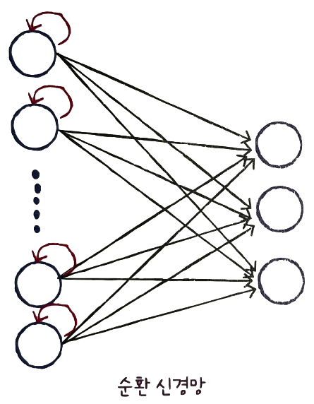
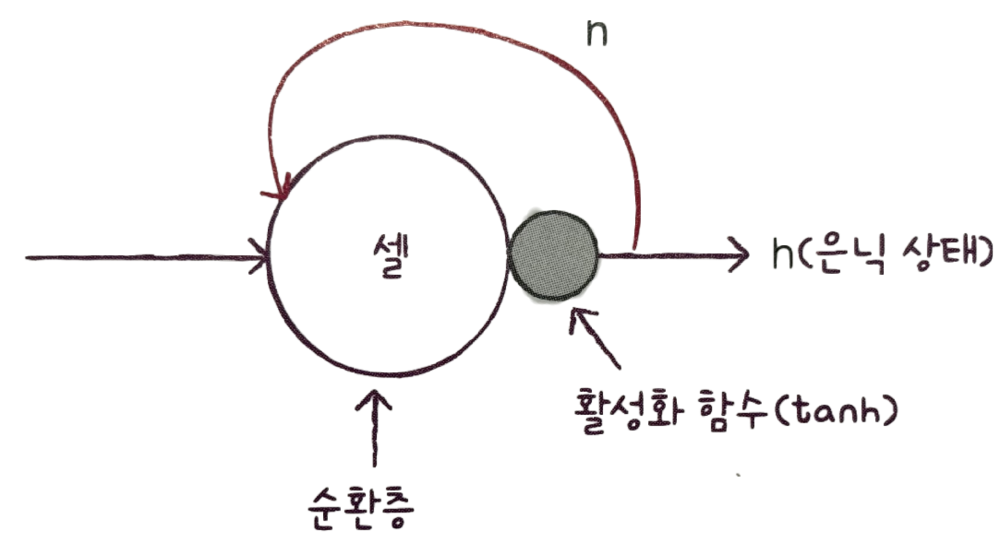
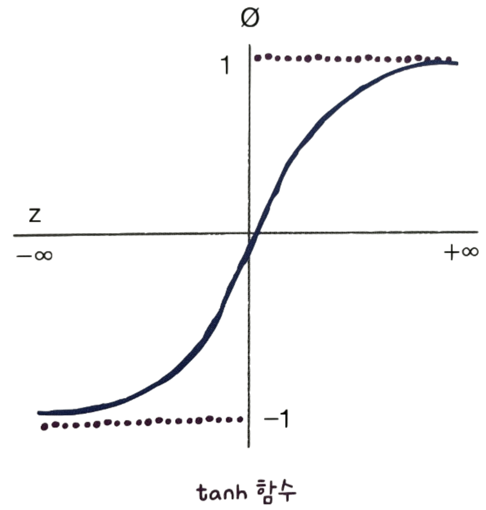
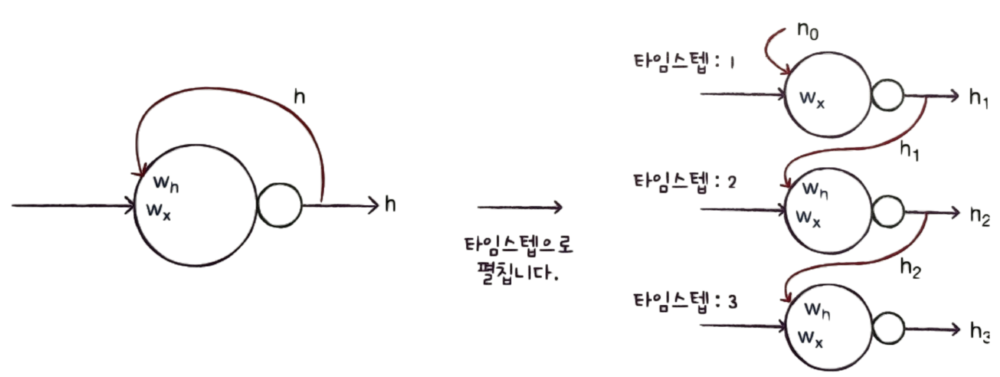
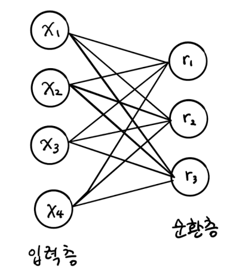
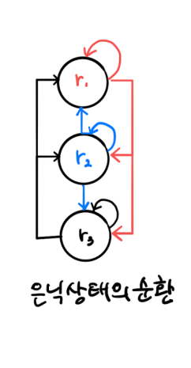
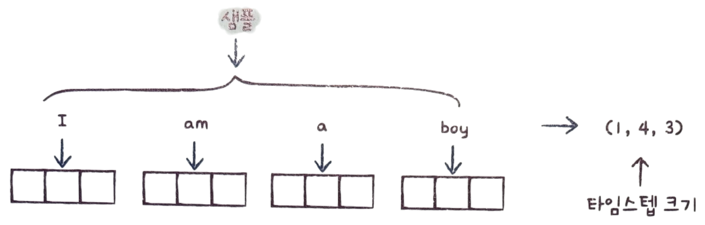
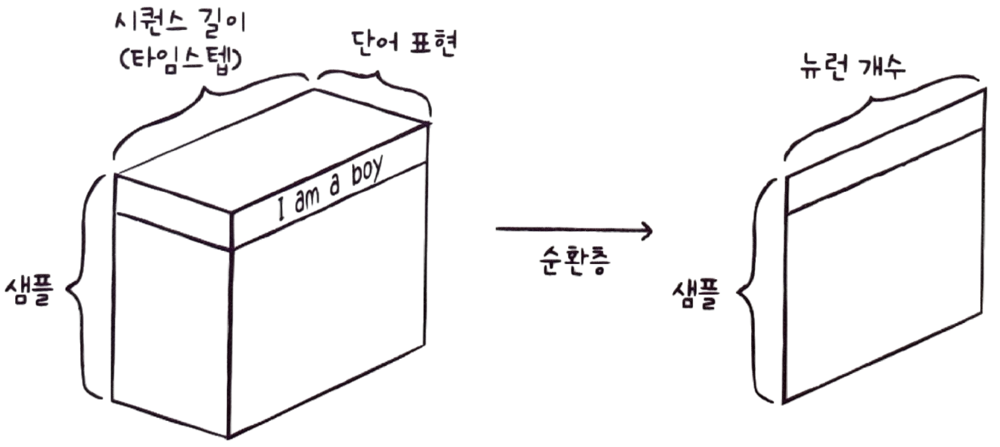
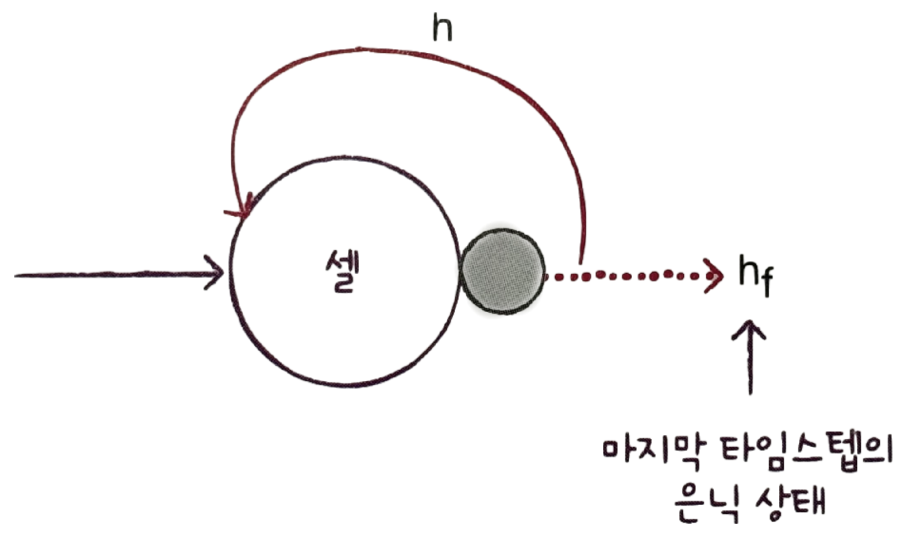
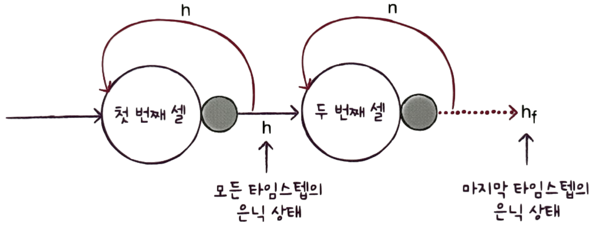

# ✔ 순차 데이터와 순환 신경망

## 1️⃣ 순차 데이터

- 순차 데이터(sequential data): 텍스트나 시계열 데이터(time series data)와 같이 순서에 의미가 있는 데이터
  - 순차 데이터 예: 글, 대화, 일자별 날씨, 일자별 판매 실적 등
- 시계열 데이터: 일정한 시간 간격으로 기록된 데이터
  - 시계열 데이터 예: 일별 온도를 기록한 데이터
- 순차 데이터는 순서를 유지하며 신경망에 주입해야 하고, 이전에 입력한 데이터를 기억하는 기능이 필요함

### 피드포워드 신경망

- Feedforward Neural Network
- 입력 데이터의 흐름이 앞으로만 전달되는 신경망
- 하나의 샘플을 사용하여 정방향 계산을 수행하고 나면 그 샘플은 버려지고 다음 샘플을 처리할 때 재사용하지 않음
- 완전 연결 신경망과 합성곱 신경망이 여기에 속함

### 순환 신경망

- Recurrent Neural Network, RNN
- 다음 샘플을 위해서 이전 데이터가 신경망 층에 순환되는 신경망
- 순차 데이터를 처리하기 위해 고안된 순환층을 1개 이상 사용한 신경망

## 2️⃣ 순환 신경망

- 어떤 샘플을 처리할 때 바로 이전에 사용했던 데이터를 재사용함
- 뉴런의 출력이 다시 자기 자신으로 전달됨

### 순환층

- 타임스텝(timestep): 샘플을 처리하는 한 단계
  - 순환 신경망은 이전 타임스텝의 샘플을 기억하지만 타임스텝이 오래될수록 순환되는 정보는 희미해짐
- 셀(cell): 순환층을 달리 부르는 말
  - 한 셀에는 여러 개의 뉴런이 있지만 완전 연결 신경망과 달리 뉴런을 모두 표시하지 않고 하나의 셀로 층을 표현함
- 은닉 상태(hidden state): 셀의 출력
  - 다음 층으로 전달될 뿐만 아니라 다음 타임스텝의 데이터를 처리할 때 재사용됨
- 층의 출력(은닉 상태)를 다음 타임 스텝에 재사용함

### tanh 함수

- Hyperbolic Tangent 함수
- 순환 신경망에서는 활성화 함수로 tanh 함수를 많이 사용함
- 시그모이드 함수와 유사하지만, 0~1 사이의 범위를 가지는 시그모이드 함수와 달리 tanh 함수는 -1~1 사이의 범위를 가짐

### 셀의 가중치

- 셀의 출력(은닉 상태)이 다음 타임스텝에 재사용되기 때문에 타임스텝으로 셀을 나누어 그릴 수 있음
- 셀은 입력과 이전 타임스텝의 은닉 상태를 사용하여 현재 타임스텝의 은닉 상태를 만듦
- $w_x$: 입력에 곱해지는 가중치
- $w_h$: 이전 타임스템의 은닉 상태에 곱해지는 가중치
  - 모든 타임스텝에서 사용되는 가중치 $w_h$는 하나임
  - 가중치 $w_h$는 타임스텝에 따라 변화되는 뉴런의 출력을 학습함
- 피드포워드 신경망과 마찬가지로 뉴런마다 하나의 절편이 포함됨
- 맨 처음 샘플을 입력할 때는 이전 타임스텝이 없으므로, $h_0$는 간단히 모두 0으로 초기화됨

## 3️⃣ 셀의 가중치와 입출력

- 가정) 순환층에 입력되는 특성의 개수가 4개이고 순환층의 뉴런이 3개라고 해보자

### 모델 파라미터

#### 가중치 $w_x$의 크기

- 입력층과 순환층의 뉴런이 모두 완전 연결됨
- $w_x$의 크기 = 4 x 3 = 12개

#### 가중치 $w_h$의 크기

- 이전 타임스텝의 은닉 상태는 다음 타임스템의 모든 뉴런에 완전히 전달됨
- 위처럼 은닉 상태가 모든 뉴런에 순환되기 때문에, 순환층을 셀 하나로 표시할 수 밖에 없었음
- $w_h$의 크기 = 3 x 3 = 9개

#### 모델 파라미터 개수

- 각 뉴런마다 하나의 절편이 있음
- 모델 파라미터 수 = $w_x$ + $w_h$ + 절편 = 12 + 9 + 3 = 24개

### 순환층의 입력

- 보통 하나의 샘플을 하나의 시퀀스(sequence)라고 말함
  - 시퀀스 안에는 여러 개의 아이템이 들어 있음
  - 시퀀스 길이 == 타임스템의 길이 (== 여기에서는 단어 개수)
- 순환층은 일반적으로 샘플마다 2개의 차원을 가짐

  - 시퀀스 길이(타임스텝) + 단어 표현

- 입력이 순환층을 통과하면 두 번째, 세 번째 차원이 사라지고 순환층의 뉴런 개수만큼 출력됨
- 즉, 한 샘플의 2차원 배열(시퀀스 길이 + 단어 표현)은 순환층을 통과하면 1차원 배열로 바뀜
  - 1차원 배열의 크기는 순환층의 뉴런 개수에 의해 결정됨

- 위에서는 셀이 모든 타임스텝에서 출력을 만드는 것처럼 표현했지만, 사실 케라스의 순환층은 기본적으로 마지막 타임스텝의 은닉 상태만 출력으로 내보냄
- 마치 입력된 시퀀스에서 읽은 모든 정보를 마지막 은닉 상태에 압축하여 전달하는 것처럼 볼 수 있음

- 순환 신경망도 다른 신경망처럼 여러 개의 층을 쌓을 수 있음
- 이때, 마지막 셀을 제외한 다른 모든 셀은 모든 타임스텝의 은닉 상태를 출력하게 됨

### 순환층의 출력

- 순환 신경망도 다른 신경망처럼 마지막에는 밀집층을 두어 클래스를 분류함
  - 다중 분류인 경우, 출력층에 클래스 개수만큼 뉴런을 두고 소프트맥스 활성화 함수를 사용
  - 이진 분류인 경우, 하나의 뉴런을 두고 시그모이드 활성화 함수를 사용
- 샘플마다 마지막 셀의 출력이 1차원이기 때문에 Flatten 클래스로 펼칠 없이 바로 출력층에 연결할 수 있음
