# ✔ 어텐션 메커니즘과 트랜스포머

## 1️⃣ 순환 신경망을 사용한 인코더-디코더 네트워크

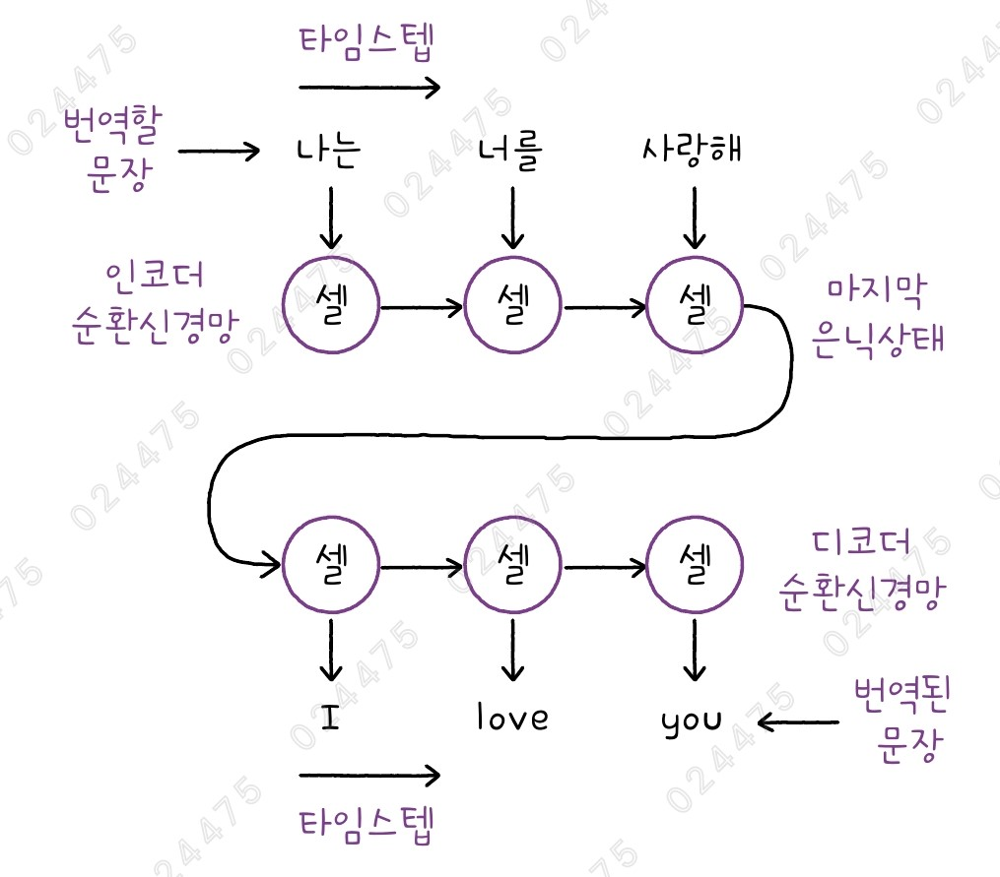

- 순환 신경망의 대표적인 한계: 시퀀스가 길어질수록 이전에 처리한 데이터를 기억하기 어려움
- 시퀀스-투-시퀀스(sequence-to-sequence) 작업: 텍스트를 입력받아 텍스트를 출력하는 작업
  - ex) 기계 번역, 문서 요약 등
- 시퀀스-투-시퀀스 작업을 수행하기 위해 보통 인코더-디코더 구조를 사용하며, 인코더와 디코더 각각에 순환 신경망을 적용할 수 있음
  - 인코더 신경망은 입력된 문장을 단어(토큰) 단위로 하나씩 처리하면서 전체 정보를 하나의 은닉 상태에 압축함
  - 디코더 신경망은 이 은닉 상태를 받아 한 단어씩 번역된 문장을 생성함
- 순환 신경망을 사용한 인코더-디코더 구조의 단점
  - 번역할 문장이 길어질수록 초기에 입력된 내용을 기억하기 어려움
  - 인코더와 디코더에서 텍스트를 한 토큰씩 처리하므로 속도가 느림
- 디코더는 이전에 생성한 토큰을 참고하면서 다음 토큰을 생성하는데 이를 자귀회귀 모델(auto regressive model)이라 함

## 2️⃣ 어텐션 메커니즘

- Attention Mechanism
- 디코더가 입력 토큰마다 중요도를 다르게 부여하는 방식
- 순환 신경망 기반 인코더-디코더 모델의 성능을 크게 향상시킨 기술
- 기존에는 디코더가 인코더의 마지막 은닉 상태만 참고하여 번역을 수행했지만, 어텐션 메커니즘을 사용하면 인코더의 모든 타임스텝에서 계산된 은닉 상태를 활용할 수 있음
- 이를 통해, 디코더가 새로운 토큰을 생성할 때 인코더에서 처리한 토큰 중 어떤 토큰에 주의를 기울일지 결정할 수 있음

### 어텐션 가중치

- 디코더는 인코더의 각 은닉 상태마다 가중치를 다르게 적용하여 더 중요한 정보를 강조함
- 이러한 가중치는 다른 모델 파라미터처럼 신경망을 훈련하면서 함께 학습됨
- 어텐션 가중치 α₁, α₂, α₃는 각기 다른 값을 가지며, 디코더의 타임스텝마다 달라질 수 있음
- 즉, 디코더가 타입스텝에서 인코더의 각기 다른 은닉 상태에 주의를 기울인다고 이해할 수 있음

### 어텐션 메커니즘의 장점과 단점

#### 장점

- 인코더의 모든 타임스텝에서 생성된 은닉 상태를 참고하기 때문에, 긴 텍스트를 처리할 때 정보 손실을 줄이는 데 매우 효과적임

#### 단점

- 어텐션 가중치를 계산하기 위해 인코더의 모든 타임스텝에서 생성된 은닉 상태를 저장해야 하므로 연산량이 증가함
- 따라서, 인코더가 처리할 수 있는 타임스텝의 최대 개수를 정해야 하며, 이로 인해 입력 텍스트의 길이가 제한될 수 있음
- 또한, 어텐션을 사용해도 여전히 한 번에 한 토큰씩 처리해야 하는 한계가 남아있음

## 3️⃣ 트랜스포머

- Transformer
- 2017년 구글 연구팀이 어텐션 메커니즘을 적극적으로 활용한 새로운 신경망 구조를 발표함
- 기존의 인코더-디코더 구조를 유지하면서도 순환 신경망을 완전히 제거했음
- 따라서, 입력 텍스트를 한 토큰씩 처리할 필요 없이 한 번에 모두 처리할 수 있음

### 트랜스포머의 작동 방식

- 트랜스포머의 인코더는 입력된 텍스트를 한 번에 모두 처리함
- 어텐션 메커니즘으로 인해 사실상 입력 텍스트의 길이에 제한은 있지만, 한 번에 모두 처리할 수 있어 모델의 처리 속도가 크게 향상됨
- 트랜스포머는 순환 신경망을 사용하지 않으므로, 은닉 상태 대신 은닉 벡터(단어 벡터, 임베딩 벡터)라는 표현을 사용함
- 디코더는 인코더에서 전달받은 은닉 벡터와 이전에 생성된 토큰을 참조하면서 각 타임스텝에서 출력할 토큰을 생성함

## 4️⃣ 셀프 어텐션 메커니즘

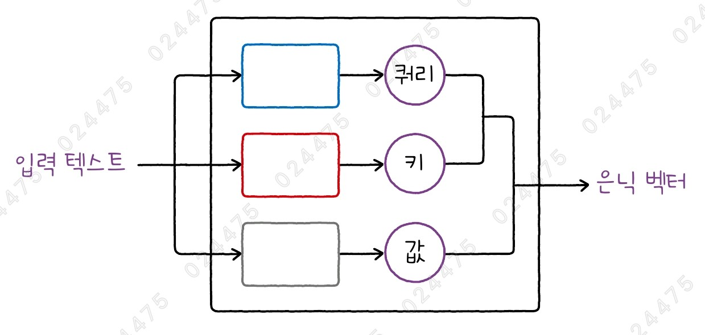

- 기존 어텐션 메커니즘은 인코더의 은닉 상태와 디코더의 은닉 상태를 비교해 디코더가 특정 타임스텝에서 어떤 입력 토큰에 집중해야 하는지를 학습함
- 트랜스포머는 인코더에 입력되는 토큰만으로 어텐션 가중치를 학습함 (셀프 어텐션)

### 셀프 어텐션의 계산 과정

- 먼저 입력 텍스트의 각 토큰을 밀집층에 통과시킴
  - 이때, 전체 토큰이 한 번에 밀집층을 통과하게 됨
- 밀집층을 통과한 벡터를 쿼리(Query) 벡터라고 함
- 같은 입력 텍스트를 두 번째 밀집층에 통과시켜 키(Key) 벡터를 만듦
- 쿼리를 생성하는 밀집층과 키를 생성하는 밀집층은 서로 다른 층임

### 어텐션 점수 계산

- 쿼리 벡터와 키 벡터가 생성되면 두 벡터를 서로 곱해서 어텐션 점수를 계산함
  - 입력된 토큰이 3개라면 쿼리 벡터도 3개, 키 벡터로 3개가 생성됨
  - 쿼리 벡터와 키 벡터를 곱하면 총 9개의 어텐션 점수가 만들어짐
  - 어텐션 행렬: 어텐션 점수를 행렬 형태로 정리한 것
- 그 다음, 입력 텍스트를 또 다른 밀집층에 통과시켜 값(Value) 벡터를 만듦
- 어텐션 점수를 값 벡터에 곱해서 최종적인 셀프 어텐션 출력을 생성함
- 출력 벡터는 각 입력 토큰이 다른 토큰들과 얼마나 관련이 있는지를 반영한 은닉 벡터라고 할 수 있음
  - 이를 통해, 문맥을 더 정확히 이해하고 중요한 정보를 효과적으로 강조할 수 있음
- 각 토큰의 벡터 표현이 주어진 문제를 효과적으로 해결할 수 있게 학습됨
  - 이를 위해 쿼리, 키, 값 벡터를 생성하는 밀집층 세 개의 가중치도 함께 학습됨

### 멀티 헤드 어텐션

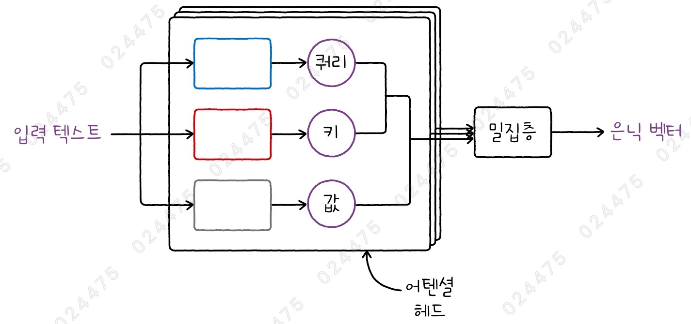

- 어텐션 헤드(Attention Head): 셀프 어텐션 연산을 수행하는 하나의 단위
- 멀티 헤드 어텐션(Multi-head Attention): 여러 개의 어텐션 헤드
- 트랜스포머는 여러 개의 어텐션 헤드를 사용함
- 각 어텐션 헤드에서는 쿼리, 키, 값 벡터를 생성하는 밀집층이 서로 다르게 사용됨
- 어텐션 헤드들의 출력은 하나로 합쳐진 후, 밀집층을 통과하여 어텐션 층의 최종 출력이 됨
- 헤드의 개수는 모델마다 다르며, 보통 몇 개에서 많게는 수십 개까지 사용됨

## 5️⃣ 층 정규화

- 딥러닝에서는 여러 개의 층을 거치면서 특성의 스케일이 변할 수 있기 때문에, 단순한 입력 정규화만으로는 충분하지 않음

### 배치 정규화

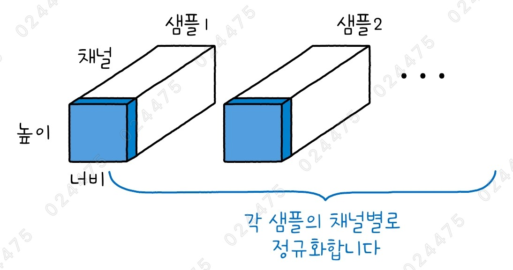

- Batch Normalization
- 주로 합성곱 신경망에 널리 활용되며 층과 층 사이에 놓임
- 이전 층의 출력을 배치 단위로 평균과 분산을 계산하여 평균이 0, 분산이 1이 되도록 조정한 후 다음 층으로 전달함
- 모든 샘플에서 특정 채널의 데이터를 모아 평균과 분산을 계산한 후 정규화를 적용함
- 배치 정규화를 적용하면 훈련 속도가 빨라지고 학습 과정이 안정화됨
- 하지만, 텍스트 데이터는 샘플마다 길이가 다르기 때문에 배치 정규화를 적용하기는 어려움

### 층 정규화

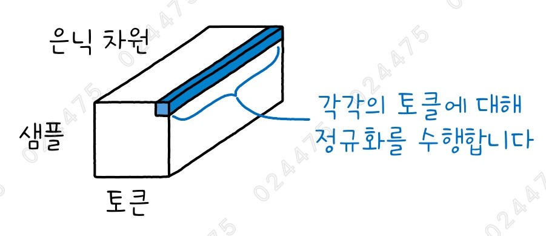

- Layer Normalization
- 각 샘플의 토큰마다 개별적으로 정규화를 수행함
- 샘플의 길이가 달라도 독립적으로 정규화할 수 있어 샘플의 길이에 영향을 받지 않음

### 잔차 연결

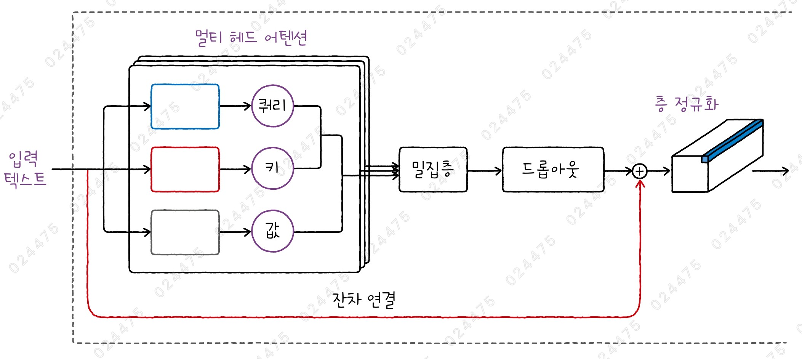

- Residual Connection
- 스킵 연결(Skip Connection)라고도 부름
- 트랜스포머에서도 멀티 헤드 어텐션 층 다음에 드롭아웃과 층 정규화가 적용됨
  - 일부 모델에서는 층 정규화를 멀티 헤드 어텐션 층 앞에 배치하기도 함
- 멀티 헤드 어텐션과 층 정규화 사이에는 잔차 연결이 추가됨
- 멀티 헤드 어텐션 층을 거친 출력에 입력값을 그대로 더하는 방식임
- ResNet이라는 합성곱 신경망에서 처음 도입된 이후, 많은 신경망에서 널리 사용되고 있는 기술임
- 신경망은 층이 많을수록 훈련이 어려워지는데, 이를 해결하기 위해 잔차 연결이 도입됨
  - 신경망이 훈련될 때는 뒤에서부터 거꾸로 모델의 파라미터 업데이트 신호가 전파됨
  - 잔차 연결이 추가되면 이 신호가 멀티 헤드 어텐션 층을 거치지 않고 직접 앞쪽 층으로 전달될 수 있음
  - 이로 인해, 신경망의 층을 많이 쌓아도 효과적으로 훈련할 수 있게 됨

## 6️⃣ 피드포워드 네트워크와 인코더 블록

### 피드포워드 네트워크

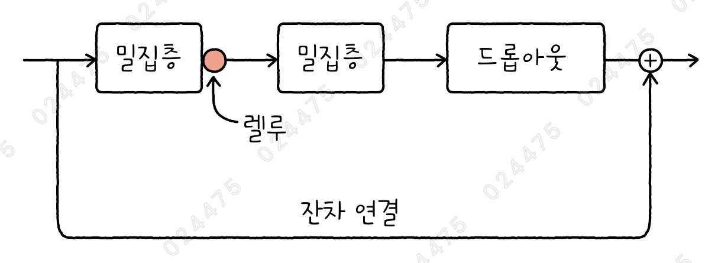

- Feedforward Network
- 트랜스포머의 인코더에서 멀티 헤드 어텐션과 층 정규화 다음에 나오는 밀집층을 의미함
  - 합성곱 신경망, 완전 연결 신경망과 같은 일반적인 피드포워드 신경망을 의미하는 것이 아님
- 보통 2개의 밀집층으로 구성됨
  - 첫 번째 밀집층은 ReLU 활성화 함수를 사용함
  - 두 번째 밀집층은 활성화 함수를 사용하지 않음
- 드롭아웃 층과 잔차 연결이 존재함

### 인코더 블록

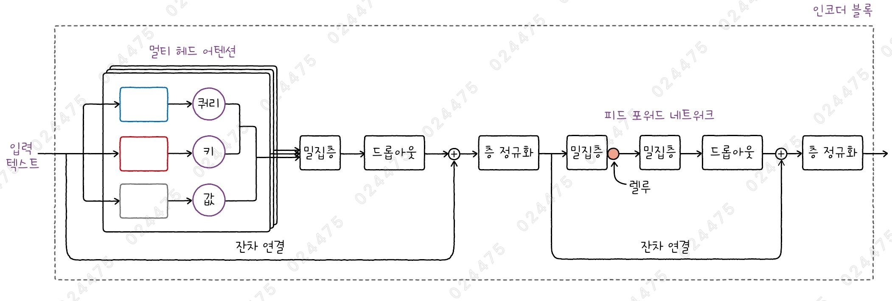

- 멀티 헤드 어텐션 + 피드포워드 네트워크 + 층 정규화 + 2 개의 잔차 연결로 구성됨
- 인코더 블록이 출력하는 값은 각 토큰의 은닉 벡터임
- 입력 토큰은 단어 임베딩과 같은 벡터 표현으로 변환되어 입력되는데, 이 벡터의 차원과 인코더 블록이 출력하는 은닉 벡터의 차원은 동일함
- 따라서, 동일한 인코더 블록을 여러 개 반복해서 배치할 수 있음
- 모델마다 다르지만 적게는 몇 개에서 많게는 수십 개의 인코더 블록을 순차적으로 쌓아 인코더 모델을 구성함

## 7️⃣ 토큰 임베딩과 위치 인코딩

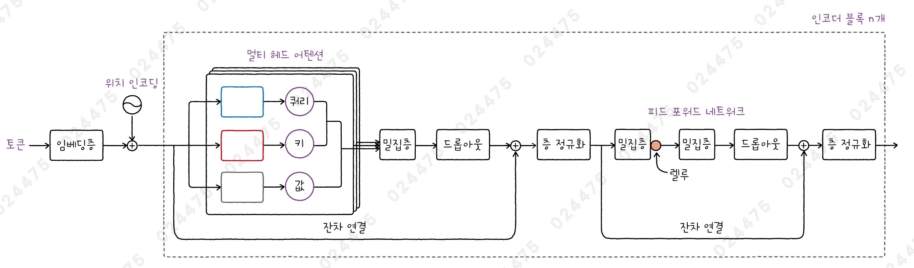

### 토큰 임베딩

- 트랜스포머에서도 토큰을 고정된 크기의 실수 벡터로 변환하기 위해 임베딩 층을 사용함
- 하지만, 트랜스포머는 모든 토큰을 동시에 처리하는 방식을 사용하기 때문에, 토큰의 위치를 고려하지 않는다는 문제가 있음
- 단어는 그 위치에 따라 의미가 달라질 수 있기 때문에, 트랜스포머가 문장의 의미를 정확히 이해하려면 위치 정보가 추가적으로 제공되어야 함

### 위치 인코딩

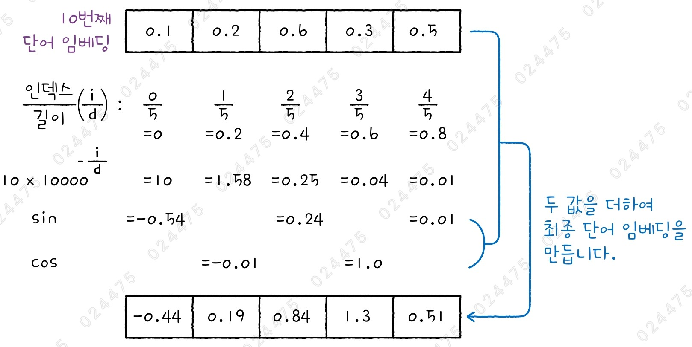

- Positional Encoding
- 사인 함수와 코사인 함수를 사용해 토큰의 위치에 따라 변하는 벡터를 생성하고, 이를 단어 임베딩에 더하는 방식
- 임베딩 벡터의 각 원소 인덱스를 임베딩 벡터의 전체 길이로 나눈 후, 이 값을 10,000의 거듭제곱한 값의 역수로 변환하고 해당 토큰의 순서를 곱함
- 그런 다음, 임베딩 벡터에서 짝수 번째 원소의 경우는 사인 함수를 적용하고, 홀수 번째 원소의 경우는 코사인 함수를 적용함
- 이렇게 구한 값을 원본 임베딩 벡터에 더해 위치 정보를 반영하게 됨
- 결국, 원본 단어 임베딩의 값은 문장에서의 위치에 따라 조금씩 달라지게 됨
- 하지만, 삼각 함수를 사용했기 때문에 주기성을 가질 것임
- 위치 인코딩은 토큰의 위치와 임베딩 벡터의 차원에 따라 일정한 값으로 계산되므로, '절대 위치 인코딩'이라고도 부름
- 이외에 최근에 많이 사용하는 '상대 위치 인코딩(또는 상대 위치 임베딩)'도 있음

## 8️⃣ 디코더 블록

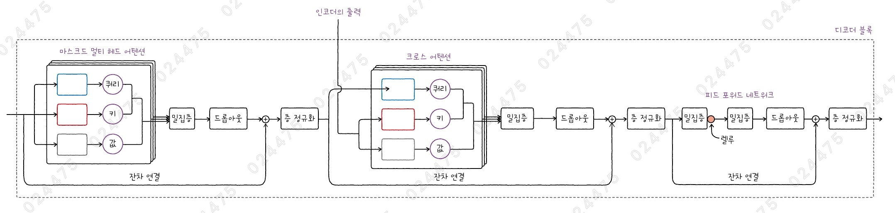

### 마스크드 멀티 헤드 어텐션

- Masked Multi-Head Attention
- 디코더 블록의 첫 번째 멀티 헤드 어텐션 층
- 디코더는 자기회귀 모델의 방식을 따라 한 번에 하나의 토큰만 생성함
- 모델을 훈련할 때의 상황은 실제 번역을 수행할 때와 다름
  - ex) "I love you"의 올바른 번역(타깃값)인 "나는 너를 사랑한다"를 디코더에게 한 번에 전달하고, 각 토큰에서 다음 토큰을 예측하도록 모델을 훈련함
  - 즉, 디코더는 "나는"에서 "너를"을 예측하고, "나는 너를"을 사용해 "사랑한다"를 예측하도록 훈련됨
- 기존처럼 모델의 출력을 정답(타깃)과 비교하여 오차를 줄이는 방식과 동일하게 훈련됨
- 이때, 다음에 출력할 정답을 미리 알 수 없게 첫 번째 멀티 헤드 어텐션 층에서 마스킹 처리를 하게 됨
  - 즉, 디코더가 한 타임스텝에서 어텐션 번수를 계산할 때 현재 토큰까지만 참고하고, 이후의 토큰은 볼 수 없도록 제한함

### 크로스 어텐션

- Cross Attention
- 인코더가 출력한 임베딩 벡터를 입력으로 받는 멀티 헤드 어텐션 층
- 디코더에서 받은 벡터를 쿼리로 사용하고, 인코더의 출력을 키와 값으로 사용함
- 크로스 어텐션 층은 인코더의 멀티 헤드 어텐션 층과 피드포워드 네트워크 사이에 배치됨
- 크로스 어텐션 층의 전후에도 잔차 연결이 있음

### 디코더 블록

- 디코더 블록인 출력하는 값도 동일한 크기의 은닉 벡터이므로, 여러 개의 디코더 블록을 반복해서 쌓을 수 있음
- 디코더 블록 여러 개가 반복적으로 쌓여 전체 디코더 모델을 구성함
  - 이때, 인코더 블록의 출력은 반복되는 모든 디코더 블록에 전달됨
- 해결하고자 하는 작업에 맞는 층을 마지막 디코더 블록 다음에 놓음

## cf) 트랜스포머 인코더-디코더 전체 모델

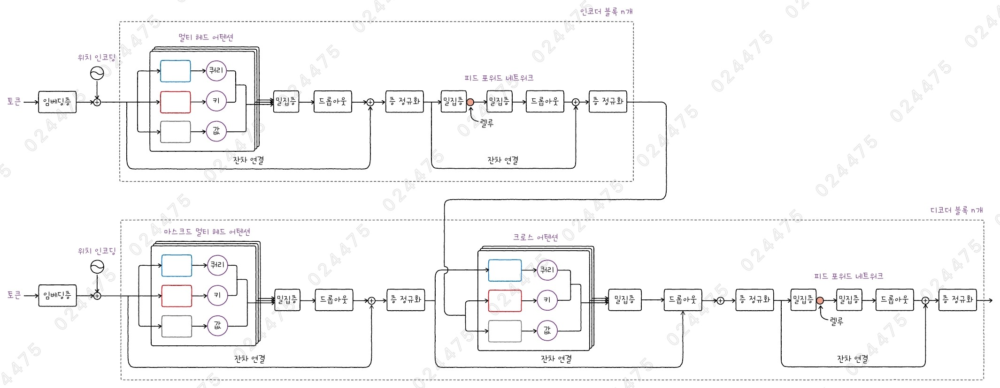

- 트랜스포머 모델은 대규모 텍스트 데이터셋을 학습하며, 매우 많은 모델 파라미터를 가지고 있음
- 대규모 언어 모델(Large Language Model, LLM)이라고 부름
- 이런 모델을 훈련하는 데는 많은 자원과 비용이 필요함
