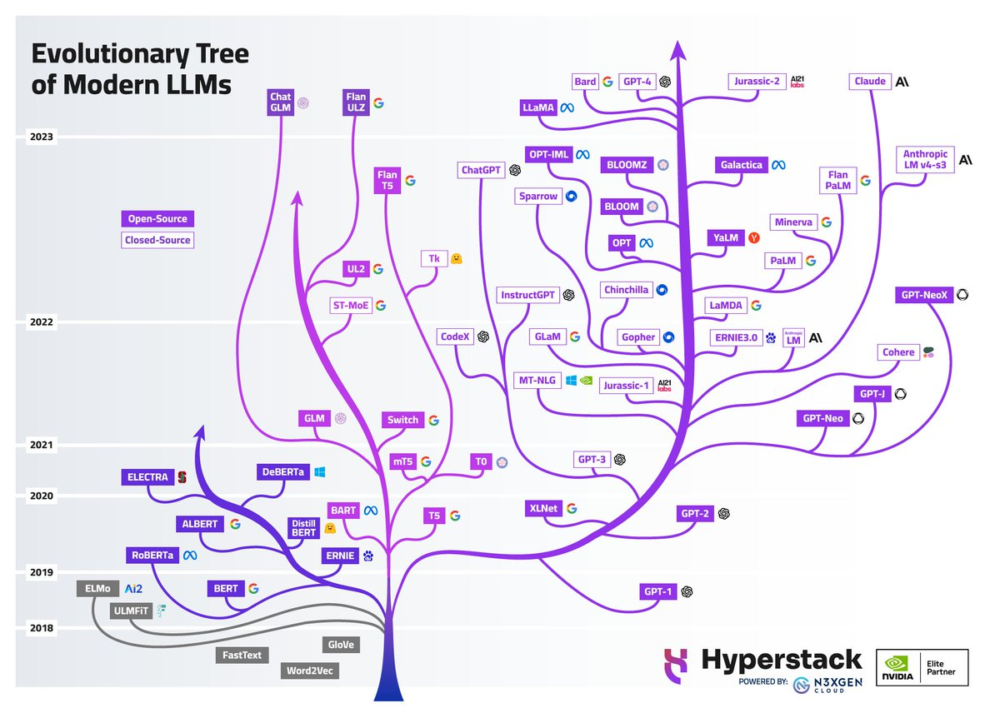
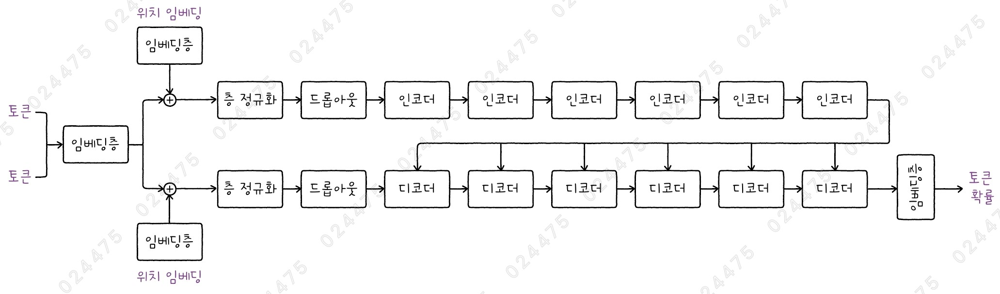
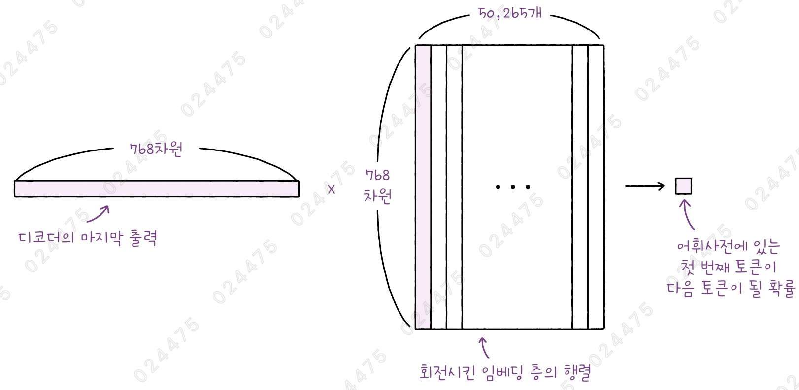
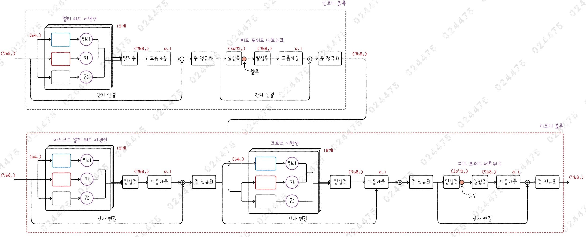
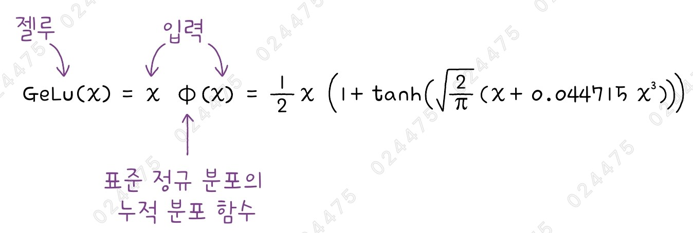
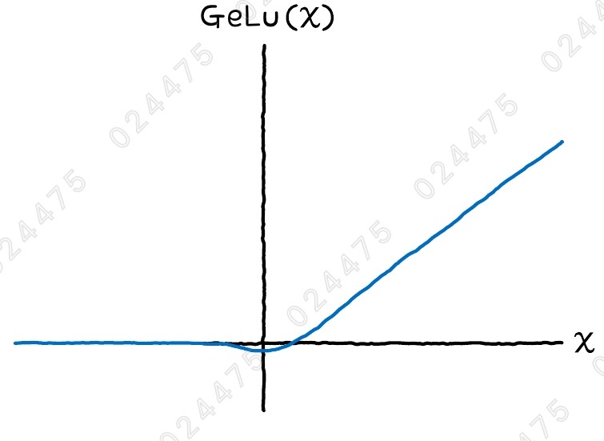
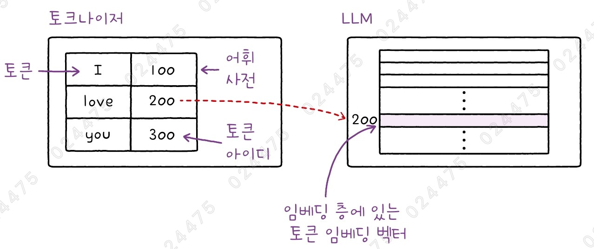

# ✔ 트랜스포머로 상품 설명 요약하기

> ['트랜스포머로 상품 설명 요약하기' 구글 코랩](https://colab.research.google.com/github/rickiepark/hg-mldl2/blob/main/10-2.ipynb)

## 1️⃣ 트랜스포머 가계도



- 트랜스포머 모델은 인코더-디코더 구조를 기반으로 하지만, 인코더와 디코더를 각각 떼어내어 독립적으로 사용할 수도 있음
- 가장 왼쪽에 회색 부분은 유용한 단어 임베딩 벡터를 만드는 데 초점을 맞춘 모델들임
  - 트랜스포머 구조를 사용하지 않으며, 초창기 LLM이라고 할 수 있음

### 인코더 기반 모델

- 왼쪽 진보라색 가지가 인코더 기반 모델에 해당
- 대표적인 인코더 기반 모델: BERT, RoBERT, ELECTRA 등

#### 주요 작업

1. 텍스트 분류

   - 시퀀스 데이터를 입력받아 하나의 결괏값을 출력하는 작업
   - 인코더의 출력에 밀집층과 같은 분류를 위한 층을 배치하여 해결 가능

2. 개체명 인식 (Named Entity)

   - 텍스트에서 사람 이름, 지역명, 회사 이름 등의 고유 명사를 식별하는 작업
   - 입력된 각 토큰마다 개체명 여부를 출력함

3. STS (Semantic Textual Similarity)
   - 두 텍스트의 유사도를 측정하는 작업

### 인코더-디코더 모델

- 가운데 연보라색 가지가 인코더-디코더 모델에 해당
- 대표적인 인코더-디코더 모델: T5, BART 등

#### 주요 작업

1. 요약
2. 번역
3. 질문-답변 (Question Answering)
   - 질문과 문맥 텍스트가 주어졌을 때, 문맥 속에서 답을 찾아 응답을 생성하는 작업

### 디코더 기반 모델

- 가장 오른쪽 보라색 가지가 디코더 기반 모델에 해당
- 대표적인 디코더 기반 모델: GPT-3, ChatGPT 등
- 뛰어난 텍스트 생성 능력으로 인해 특히 인기가 높음
- 디코더는 이전까지 생성한 텍스트를 입력으로 받아 다음 토큰을 예측하는 식으로 동작함
- 사람이 모델을 실행할 때 전달한 프롬프트를 통해 인코더의 도움 없이도 다음 토큰을 예측할 수 있음
  - 프롬프트(prompt): 이전에 생성한 텍스트인 것처럼 전달하는 초기 텍스트

#### 주요 작업

1. 요약
2. 번역
3. 질문-답변
4. 챗봇

## 2️⃣ 전이 학습

- Transfer Learning
- 이미 훈련된 모델을 새로운 작업에 맞춰 재사용하거나 약간 조정하여 사용하는 방법
- 이미지넷 데이터셋에서 훈련된 신경망이 많이 공개되어 있음
  - 신경망의 구조와 가중치가 모두 공개되어 있기 때문에 누구나 자신의 작업에 가져다 사용할 수 있음
  - 일반적으로 합성곱 신경망의 마지막 분류층을 버리고 입력부터 마지막 합성곱 층까지만 재사용함
  - 이런 모델을 베이스 모델(Base Model)이라고 부름
- 트랜스포머 기반 언어 모델도 전이 학습이 가능함
  - 대규모 말뭉치에서 사전 훈련된 트랜스포머 모델의 파라미터는 은닉 벡터를 잘 만들 수 있도록 최적화되어 있을 것임
  - 따라서, 대규모 텍스트 데이터셋에서 사전 훈련된 트랜스포머 모델의 인코더와 디코더를 사용해 새로운 작업에 적용할 수 있음

## 3️⃣ BART 모델 소개

- 2019년 메타에서 공개한 트랜스포머 기반의 인코더-디코더 모델
- 160GB의 대규모 텍스트 데이터셋으로 훈련됨
- 베이스(base)와 라지(large) 모델 두 가지 버전이 있음
  - 베이스 모델: 인코더/디코더 블록 각각 6개씩 사용, 약 1억 2천만 개의 파라미터
  - 라지 모델: 인코더/디코더 블록 각각 12씩 사용, 4억 개 이상의 파라미터

### BART base 모델



- 구성
  - 인코더/디코더 블록 개수: 각각 6개
  - 은닉 벡터 크기: 768
  - 어휘 사전 크기: 50,265개
- 마지막 인코더의 출력이 모든 디코더 블록에 추가됨
- 인코더와 디코더에 들어가는 토큰은 하나의 공통된 단어 임베딩 층을 통과해 인코더와 디코더가 동일한 방식으로 토큰을 변환하도록 설계됨
- 인코더와 디코더는 각각 별도의 위치 임베딩 층을 더함
- 이후 층 정규화와 드롭아웃 층을 거치고, 인코더 블록과 디코더 블록을 반복해서 거침
- 디코더 마지막에 세로로 회전시킨 임베딩 층을 통과해 토큰에 대한 확률을 출력함

### 위치 임베딩

- Positional Embedding
- 위치 인코딩: 토큰의 위치에 대한 정보를 만들기 위해 삼각 함수를 사용
  - 즉, 토큰의 위치에 해당하는 정숫값을 삼각 함수로 위치 정보가 담긴 벡터로 바꿈
- 위치 임베딩: 토큰 아이디를 실수 벡터 표현으로 바꾸기 위해 임베딩 층을 사용하듯, 위치 정숫값을 실수 벡터 표현으로 바꾸기 위해 임베딩 층을 사용
- 토큰을 위한 임베딩 층처럼 위치를 위한 임베딩 층도 처음에는 랜덤하게 초기화되며 훈련을 통해 최적의 값을 학습함

### 회전시킨 임베딩 층



- 디코더의 마지막 출력은 토큰에 대한 은닉 벡터(임베딩 벡터)임
- BART base 모델의 은닉 벡터 크기는 768이고, 어휘 사전 크기는 50,265개임
- 따라서, 768 크기의 벡터를 50,265개의 확률을 담은 또 다른 벡터로 바꾸는 작업이 필요함
- 입력이 768개일 때 50,265개의 출력을 만드는 밀집층으로 구현할 수도 있음
  - 768 x 50,265개의 모델 파라미터 필요
- 하지만, 이와 동일한 크기의 모델 파라미터가 모델 맨 처음에 토큰 정수를 단어 임베딩으로 만드는 임베딩 층에 이미 사용되고 있음
  - 50,265개의 토큰 x 768차원 벡터
  - 이 임베딩 층을 회전시킨다면 768 x 50,265 크기의 모델 파라미터를 얻을 수 있음
- 즉, 별도의 밀집층을 두지 않고 임베딩 층의 모델 파라미터를 사용해 디코더의 출력 벡터를 각 토큰에 대한 확률로 바꿀 수 있음
  - 사실, 디코더의 출력을 확률로 생각하려면 마지막 출력값에 소프트맥스 함수를 적용해야 함

## 4️⃣ BART의 인코더와 디코더



- BART의 인코더 블록과 디코더 블록은 원본 트랜스포머의 구조와 매우 유사함
- 원본 트랜스포머 구조와 다른 점
  - 피드포워드 네트워크에서 렐루 활성화 함수 대신 젤루(GeLU) 활성화 함수를 사용함

### 인코더 블록

- 768 크기의 임베딩 벡터가 입력되면, 12개의 헤드에 나누어 전달됨
  - 각 헤드에 입력되는 벡터 크기는 64임
- 멀티 헤드 어텐션의 마지막 밀집층을 통과하면서 다시 768 크기의 벡터로 변환됨
- 드롭아웃 비율이 0.1인 드롭아웃 층을 지난 후, 잔차 연결이 나오고 층 정규화가 이어짐
- 피드포워드 네트워크 첫 번째 밀집층은 임베딩 벡터 차원의 네 배인 3074 크기의 출력을 만듦
- 두 번째 밀집층은 다시 원래 임베딩 차원인 768 크기의 출력을 만듦
- 다음으로 드롭아웃, 잔차 연결, 층 정규화가 등장함
- 인코더 블록의 최종 출력 크기는 768임

### 디코더 블록

- 768 크기의 입력이 마스크드 멀티 헤드 어텐션 층에 12개의 헤드에 나뉘어져 들어감
- 어텐션의 바로 뒤에 등장하는 밀집층이 출력 차원을 768 크기로 만들고, 이어서 드롭아웃, 잔차 연결, 층 정규화가 등장함
- 인코더의 출력을 사용하는 크로스 어텐션을 거쳐, 드롭아웃, 잔차 연결, 층 정규화를 지남
- 디코더 블록의 최종 출력 크기도 768임

### 젤루(GeLU) 함수



- 입력에 표준 정규 분포의 누적 분포 함수를 곱함
- 누적 분포 함수를 계산하려면 적분이 필요함
- 따라서, 대부분의 딥러닝 프레임워크들은 복잡한 적분 대신 근사값을 구할 수 있는 간단한 공식을 사용함



- 젤루 함수의 그래프는 렐루 함수와 비슷하지만 원점에서 부드럽게 변하기 때문에 미분이 가능함

## 5️⃣ 허깅페이스로 KoBART 모델 로드하기

### 허깅페이스

- HuggingFace
- 트랜스포머 기반의 오픈소스 모델을 공유하는 곳
- transformers 패키지를 사용하면 허깅페이스에서 공유되는 사전 훈련된 오픈소스 LLM을 쉽게 로드하여 사용할 수 있고, 직접 미세 튜닝한 모델도 허깅페이스를 통해 공유할 수 있음
- 모델뿐만 아니라 데이터셋과 교육 자료도 풍부함
- 구글, 메타와 같이 오픈소스 LLM을 개발하는 회사들이 자사의 모델을 공개하기도 함
- 트랜스포머 기반 LLM 모델을 넘어서 컴퓨터 비전과 오디오 등 다른 분야의 모델도 제공함

#### 1. 텍스트 요약을 위한 파이프라인을 준비해보자

```py
from transformers import pipeline

pipe = pipeline(task='summarization', device=0)
```


- 출력 결과를 보면 모델을 지정하지 않았기 때문에 요약 작업을 위한 기본 모델인 'sshleifer/distilbert-cnn-12-6'을 사용한다고 적혀 있음
- 이어서 필요한 파일을 허깅페이스에서 다운로드하는 것을 확인할 수 있음
- `pipeline()` 함수: 허깅페이스에 있는 LLM을 사용하기 위해 수행할 몇 가지 단계를 한 번에 실행 가능
  - 각 작업에 연관된 파이프라인 클래스의 인스턴스 객체를 반환함
  - ex) 요약 작업의 경우, SummarizationPipeline 클래스의 객체를 만들어 반환함
- `task` 매개변수: 수행할 작업의 종류를 지정
  - 'summarization': 요약
  - 'text-classification': 텍스트 분류
  - 'text-generation': 텍스트 생성
  - 'translation': 번역
- `device` 매개변수: CPU, GPU 지정 가능
  - -1: CPU 사용
  - 0: 첫 번째 GPU 사용

#### 2. 'sshleifer/distilbert-cnn-12-6' 모델을 사용해 영문 텍스트를 요약 해보자

```py
pipe = pipeline(task='summarization', model='sshleifer/distilbert-cnn-12-6' device=0)
```

- 'sshleifer/distilbert-cnn-12-6' 모델
  - BART 모델을 CNN 텍스트 데이터셋에서 미세 튜닝한 모델
  - 텍스트를 56~142자 사이의 길이로 요약함
  - 영어 데이터셋에서 훈련되었기 때문에, 한글과 같은 다국어를 지원하지 못함
- `model` 매개변수: 모델 지정
  - 모델 이름은 허깅페이스 웹사이트의 경로를 나타냄
- `revision` 매개변수: 리비전 지정
  - 지정하지 않으면 자동으로 최신 리비전의 파일을 다운로드함
- `min_length` 매개변수: 텍스트 최소 요약 길이 지정
- `max_length` 매개변수: 텍스트 최대 요약 길이 지정

```py
sample_text = """Vincent Willem van Gogh was a Dutch Post-Impressionist painter who is among the most famous and influential figures in the history of Western art. In just over a decade, he created approximately 2100 artworks, including around 860 oil paintings, most of them in the last two years of his life. His oeuvre includes landscapes, still lifes, portraits, and self-portraits, most of which are characterised by bold colours and dramatic brushwork that contributed to the rise of expressionism in modern art. Van Gogh's work was beginning to gain critical attention before he died from a self-inflicted gunshot at age 37. During his lifetime, only one of Van Gogh's paintings, The Red Vineyard, was sold.
"""

pipe(sample_text)
"""
[{'summary_text': " Vincent Willem van Gogh was a Dutch Post-Impressionist painter . His oeuvre includes landscapes, still lifes, portraits and self-portraits . Van Gogh's work was beginning to gain critical attention before he died from a self-inflicted gunshot at age 37 ."}]
"""
```

- pipe 객체에 여러 개의 텍스트를 리스트로 감싸서 호출할 수도 있음
- 출력은 딕셔너리의 리스트고, 딕셔너리 안에 'summary_text' 키에 매핑된 값이 요약된 문자열임

#### 3. 'EbanLee/kobart-summary-v3' 모델을 사용해 한글 텍스트를 요약 해보자

```py
kobart = pipeline(task='summarization', model='EbanLee/kobart-summary-v3', device=0)
```

- KoBART 모델
  - SKT에서 만든 BART 기반의 한국어 인코더-디코더 모델
  - BART 베이스 모델을 사용해 한글 데이터셋에서 미세 튜닝함
- 'EbanLee/kobart-summary-v3' 모델
  - 요약 작업에 맞춰 KoBART 모델을 미세 튜닝함
  - 기본적으로 최대 300자까지 요약을 만들어줌

```py
ko_text = """하나, ‘입문자 맞춤형 7단계 구성’을 따라가며 체계적으로 반복하는 탄탄한 학습 설계!
이 책은 데이터 분석의 핵심 내용을 7단계에 걸쳐 반복 학습하면서 자연스럽게 머릿속에 기억되도록 구성했습니다. [핵심 키워드]와 [시작하기 전에]에서 각 절의 주제에 대한 대표 개념을 워밍업하고, 이론과 실습을 거쳐 마무리에서는 [핵심 포인트]와 [확인 문제]로 한번에 복습합니다. ‘혼자 공부할 수 있는’ 커리큘럼을 그대로 믿고 끝까지 따라가다 보면 데이터 분석 공부가 난생 처음인 입문자도 무리 없이 책을 끝까지 마칠 수 있습니다!
둘, 실제로 일어날 법한 흥미로운 스토리에 담긴 문제를 직접 해결하며 익히는 ‘진짜’ 데이터 분석!
현장감 넘치는 스토리를 통해 데이터를 다루는 방법을 알려 주어 ‘파이썬’과 ‘데이터’가 낯설어도 몰입감 있는 학습을 할 수 있도록 구성했습니다. 이 책에서는 API와 웹 스크래핑을 통해 실제 도서관 데이터와 온라인 서점 웹사이트에서 데이터를 가져오는 등 내 주변에 있는 데이터를 직접 수집할 수 있는 방법을 가이드합니다. 또한 판다스, 넘파이, 맷플롯립 등 데이터 분석에 유용한 각종 파이썬 라이브러리를 활용해 보며 코딩 감각을 익히고, 핵심 통계 지식으로 기본기를 탄탄하게 다질 수 있습니다. 마지막에는 분석을 바탕으로 미래를 예측하는 머신러닝까지 맛볼 수 있어 데이터 분석의 처음부터 끝까지 제대로 배울 수 있습니다.
셋, ‘혼공’의 힘을 실어줄 동영상 강의와 혼공 학습 사이트 지원!
책으로만 학습하기엔 여전히 어려운 입문자를 위해 저자 직강 동영상도 지원합니다. 또한 학습을 하며 궁금한 사항은 언제든지 저자에게 질문할 수 있도록 학습 사이트를 제공합니다. 저자가 질문 하나하나에 직접 답변을 달아 주는 것은 물론, 관련 최신 기술과 정보도 얻을 수 있습니다. 게다가 혼자 공부하고 싶지만 정작 혼자서는 자신 없는 사람들을 위해 혼공 학습단을 운영합니다. 혼공 학습단과 함께하면 마지막까지 포기하지 않고 완주할 수 있을 것입니다.
▶ https://hongong.hanbit.co.kr
▶ https://github.com/rickiepark/hg-da
넷, 언제 어디서든 가볍게 볼 수 있는 혼공 필수 [용어 노트] 제공!
꼭 기억해야 할 핵심 개념과 용어만 따로 정리한 [용어 노트]를 제공합니다. 처음 공부하는 사람들이 프로그래밍을 어려워하는 이유는 낯선 용어 때문입니다. 그러나 어려운 것이 아니라 익숙하지 않아서 헷갈리는 것이므로, 용어나 개념이 잘 생각나지 않을 때는 언제든 부담 없이 [용어 노트]를 펼쳐 보세요. 제시된 용어 외에도 새로운 용어를 추가하면서 자신만의 용어 노트를 완성해가는 과정도 또 다른 재미가 될 것입니다.
"""

kobart(ko_text)
"""
[{'summary_text': '이 책은 데이터 분석의 핵심 내용을 7단계에 걸쳐 반복 학습하면서 머릿속에 기억되도록 구성했습니다. 독자 공부할 수 있는 커리큘럼을 그대로 믿고 끝까지 따라가다 보면 데이터 분석 공부가 난생 처음인 입문자도 무리 없이 책을 끝까지 마칠 수 있습니다. 현장감 넘치는 스토리를 통해 데이터를 다루는 방법을 알려 주어 몰입감 있는 학습을 할 수 있도록 구성했습니다. 저자가 질문 하나하나에 직접 답변을 달아 주는 것은 물론, 최신 기술과 정보도 얻을 수 있습니다. 혼공 학습단과 함께하면 마지막까지 포기하지 않고 완주할 수 있을 것입니다. 꼭 기억해야 할 핵심 개념과 용어만 따로 정리한 [용어 노트]를 제공합니다. 새로운 용어를 추가하면서 자신만의 용어 노트를 완성해가는 과정도 재미가 될 것입니다.'}]
"""
```

- 이 모델은 빔 서치(Beam Search)라는 방법을 사용해 텍스트를 생성하기 때문에 실행할 때마다 결과가 다를 수 있음
  - 빔 서치: 토큰 단계마다 가장 가능성이 높은 n개의 시퀀스를 유지하면서 다음 토큰을 생성하여 이어가는 방법

## 6️⃣ 텍스트 토큰화



- 토큰화(Tokenization): 텍스트를 토큰 단위로 분할하는 과정
- LLM 모델 자체가 토큰화를 수행하지 않음
  - LLM 모델은 이미 텍스트가 토큰으로 분할되고 각 토큰에 정수 아이디가 할당된 후 이 정수 리스트가 전달된다고 가정함
- 토크나이저(Tokenizer): 토큰화를 수행하는 모델
  - 훈련 데이터로부터 최적의 어휘 사전을 학습하는 모델에 가까움
- 토큰의 임베딩 벡터는 토크나이저에 있지 않고 LLM 모델의 임베딩 층에 있음
- 공백을 기준으로 텍스트를 나누는 방법이 가장 간단하지만, 이렇게 하면 훈련 데이터에 등장하지 않는 단어의 경우는 학습하기 어려움
  - 따라서, 단어보다 더 작은 부분 단어 토큰화 방식이 등장했으며 트랜스포머 기반 LLM에서 널리 사용됨
- 부분단어 토큰화 알고리즘
  - BPE (Byte-Pair Encoding)
  - 워드피스 (WordPiece)
  - 유니그램 (unigram)
  - 센텐스피스 (SentencePiece)

### BPE (Byte-Pair Encoding)

#### 문자 수준의 BPE

- 각 단어를 문자 단위로 분해하여 어휘 사전에 추가한 후, 가장 많이 등장하는 순서대로 문자 쌍 (또는 부분단어 쌍)을 찾아 병합함
- 그리고 합쳐진 부분단어를 어휘 사전에 추가함
- 이 과정을 사전에 정의된 어휘 사전 크기에 도달할 때까지 계속 진행함

#### 문자 수준의 BPE의 단점

- 유니코드 문자의 개수는 154,998개이기 때문에, 최악의 경우 어휘 사전의 크기가 154,998개부터 시작하게 됨
- 어휘 사전의 크기가 크면 임베딩 층의 크기도 따라서 커지므로, 모델 파라미터의 개수가 급격히 늘어나게 됨
- 따라서, 적절한 수준의 어휘 사전 크기에서 유니코드를 처리할 수 있는 방법이 필요함

#### 바이트 수준의 BPE (Byte-level BPE)

- 텍스트를 바이트 스트림으로 인식하고 자주 등장하는 바이트 쌍을 어휘사전에 추가하는 방식
- 유니코드 문자도 바이트 수준에서 병합하여 어휘사전에 추가할 수 있음
- 원본 BART 모델이 바이트 수준의 BPE 알고리즘을 사용함

#### 1. KoBART 모델의 어휘사전 크기를 확인해보자

```py
# 방법 1
print(kobart.tokenizer.vocab_size)  # 30000

# 방법 2
len(kobart.tokenizer)  # 30000

# 방법 3
vocab = kobart.tokenizer.vocab
len(vocab)  # 30000
```

- KoBART는 문자 수준의 BPE 알고리즘을 사용함
- `model` 속성: 허깅페이스 파이프라인 객체가 저장한 모델 객체
- `tokenizer` 속성: 허깅페이스 파이프라인 객체가 저장한 토크나이저 객체
- `vocab` 속성: 전체 어휘 사전을 저장
  - type: 파이썬 딕셔너리

#### 2. KoBART 모델의 어휘사전 내 일부 토큰을 확인해보자

```py
list(vocab.items())[:10]
"""
[('▁처음에는', 22432),
 ('∪', 1607),
 ('隻', 8459),
 ('크로', 18410),
 ('긴다.\n', 28840),
 ('ల', 1025),
 ('疵', 5888),
 ('먤', 10539),
 ('▁밑에', 27367),
 ('写', 2521)]
"""
```

- 각 튜플은 토큰과 토큰 아이디의 쌍으로 이루어짐
- `_` 문자는 공백을 의미함
  - 즉, 해당 토큰 앞에 공백이 있으면 단어의 시작 부분을 나타냄

#### 3. 샘플 텍스트를 직접 토큰으로 나누어보자

```py
tokens = kobart.tokenizer.tokenize('혼자 만들면서 배우는 딥러닝')
print(tokens)
# ['▁혼자', '▁만들', '면서', '▁배우는', '▁', '딥', '러', '닝']
```

- `tokenize()` 메서드: 텍스트를 토큰으로 나눠줌

#### 4. 각 토큰에 해당하는 토큰 아이디를 확인해보자

```py
kobart.tokenizer.convert_tokens_to_ids(tokens)
# [16814, 14397, 14125, 25429, 1700, 10021, 10277, 9747]
```

- `convert_tokens_to_ids()` 메서드: 토큰에 해당하는 토큰 아이디로 변환해줌

#### 5. 텍스트 문자열을 바로 토큰 아이디로 만들어보자

```py
token_ids = kobart.tokenizer.encode('혼자 만들면서 배우는 딥러닝')
print(token_ids)
# [0, 16814, 14397, 14125, 25429, 1700, 10021, 10277, 9747, 1]
```

- `encode()` 메서드: 문자열을 토큰 아이디 리스트로 변환해줌
- 출력을 보면 맨 앞과 뒤에 토큰 아이디 0과 1이 추가됨
  - 문자열의 시작과 끝을 나타냄

#### 6. 토큰 아이디를 토큰으로 변환해보자

```py
tokens = kobart.tokenizer.convert_ids_to_tokens(token_ids)
print(tokens)
# ['<s>', '▁혼자', '▁만들', '면서', '▁배우는', '▁', '딥', '러', '닝', '</s>']
```

- `convert_ids_to_tokens()` 메서드: 토큰 아이디를 토큰으로 변환해줌

#### 7. 토큰 아이디를 원래 문자열로 복원해보자

```py
kobart.tokenizer.decode(token_ids)
# <s> 혼자 만들면서 배우는 딥러닝</s>
```

- `decode()` 메서드: 토큰 아이디 리스트를 문자열로 변환해줌

### 워드피스

- BPE 토큰화와 매우 비슷함
- 먼저 훈련 데이터셋에 있는 모든 문자가 포함된 어휘 사전으로 시작해서, 가장 많이 등장하는 부분단어 쌍을 어휘 사전에 추가함
- BPE는 단순히 가장 많이 등장하는 부분단어를 선택하지만, 워드피스는 부분단어를 구성하는 개별 토큰의 빈도도 고려함
  - ex) 'ab' 토큰과 'cd' 토큰의 빈도가 각각 10과 20이라고 가정
  - BPE 알고리즘의 경우, 'cd' 토큰을 먼저 어휘 사전에 추가
  - 워드피스의 경우, 'ab' 토큰의 빈도를 'a'와 'b' 토큰의 빈도로 나누고, 'cd' 토큰의 빈도를 'c'와 'd' 토큰의 빈도로 나눈 후, 둘 중 큰 값을 가진 토큰을 어휘사전에 추가함
- 인코더 기반 모델인 BERT가 워드피스를 사용함

### 유니그램

- 초기에 매우 큰 어휘 사전을 만든 다음 사전에 지정한 어휘 사전 크기에 도달할 때까지 점진적으로 토큰을 제거함
- 초기 어휘 사전은 공백으로 나누어진 단어를 부분단어로 쪼개어 추가하거나 BPE 알고리즘을 적요하여 만듦
- 그 다음 어휘 사전에 있는 모든 토큰이 독립적이라 가정하고, 전체 손실을 가장 적게 증가시키는 토큰을 하나씩 삭제함
  - 손실: 각 토큰의 등장 확률을 곱한 것에 음수를 취한 값
  - 작은 실숫값인 확률을 곱하는 대신 계산하기 쉬운 뎃셈으로 바꾸기 위해 로그를 씌움 (음의 로그 확률)
- 일반적으로 유니그램 토큰화는 단독으로 쓰이지 않으며, 센텐스피스와 함께 사용됨

### 센텐스피스

- 사전 토큰화 (Pre-tokenization): 먼저 텍스트를 공백 등을 기준으로 단어를 나누는 과정
  - 위의 모든 토큰화 방법은 사전 토큰화 방식을 사용함
  - 하지만, 이 방식은 중국어와 같은 일부 언어에 통하지 않음
- 센텐스피스는 사전 토큰화를 사용하지 않는 방법으로, 최신 언어 모델에서 널리 사용됨
- 원시 입력 텍스트를 그대로 사용하며, 공백을 문자의 하나로 간주함
- 센텐스피스는 알고리즘이자 라이브러리이며, 실제 어휘 사전 구성은 BPE나 유니그램 알고리즘을 사용함

## cf) 핵심 패키지와 함수

### transformers

#### `pipeline()` 함수

- 허깅페이스 transformers 라이브러리로 간편하게 모델 추론을 할 수 있는 파이프라인 객체를 만들어 주는 함수
- task 매개변수
  - 파이프라인 객체로 수행할 작업을 지정
  - 'text-classification': 텍스트 분류 작업
  - 'summarization': 텍스트 요약 작업
- model 매개변수
  - 작업 수행에 사용할 모델을 지정
  - 지정하지 않을 경우 각 작업의 기본 모델이 사용됨
- device 매개변수
  - 추론에 사용할 하드웨어 장치를 지정
  - 기본값: -1 (CPU 사용)
  - 0부터 시작해서 컴퓨터에 설치된 GPU 장치를 순서대로 지정할 수 있음

#### 파이프라인 객체

- model 속성
  - pipeline() 함수를 호출할 때 로드한 모델 객체를 담고 있음
  - 이 모델 객체의 config 속성은 인코더와 디코더 개수, 임베딩 크기 등 LLM 모델을 위한 다양한 설정을 포함하고 있음
- tokenizer 속성
  - pipeline() 함수를 호출할 때 로드한 토크나이저 객체를 담고 있음

#### 토크나이저 객체

- vocab_size 속성
  - 토크나이저의 어휘 사전 크기
- vocab 속성
  - 토크나이저의 어휘 사전을 반환
- tokenize() 메서드
  - 문자열을 토큰으로 분할하여 토큰 리스트를 반환
- convert_tokens_to_ids() 메서드
  - 토큰(또는 토큰 리스트)을 토큰 아이디(또는 토큰 아이디 리스트)로 변환
- convert_ids_to_tokens() 메서드
  - 토큰 아이디(또는 토큰 아이디 리스트)를 토큰(또는 토큰 리스트)으로 변환
- encode() 메서드
  - 문자열(또는 문자열 리스트)를 토큰으로 분할하여 토큰 아이디의 리스트를 반환
- decode() 메서드
  - 토큰 아이디(또는 토큰 아이디 리스트)를 문자열로 복원

```
                          'decode()'
      ----------------------------------------------------
      |                                                  |
      ↓                       'convert_ids_to_tokens()'  |
텍스트 문자열 ---------------→ 토큰 ←-----------------→ 토큰 아이디
      |       'tokenize()'    'convert_tokens_to_ids()'  ↑
      |                                                  |
      ----------------------------------------------------
                          'encode()'
```
