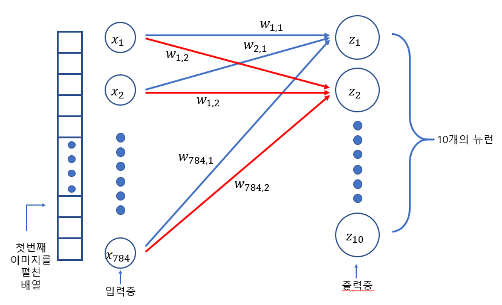
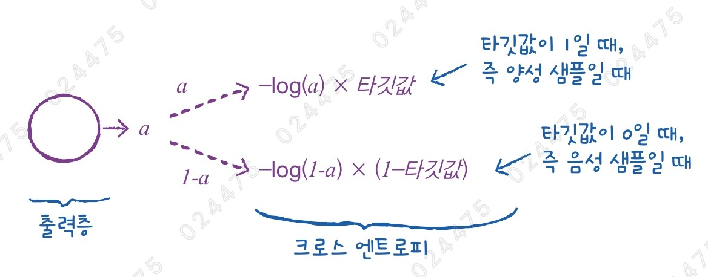
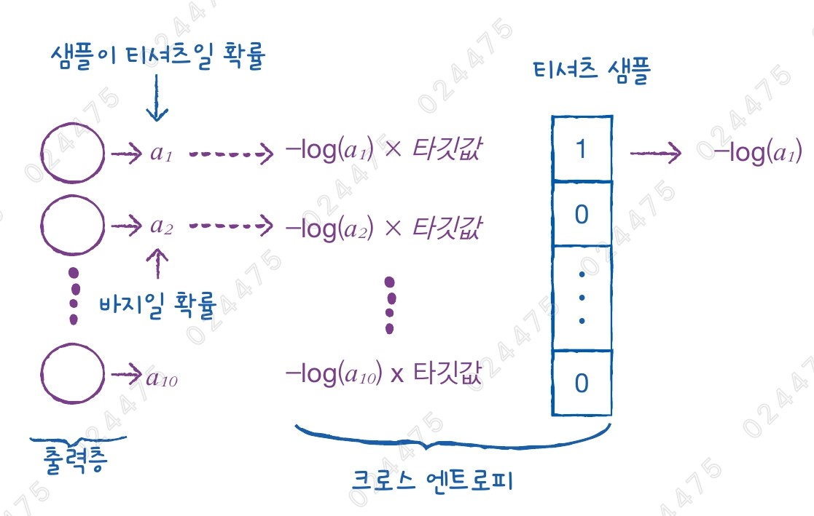

# ✔ 인공 신경망

> ['인공 신경망' 구글 코랩](https://colab.research.google.com/github/rickiepark/hg-mldl/blob/master/7-1.ipynb)

## 1️⃣ 패션 MNIST

- 10종류의 패션 아이템으로 구성된 데이터셋

#### 1. 케라스를 통해 패션 MNIST 데이터를 다운로드하자

```py
from tensorflow import keras

(train_input, train_target), (test_input, test_target) = keras.datasets.fashion_mnist.load_data()

print(train_input.shape, train_target.shape)
# (60000, 28, 28) (60000,)
print(test_input.shape, test_target.shape)
# (10000, 28, 28) (10000,)
```

- `load_data()`: 훈련 데이터와 테스트 데이터를 나누어 반환함
  - 데이터는 각각 입력과 타깃의 쌍으로 구성됨
- 각 이미지는 28 x 28 크기임

#### 2. 몇 개의 샘플을 이미지로 출력해보자

```py
import matplotlib.pyplot as plt

fig, axs = plt.subplots(1, 10, figsize=(10,10))
for i in range(10):
    axs[i].imshow(train_input[i], cmap='gray_r')
    axs[i].axis('off')
plt.show()

print(train_target[:10])
# [9, 0, 0, 3, 0, 2, 7, 2, 5, 5]
```


```py
import numpy as np

print(np.unique(train_target, return_counts=True))
# (array([0, 1, 2, 3, 4, 5, 6, 7, 8, 9], dtype=uint8), array([6000, 6000, 6000, 6000, 6000, 6000, 6000, 6000, 6000, 6000]))
```

- 패션 MNIST의 타깃은 0~9까지의 숫자 레이블로 구성됨

  | 레이블      | 0      | 1    | 2      | 3      | 4    | 5    | 6    | 7        | 8    | 9         |
  | ----------- | ------ | ---- | ------ | ------ | ---- | ---- | ---- | -------- | ---- | --------- |
  | 패션 아이템 | 티셔츠 | 바지 | 스웨터 | 드레스 | 코트 | 샌달 | 셔츠 | 스니커즈 | 가방 | 앵글 부츠 |

- 레이블마다 정확히 6,000개의 샘플이 들어있음

## 2️⃣ 로지스틱 회귀로 패션 아이템 분류하기

- 60,000개나 되는 전체 데이터를 한꺼번에 사용하여 모델을 훈련하는 것보다 확률적 경사 하강법을 사용해 샘플을 하나씩 꺼내서 모델을 훈련하는 것이 더 효율적임
- SGDClassifier 모델은 패션 MNIST 데이터의 클래스를 구분하기 위해 10개의 선형 방정식에 대한 모델 파라미터를 찾음

  - 10개의 z값을 구한 다음 소프트맥스 함수를 통과하여 각 클래스에 대한 확률을 얻을 수 있음

  ```
  z_티셔츠 = w1 x (픽셀1) + w2 x (픽셀2) + ... + w784 x (픽셀784) + b
  z_바지 = w1' x (픽셀1) + w2' x (픽셀2) + ... + w784' x (픽셀784) + b'
  ...
  ```

#### 1. 데이터를 표준화한 후, 2차원 배열을 1차원 배열로 펼치자

```py
train_scaled = train_input / 255.0
train_scaled = train_scaled.reshape(-1, 28*28)
print(train_scaled.shape)  # (60000, 784)
```

- 확률적 경사 하강법은 여러 특성 중 기울기가 가장 가파른 방향을 따라 이동하기 때문에 데이터를 표준화 전처리하는 것이 필요
  - 패션 MNIST의 경우 각 픽셀은 0~255 사이의 정숫값을 가짐
  - 이미지의 경우 보통 255로 나누어 0~1 사이의 값으로 정규화함
- SDGClassifier는 2차원 입력을 다루지 못하기 때문에 각 샘플을 1차원 배열로 만들어야 함

#### 2. 확률적 경사 하강 분류 모델을 교차 검증 해보자

```py
from sklearn.model_selection import cross_validate
from sklearn.linear_model import SGDClassifier

sc = SGDClassifier(loss='log_loss', max_iter=5, random_state=42)
scores = cross_validate(sc, train_scaled, train_target, n_jobs=-1)

print(np.mean(scores['test_score']))  # 0.819
```

## 3️⃣ 인공 신경망

- Artificial Neural Network, ANN
- 생물학적 뉴런에서 영감을 받아 만든 머신러닝 알고리즘
- 인공 신경만 알고리즘을 종종 딥러닝이라고도 부름
- 기존의 머신러닝 알고리즘으로 다루기 어려웠던 이미지, 음성, 텍스트 분야에서 뛰어난 성능을 발휘함
- 가장 기본적인 인공 신경망은 **확률적 경사 하강법을 사용하는 로지스틱 회귀**와 같음

### 인공 신경망에 의한 패션 아이템 분류



- 입력층(input layer): 입력(특성) 그 자체로 별다른 연산을 수행하지 않음
  - 여기서는 784개의 픽셀값
- 출력층(output layer): 신경망의 최종 값을 만듦
- 밀집층(dense layer): 가장 간단한 인공 신경망의 층
  - 양쪽의 뉴런이 모두 연결되어 있기 때문에 완전 연결층이라고도 부름
  - 출력층에 밀집층을 사용할 때는 분류하려는 클래스와 동일한 개수의 뉴런을 사용함
- 뉴런(neuron): 인공 신경망에서 z 값을 계산하는 단위
  - 유닛(unit)이라고 부르기도 함

### 텐서플로와 케라스

- 딥러닝 라이브러리가 머신러닝 라이브러리와 다르게, GPU를 사용하여 인공신경망을 훈련함

  - GPU는 벡터와 행렬 연산에 매우 최적화되어 있기 때문에, 곱셈과 덧셈이 많이 수행되는 인공 신경망에 큰 도움이 됨

- 텐서플로: 구글이 오픈소스로 공개한 딥러닝 라이브러리
  - 텐서플로에는 저수준 API와 고수준 API가 있음
- 케라스: 프랑소와 숄레가 만든 딥러닝 라이브러리
  - 직접 GPU 연산을 수행하지 않고 GPU 연산을 수행하는 다른 라이브러리를 백엔드로 사용함 (멀티 백엔드 케라스)
  - 케라스의 백엔드: 텐서플로, 씨아노, CNTK 등 딥러닝 라이브러리
  - 케라스는 직관적이고 사용하기 편한 고수준 API를 제공함
  - 케라스 3.0부터 텐서플로, 파이토치, 잭스를 백엔드로 사용함
- 텐서플로 라이브러리에 케라스 API가 내장되어있음
  - 케라스는 텐서플로의 고수준 API임
- 코랩에 설치된 케라스는 기본적으로 텐서플로를 백엔드로 사용함

  - 환경 변수 "KERAS_BACKEND"를 사용해 케라스의 백엔드 변경 가능

  ```py
  import keras

  keras.config.backend()  # 'tensorflow'
  ```

  ```py
  import os

  os.environ["KERAS_BACKEND"] = "torch"
  ```

## 4️⃣ 인공 신경망으로 모델 만들기

#### 1. 훈련 세트에서 검증 세트를 나누자

```py
from sklearn.model_selection import train_test_split

train_scaled, val_scaled, train_target, val_target = train_test_split(train_scaled, train_target, test_size=0.2, random_state=42)

print(train_scaled.shape, train_target.shape)
# (48000, 784) (48000,)
print(val_scaled.shape, val_target.shape)
# (12000, 784) (12000,)
```

- 인공 신경망에서는 교차 검증을 잘 사용하지 않고 검증 세트를 별도로 덜어내어 사용함
  - 이유1) 딥러닝 분야의 데이터셋은 충분히 크기 때문에 검증 점수가 안정적임
  - 이유2) 교차 검증을 하기에는 훈련 시간이 너무 오래 걸림

#### 2. 인공 신경망 모델을 만들자

```py
from tensorflow import keras

inputs = keras.layers.Input(shape=(784,))
dense = keras.layers.Dense(10, activation='softmax')
model = keras.Sequential([inputs, dense])
```

- `Input()` 함수: 입력층 정의
  - shape 매개변수: 입력의 크기를 지정 (꼭 튜플 형태로 전달해야 함)
- `Dense()` 클래스: 밀집층 정의
  - 첫 매개변수로 뉴런 개수를 지정
  - activation 매개변수: 활성화 함수를 지정
    - 뉴런에서 출력되는 값을 확률로 바꿔줌
    - 다중 분류인 경우 소프트맥스 함수를 사용하고, 이진 분류인 경우 시그모이드를 사용
- `Sequential()` 클래스: 입력층, 밀집층 등을 묶어 신경망 모델을 만들어줌

## 5️⃣ 인공 신경망으로 패션 아이템 분류하기

- (4장-2절) 손실 함수 종류
  - 이진 분류: 이진 크로스 엔트로피 손실 함수(로지스틱 손실 함수)
  - 다중 분류: 크로스 엔트로피 손실 함수
- 케라스에서는 위 두 손실 함수를 아래처럼 나누어 부름

  - 이진 분류: 'binary_crossentropy'
  - 다중 분류: 'categorical_crossentropy'

### Binary crossentropy



- 이진 분류의 출력 뉴런은 오직 양성 클래스에 대한 확률(a, 시그모이드 함수의 출력값)만 출력하기 때문에 음성 클래스에 대한 확률은 1-a로 구할 수 있음
- 이진 분류의 타깃값은 양성 샘플인 경우에는 1, 음성 샘플인 경우에는 0임
- 즉, 양성 샘플에서 손실을 낮추려면 양성 클래스에 대한 확률 a의 값을 가능한 1에 가깝게 만들어야 함

### Categorical crossentropy



- 다중 분류는 각 클래스에 대한 확률이 모두 출력되기 때문에 타깃에 해당하는 확률만 남겨 놓기 위해서 나머지 확률에는 모두 0을 곱함
- 즉, 티셔츠 샘플에서 손실을 낮추려면 첫 번째 뉴런의 활성화 출력 a1의 값을 가능한 1에 가깝게 만들어야 함
- 원-핫 인코딩(one-hot encoding): 타깃값을 해당 클래스만 1이고 나머지는 모두 0인 배열로 만드는 것
- 다중 분류에서 크로스 엔트로피 손실 함수를 사용하려면 0, 1, 2와 같이 정수로 된 타깃값을 원-핫 인코딩으로 변환해야 함

#### 1. 손실 함수와 훈련 과정에서 계산하고 싶은 측정값을 지정해보자

```py
model.compile(loss='sparse_categorical_crossentropy', metrics=['accuracy'])
```

- loss 매개변수: 손실 함수의 종류 지정
  - 패션 MNIST 데이터의 타깃값은 모두 정수로 되어 있음
  - sparse_categorical_crossentropy: 정수로된 타깃값을 사용해 크로스 엔트로피 손실을 계산하는 것
  - 타깃값을 원-핫 인코딩으로 준비했다면, loss='categorical_crossentropy'로 지정하면 됨
- metrics 매개변수: 훈련 과정에서 계산하고 싶은 측정값 지정
  - 케라스는 모델이 훈련할 때 기본으로 에포크마다 손실 값을 출력해 줌
  - 'accuracy'를 지정하면 정확도도 함께 출력해 줌

#### 2. 인공 신경망 모델을 훈련해보자

```py
model.fit(train_scaled, train_target, epochs=5)
```


- `fit()` 메서드: 모델을 훈련하는 메서드
- epochs 매개변수: 반복할 에포크 횟수를 지정
- 5번 반복에 정확도가 85%가 넘는 것을 확인할 수 있음

#### 3. 검증 세트를 통해 모델을 평가해보자

```py
model.evaluate(val_scaled, val_target)
```


- `evaluate()` 메서드: 모델을 평가하는 메서드
- 훈련 세트보다 조금 낮은 84% 정도의 정확도를 나타냄

## cf) 핵심 패키지와 함수

### Keras

#### `Input` 함수

- 입력층을 구성하기 위한 함수
- shape 매개변수
  - 입력의 크기를 튜플로 지정

#### `Dense` 클래스

- 신경망에서 가장 기본 층인 밀집층을 만드는 클래스
- 첫 번째 매개변수로 뉴런의 개수를 지정
- activation 매개변수
  - 활성화 함수 지정
  - 'sigmoid', 'softmax'
  - 아무것도 지정하지 않으면 활성화 함수를 사용하지 않음

#### `Sequential` 클래스

- 케라스에서 신경망 모델을 만드는 클래스
- 이 클래스의 객체를 생성할 때 신경망 모델에 추가할 층을 파이썬 리스트로 전달

#### `compile()` 메서드

- 모델 객체를 만든 후 훈련하기 전에 사용할 손실 함수와 측정 지표 등을 지정하는 메서드
- loss 매개변수
  - 손실 함수를 지정
  - 이진 분류일 경우, 'binary_crossentropy'
  - 다중 분류일 경우, 'categorical_crossentropy'
  - 클래스 레이블이 정수일 경우, 'sparse_categorical_crossentropy'
  - 회귀 모델일 경우, 'mean_square_error'
- metrics 매개변수
  - 훈련 과정에서 측정하고 싶은 지표를 리스트로 전달

#### `fit()` 메서드

- 모델을 훈련하는 메서드
- 첫 번째 매개변수에 입력 데이터를 전달
- 두 번째 매개변수에 타깃 데이터를 전달
- epochs 매개변수
  - 전체 데이터에 대해 반복할 에포크 횟수를 지정

#### `evaluate()` 메서드

- 모델 성능을 평가하는 메서드
- 첫 번째 매개변수에 입력 데이터를 전달
- 두 번째 매개변수에 타깃 데이터를 전달
- compile() 메서드에서 loss 매개변수에 지정한 손실 함수의 값과 metrics 매개변수에서 지정한 측정 지표를 출력함
