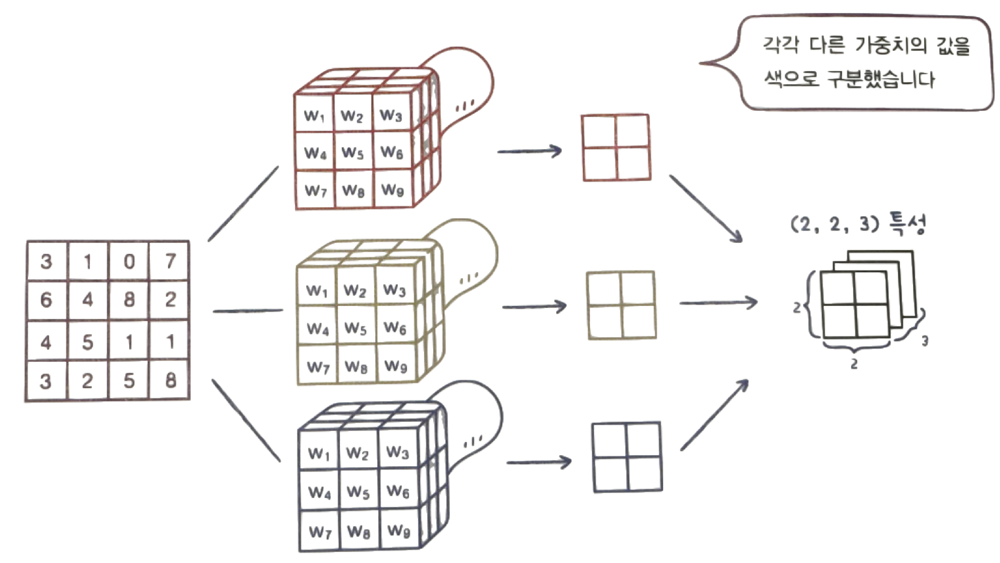
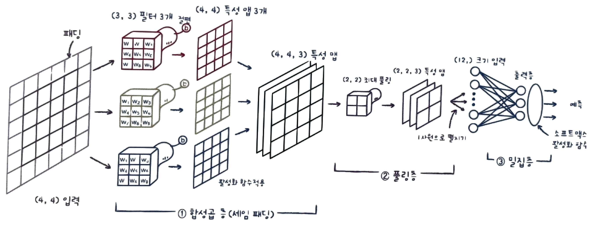

# ✔ 합성곱 신경망의 구성 요소

## 1️⃣ 합성곱

- 합성곱(convolution)은 마치 입력 데이터에 마법의 도장을 찍어서 유용한 특성만 드러나게 하는 것으로 비유할 수 있음

### 밀집층 vs 합성곱층

#### 밀집층

- 뉴런마다 입력 개수만큼의 가중치가 있음
- 입력 개수에 상관없이 뉴런 개수가 곧 출력 개수가 됨
- 밀집층의 뉴런: 입력 개수만큼의 가중치를 가지고 1개의 출력을 만듦

#### 합성곱층

- 입력 데이터 전체에 가중치를 적용하는 것이 아니라 일부에 가중치를 곱함
- 그러면서, 한 칸씩 아래로 이동하면서 출력을 만듦
- 합성곱층의 뉴런: 입력 개수보다 적은 개수의 가중치를 가지고 1개 이상의 출력을 만듦

### 합성곱 신경망 (Convolutional Neural Network, CNN)



- 완전 연결 신경망(밀집 신경망): 완전 연결 층(밀집층)만 사용하여 만든 신경망
  - 뉴런이 길게 늘어서 있고 서로 조밀하게 연결되어 있음
- 합성곱 신경망: 1개 이상의 합성곱 층을 사용한 인공 신경망
  - 뉴런이 입력 위를 이동하면서 출력을 만듦
- 합성곱 신경망에서는 뉴런을 필터(filter) 또는 커널(kernel)이라고 부름
- 케라스 API에서는 **커널을 입력에 곱하는 가중치, 필터를 뉴런 개수**를 표현할 때 사용함
- 합성곱은 1차원이 아닌 2차원 입력에도 적용할 수 있는 장점이 있음
  - 2차원 구조를 그대로 사용하기 때문에 이미지 처리 분야에서 뛰어난 성능을 발휘함
- 합성곱은 마치 도장을 찍듯이 왼쪽 위에서 오른쪽 맨 아래까지 이동하면서 출력을 만듦
- 합성곱 계산을 통해 얻은 출력을 특별히 **특성 맵**(feature map)이라고 부름
  - 필터 하나가 하나의 특성 맵을 만듦
- 합성곱 층은 여러 개의 필터를 사용하고, 각 필터의 가중치(커널)은 모두 다름
- 각 필터를 통해 만들어진 특성 맵은 순서대로 차곡차곡 쌓여 2차원 특성 맵을 만듦

## 2️⃣ 케라스 합성곱 층

```py
import keras
keras.layers.Conv2D(10, kernel_size=(3, 3), activation='relu')
```

- 케라스에서 `Conv2D` 클래스로 합성곱 층을 나타낼 수 있음
- 첫 번째 매개변수는 필터의 개수임
- kernel_size 매개변수
  - 필터에 사용할 커널의 크기를 지정
  - 보통 (3,3)이나 (5,5) 크기가 많이 사용됨
- activation 매개변수
  - 활성화 함수를 지정
- 일반적으로 특성 맵은 활성화 함수를 통과한 값을 나타냄

### 패딩

- 패딩(padding): 입력 배열의 주위를 가상의 원소로 채우는 것 (0으로 채움)
  - 커널이 도장을 찍을 횟수를 늘려줌
  - 0으로 채워져 있기 때문에 계산에 영향을 미치지는 않음
- 세임 패딩(same padding): 입력과 특성 맵의 크기를 동일하게 만들기 위해 입력 주위에 0으로 패딩 하는 것
- 밸리드 패딩(valid padding): 패딩 없이 순수한 입력 배열에만 합성곱을 하여 특성 맵을 만드는 것
  - 따라서, 밸리드 패딩을 하면 특성 맵의 크기가 줄어듦

#### 패딩을 하는 이유

- 패딩을 하지 않을 경우, 모서리에 있는 중요한 정보가 특성 맵으로 잘 전달되지 않는 반면 가운데 있는 정보는 두드러지게 표현됨
  - 즉, 중앙부와 모서리 픽셀이 합성곱에 참여하는 비율이 크게 차이남
- 적절한 패딩은 이미지의 주변에 있는 정보를 잃어버리지 않도록 도와줌

#### Conv2D 클래스의 padding 매개변수

```py
keras.layers.Conv2D(10, kernel_size=(3, 3), activation='relu', padding='same')
```

- padding 매개변수
  - 패딩을 지정
  - 'same': 세임 패딩
  - 기본값: 'valid' (밸리드 패딩)
- 일반적으로 합성곱 신경망에서 세임 패딩이 많이 사용됨

### 스트라이드

- 스트라이드(stride): 필터가 입력 위를 이동하는 크기

#### Conv2D 클래스의 strides 매개변수

```py
keras.layers.Conv2D(10, kernel_size=(3, 3), activation='relu', padding='same', strides=1)
```

- strides 매개변수
  - 이동하는 칸의 개수 지정
  - 정수나 튜플 형태로 지정 가능
  - 기본값: 1 (한 칸씩 이동)
- 스트라이드를 가로세로 방향으로 다르게 지정하거나, 1보다 크게 지정하는 경우는 드묾

### 풀링

- 풀링(pooling): 합성곱 층에서 만든 특성 맵의 가로세로 크기를 줄이는 역할을 수행
  - 특성 맵의 개수는 줄지 않음
  - 가중치가 없음
  - 합성곱처럼 입력 위를 지나가면서 도장을 찍음
  - 겹치지 않고 이동함 (스트라이드 == 풀링 크기)
- 최대 풀링(max pooling): 도장을 찍은 영역에서 가장 큰 값을 고름
- 평균 풀링(average pooling): 도장을 찍은 영역의 평균값을 계산함
- 평균 풀링은 특성 맵에 있는 중요한 정보를 희석시킬 수 있기 때문에, 많은 경우 평균 풀링보다 최대 풀링을 많이 사용함

#### 풀링을 하는 이유

- 합성곱에서 스트라이드를 크게 하여 특성 맵을 줄이는 것보다, 풀링 층에서 크기를 줄이는 것이 경험적으로 더 나은 성능을 냄

#### 풀링층

```py
keras.layers.MaxPooling2D(2)
```

- 케라스에서 `MaxPooling2D` 클래스로 최대 풀링을 수행할 수 있음
- 케라스에서 `AveragePooling2D` 클래스로 평균 풀링을 수행할 수 있음
- 첫 번째 매개변수로 풀링의 크기를 지정
  - 정수나 튜플 형태로 지정 가능
  - 보통 풀링의 크기를 2로 많이 지정하고, 가로세로 방향으로 다르게 지정하는 경우는 드묾
- strides 매개변수
  - 기본값: 풀링의 크기
- padding 매개변수
  - 기본값: 'valid'
- 풀링 층에서 출력되는 값도 특성 맵이라고 부름

## 3️⃣ 합성곱 신경망의 전체 구조



- 합성곱 신경망은 위처럼 합성곱 층에서 특성 맵을 생성하고 풀링에서 크기를 줄이는 구조가 쌍을 이룸

### 컬러 이미지를 사용한 합성곱

- 패션 MNIST 데이터는 흑백 이미지이기 때문에 2차원 배열로 표현할 수 있었음
  - 흑백 이미지 = (너비 차원, 높이 차원)
- 컬러 이미지는 RGB(빨강, 초록, 파랑) 세 개의 채널(깊이)로 구성되어 있기 때문에 3차원 배열로 표시함
  - 컬러 이미지 = (너비 차원, 높이 차원, 깊이 또는 채널 차원)
- 깊이가 있는 입력에서 합성곱을 수행하기 위해서는 도장도 깊이가 필요함
  - 커널 배열의 깊이는 항상 입력의 깊이와 같음
  - 이때, 입력이나 필터의 차원이 몇 개인지 상관없이 항상 출력은 하나의 값임
  - 즉, 특성 맵에 있는 한 원소가 채워짐
- 사실, 케라스의 합성곱 층은 항상 3차원 입력을 기대함
  - 따라서, 패션 MNIST 데이터처럼 흑백 이미지일 경우 깊이 차원이 1인 3차원 배열로 변환해 전달함

### 합성곱 층-풀링 층의 반복

- 첫 번째 합성곱 층과 풀링 층을 통과한 특성 맵의 크기가 (4, 4, 5)라면, 두 번째 합성곱 층에서의 커널 크기는 (_, _, 5)가 됨
  - 이유: 필터의 깊이는 입력의 깊이와 같아야 하기 때문
- 합성곱 신경망은 너비와 높이는 점점 줄어들고 깊이는 점점 깊어지는 것이 특징임
  - 처음에는 간단한 기본적인 특징(직선, 곡선 등)을 찾고 층이 깊어질수록 다양하고 구체적인 특징을 감지할 수 있도록 필터의 개수를 늘림
  - 어떤 특징이 이미지의 어느 위치에 놓이더라도 쉽게 감지할 수 있도록 너비와 높이 차원을 점점 줄여감
- 그리고 마지막에는 출력층 전에 특성 맵을 모두 펼쳐서 밀집층의 입력으로 사용함
