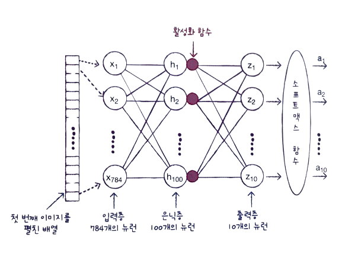
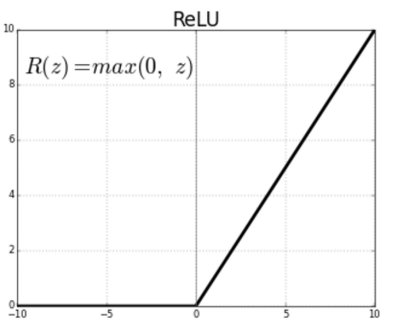
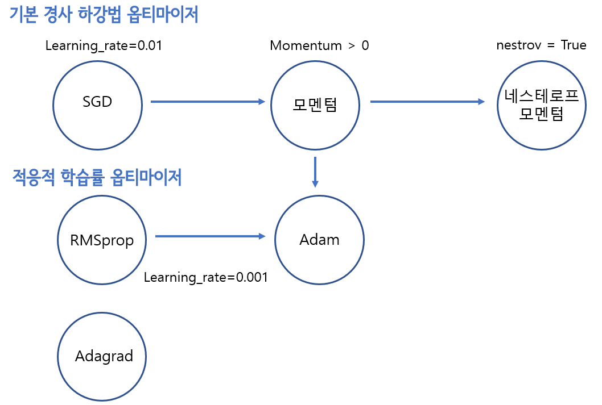

# ✔ 심층 신경망

> ['심층 신경망' 구글 코랩](https://colab.research.google.com/github/rickiepark/hg-mldl/blob/master/7-2.ipynb)

## 1️⃣ 2개의 층

### 심층 신경망에 의한 패션 아이템 분류



- 은닉층(hidden layer): 입력층과 출력층 사이에 있는 모든 층
  - 모든 신경망의 은닉층에는 항상 활성화 함수가 있음
- 활성화 함수: 신경망 층의 선형 방정식의 계산 값에 적용하는 함수
  - 은닉층에 활성화 함수를 적용하는 이유: 은닉층에서 선형적인 산술 계산만 수행한다면 수행 역할이 없는 셈이니, 선형 계산을 적당히 비선형적으로 비틀어 주어야 함
- 출력층에 적용하는 활성화 함수는 종류가 제한되어 있음
  - 이진 분류: 시그모이드 함수
  - 다중 분류: 소프트맥스 함수
  - 회귀의 경우, 임의의 어떤 숫자이기 때문에 활성화 함수를 적용할 필요가 없음
- 은닉층에 적용하는 활성화 함수는 비교적 자유로움
  - ex) 시그모이드 함수, 렐루(ReLU) 함수 등

#### 1. 패션 MNIST 데이터를 가져와 표준화한 후 1차원 배열로 펼치자

```py
from tensorflow import keras
from sklearn.model_selection import train_test_split

(train_input, train_target), (test_input, test_target) = keras.datasets.fashion_mnist.load_data()

train_scaled = train_input / 255.0
train_scaled = train_scaled.reshape(-1, 28*28)
```

#### 2. 훈련 세트에서 검증 세트를 나누자

```py
train_scaled, val_scaled, train_target, val_target = train_test_split(train_scaled, train_target, test_size=0.2, random_state=42)
```

#### 3. 입력층, 은닉층, 출력층을 만들자

```py
inputs = keras.layers.Input(shape=(784,))
dense1 = keras.layers.Dense(100, activation='sigmoid')
dense2 = keras.layers.Dense(10, activation='softmax')
```

- dens1이 은닉층이고 100개의 뉴런을 가진 밀집층임
- 은닉층의 뉴런 개수를 정하는 데는 특별한 기준이 없음
  - 적어도 출력층의 뉴런보다는 많이 만들어야 함

## 2️⃣ 심층 신경망 만들기

- Deep Neural Network, DNN
- 2개 이상의 층을 포함한 신경망
- 다층 인공 신경망, 딥러닝라는 용어와 같은 의미로 사용

#### 1. 심층 신경망 모델을 만들자

```py
model = keras.Sequential([inputs, dense1, dense2])
```

#### 2. 각 층에 대한 정보를 확인해보자

```py
model.summary()
```


- `summary()` 메서드: 층에 대한 유용한 정보를 출력해줌
- 맨 첫 줄에 모델의 이름이 나옴
- 입력층을 제외하고 이 모델에 들어 있는 층이 순서대로 나열됨
- 층마다 층 이름, 클래스, 출력 크기, 모델 파라미터 개수가 출력됨
- 층을 만들 때 name 매개변수로 이름을 지정할 수 있음
  - 지정하지 않으면 케라스가 자동으로 이름 붙임
- 출력 크기에서 첫 번째 차원은 샘플의 개수임
  - 미니배치 경사 하강법을 사용해 데이터를 훈련하는데, 샘플 개수가 아직 정의되어 있지 않기 때문에 None이라 뜸
  - 케라스의 기본 미니배치 크기는 32개임
  - fit() 메서드에서 batch_size 매개변수로 미니배치 크기를 변경할 수 있음
  - 배치 차원: 신경망 층에 입력되거나 출력되는 첫 번째 차원
- 출력 크기에서 두 번째 차원은 뉴런의 개수임
- 모델 파라미터 개수
  - dense 층: 784 x 100 + 100 = 78,500개
  - dens_1 층: 100 x 10 + 10 = 1,010개
- 마지막에는 총 모델 파라미터 개수, 훈련되는 파라미터 개수, 훈련되지 않는 파라미터 개수가 나옴

#### 3. 심층 신경망 모델을 훈련해보자

```py
model.compile(loss='sparse_categorical_crossentropy', metrics=['accuracy'])
model.fit(train_scaled, train_target, epochs=5)
```


## 3️⃣ 층을 추가하는 다른 방법

### Sequential 클래스의 생성자 안에서 바로 클래스의 객체를 만드는 방법

```py
model = keras.Sequential([
    keras.layers.Input(shape=(784,))
    keras.layers.Dense(100, activation='sigmoid', name='은닉층'),
    keras.layers.Dense(10, activation='softmax', name='출력층')
], name='패션 MNIST 모델')
```

- Sequential 클래스와 Dense 층의 name 매개변수로 각각 모델과 층의 이름을 지정함
- 장점
  - 추가되는 층을 한눈에 쉽게 알아볼 수 있음
- 단점
  - 아주 많은 층을 추가하면 생성자가 매우 길어짐
  - 조건에 따라 층을 추가할 수 없음

```py
model.summary()
```


### Sequential 클래스의 객체를 만들고 이 객체의 add() 메서드를 호출하여 층을 추가하는 방법

```py
model = keras.Sequential()
model.add(keras.layers.Input(shape=(784,)))
model.add(keras.layers.Dense(100, activation='sigmoid'))
model.add(keras.layers.Dense(10, activation='softmax'))
```

- 장점
  - 한눈에 추가되는 층을 볼 수 있음
  - 동적으로 층을 선택하여 추가할 수 있음

```py
model.summary()
```


## 4️⃣ 렐루 함수

- 초창기 인공 신경망의 은닉층에 많이 사용된 활성화 함수는 시그모이드 함수였음

  

- 하지만, 이 함수의 양쪽 끝에서 변화가 작기 때문에 학습이 어려워짐
- 특히, 층이 많은 심층 신경망일수록 그 효과가 누적되어 학습을 더 어렵게 만듦
- 이러한 시그모이드 함수의 단점을 개선하기 위해 렐루(ReLU) 함수가 제안됨

### 렐루(ReLU) 함수



- 입력이 양수일 경우 마치 활성화 함수가 없는 것처럼 그냥 입력을 통과시키고 음수일 경우에는 0으로 만듦
- 렐루 함수는 max(0, z)와 같이 쓸 수 있음
  - z가 0보다 크면 z를 출력하고 z가 0보다 작으면 0을 출력함
- 렐루 함수는 특히 이미지 처리에서 좋은 성능을 낸다고 알려짐

#### 1. 은닉층에 렐루 함수를 적용한 심층 신경망 모델을 만들어보자

```py
model = keras.Sequential()
model.add(keras.layers.Input(shape=(28,28)))
model.add(keras.layers.Flatten())
model.add(keras.layers.Dense(100, activation='relu'))
model.add(keras.layers.Dense(10, activation='softmax'))
```

- 이전에는 reshape() 메서드를 사용해 28x28 크기의 이미지를 1차원으로 펼쳤지만, 케라스에서 제공하는 Flatten 층을 사용해 간편하게 펼칠 수 있음
- `Flatten` 클래스: 배치 차원을 제외하고 나머지 입력 차원을 모두 일렬로 펼침
  - 인공 신경망의 성능을 위해 기여하는 바는 없음
  - 입력층 바로 뒤에 추가함

```py
model.summary()
```


- Flatten 클래스에 포함된 모델 파라미터는 0개임을 알 수 있음
- Flatten 층을 신경망 모델에 추가하면 입력값의 차원을 짐작할 수 있는 장점이 있음

#### 2. 다시 패션 MNIST 데이터를 가져와 표준화한 후 훈련 세트와 검증 세트로 나누자

```py
(train_input, train_target), (test_input, test_target) = keras.datasets.fashion_mnist.load_data()
train_scaled = train_input / 255.0
train_scaled, val_scaled, train_target, val_target = train_test_split(train_scaled, train_target, test_size=0.2, random_state=42)
```

#### 3. 심층 신경망 모델을 컴파일하고 훈련하자

```py
model.compile(loss='sparse_categorical_crossentropy', metrics=['accuracy'])
model.fit(train_scaled, train_target, epochs=5)
```


- 시그모이드 함수를 사용했을 때와 비교하면 성능이 조금 향상되었음

#### 4. 검증 세트를 통해 모델을 평가해보자

```py
model.evaluate(val_scaled, val_target)
```


- 7장 1절에서 은닉층을 추가하지 않은 경우보다 정확도가 향상되었음

## 5️⃣ 옵티마이저

- 하이퍼파라미터: 모델이 학습하지 않아 사람이 지정해 주어야 하는 파라미터
- 신경망에서의 하이퍼파라미터
  - 은닉층의 개수
  - 뉴런 개수
  - 활성화 함수
  - 층의 종류
  - 배치 사이즈 매개변수
  - 에포크 매개변수
  - 옵티마이저
  - RMSprop의 학습률 등

### 옵티마이저(optimizer)

- 신경망의 가중치와 절편을 학습하기 위한 알고리즘
- 케라스는 다양한 종류의 경사 하강법 알고리즘를 제공함

  

#### 기본 경사 하강법 옵티마이저

- 가장 기본적인 옵티마이저는 확률적 경사 하강법인 `SGD`임
- 이름이 SGD이지만 1개의 샘플을 뽑아서 훈련하지 않고 기본적으로 미니배치를 사용함
- compile() 메서드의 optimizer 매개변수를 'sdg'로 지정하면 SGD 옵티마이저를 사용할 수 있음

  ```py
  model.compile(optimizer='sgd', loss='sparse_categorical_crossentropy', metrics=['accuracy'])
  ```

- 또는, SGD 클래스로 객체를 생성해 optimizer 매개변수에 넣어도 됨

  ```py
  sgd = keras.optimizers.SGD()
  model.compile(optimizer=sgd, loss='sparse_categorical_crossentropy', metrics=['accuracy'])
  ```

- `learning_rate` 매개변수를 지정해 학습률을 변경할 수 있음 (기본값: 0.01)

  ```py
  sgd = keras.optimizers.SGD(learning_rate=0.1)
  ```

- `momentum` 매개변수를 0보다 큰 값으로 지정하면 마치 이전의 그레디언트를 가속도처럼 사용하는 모멘텀 최적화를 사용함
  - 기본값: 0
  - 보통 0.9 이상을 지정함
- `nesterov` 매개변수를 True로 지정하면 네스테로프 모멘텀 최적화를 사용함

  - 기본값: False
  - 네스테로프 모멘텀은 모멘텀 최적화를 2번 반복하여 구현함

  ```py
  sgd = keras.optimizers.SGD(momentum=0.9, nesterov=True)
  ```

- 대부분의 경우 네스테로프 모멘텀 최적화가 기본 확률적 경사 하강법보다 더 나은 성능을 제공함

#### 적응적 학습률 옵티마이저

- 모델이 최적점에 가까이 갈수록 학습률을 낮추는 옵티마이저
- 안정적으로 최적점에 수렴할 가능성이 높음
- 학습률 매개변수를 튜닝하는 수고를 덜 수 있는 장점이 있음
- 아래 세 클래스는 모두 learning_rate 매개변수의 기본값으로 0.001을 사용함

1. `Adagrad` 옵티마이저

   ```py
   model.compile(optimizer='adagrad', loss='sparse_categorical_crossentropy', metrics=['accuracy'])
   ```

   ```py
   adagrad = keras.optimizers.Adagrad()
   model.compile(optimizer=adagrad, loss='sparse_categorical_crossentropy', metrics=['accuracy'])
   ```

2. `RMSprop` 옵티마이저

   - compile() 메서드에서 optimizer 매개변수의 기본값이 'rmsprop'임

   ```py
   model.compile(optimizer='rmsprop', loss='sparse_categorical_crossentropy', metrics=['accuracy'])
   ```

   ```py
   rmsprop = keras.optimizers.RMSprop()
   model.compile(optimizer=rmsprop, loss='sparse_categorical_crossentropy', metrics=['accuracy'])
   ```

3. `Adam` 옵티마이저

   - 모멘텀 최적화와 RMSprop의 장점을 접목한 옵티마이저

   ```py
   model.compile(optimizer='adam', loss='sparse_categorical_crossentropy', metrics=['accuracy'])
   ```

   ```py
   adam = keras.optimizers.Adam()
   model.compile(optimizer=adam, loss='sparse_categorical_crossentropy', metrics=['accuracy'])
   ```

#### 1. Adam 옵티마이저를 사용해 심층 신경망 모델을 훈련해보자

```py
model = keras.Sequential()
model.add(keras.layers.Input(shape=(28,28)))
model.add(keras.layers.Flatten())
model.add(keras.layers.Dense(100, activation='relu'))
model.add(keras.layers.Dense(10, activation='softmax'))

model.compile(optimizer='adam', loss='sparse_categorical_crossentropy', metrics=['accuracy'])
model.fit(train_scaled, train_target, epochs=5)
```


- 기본 RMSprop을 사용했을 때와 거의 같은 성능을 보여줌

#### 2. 검증 세트를 통해 모델을 평가해보자

```py
model.evaluate(val_scaled, val_target)
```


- 기본 RMSprop보다 조금 더 나은 성능을 보여줌

## cf) 핵심 패키지와 함수

### Keras

#### `add()` 메서드

- 케라스 모델에 층을 추가하는 메서드
- keras.layers 패키지 아래에 있는 층의 객체를 입력받아 신경망 모델에 추가함
- add() 메서드를 호출하여 전달한 순서대로 층이 차례대로 늘어남

#### `summary()` 메서드

- 케라스 모델의 정보를 출력하는 메서드
- 모델에 추가된 층의 종류와 순서, 모델 파라미터 개수를 출력함
- 층을 만들 때 name 매개변수로 이름을 지정할 수 있음

#### `SGD` 클래스

- 기본 경사 하강법 옵티마이저 클래스
- learning_rate 매개변수
  - 학습률을 지정
  - 기본값: 0.01
- momentum 매개변수
  - 0 이상의 값을 지정하면 모멘텀 최적화를 수행함
- nestrov 매개변수
  - True로 설정하면 네스테로프 모멘텀 최적화를 수행함

#### `Adagrad` 클래스

- Adagrad 옵티마이저 클래스
- 그레이디언트 제곱을 누적하여 학습률을 나눔
- learning_rate 매개변수
  - 학습률을 지정
  - 기본값: 0.001
- initial_accumulator_value 매개변수
  - 누적 초깃값을 지정
  - 기본값: 0.1

#### `RMSprop` 클래스

- RMSprop 옵티마이저 클래스
- 그레이디언트 제곱으로 학습률을 나누지만, 최근의 그레이디언트를 사용하기 위해 지수 감소를 사용함
- learning_rate 매개변수
  - 학습률을 지정
  - 기본값: 0.001
- rho 매개변수
  - 감소 비율을 지정
  - 기본값: 0.9

#### `Adam` 클래스

- Adam 옵티마이저 클래스
- learning_rate 매개변수
  - 학습률을 지정
  - 기본값: 0.001
- beta_1 매개변수
  - 모멘텀 최적화에 있는 그레이디언트의 지수 감소 평균을 조절
  - 기본값: 0.9
- beta_2 매개변수
  - RMSprop에 있는 그레이디언트 제곱의 지수 감소 평균을 조절
  - 기본값: 0.999
