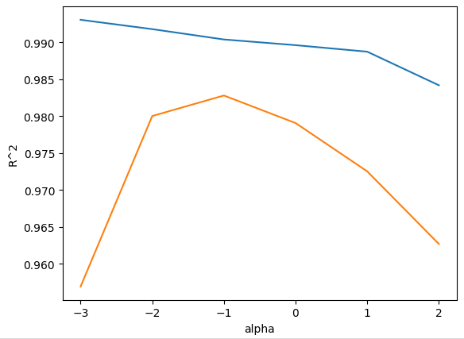
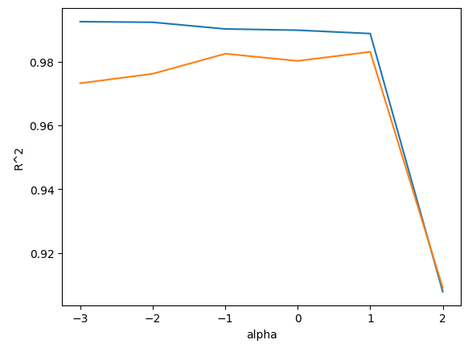

# ✔ 특성 공학과 규제

> ['특성 공학과 규제' 구글 코랩](https://colab.research.google.com/github/rickiepark/hg-mldl/blob/master/3-3.ipynb)

## 1️⃣ 다중 회귀

- 여러 개의 특성을 사용한 선형 회귀
- 선형 회귀 모델은 1개의 특성을 사용하면 직선을 학습하게 되고, 2개의 특성을 사용하면 평면을 학습하게 됨

  - 특성이 2개일 때의 선형 회귀 방정식 (3차원 공간)

    ```
    타깃 = a * 특성1 + b * 특성2 + 절편
    ```

- 특성 공학: 기존의 특성을 사용해 새로운 특성을 뽑아내는 작업

## 2️⃣ 데이터 준비

- 판다스(pandas): 유명한 데이터 분석 라이브러리
  - 넘파이 배열과 비슷하게 2차원 배열을 다룰 수 있지만 훨씬 더 많은 기능을 제공함
- 데이터프레임: 판다스의 핵심 데이터 구조
  - `to_numpy()` 메서드를 통해 넘파이 배열로 쉽게 변경 가능
  - 사이킷런 1.2버전부터는 판다스 데이터프레임 자체를 입력 데이터로 사용할 수 있음
  - 사실 사이킷런에 데이터프레임을 입력하면 넘파이 배열로 바꾸어 모델을 훈련함
- CSV 파일: 콤마로 나누어져 있는 텍스트 파일
  - 판다스 데이터프레임을 만들기 위해 많이 사용하는 파일임

#### 1. 농어 데이터를 인터넷에서 내려받아 데이터프레임에 저장하자

```py
import pandas as pd

perch_full = pd.read_csv('https://bit.ly/perch_csv_data')
perch_full.head()
```

- `read_csv()`: CSV 파일을 읽어 데이터프레임으로 저장
- `head()`: 처음 일부 행을 출력해줌

#### 2. 타깃 데이터도 준비하자

```py
import numpy as np

perch_weight = np.array([5.9, 32.0, 40.0, 51.5, 70.0, ...])
```

#### 3. 훈련 세트와 테스트 세트와 나누자

```py
from sklearn.model_selection import train_test_split

train_input, test_input, train_target, test_target = train_test_split(perch_full, perch_weight, random_state=42)
```

## 3️⃣ 사이킷런의 변환기

- 변환기(transformer): 특성을 만들거나 전처리하는 클래스
  - ex) PolynomialFeatures 클래스, StandardScaler 클래스
- 변환기는 타깃 데이터 없이 입력 데이터를 변환함
- 모델 클래스에 fit, score, predict 메서드가 있는 것처럼, 변환기 클래스는 fit, transform 메서드를 제공함
  - `fit()` 메서드: 새롭게 만들 특성 조합을 찾음
  - `transform()` 메서드: 실제로 데이터를 변환함

### PolynomialFeatures 클래스

- PolynomialFeatures 클래스는 기본적으로 각 특성을 제곱한 항을 추가하고 특성끼리 서로 곱한 항을 추가함

  - 여기서 '1'은 절편에 곱해지는 항임

  ```py
  from sklearn.preprocessing import PolynomialFeatures

  poly = PolynomialFeatures()
  poly.fit([[2, 3]])
  print(poly.transform([[2, 3]]))  # [[1. 2. 3. 4. 6. 9.]]
  ```

- 사이킷런의 선형 모델은 자동으로 절편을 추가하므로 굳이 절편을 위한 항은 필요 없음

  - `include_bias=False`로 지정하면 절편 항은 제거됨
  - 사실, `include_bias=False`로 지정하지 않아도 사이킷런 모델은 자동으로 특성에 추가된 절편 항을 무시함

  ```py
  poly = PolynomialFeatures(include_bias=False)
  poly.fit([[2, 3]])
  print(poly.transform([[2, 3]]))  # [[2. 3. 4. 6. 9.]]
  ```

#### 1. 훈련 세트 내 입력 데이터를 변환해보자

```py
poly = PolynomialFeatures(include_bias=False)
poly.fit(train_input)
train_poly = poly.transform(train_input)

print(train_poly.shape)  # (42, 9)
poly.get_feature_names_out()
"""
array(['length', ' height', ' width', 'length^2', 'length  height',
       'length  width', ' height^2', ' height  width', ' width^2'],
      dtype=object)
"""
```

- 9개의 특성이 만들어졌음
- `get_feature_names_out()`: 각각 어떤 조합으로 특성이 만들어졌는지 알려줌
  - 데이터프레임 대신 넘파이 배열을 사용하는 경우에는 x0, x1, x2와 같이 특성 이름이 부여됨

#### 2. 테스트 세트 내 입력 데이터도 변환해보자

```py
test_poly = poly.transform(test_input)
```

## 4️⃣ 다중 회귀 모델 훈련하기

- 다중 회귀 모델을 훈련하는 것은 선형 회귀 모델을 훈련하는 것과 같음

#### 1. 선형 회귀 모델을 훈련하고 테스트 해보자

```py
from sklearn.linear_model import LinearRegression

lr = LinearRegression()
lr.fit(train_poly, train_target)
print(lr.score(train_poly, train_target))  # 0.99
print(lr.score(test_poly, test_target))  # 0.97
```

- 이전 챕터에서의 다항 회귀일 때에 비해, 훈련 세트에 대한 점수가 올라갔음
- 더이상 과소적합 문제는 나타나지 않음

#### 2. 특성을 더 추가해본 후, 다시 모델을 훈련하고 테스트 해보자

```py
poly = PolynomialFeatures(degree=5, include_bias=False)
poly.fit(train_input)
train_poly = poly.transform(train_input)
test_poly = poly.transform(test_input)
print(train_poly.shape)  # (42, 55)
```

- `degree`: 필요한 고차항의 최대 차수
- 5제곱까지 특성을 만들 수 있도록 지정하니, 만들어진 특성의 개수가 55개나 됨

```py
lr.fit(train_poly, train_target)
print(lr.score(train_poly, train_target))  # 0.99
print(lr.score(test_poly, test_target))  # -144.40 ❗
```

- 특성의 개수를 크게 늘리면 선형 모델은 아주 강력해짐
- 즉, 훈련 세트에 대해 거의 완벽하게 학습할 수 있음
- 하지만, 이런 모델은 훈련 세트에 너무 과대적합되므로 테스트 세트에서는 형편없는 점수를 만들게 됨

## 5️⃣ 규제

- 규제(regularization): 머신러닝 모델이 훈련 세트를 너무 과도하게 학습하지 못하도록 훼방을 놓는 것을 의미
  - 모델이 훈련 세트에 과대적합되지 않도록 함
  - 선형 회귀 모델의 경우, 특성에 곱해지는 계수(또는 기울기)의 크기를 작게 만드는 일임
- 선형 회귀 모델에 규제를 추가한 모델을 **릿지**와 **라쏘**라고 부름
  - 릿지(ridge): 계수를 제곱한 값을 기준으로 규제를 적용
  - 라쏘(lasso): 계수의 절댓값을 기준으로 규제를 적용
  - 두 알고리즘 모두 계수의 크기를 줄이지만, 라쏘는 아예 0으로 만들 수도 있음
- 릿지와 라쏘 모델을 사용할 때 규제의 양을 임의로 조절할 수 있음
  - 모델 객체를 만들 때 `alpha` 매개변수로 규제의 강도 조절 가능
  - alpha 값이 큼
    - = 규제 강도가 세짐
    - = 계수 값을 더 줄임
    - = 조금 더 과소적합되도록 유도함
  - alpha 값이 작음
    - = 규제 강도가 약함
    - = 계수 값을 덜 줄임
    - = 선형 회귀 모델과 유사해지므로 과대적합될 가능성이 큼
- 하이퍼파라미터: 머신러닝 모델이 학습할 수 없고 사람이 알려줘야 하는 파라미터
  - ex) alpha

### 릿지 회귀

#### 1. 먼저, 데이터를 정규화하자

```py
from sklearn.preprocessing import StandardScaler

ss = StandardScaler()
ss.fit(train_poly)

train_scaled = ss.transform(train_poly)
test_scaled = ss.transform(test_poly)
```

- 특성의 스케일이 정규화되지 않으면 계수 값도 차이 나게 됨
- 일반적으로, 선형 회귀 모델에 규제를 적용할 때 계수 값의 크기가 서로 많이 다르면 공정하게 제어되지 않음
- 주의) 반드시 훈련 세트로 학습한 변환기를 사용해 테스트 세트를 변환해야 함
- StandardScaler 객체의 `mean_`, `scale_` 속성에 훈련 세트에서 학습한 평균과 표준편차가 저장됨 (특성마다 계산)

#### 2. 릿지 모델을 훈련하고 테스트 해보자

```py
from sklearn.linear_model import Ridge

ridge = Ridge()
ridge.fit(train_scaled, train_target)

print(ridge.score(train_scaled, train_target))  # 0.9896
print(ridge.score(test_scaled, test_target))  # 0.9791
```

- 훈련 세트에 대한 점수가 조금 낮아졌음
- 테스트 세트에 대한 점수가 정상으로 돌아옴

#### 3. 적절한 alpha 값을 찾아보자

```py
import matplotlib.pyplot as plt

train_score = []
test_score = []

alpha_list = [0.001, 0.01, 0.1, 1, 10, 100]
for alpha in alpha_list:
    ridge = Ridge(alpha=alpha)
    ridge.fit(train_scaled, train_target)
    train_score.append(ridge.score(train_scaled, train_target))
    test_score.append(ridge.score(test_scaled, test_target))

plt.plot(np.log10(alpha_list), train_score)
plt.plot(np.log10(alpha_list), test_score)
plt.xlabel('alpha')
plt.ylabel('R^2')
plt.show()
```

- alpha 값에 대한 R² 값의 그래프를 그린 후, 훈련 세트와 테스트 세트의 점수가 가장 가까운 지점이 최적의 alpha 값이 됨
- alpha_list에 있는 6개의 값을 동일한 간격으로 나타내기 위해 로그 스케일로 나타냄



- 그래프의 왼쪽: 과대적합
- 그래프의 오른쪽: 과소적합
- 적절한 alpha 값은 두 그래프가 가장 가깝고 테스트 세트의 점수가 가장 높은 0.1임

#### 4. alpha=0.1로 두고 다시 훈련 및 테스트해보자

```py
ridge = Ridge(alpha=0.1)
ridge.fit(train_scaled, train_target)

print(ridge.score(train_scaled, train_target))  # 0.9904
print(ridge.score(test_scaled, test_target))  # 0.9828
```

- 훈련 세트와 테스트 세트의 점수가 비슷하게 모두 높은 것을 확인할 수 있음

### 라쏘 회귀

#### 1. 라쏘 모델을 훈련하고 테스트 해보자

```py
from sklearn.linear_model import Lasso

lasso = Lasso()
lasso.fit(train_scaled, train_target)

print(lasso.score(train_scaled, train_target))  # 0.9898
print(lasso.score(test_scaled, test_target))  # 0.9801
```

#### 2. 적절한 alpha 값을 찾아보자

```py
train_score = []
test_score = []

alpha_list = [0.001, 0.01, 0.1, 1, 10, 100]
for alpha in alpha_list:
    lasso = Lasso(alpha=alpha, max_iter=10000)
    lasso.fit(train_scaled, train_target)
    train_score.append(lasso.score(train_scaled, train_target))
    test_score.append(lasso.score(test_scaled, test_target))

plt.plot(np.log10(alpha_list), train_score)
plt.plot(np.log10(alpha_list), test_score)
plt.xlabel('alpha')
plt.ylabel('R^2')
plt.show()
```

- 위 코드를 실행하면 ConvergenceWaring 경고가 뜸
  - 사이킷런의 라쏘 모델은 최적의 계수를 찾기 위해 반복적인 계산을 수행하는데, 지정한 반복 횟수가 부족할 때 이런 경고가 발생함
  - `max_iter` 매개변수 값을 10000으로 지정해 반복 횟수를 충분히 늘려줌



- 그래프의 왼쪽: 과대적합
- 그래프의 오른쪽: 과소적합
- 적절한 alpha 값은 두 그래프가 가장 가깝고 테스트 세트의 점수가 가장 높은 10임

#### 3. alpha=10으로 두고 다시 훈련 및 테스트해보자

```py
lasso = Lasso(alpha=10)
lasso.fit(train_scaled, train_target)

print(lasso.score(train_scaled, train_target))  # 0.9889
print(lasso.score(test_scaled, test_target))  # 0.9824
```

- 과대적합을 잘 억제하고 테스트 세트의 성능을 크게 높인 것을 알 수 있음

#### 4. 라쏘 모델의 계수 중 0인 것을 헤아려 보자

```py
print(np.sum(lasso.coef_ == 0))  # 40
```

- `coef_`: 라쏘 모델의 계수가 저장됨
- 넘파이 배열에 비교 연산자를 사용했을 때 각 원소는 True 또는 False가 됨
- `np.sum()`: True를 1로, False를 0으로 인식하여 덧셈을 할 수 있음
- 55개의 특성을 모델에 주입했지만 라쏘 모델이 사용한 특성은 15개 밖에 되지 않음을 알 수 있음
- 라쏘 모델은 계수 값을 0으로 만들 수 있기 때문에, 라쏘 모델을 유용한 특성을 골라내는 용도로도 사용할 수 있음

## cf) 핵심 패키지와 함수

### pandas

#### `read_csv()` 함수

- CSV 파일을 로컬 컴퓨터나 인터넷에서 읽어 판다스 데이터프레임으로 변환하는 함수
- sep 매개변수
  - CSV 파일의 구분자를 지정
  - 기본값: 콤마(,)
- header 매개변수
  - 데이터프레임의 열 이름으로 사용할 CSV 파일의 행 번호를 지정
  - 기본값: 첫 번째 행을 열 이름으로 사용
- skiprows 매개변수
  - 파일에서 읽기 전에 건너뛸 행의 개수를 지정
- nrows 매개변수
  - 파일에서 읽을 행의 개수를 지정

### scikit-learn

#### `PolynomialFeatures` 클래스

- 주어진 특성을 조합하여 새로운 특성을 만듦
- degree 매개변수
  - 최고 차수를 지정
  - 기본값: 2
- interaction_only 매개변수
  - True이면, 거듭제곱 항은 제외되고 특성 간의 곱셈 항만 추가됨
  - 기본값: False
- include_bias 매개변수
  - False이면 절편을 위한 특성을 추가하지 않음
  - 기본값: True

#### `Ridge` 클래스

- 규제가 있는 회귀 알고리즘인 릿지 회귀 모델을 훈련함
- alpha 매개변수
  - 규제의 강도를 조절함
  - 값이 클수록 규제가 세짐
  - 기본값: 1
- solver 매개변수
  - 최적의 모델을 찾기 위한 방법을 지정
  - 'auto': 데이터에 따라 자동으로 선택됨
  - 'sag': 확률적 평균 경사 하강법 알고리즘 (특성과 샘플 수가 많을 때에 성능이 빠르고 좋음)
  - 'saga': 'sag'의 개선 버전
  - 기본값: 'auto'
- random_state 매개변수
  - solver가 'sag'나 'saga'일 때 넘파이 난수 시드값을 지정

#### `Lasso` 클래스

- 규제가 있는 회귀 알고리즘인 라쏘 회귀 모델을 훈련함
- 최적의 모델을 찾기 위해 좌표축을 따라 최적화를 수행해가는 좌표 하강법(coordinate descent)을 사용함
- alpha 매개변수
  - Ridge 클래스와 동일
- random_state 매개변수
  - Ridge 클래스와 동일
- max_iter 매개변수
  - 알고리즘의 수행 반복 횟수를 지정
  - 기본값: 1000
