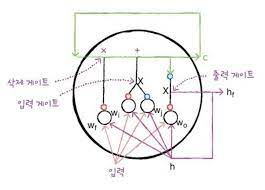
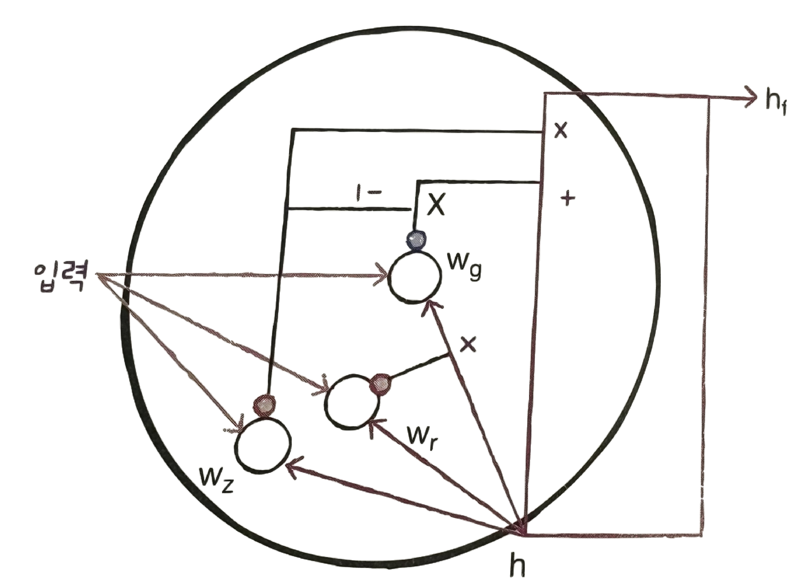
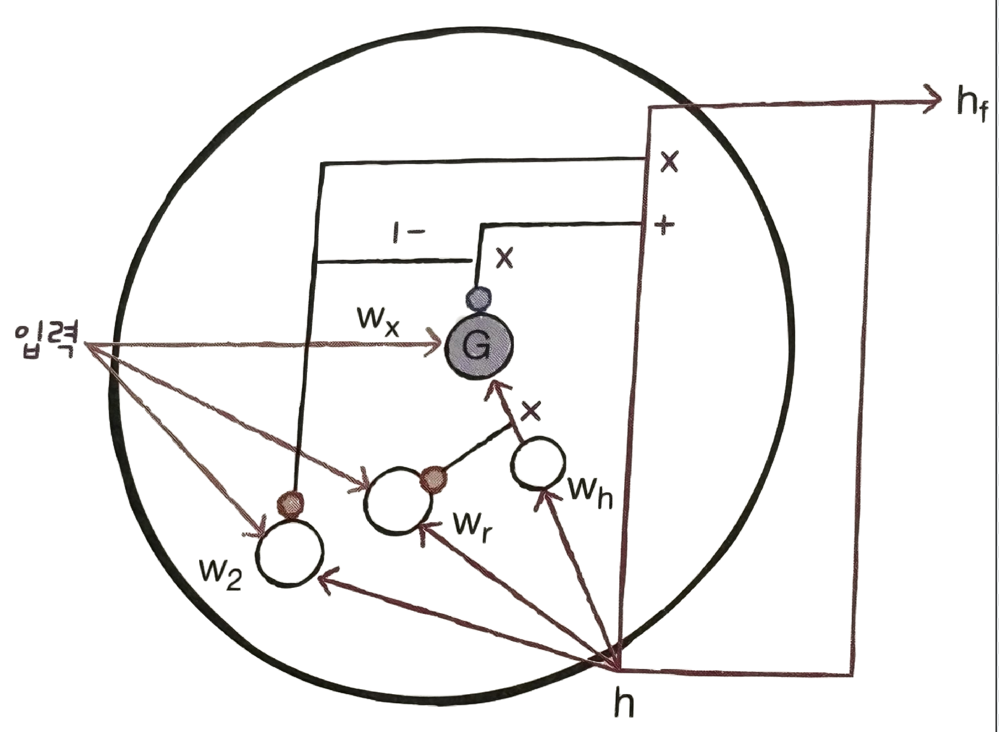

# ✔ LSTM과 GRU 셀

> ['LSTM과 GRU 셀' 구글 코랩](https://colab.research.google.com/github/rickiepark/hg-mldl/blob/master/9-3.ipynb)

## 1️⃣ LSTM 구조

- Long Short-Term Memory
- 일반적으로 기본 순환층은 긴 시퀀스를 학습하기 어려움
  - 이유: 시퀀스가 길수록 순환되는 은닉 상태에 담긴 정보가 점차 희석되기 때문
  - 따라서, 멀리 떨어져 있는 단어 정보를 인식하는 데 어려울 수 있음
- LSTM 셀은 타임스텝이 긴 데이터를 효과적으로 학습하기 위해 고안된 순환층임

### 구조



- 빨간색 원: 시그모이드 함수
- 파란색 원: tanh 함수
- 각 $w_f$, $w_i$, $w_j$, $w_o$는 $w_x$와 $w_h$를 통틀어 표시한 것임
- LSTM에는 총 4개의 작은 셀이 있음
- LSTM에는 순환되는 상태가 2개임
  1. 은닉 상태 (빨간색 선, h)
  2. 셀 상태 (초록색 선, c)
- 셀 상태 (cell state): 은닉 상태와 달리 다음 층으로 전달되지 않고 현재 셀 안에서만 순환되는 값
- 위 그림에서 세 군데의 곱셈을 왼쪽부터 차례대로 삭제 게이트, 입력 게이트, 출력 게이트라고 부름
  - 삭제 게이트: 셀 상태에 있는 정보를 제거하는 역할
  - 입력 게이트: 새로운 정보를 셀 상태에 추가하는 역할
  - 출력 게이트: 셀 상태를 다음 은닉 상태로 출력하는 역할

#### 은닉 상태를 만드는 부분 (오른쪽)

- 은닉 상태는 입력과 이전 타임스텝의 은닉 상태를 가중치 $w_o$에 곱한 후 시그모이드 활성화 함수를 통과시켜 다음 은닉 상태를 만듦
- 이때, tanh 활성화 함수를 통과한 어떤 값과 곱해져서 은닉 상태를 만듦

#### 셀 상태를 만드는 부분 1 (왼쪽)

- 입력과 은닉 상태를 또 다른 가중치 $w_f$에 곱한 다음 시그모이드 함수를 통과시킨 후, 이전 타임스텝의 셀 상태와 곱하여 새로운 셀 상태를 만듦
- 이 셀 상태가 오른쪽에서 tanh 함수를 통과하여 새로운 은닉 상태를 만드는 데 기여하게 됨

#### 셀 상태를 만드는 부분 2 (중앙)

- 2개의 작은 셀이 더 추가되어 셀 상태를 만드는 데 기여함
- 입력과 은닉 상태를 각기 다른 가중치 $w_i$, $w_j$에 곱한 다음, 하나는 시그모이드 함수를 통과시키고 다른 하나는 tanh 함수를 통과시킴
- 그다음 두 결과를 곱한 후 이전 셀 상태와 더함

## 2️⃣ LSTM 신경망 훈련하기

#### 1. IMDB 리뷰 데이터셋을 로드한 후, 훈련 세트와 검증 세트로 나누자

```py
from tensorflow.keras.datasets import imdb
from sklearn.model_selection import train_test_split

(train_input, train_target), (test_input, test_target) = imdb.load_data(num_words=500)

train_input, val_input, train_target, val_target = train_test_split(train_input, train_target, test_size=0.2, random_state=42)
```

#### 2. 각 샘플의 길이를 100으로 맞추자

```py
from tensorflow.keras.preprocessing.sequence import pad_sequences

train_seq = pad_sequences(train_input, maxlen=100)
val_seq = pad_sequences(val_input, maxlen=100)
```

#### 3. LSTM 순환 신경망 모델을 만들자

```py
from tensorflow import keras

model_lstm = keras.Sequential()
model_lstm.add(keras.layers.Input(shape=(100,)))
model_lstm.add(keras.layers.Embedding(500, 16))
model_lstm.add(keras.layers.LSTM(8))
model_lstm.add(keras.layers.Dense(1, activation='sigmoid'))
```

#### 4. 모델의 구조를 확인하자

```py
model_lstm.summary()
```


- LSTM 셀에 사용된 모델 파라미터 개수(800) = 16 x 8 x 4 + 8 x 8 x 4 + 8 x 4
- SimpleRNN 클래스의 모델 파라미터 개수는 200개였는데, LSTM 셀에는 작은 셀이 4개 있으므로 정확히 4배가 늘어 800개가 되었음

#### 5. 모델을 컴파일하고 훈련하자

```py
model_lstm.compile(optimizer='adam', loss='binary_crossentropy', metrics=['accuracy'])

checkpoint_cb = keras.callbacks.ModelCheckpoint('best-lstm-model.keras', save_best_only=True)
early_stopping_cb = keras.callbacks.EarlyStopping(patience=3, restore_best_weights=True)

history = model_lstm.fit(train_seq, train_target, epochs=100, batch_size=64, validation_data=(val_seq, val_target), callbacks=[checkpoint_cb, early_stopping_cb])
```


- 검증 세트에 대한 정확도가 약 80% 정도로 SimpleRNN 클래스를 사용했을 때보다 향상된 것을 알 수 있음

#### 6. 훈련 손실과 검증 손실 그래프를 그려보자

```py
import matplotlib.pyplot as plt

plt.plot(history.history['loss'], label='train')
plt.plot(history.history['val_loss'], label='val')
plt.xlabel('epoch')
plt.ylabel('loss')
plt.legend()
plt.show()
```


- 그래프를 보면 훈련 손실이 잘 줄어들고 있지만 과대적합을 잘 억제하지 못한 것 같음

## 3️⃣ 순환층에 드롭아웃 적용하기

- 드롭아웃: 은닉층에 있는 뉴런의 출력을 랜덤하게 꺼서 과대적합을 막는 기법
- 순환층은 자체적으로 드롭아웃 기능을 제공함
- SimpleRNN과 LSTM 클래스 모두 dropout 매개변수와 recurrent_dropout 매개변수를 가지고 있음
  - dropout 매개변수: 셀의 입력에 드롭아웃을 적용
  - recurrent_dropout 매개변수: 순환되는 은닉 상태에 드롭아웃을 적용
- 하지만, 기술적인 문제로 인해 recurrent_dropout을 사용하면 GPU를 사용하여 모델을 훈련하지 못하기 때문에, 모델의 훈련 속도가 크게 떨어지게 됨

#### 1. 20%의 드롭아웃을 가진 LSTM 순환 신경망 모델을 만들자

```py
model_dropout = keras.Sequential()
model_dropout.add(keras.layers.Input(shape=(100,)))
model_dropout.add(keras.layers.Embedding(500, 16))
model_dropout.add(keras.layers.LSTM(8, dropout=0.2))
model_dropout.add(keras.layers.Dense(1, activation='sigmoid'))
```

#### 2. 모델을 컴파일하고 훈련하자

```py
model_dropout.compile(optimizer='adam', loss='binary_crossentropy', metrics=['accuracy'])

checkpoint_cb = keras.callbacks.ModelCheckpoint('best-dropout-model.keras', save_best_only=True)
early_stopping_cb = keras.callbacks.EarlyStopping(patience=3, restore_best_weights=True)

history = model_dropout.fit(train_seq, train_target, epochs=100, batch_size=64, validation_data=(val_seq, val_target), callbacks=[checkpoint_cb, early_stopping_cb])
```


- 드롭아웃을 추가했더니 모델의 성능이 약간 줄어든 것 같음

#### 3. 훈련 손실과 검증 손실 그래프를 그려보자

```py
plt.plot(history.history['loss'], label='train')
plt.plot(history.history['val_loss'], label='val')
plt.xlabel('epoch')
plt.ylabel('loss')
plt.legend()
plt.show()
```


- LSTM 층에 적용한 드롭아웃 덕분에 훈련 손실이 줄어드는 것을 조금 억제했지만 검증 손실이 더 나아지지는 않음

## 4️⃣ 2개의 층을 연결하기

- 순환층의 은닉 상태는 샘플의 마지막 타임스텝에 대한 은닉 상태만 다음 층으로 전달하게 됨
- 하지만, 순환층을 쌓게 되면 모든 순환층에 순차 데이터가 필요하므로, 앞쪽의 순환층이 모든 타임스텝에 대한 은닉 상태를 출력해야 함
- 오직 마지막 순환층만 마지막 타임스텝의 은닉 상태를 출력해야 함

#### 1. 2개의 LSTM이 있는 순환 신경망 모델을 만들자

```py
model_2lstm = keras.Sequential()
model_2lstm.add(keras.layers.Input(shape=(100,)))
model_2lstm.add(keras.layers.Embedding(500, 16))
model_2lstm.add(keras.layers.LSTM(8, dropout=0.2, return_sequences=True))
model_2lstm.add(keras.layers.LSTM(8, dropout=0.2))
model_2lstm.add(keras.layers.Dense(1, activation='sigmoid'))
```

- `return_sequences` 매개변수: True로 지정하면 모든 타임스텝의 은닉 상태를 출력함

#### 2. 모델의 구조를 확인하자

```py
model_2lstm.summary()
```


#### 3. 모델을 컴파일하고 훈련하자

```py
model_2lstm.compile(optimizer='adam', loss='binary_crossentropy', metrics=['accuracy'])

checkpoint_cb = keras.callbacks.ModelCheckpoint('best-2lstm-model.keras', save_best_only=True)
early_stopping_cb = keras.callbacks.EarlyStopping(patience=3, restore_best_weights=True)

history = model_2lstm.fit(train_seq, train_target, epochs=100, batch_size=64, validation_data=(val_seq, val_target), callbacks=[checkpoint_cb, early_stopping_cb])
```


- 모델은 잘 훈련되었지만 여기에서는 순환층을 쌓아 그리 큰 효과를 얻진 못했음
- 하지만, 일반적으로 순환층을 쌓으면 성능이 높아짐

#### 4. 훈련 손실과 검증 손실 그래프를 그려보자

```py
plt.plot(history.history['loss'], label='train')
plt.plot(history.history['val_loss'], label='val')
plt.xlabel('epoch')
plt.ylabel('loss')
plt.legend()
plt.show()
```


## 5️⃣ GRU 구조

- Gated Recurrent Unit
- LSTM을 간소화한 버전의 셀
- LSTM처럼 셀 상태를 계산하지 않고 은닉 상태 하나만 포함하고 있음
- GRU 셀은 LSTM보다 가중치가 적기 때문에 계산량이 적지만, LSTM 못지않은 좋은 성능을 내는 것으로 알려짐

### 구조



- 빨간색 원: 시그모이드 함수
- 파란색 원: tanh 함수
- 각 $w_z$, $w_r$, $w_g$는 $w_x$와 $w_h$를 통틀어 표시한 것임
- GRU 셀에는 은닉 상태와 입력에 가중치를 곱하고 절편을 더하는 작은 셀이 3개 있음
  - 2개는 시그모이드 활성화 함수를 사용하고 1개는 tanh 활성화 함수를 사용함

#### 왼쪽 셀

- $w_z$를 사용하는 셀의 출력이 은닉 상태에 바로 곱해짐
- 삭제 게이트 역할을 수행

#### 오른쪽 셀

- 왼쪽 $w_z$를 사용하는 셀에서의 출력을 1에서 뺀 다음에, $w_g$를 사용하는 셀의 출력에 곱함
- 입력되는 정보를 제어하는 역할을 수행

#### 중앙 셀

- $w_r$을 사용하는 셀에서 출력된 값은 $w_g$ 셀이 사용할 은닉 상태의 정보를 제어함

## 6️⃣ GRU 신경망 훈련하기

#### 1. GRU 순환 신경망 모델을 만들자

```py
model_gru = keras.Sequential()
model_gru.add(keras.layers.Input(shape=(100,)))
model_gru.add(keras.layers.Embedding(500, 16))
model_gru.add(keras.layers.GRU(8, dropout=0.2))
model_gru.add(keras.layers.Dense(1, activation='sigmoid'))
```

#### 2. 모델의 구조를 확인하자

```py
model_gru.summary()
```


- GRU 셀에 사용된 모델 파라미터 개수(624) = 16 x 8 x 3 + 8 x 8 x 3 + 8 x 3 = 600개❓
- 사실 케라스에 구현된 GRU 셀의 계산은 아래처럼 계산됨

  - 이유: GPU를 잘 활용하기 위함
  - 위에서는 가운데 셀의 출력과 은닉 상태가 곱해진 후 G셀에 입력되었음
  - 아래에서는 은닉 상태가 먼저 가중치와 곱해진 다음 가운데 셀의 출력과 곱해짐
  - 따라서, 위에서는 가중치를 $w_g$로 표기했는데, 아래에서는 $w_x$와 $w_h$로 나눔

  

- 이처럼 나누어 계산하면 은닉 상태에 곱해지는 가중치 외에 절편이 별도로 필요함
  - 따라서, 작은 셀마다 하나씩 절편이 추가되고 8개의 뉴런이 있으므로 총 24개의 모델 파라미터가 더해져 GRU 층의 총 모델 파라미터 개수는 624개가 됨
- 사실, 대부분의 GRU 셀을 소개할 때는 위가 아닌 이전의 구조를 사용함

#### 3. 모델을 컴파일하고 훈련하자

```py
model_gru.compile(optimizer='adam', loss='binary_crossentropy', metrics=['accuracy'])

checkpoint_cb = keras.callbacks.ModelCheckpoint('best-gru-model.keras', save_best_only=True)
early_stopping_cb = keras.callbacks.EarlyStopping(patience=3, restore_best_weights=True)

history = model_gru.fit(train_seq, train_target, epochs=100, batch_size=64, validation_data=(val_seq, val_target), callbacks=[checkpoint_cb, early_stopping_cb])
```


- LSTM과 거의 비슷한 성능을 냄

#### 4. 훈련 손실과 검증 손실 그래프를 그려보자

```py
plt.plot(history.history['loss'], label='train')
plt.plot(history.history['val_loss'], label='val')
plt.xlabel('epoch')
plt.ylabel('loss')
plt.legend()
plt.show()
```


## cf) 핵심 패키지와 함수

### Keras

#### `LSTM` 클래스

- LSTM 셀을 사용한 순환층 클래스
- 첫 번째 매개변수에 뉴런의 개수를 지정
- dropout 매개변수
  - 입력에 대한 드롭아웃 비율을 지정
- return_sequences 매개변수
  - 모든 타입스텝의 은닉 상태를 출력할지 결정
  - 기본값: False

#### `GRU` 클래스

- GRU 셀을 사용한 순환층 클래스
- 첫 번째 매개변수에 뉴런의 개수를 지정
- dropout 매개변수
  - 입력에 대한 드롭아웃 비율을 지정
- return_sequences 매개변수
  - 모든 타입스텝의 은닉 상태를 출력할지 결정
  - 기본값: False
