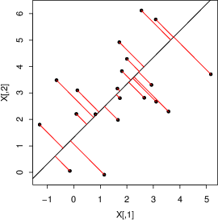
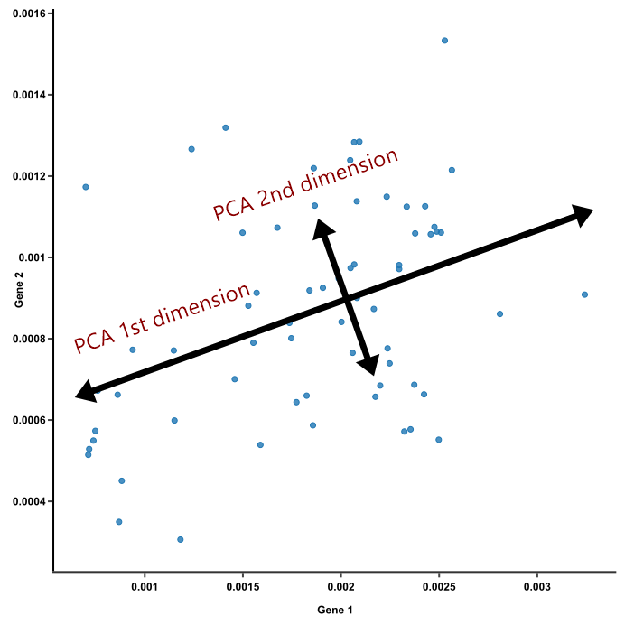

# ✔ 주성분 분석

> ['주성분 분석' 구글 코랩](https://colab.research.google.com/github/rickiepark/hg-mldl/blob/master/6-3.ipynb)

## 1️⃣ 차원과 차원 축소

- 특성: 데이터가 가진 속성
  - 과일 사진의 경우, 10,000개의 픽셀 == 10,000개의 특성
- 머신러닝에서는 특성으로 차원(dimension)이라고도 부름
- 배열과 벡터에서 차원이란 용어는 조금 다르게 사용됨
  - 다차원 배열에서의 차원: 배열의 축 개수
  - 벡터에서의 차원: 원소의 개수

### 차원 축소(dimensionality reduction)

- 비지도 학습 작업 중 하나인 알고리즘
- 원본 데이터의 특성을 적은 수의 새로운 특성으로 변환
- 특성이 많으면 선형 모델의 성능이 높아지고 훈련 데이터에 쉽게 과대적합 됨
- 차원 축소는 데이터를 가장 잘 나타내는 일부 특성을 선택하여 데이터 크기를 줄이고 지도 학습 모델의 성능을 향상시킬 수 있는 방법임
- 줄어든 차원에서 다시 원본 차원으로 손실을 최대한 줄이면서 복원할 수도 있음
- 장점
  1.  저장 공간을 줄임
  2.  시각화하기 쉬움
  3.  다른 알고리즘의 성능을 높이거나 훈련 속도를 빠르게 만듦

## 2️⃣ 주성분 분석 소개

- Principle Component Analysis, PCA
- 대표적인 차원 축소 알고리즘
- 데이터에 있는 분산이 큰 방향을 찾음
  - 분산: 데이터가 널리 퍼져있는 정도
  - 분산이 큰 방향 == 데이터를 잘 표현하는 어떤 벡터

### 주성분(주성분 벡터)



- 원본 데이터에 있는 가장 분산이 큰 방향으로, 주성분에 투영하여 바꾼 데이터는 원본이 가지고 있는 특성을 가장 잘 나타냄
- 주성분 백터의 원소 개수는 원본 데이터셋에 있는 특성 개수와 같음
- 주성분을 사용해 원본 데이터의 차원을 줄일 수 있음
- 즉, 주성분은 원본 차원과 같고 주성분으로 바꾼 데이터는 차원이 줄어듦



- 첫 번째 주성분 벡터에 수직이고 그 다음으로 분산이 큰 방향이 두 번째 주성분이 됨
- 일반적으로 주성분은 원본 특성의 개수보다 작음

## 3️⃣ PCA 클래스

#### 1. 과일 데이터를 불러온 후, 2차원 배열로 펼치자

```py
import numpy as np

fruits = np.load('fruits_300.npy')
fruits_2d = fruits.reshape(-1, 100*100)
```

#### 2. 과일 데이터에서 50개의 주성분을 찾아보자

```py
from sklearn.decomposition import PCA

pca = PCA(n_components=50)
pca.fit(fruits_2d)
```

- `n_components`: 주성분의 개수 지정

#### 3. PCA 클래스가 찾은 주성분을 이미지로 출력해보자

```py
print(pca.components_.shape)  # (50, 10000)
```

- `components_`: PCA 클래스가 찾은 주성분이 저장됨
  - 첫 번째 차원은 주성분 개수가 됨
  - 두 번쨰 차원은 원본 데이터의 특성 개수와 같음

```py
draw_fruits(pca.components_.reshape(-1, 100, 100))
```


- 원본 데이터에서 가장 분산이 큰 방향을 순서대로 나타냄
- 데이터셋에 있는 어떤 특징을 잡아낸 것처럼 생각할 수도 있음

#### 4. 주성분을 사용해 원본 데이터의 차원을 줄여보자

```py
print(fruits_2d.shape)  # (300, 10000)

fruits_pca = pca.transform(fruits_2d)
print(fruits_pca.shape)  # (300, 50)
```

- 차원을 10,000개에서 50개로 줄임
- fruits_2d 대신 fruits_pca를 저장한다면 훨씬 공간을 줄일 수 있을 것임

## 4️⃣ 원본 데이터의 재구성

- 어느 정도 손실이 발생할 수밖에 없지만, 최대한 분산이 큰 방향으로 데이터를 투영했기 때문에 원본 데이터를 상당 부분 재구성할 수 있음

#### 1. 차원이 축소된 데이터를 원본 데이터로 복원해보자

```py
fruits_inverse = pca.inverse_transform(fruits_pca)
print(fruits_inverse.shape)  # (300, 10000)
```

- `inverse_transform()`: 원본 데이터로 복원해주는 메서드
- 50개에서 10,000개로 특성이 복원되었음

#### 2. 복원된 데이터를 전부 이미지로 출력해보자

```py
fruits_reconstruct = fruits_inverse.reshape(-1, 100, 100)
for start in [0, 100, 200]:
    draw_fruits(fruits_reconstruct[start:start+100])
    print("\n")
```


- 일부 흐리고 번진 부분이 있지만, 거의 모든 과일이 잘 복원되었음

## 5️⃣ 설명된 분산

- explained variance
- 주성분이 원본 데이터의 분산을 얼마나 잘 나타내는지 기록한 값

#### 1. 50개 주성분의 총 분산 비율을 확인해보자

```py
print(np.sum(pca.explained_variance_ratio_))  # 0.922
```

- `explained_variance_ratio_`: 각 주성분의 설명된 분산 비율이 기록됨
  - 첫 번째 주성분의 설명된 분산이 가장 큼
  - 이 분산 비율을 전부 더하면 50개의 주성분으로 표현하고 있는 총 분산 비율을 얻을 수 있음
- 92%가 넘는 분산을 유지하는 것을 확인할 수 있음

#### 2. 설명된 분산의 비율을 그래프로 그려보자

```py
plt.plot(pca.explained_variance_ratio_)
```


- 그래프를 보면 처음 10개의 주성분이 대부분의 분산을 표현하고 있음을 알 수 있음
- 이를 통해 적절한 주성분의 개수를 찾는데 도움을 줄 수 있음

## 6️⃣ 다른 알고리즘과 함께 사용하기

- 과일 사진 원본 데이터와 PCA로 축소한 데이터를 지도 학습에 적용해 보고 어떤 차이가 있는지 알아보자

#### 1. 원본 데이터를 사용해, 로지스틱 회귀 모델을 훈련하고 평가해보자

```py
from sklearn.linear_model import LogisticRegression
from sklearn.model_selection import cross_validate

target = np.array([0] * 100 + [1] * 100 + [2] * 100)
lr = LogisticRegression()

scores = cross_validate(lr, fruits_2d, target)
print(np.mean(scores['test_score']))  # 0.997
print(np.mean(scores['fit_time']))  # 0.748
```

- 교차 검증의 점수는 99.7% 정도로 매우 높음
- fit_time 항목에 각 교차 검증 폴드의 훈련 시간이 기록되어 있음

#### 2. PCA로 축소한 데이터를 사용해, 로지스틱 회귀 모델을 훈련하고 평가해보자

```py
scores = cross_validate(lr, fruits_pca, target)
print(np.mean(scores['test_score']))  # 0.997
print(np.mean(scores['fit_time']))  # 0.021
```

- 50개의 특성만 사용했는데도 정확도가 99.7%로 동일하고 훈련 시간은 30배 이상 감소했음
- PCA로 훈련 데이터의 차원을 축소하면 저장 공간뿐만 아니라 머신러닝 모델의 훈련 속도도 높일 수 있음

#### 3. 설명된 분산의 50%에 달하는 주성분을 찾아, 이 모델로 원본 데이터를 변환해보자

```py
pca = PCA(n_components=0.5)
pca.fit(fruits_2d)

print(pca.n_components_)  # 2
```

- n_components 매개변수에 주성분의 개수 대신 원하는 설명된 분산의 비율(0~1 사이 실수)을 입력할 수도 있음
  - PCA 클래스는 지정된 비율에 도달할 때까지 자동으로 주성분을 찾음
- 단 2개의 주성분만 찾았음
  - 즉, 2개의 특성만으로 원본 데이터에 있는 분산의 50%를 표현함

```py
fruits_pca = pca.transform(fruits_2d)
print(fruits_pca.shape)  # (300, 2)
```

#### 4. 2개의 특성으로 축소된 데이터를 사용해, 로지스틱 회귀 모델을 훈련하고 평가해보자

```py
scores = cross_validate(lr, fruits_pca, target)
print(np.mean(scores['test_score']))  # 0.99
print(np.mean(scores['fit_time']))  # 0.047
```

- 2개의 특성을 사용했을 뿐인데 99%의 정확도를 달성했음

#### 5. 차원 축소된 데이터를 사용해 k-평균 알고리즘으로 클러스터를 찾아보자

```py
from sklearn.cluster import KMeans

km = KMeans(n_clusters=3, random_state=42)
km.fit(fruits_pca)

print(np.unique(km.labels_, return_counts=True))
# (array([0, 1, 2], dtype=int32), array([110,  99,  91]))
```

- 6-2절에서 원본 데이터를 사용했을 때와 거의 비슷한 결과임

#### 6. 각 클러스터별로 과일 이미지를 출력해보자

```py
for label in range(0, 3):
    draw_fruits(fruits[km.labels_ == label])
    print("\n")
```


- 6-2절에서 찾은 클러스터와 비슷하게 파인애플과 사과가 조금 혼동되는 면이 있음

#### 7. 차원 축소된 데이터를 클러스터별로 나누어 산점도를 그려보자

```py
for label in range(0, 3):
    data = fruits_pca[km.labels_ == label]
    plt.scatter(data[:,0], data[:,1])
plt.legend(['pineapple', 'banana', 'apple'])
plt.show()
```


- 훈련 데이터의 차원을 줄였을 때의 또 다른 장점은 시각화임
  - 3개 이하로 차원을 줄이면 화면에 비교적 출력하기 쉬움
  - 위에서 2개의 특성으로 줄였기 때문에 2차원으로 표현할 수 있음
- 각 클러스터의 산점도가 잘 구분되는 것을 확인할 수 있음
  - 2개의 특성만을 사용했는데도 로지스틱 회귀 모델의 교차 검증 점수가 높은 이유임
  - 사과와 파인애플의 클러스터의 경계가 가깝게 붙어 있기 때문에 두 클러스터의 일부 샘플이 섞이게 됐을 것임

## cf) 핵심 패키지와 함수

### scikit-learn

#### `PCA` 클래스

- 주성분 분석을 수행하는 클래스
- n_components 매개변수
  - 주성분의 개수를 지정
  - 기본값: None (샘플 개수와 특성 개수 중에 작은 값)
- random_state 매개변수
  - 넘파이 난수 시드 값을 지정
- components\_ 속성
  - 훈련 세트에서 찾은 주성분이 저장됨
- explained*variance* 속성
  - 설명된 분산이 저장됨
- explained_variance_ratio 속성
  - 설명된 분산의 비율이 저장됨
- inverse_transform() 메서드
  - transform() 메서드로 차원을 축소시킨 데이터를 다시 원본 차원으로 복원함
