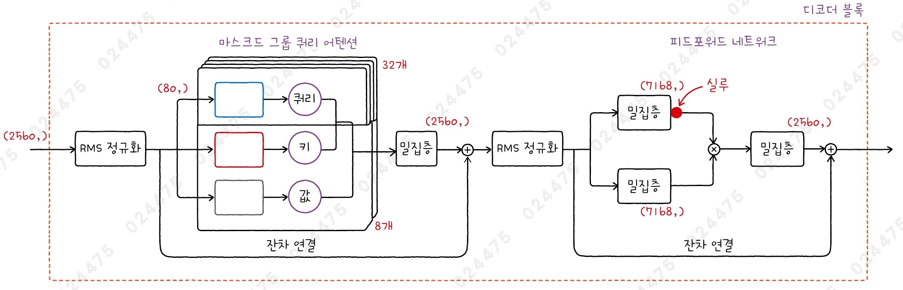
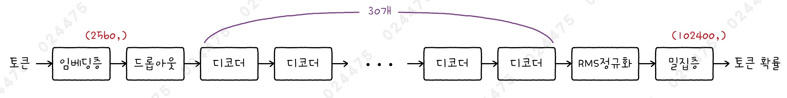
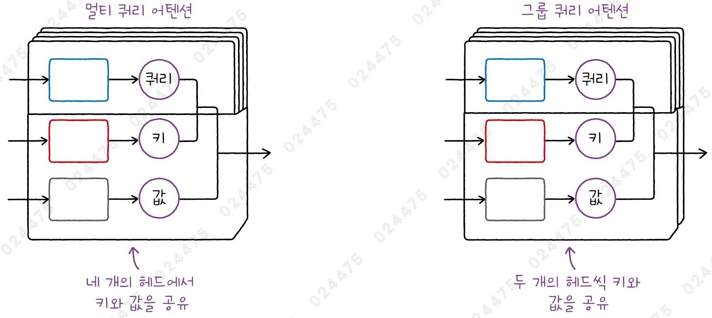
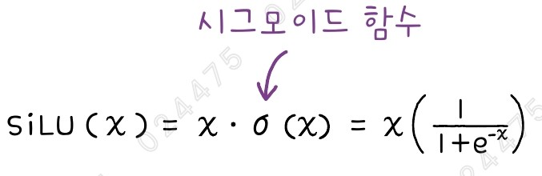
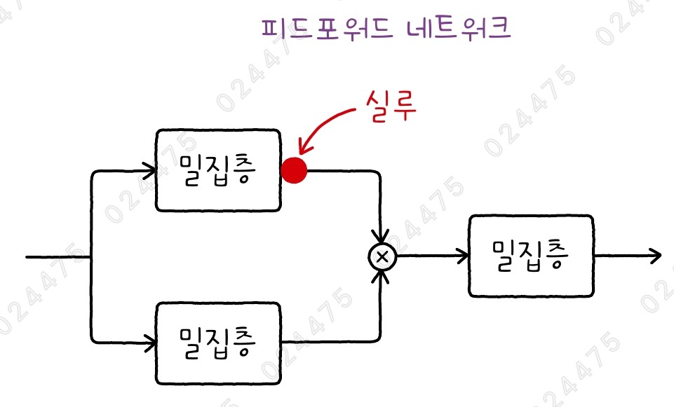
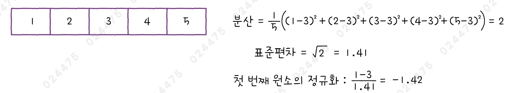
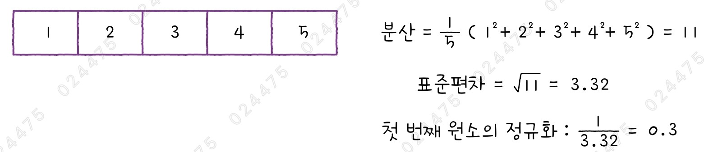
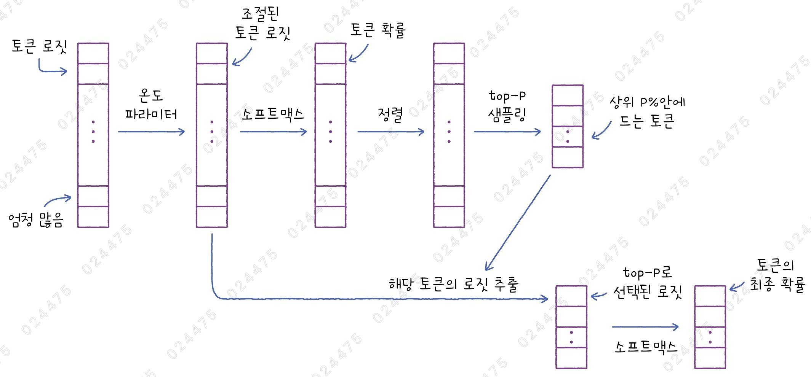
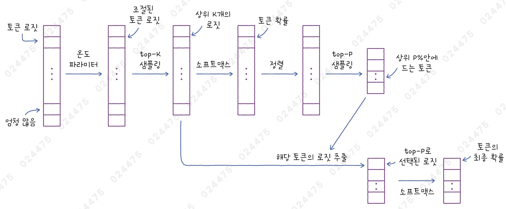

# ✔ 대규모 언어 모델로 텍스트 생성하기

> ['대규모 언어 모델로 텍스트 생성하기' 구글 코랩](https://colab.research.google.com/github/rickiepark/hg-mldl2/blob/main/10-3.ipynb)

## 1️⃣ 디코더 기반의 대규모 언어 모델

- 디코더 기반의 LLM은 텍스트 생성 능력이 특히 뛰어나기 때문에 종종 생성 언어 모델 또는 생성 언어 AI라고도 불림

### 대표적인 오픈 소스 모델

- 메타의 Llama
- 구글의 Gemma
- 마이크로소프트의 Phi
- 알리바바의 Qwen
- 인기 있는 오픈 소스 모델을 특정 데이터셋으로 다시 미세 튜닝한 변형 모델들도 많음

### 대표적인 클로즈드 소스 모델

- 오픈 AI의 GPT-4
- Anthropic의 Claude
- 구글의 Gemini
- 클로즈드 소스 모델들은 웹 인터페이스를 제공하거나, API 방식을 지원함

## 2️⃣ LLM 리더보드

- 대규모 언어 모델의 성능을 비교하는 서비스가 많음
  - ex) 오픈 LLM 리더보드, LMSYS 챗복 아레나 리더보드

### 오픈 LLM 리더보드

> [오픈 LLM 리더보드 사이트](https://huggingface.co/open-llm-leaderboard)


- 허깅페이스에서 제공하는 서비스로, 허깅페이스에 등록된 오픈 소스 LLM의 성능을 비교함
- 이를 활용해 특정 작업에 적합한 최신 모델을 쉽게 찾을 수 있음

#### Type

- 모델의 종류
- 🟢: 대규모 데이터셋에서 사전 훈련된 베이스 모델 (또는 파운데이션 모델)
- 🔶: 특정 데이터셋에서 미세 튜닝된 모델
- 💬: 대화 기능을 위해 미세 튜닝된 모델
- 🤝: 여러 모델을 병합하여 만든 모델
- 🌺: 텍스트, 이미지, 오디오 등과 같이 여러 종류의 데이터를 다룰 수 있는 모델
- 🟩: 다양한 데이터셋을 사용해 추가로 훈련한 베이스 모델

#### Average

- 모든 벤치마크에서 얻은 점수를 평균한 값
- 리더보드는 기본적으로 Average 열의 값을 기준으로 정렬됨

1. `IFEval`

   - Instruction-Following Evaluation
   - 약 500개의 프롬프트를 선택하여 언어 모델이 프롬프트의 지시를 얼마나 잘 따르는지 평가한 값

2. `BBH`

   - Big Bench Hard
   - 빅 벤치 평가의 하위 집합으로 다단계 추론 능력을 평가하는 어려운 과제로 구성됨

3. `MATH`

   - Mathematics Aptitude Test of Heuristics
   - 수학 문제 해결 능력을 평가
   - 12,500개 문제로 구성
   - 대수학, 정수론, 조합, 확률, 미적분 등의 문제를 풀어야 함

4. `GPQA`

   - Graduate-Level Google-Proof Q&A
   - 화학, 생물학, 물리학 분야에서 박사 수준의 448개의 객관식 문제를 풂

5. `MUSR`

   - Multistep Soft Reasoning
   - 자연어로 묘사된 추론 문제를 풂
   - ex) 1,000 단어 길이의 미스터리 문제를 풂

6. `MMLU-Pro`

   - Massive Multitask Language Understanding - Professional
   - 대규모 언어 모델의 언어 이해과 추론 능력을 평가
   - 기존의 MMLU보다 더 복잡하고 어려운 12,000개의 문제로 구성

7. `CO₂ Cost`

   - 모델을 평가하는 데 사용된 전력을 생상하기 위해 배출된 탄소의 양 (Kg)

#### Quick Filters

- 리더보드 중앙 검색 창 아래에 'Quick Filters' 버튼이 있음
- 모델 파라미터 크기에 따라 순서대로 네 개의 버튼이 제공됨
- For Edge Devices: 30억 개 이하
- For Consumers: 30억 개 ~ 70억 개
- Mid-range: 70억 개 ~ 650억 개
- For the GPU-rich: 650억 개 이상

## 3️⃣ EXAONE의 특징

- 국내에서 오픈 소스로 공개된 파운데이션 모델
- LG AI 연구원에서 만든 디코더 기반 트랜스포머 모델
- 한국어와 영어를 잘 이해하며, 다양한 작업을 수행할 수 있음

### EXAONE-3.5

- 2024년 후반 LG AI 연구원에서 공개한 디코더 기반 LLM
- 24억 개의 파라미터를 가진 작은 모델
- IFEval 점수가 79.5%에 달해서 비슷한 크기의 다른 모델의 성능을 압도함
- 최신 LLM에서 채택하는 여러 기술을 사용함
  - 그룹 쿼리 어텐션
  - 피드포워드 네트워크에서 실루 활성화 함수 사용
  - RMS 정규화
  - 로터리 위치 임베딩

#### 디코더 블록



- 24억 파라미터 버전 EXAONE의 디코더 블록
- 24억 파라미터 버전의 은닉 벡터 크기는 2,560임
- 이를 80개씩 나누어 32개의 헤드에 입력됨
- 그룹 쿼리 어텐션을 사용하며 키와 값의 헤드는 8개임
- 피드 포워드 네트워크에서 실루 활성화 함수를 사용

#### EXAONE 전체 구조



- 24억 파라미터 버전 EXAONE의 전체 구조
- 디코더 블록을 30개 쌓음
- 마지막 밀집층을 통과하면서 어휘 사전 크기인 102,400 크기의 벡터를 출력함
  - 이 출력에 소프트맥스 함수를 적용하면 어휘 사전에 있는 모든 토큰에 대한 확률을 구할 수 있음

### 그룹 쿼리 어텐션



- Grouped Query Attention
- 멀티 헤드 어텐션의 변형
- 디코더는 하나의 토큰을 생성한 후, 그 토큰을 입력의 끝에 이어 붙인 다음 다시 모델에 입력해 다음 토큰을 생성함 (자기회귀 모델)
  - 하나의 토큰을 생성할 때마다 이전에 처리했던 토큰들을 매번 다시 계산해야 하므로 계산 낭비처럼 보임
  - 이를 해결하기 위해 어텐션 층에서 키와 값을 캐시에 저장하고 다음 토큰을 생성할 때 재사용하는 기법이 등장함
  - 하지만, 트랜스포머에 입력할 수 있는 최대 입력 길이를 늘리려면 캐시의 크기도 자연스럽게 커질 수 밖에 없는 문제가 있음
  - 이 문제를 해결하기 위해 멀티 쿼리 어텐션이 등장함
- 멀티 쿼리 어텐션 (Multi-Query Attention): 멀티 헤드 어텐션에서 키와 값을 모든 헤드에서 공유하는 방식
- 그룹 쿼리 어텐션: 모든 헤드에서 키와 값을 공유하지 않고, 몇 개의 헤드씩 나눠서 공유하는 방식
- 멀티 쿼리 어텐션과 그룹 쿼리 어텐션은 키와 값을 만드는 밀집층의 개수가 줄어들기 때문에 전체 모델의 파라미터 개수를 줄이는 효과가 있음
- EXAONE은 24억, 78억, 320억 파라미터 버전에서 모두 그룹 쿼리 어텐션을 사용함

### 실루(SiLU) 활성화 함수



- 밀집층의 출력에 시그모이드 함수를 적용한 다음, 이 결과에 원래 출력을 다시 곱함
- 실루 함수는 렐루 함수와 비슷한 형태를 가지며, 젤루와 마찬가지로 원점에서도 미분이 가능함



- 일반적으로 실루 함수를 적용할 때 피드포워드 네트워크의 첫 번째 밀집층을 두 개로 나누어 하나는 실루 함수를 적용하고, 다른 하나는 활성화 함수를 적용하지 않음
- 그 후, 이 두 출력을 곱함

### RMS 정규화

- 층 정규화의 변종
- 정규화를 할 때 평균을 구하지 않는 방법
- 평균을 계산하지 않아도 되므로 계산 속도가 빠름
- 평균을 사용해 데이터를 중심에 맞추지 않아도 모델의 성능에 큰 영향을 미치지 않음
- 최근 LLM은 RMS 정규화를 어텐션 층 다음이 아니라 어텐션 이전에 두는 경향이 있음
- EXAONE도 어텐션 층 이전과 피드포워드 네트워크 이전에 RMS 정규화를 적용함

#### 일반 정규화



- 입력에서 평균을 빼고 표준편차로 나누어 표준 점수를 계산함
- 층 정규화도 기본적으로 이와 같은 방식으로 사용함

#### RMS 정규화



- 입력에서 평균을 빼지 않고, 표준편차를 구할 때도 평균을 사용하지 않음

### 로터리 위치 임베딩

- Rotary Position Embedding, RoPE
- 디코더 블록의 어텐션 층 안에 위치 임베딩이 포함됨
- EXAONE을 비롯해 최근 LLM에서 널리 사용되는 위치 임베딩 방식임
- 쿼리와 키 벡터를 서로 다른 각도로 회전한 후, 회전시킨 두 벡터를 곱하면 그 결과에 두 벡터의 상대적인 각도 차이를 인코딩할 수 있음
- 절대 위치 임베딩: 토큰의 절대적인 위치 인덱스를 벡터로 변환
  - 위치 인코딩, 위치 임베딩이 여기에 해당
- 상대 위치 임베딩: 쿼리와 키의 상대적인 각도 차이를 표현
  - 로터리 위치 임베딩이 여기에 해당
- 로터리 위치 임베딩은 별도의 위치 임베딩 벡터를 만들지 않기 때문에 계산이 간단하고 트랜스포머 모델의 성능도 향상시킴

## 4️⃣ EXAONE-3.5로 상품 질문에 대한 대답 생성하기

- EXAONE 모델에서 채팅 템플릿을 사용하려면 토크나이저를 별도로 로드해야 함

#### 1. EXAONE의 토크나이저를 로드하자

```py
from transformers import AutoTokenizer

exaone_tokenizer = AutoTokenizer.from_pretrained("LGAI-EXAONE/EXAONE-3.5-2.4B-Instruct")
```

- `AutoTokenizer` 클래스를 사용해 토크나이저를 명시적으로 로드하여 pipeline() 함수에 전달할 수 있음
- `from_pretrained()` 메서드: 토크나이저를 로드함
  - 불러올 토크나이저 이름은 허깅페이스의 경로를 전달하면 됨

#### 2. EXAONE 파이프라인을 준비하자

```py
from transformers import pipeline

pipe = pipeline(task="text-generation",
                model="LGAI-EXAONE/EXAONE-3.5-2.4B-Instruct",
                tokenizer=exaone_tokenizer,
                device=0, trust_remote_code=True)
```

- `tokenizer` 매개변수: 토크나이저 지정
- `trust_remote_code` 매개변수: True로 설정하면, 코드를 신뢰한다고 가정하고 일일이 실행할지 여부를 묻지 않음
  - 허깅페이스에 있는 모델은 transformers 패키지의 코드 외에 독자적인 코드로 모델을 정의할 수 있음
  - EXAONE이 이런 경우에 해당함
  - 이런 코드는 실행하기 전에 사용자에게 실행 여부를 묻게 됨

#### 3. 채팅 템플릿을 만들자

```py
messages = [
    {"role": "system",
     "content": "너는 쇼핑몰 홈페이지에 올라온 질문에 대답하는 Q&A 챗봇이야. \
                 확정적인 답변을 하지 말고 제품 담당자가 정확한 답변을 하기 위해 \
                 시간이 필요하다는 간단하고 친절한 답변을 생성해줘."},
    {"role": "user", "content": "이 다이어리에 내년도 공휴일이 표시되어 있나요?"}
]
```

- 채팅 템플릿은 딕셔너리의 리스트로 구성됨
- 딕셔너리의 키로는 'role'과 'content'가 있음
  - 'role': 'system'과 'user'와 같이 대화 상대의 역할을 지정함
  - 'content': 실제 메시지 내용

#### 4. 파이프라인 객체를 호출해 대답을 생성하자

```py
pipe(messages, max_new_tokens=200)
"""
[{'generated_text': [{'role': 'system',
    'content': '너는 쇼핑몰 홈페이지에 올라온 질문에 대답하는 Q&A 챗봇이야. 확정적인 답변을 하지 말고 제품 담당자가 정확한 답변을 하기 위해 시간이 필요하다는 간단하고 친절한 답변을 생성해줘.'},
   {'role': 'user', 'content': '이 다이어리에 내년도 공휴일이 표시되어 있나요?'},
   {'role': 'assistant',
    'content': '안녕하세요! 다이어리에 내년의 공휴일이 미리 표시되어 있는지에 대한 정확한 답변을 드리기 위해 잠시 시간이 필요합니다. 제품 담당자께서 확인해 주실 예정이니, 조금만 기다려 주세요. 빠르게 알려드릴게요! 😊'}]}]
"""
```

- 생성된 텍스트는 딕셔너리의 리스트 형태로 반환함
- 딕셔너리 안에는 'generate_text' 키와 이 키의 값으로 채팅 템플릿에 포함된 메시지와 함께 'role'이 'assistant'인 항목이 추가됨

```py
pipe(messages, max_new_tokens=200, return_full_text=False)
"""
[{'generated_text': '안녕하세요! 다이어리에 대한 질문 감사합니다. 정확한 정보를 드리기 위해서는 제품 담당자님께서 확인이 필요합니다. 공휴일 정보는 매년 변경될 수 있으니, 가능한 빨리 확인해 주시면 좋겠습니다. 추가로 궁금한 점이 있으시다면 언제든지 물어봐 주세요!'}]
"""
```

- `return_full_text` 매개변수: False로 지정하면, 모델이 생성한 텍스트만 출력됨
- 다음 토큰을 선택할 때 무조건 가장 높은 확률의 토큰을 선택하기 때문에, 위 두 결과를 보면 출력 내용이 동일한 것을 알 수 있음

```py
output = pipe(messages, max_new_tokens=200, return_full_text=False, do_sample=True)

print(output[0]['generated_text'])
"""
물론이죠! 다이어리에 내년도 공휴일 정보가 포함되어 있는지 확인하려면, 먼저 제품 설명이나 카탈로그를 살펴보시는 게 좋을 것 같아요. 만약 온라인으로 확인하고 계시다면, 해당 제품 페이지의 고객 리뷰나 FAQ 섹션에서도 관련 정보를 찾아볼 수 있을 거예요. 제품 담당자님께 직접 문의하시는 것도 가장 확실한 방법일 것 같아요. 시간이 조금 걸리더라도 정확한 답변을 받으실 수 있을 거예요! 😊
"""
```

- `do_sample` 매개변수: True로 지정하면, 조금 확률적으로 토큰을 선택할 수 있음
- 대규모 언어 모델은 마지막에 어휘 사전 크기만큼의 확률을 출력함
- 이 확률을 바탕으로 어떤 토큰을 선택할지를 결정하는 과정을 샘플링 전략 (또는 디코딩 전략)이라고 함

## 5️⃣ 토큰 디코딩 전략

- 대규모 언어 모델이 출력한 로짓을 바탕으로 다음 토큰을 선택하는 과정
- 실제로 디코더가 출력하는 것은 확률이 아니라 어휘 사전에 들어 있는 각 토큰에 대한 점수임
- 이 점수에 소프트맥스 함수를 적용하면 확률로 변환할 수 있음
  - 보통 소프트맥스 함수를 적용하기 전의 값을 로짓(logit)이라 부름
- 디코더가 출력한 로짓 중에서 어떤 토큰을 선택할지는 LLM 모델이 아닌, transformers 같은 프레임워크의 몫임
  - 프레임워크마다 조금씩 다를 수 있기 때문에 같은 모델, 같은 프롬프트, 같은 디코딩 옵션을 사용하더라도 출력된 텍스트가 다를 수 있음

### transformers 패키지 기준 디코딩 전략

1. `do_sample` 매개변수가 False(기본값)인 경우

   - 가장 간단한 디코딩 방식
   - 가장 높은 확률을 가진 토큰 하나를 선택함
   - 프롬프트가 같으면 모델을 여러 번 실행해도 항상 같은 대답을 얻을 수 있음
   - 이런 전략을 그리디 서치(Greedy Search)라 부름

2. `do_sample` 매개변수가 True인 경우

   - 샘플링 전략을 사용함
   - ex) top-k 샘플링, top-p 샘플링

### 기본 샘플링

#### 1. 다섯 개의 토큰에 대한 로짓을 얻었고, 이 중 한 토큰의 로짓이 아주 크다고 가정해보자

```py
import numpy as np

logits = np.array([1, 2, 3, 4, 100])
```

#### 2. 로짓 배열을 소프트맥스 함수에 통과시켜 보자

```py
from scipy.special import softmax

probas = softmax(logits)
print(probas)
# [1.01122149e-43 2.74878501e-43 7.47197234e-43 2.03109266e-42 1.00000000e+00]
```

- 결과를 보면 마지막 원소의 확률이 거의 1에 가깝고 나머지 원소의 확률은 0에 가까움

#### 3. 100번 샘플링해서 확률 분포에서 하나의 토큰을 랜덤하게 선택해보자

```py
np.random.multinomial(100, probas)
# array([  0,   0,   0,   0, 100])
```

- `random.multinomial()` 함수: 주어진 확률 분포를 바탕으로 샘플링함
- 100번을 시도했는데 100번 모두 마지막 원소가 선택됨
- 이는 그리디 서치를 적용한 것과 별반 다르지 않음
- 소프트맥스 함수가 만드는 확률 분포를 조금 변형시켜 주는 기법을 사용하면 선택 범위를 넓힐 수 있음

#### 4. 로짓을 100으로 나눈 다음 다시 100번 샘플링 해보자

```py
probas = softmax(logits/100)
np.random.multinomial(100, probas)
# array([15, 13, 16, 12, 44])
```

- 여전히 마지막 원소가 선택되는 경우가 높지만, 이전과 달리 처음 네 개의 원소도 어느 정도 선택됨
- 이렇게 로짓을 1보다 큰 값으로 나누면 확률 분포가 조금 더 부드러워져 다른 원소가 선택될 가능성이 높아짐
- 반대로 로짓을 1보다 작은 값으로 나누면 확률 분포가 더 결정적으로 바뀌고 가장 큰 로짓을 선택하는 그리디 서치와 비슷하게 동작하게 됨
- 온도 파라미터: 선택의 다양성을 증가시키거나 줄이는 역할을 하는 값

#### 5. 온도 파라미터를 높인 기본 샘플링 전략을 사용해 답변을 생성해보자

```py
output = pipe(messages, max_new_tokens=200, return_full_text=False,
              do_sample=True, temperature=10.0)
print(output[0]['generated_text'])
"""
하이ệ� 사용자 양반!/question=아니메봇하지만 현재 이와 연관어진 정확하고 최종인답변은저희로 부터 도출시키자 한다면 직접 제조사 담당자게 다시 안내해주시거나 직접 공휴일 표시가 상세페이지상 특정 상품코드 뒤 특정 기능 섹션 여부라도 사전 파악함을 권했숖습니다. 혹시 휴일이나 연도설정 및 해당 목록 기능 포함 관련 특정 디테일 부분으로 알아보면 훨씬 나을 터같네뇨.@reference {Contact_Manager /CustomerCarePageURL}] 이렇게 안내받아가심이 원활해져겠다고 본다는말씀드려요 💙
"""
```

- `temperature` 매개변수: 온도 값 조절
  - 0보다 큰 실수여야 함
  - 기본값: 1
- 토큰의 선택 가능성을 고르게 부여하다 보니 적절하지 않은 토큰이 많이 선택되어 출력 내용 엉망인 것을 확인할 수 있음

#### 6. 온도 파라미터를 낮춘 기본 샘플링 전략을 사용해 답변을 생성해보자

```py
output = pipe(messages, max_new_tokens=200, return_full_text=False,
              do_sample=True, temperature=0.001)
print(output[0]['generated_text'])
"""
안녕하세요! 다이어리에 내년의 공휴일이 미리 표시되어 있는지에 대해 정확한 답변을 드리기 위해서는 제품 담당자에게 확인이 필요합니다. 현재로선 직접 확인이 어려우니, 저희가 안내드릴 수 있는 방법으로는 고객센터에 연락하시거나, 제품 페이지 내의 문의 게시판을 통해 질문해 보시는 것이 좋을 것 같습니다. 담당자분께서 빠르게 답변해 주실 거예요! 감사합니다.
"""
```

- 온도 파라미터를 1보다 많이 작게 하니 위에서 그리디 서치로 생성한 결과와 동일하게 나왔음
- 온도 파라미터를 낮춰서 가장 큰 로짓을 가진 토큰에 높은 가능성을 부여했음

### top-k 샘플링

- 모델이 출력한 로짓을 기준으로 최상위 k개의 토큰을 선택하는 방법
- 이후 선택된 토큰의 로짓만 소프트맥스 함수에 통과시킴
- 즉, 가능성이 높은 몇 개의 토큰 중에서 하나를 선택하는 방법
- transformers 패키지는 온도 파라미터를 top-k 샘플링이나 top-p 샘플링보다 먼저 적용함
  - 즉, 모델이 생성한 로짓에 대해 temperature를 적용해 분포를 조정한 다음 top-k 매개변수 값만큼 최상위 k개의 로짓을 선택하고, 마지막으로 소프트맥스 함수가 적용됨

#### 1. top-k 샘플링 전략을 사용해 답변을 생성해보자

```py
output = pipe(messages, max_new_tokens=200, return_full_text=False,
              do_sample=True, top_k=10)
print(output[0]['generated_text'])
"""
안녕하세요! 다이어리에 내년의 공휴일이 미리 표시되어 있는지에 대한 답변을 드리기 위해 잠시 시간을 내서 확인이 필요합니다. 담당자가 빠른 시일 내에 정확한 정보를 제공해 드릴 수 있도록 노력하겠습니다. 감사합니다! 궁금한 점이 더 있으시면 언제든지 알려주세요. 😊
"""
```

- `top-k` 매개변수: 선택할 최상위 토큰 갯수 지정
  - 1보다 큰 정수를 지정해야 함
  - 일반적으로 5~50 사이의 값을 많이 사용함

#### 2. 온도 파라미터를 높인 top-k 샘플링 전략을 사용해 답변을 생성해보자

```py
output = pipe(messages, max_new_tokens=200, return_full_text=False,
              do_sample=True, top_k=10, temperature=10.0)
print(output[0]['generated_text'])
"""
죄송하게 들리시네요~ 하지만, 아직 저희 웹팀은 다이어리에 정확히 표시되어있는 각 지역마다의 정확 공휴일 내역 확인 중이라 답변 드리기 어려워요일까요!  빠른 시기에는 반영되리 거라 기대되는데 기다리면 다시 알려줄 수 밖에 absence니다. 문의하신 사항이 빨리 해결될 수 되도록 지속 관리중에 계시고 계시죠?
"""
```

- 맞춤법이 좀 틀리긴 했지만 어느 정도 이해할 수 있는 문장이 생성됨
- temperature 매개변수로 로짓이 작은 토큰들의 선택 가능성을 높였지만, top_k 매개변수를 함께 사용해 최상위 토큰만 선택한 결과임

### top-p 샘플링

- 뉴클리어스 샘플링(Nucleus Sampling)이라고도 부름
- 확률 순으로 토큰을 나열한 후 사전에 지정한 확률만큼만 최상위 토큰을 선택하는 방식

#### 장점

- top-k 샘플링은 최상위 토큰 개수를 고정하기 때문에 비교적 높은 확률을 가진 토큰임에도 불구하고 선택에서 제외될 가능성이 있음
- 이에 반해 top-p 샘플링은 대상 토큰을 누적 확률로 지정하기 때문에 다양한 확률 분포에 유연하게 대처할 수 있음

#### 단점



- top-p 샘플링을 하려면 소프트맥스 함수를 사용해 로짓을 확률로 바꾸어야 함
- 그 다음 확률을 기준으로 토큰을 선택하고, 이 토큰들의 로짓을 다시 소프트맥스 함수에 통과시켜서 최종 토큰 확률을 계산해야 함
- 전체 토큰의 로짓에 소프트맥스 함수를 적용하는 것이 계산량이 많이 듦

#### 해결 방법



- top-p를 top-k와 함께 사용하면 계산량을 줄일 수 있음
- transformers 패키지는 top-k와 top-p 방식을 동시에 사용할 수 있으며, top-k로 먼저 최상위 로짓을 일부 선택한 다음 top-p 방식을 적용함

#### 1. top-p 샘플링 전략을 사용해 답변을 생성해보자

```py
output = pipe(messages, max_new_tokens=200, return_full_text=False,
              do_sample=True, top_p=0.9)
print(output[0]['generated_text'])
"""
안녕하세요! 다이어리에 내년도 공휴일 정보가 포함되어 있는지 확인하는 건 좋은 질문이에요. 현재 바로 답변 드리기는 어렵지만, 제품 담당자님께 문의하시면 가장 정확한 정보를 제공받으실 수 있을 거예요. 담당자분께서는 다이어리의 제작 연도와 최신 업데이트 정보를 바탕으로 답변해 주실 거예요. 혹시 직접 확인하실 수 있는 부분이 있다면 거기서도 확인해 보시는 것도 좋을 것 같아요! 감사합니다.
"""
```

- `top_p` 매개변수: 누적 확률의 임곗값
  - 0.0보다 크고 1.0보다 작은 실숫값을 지정해야 함
  - 일반적으로 0.9~0.95 사이의 값을 많이 사용함

#### 2. top-k와 top-p 샘플링 전략을 함께 사용해 답변을 생성해보자

```py
output = pipe(messages, max_new_tokens=200, return_full_text=False,
              do_sample=True, temperature=0.8, top_k=100, top_p=0.9)
print(output[0]['generated_text'])
"""
안녕하세요! 다이어리에 내년도 공휴일 정보가 표시되어 있는지에 대해 궁금하시군요. 현재로선 정확한 답변을 드리기 어렵습니다. 공휴일 정보는 연도별로 변동이 있을 수 있고, 제품 출시 시 정확한 데이터를 반영하기 위해 노력하지만, 혹시라도 최신 정보가 필요하시다면 직접 고객센터에 연락하시거나, 저희 웹사이트 내에 있는 자주 묻는 질문(FAQ) 섹션을 확인해 보시는 것도 좋을 것 같아요. 전문가님께서 신속하게 답변드리실 수 있도록 도와드리겠습니다! 감사합니다.
"""
```

## 6️⃣ 오픈 AI 모델의 간략한 역사

- 오픈 AI는 GPT(Generative Pre-trained Transformer)란 이름의 디코더 기반의 LLM을 개발해 옴
- GPT-1: 2018년에 출시
- GPT-2: 2019년에 출시
- GPT-3: 2020년에 출시 (1,750억 개의 파라미터, 클로즈드 소스로 전환)
- GPT-3.5, ChatGPT: 2022년에 출시
- GPT-4: 2023년에 출시 (이미지까지 처리할 수 있는 멀티모달 모델)
- GPT-4o: 2024년에 출시

## 7️⃣ 오픈 AI API 키 만들기

- 오픈 AI에서 제공하는 모델을 사용하려면 먼저 오픈 AI 사이트에 가입하고 API 키를 발급받아야 함
- 보안을 위해 API 키는 생성 시점에만 복사가 가능하기 때문에, 복사된 키를 메모장이나 텍스트 파일로 잘 보관해야 함

## 8️⃣ 오픈 AI API로 상품 질문에 대한 대답 생성하기

#### 1. OpenAI를 사용해 답변을 생성해보자

```py
from openai import OpenAI

client = OpenAI(api_key="OpenAI 키를 입력하세요")

completion = client.chat.completions.create(
    model="gpt-4o-mini",
    messages=messages
)

print(completion.choices[0].message.content)
"""
안녕하세요! 해당 다이어리에 내년도 공휴일이 표시되어 있는지 확인하기 위해 제품 담당자에게 문의해보겠습니다. 조금만 기다려 주세요! 감사합니다.
"""
```

- `chat.completions.create()` 메서드: 채팅 완성 API 호출
- `model` 매개변수: 사용할 모델 지정
- `messages` 매개변수: 채팅 메시지 입력
  - 위에서 만든 채팅 템플릿과 동일함
- `n` 매개변수: 반환할 응답 갯수
  - 기본값: 1
- `choices` 속성: 모델이 응답한 여러 버전을 담고 있음

#### 2. top-p 샘플링 전략을 사용해 답변을 생성해보자

```py
completion = client.chat.completions.create(
    model="gpt-4o-mini",
    messages=messages,
    top_p=0.9
)

print(completion.choices[0].message.content)
"""
안녕하세요! 문의 주셔서 감사합니다. 다이어리에 내년도 공휴일이 포함되어 있는지 확인해 보도록 하겠습니다. 제품 담당자가 정확한 정보를 드릴 수 있도록 시간이 필요합니다. 조금만 기다려 주세요!
"""
```

- `top_p` 매개변수: 누적 확률의 임곗값
  - 기본값: 1 (전체 토큰 사용)
- top_p를 0.9로 낮추면 높은 확률을 가진 토큰이 선택될 가능성이 조금 더 올라가게 됨

#### 3. 온도 파라미터를 높인 후 답변을 생성해보자

```py
completion = client.chat.completions.create(
    model="gpt-4o-mini",
    messages=messages,
    temperature=1.8
)

print(completion.choices[0].message.content)
"""
답변을 드리는 데 시간이 필요합니다. 제품 담당자가 확인 후 정확한 정보를 제공하도록 하겠습니다. 좀 더 기다려 주시면 감사하겠습니다.
"""
```

- `temperature` 매개변수: 온도 파라미터 지정
  - 0~2 사이의 값을 지정해야 함
  - 기본값: 1
- 온도를 증가시키니 불안정한 답이 출력되었음
- 오픈 AI에서는 temperature 매개변수와 top_p 매개변수를 동시에 사용하는 것보다 둘 중 하나를 선택해서 사용하도록 권장하고 있음

## cf) 핵심 패키지와 함수

### transformers

#### `AutoTokenizer` 클래스

- 허깅페이스에서 제공하는 사전 훈련된 LLM 모델의 토크나이저를 직접 로드하기 위한 클래스
- from_pretrained() 메서드에 허깅페이스의 모델 경로를 전달하여 불러올 수 있음

#### `AutoModelForCausalLM` 클래스

- 허깅페이스에서 제공하는 트랜스포머 디코더 기반의 LLM 모델을 로드하기 위한 클래스

#### 파이프라인 객체 호출 시

- max_new_tokens 매개변수
  - 모델이 생성할 최대 토큰 개수를 지정
- return_full_text 매개변수
  - False로 지정하면 모델이 생성한 텍스트만 반환함
  - 기본값: True
- do_sample 매개변수
  - True로 지정하면 토큰 확률을 기반으로 다음 토큰을 선택함
  - 기본값: False
- temperature 매개변수
  - 모델이 출력한 로짓의 분포를 조정하는 온도 파라미터
  - 1.0보다 크면 토큰의 선택 가능성을 고르게 만들고, 1.0보다 작으면 높은 확률의 토큰이 선택될 가능성이 더 커짐
  - 기본값: 1.0
- top_k 매개변수
  - 가장 큰 확률을 가진 토큰 k개를 다음 토큰의 후보로 설정함
  - 기본값: 50
  - 이런 디코딩 전략을 top-k 샘플링이라고 함
- top_p 매개변수
  - 1.0보다 작게 설정하면 확률 크기 순으로 토큰을 나열했을 때 누적 확률이 지정한 값을 넘기지 않을 때까지 후보 토큰으로 설정함
  - 기본값: 1.0
  - 이런 디코딩 전략을 top-p 샘플링이라고 함

### openai

#### `OpenAI` 클래스

- 오픈 AI의 API 호출을 위한 클라이언트 객체를 만듦
- api_key 매개변수
  - 오픈 AI에서 발급받은 API 키를 지정함
  - 이 매개변수를 지정하지 않으면 OPENAI_API_KEY 환경 변수에 저장된 값을 이용함

#### `OpenAI.chat.completion.create()` 메서드

- 채팅 완성 API를 호출하고 GPT 모델의 응답을 반환함
- model 매개변수
  - 사용할 모델 아이디를 지정
- messages 매개변수
  - 모델에게 전달할 대화 메시지를 입력함
  - 멀티모달 모델일 경우, 텍스트 외에 이미지나 오디오 등을 전달할 수 있음
- temperature 매개변수
  - 0~2 사이의 온도 파라미터를 조정
  - 기본값: 1
- top_p 매개변수
  - top_p 샘플링을 설정
  - 기본값: 1
- max_completion_tokens 매개변수
  - 모델이 생성할 최대 토큰 수를 지정
