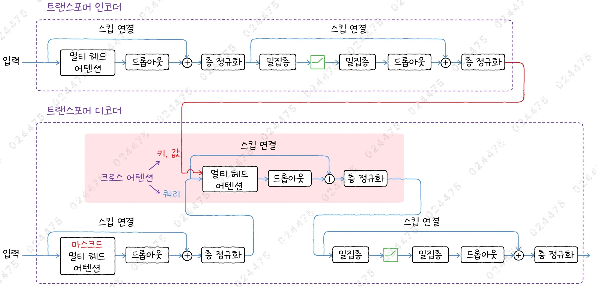
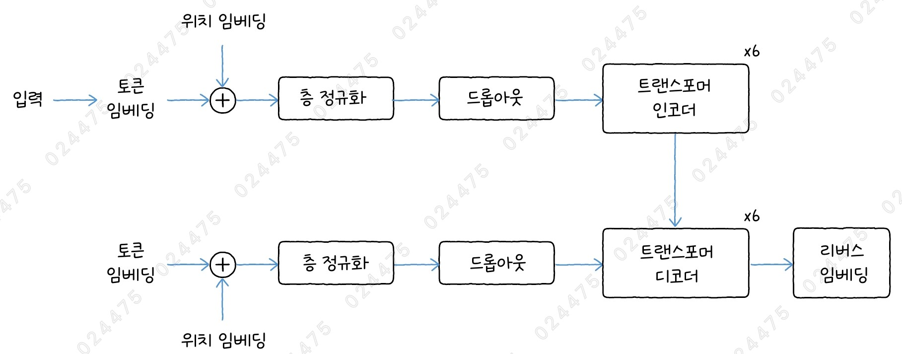
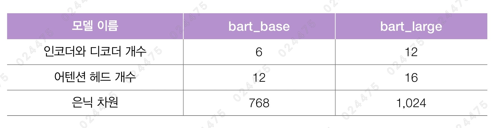

# ✔ BART 모델로 텍스트 요약하기

> ['BART 모델로 텍스트 요약하기' 구글 코랩](https://colab.research.google.com/github/rickiepark/hm-dl/blob/main/06-1.ipynb)

## 1️⃣ 트랜스포머 인코더-디코더 모델 만들기

- 원본 트랜스포머는 인코더와 디코더를 모두 사용하는 모델임
- 인코더에서 입력된 텍스트를 한 번에 처리해 디코더에게 전달하면, 디코더에서 자귀회귀 방식으로 새로운 텍스트를 생성함

### 트랜스포머 인코더-디코더 모델 구조



- 인코더는 4장 1절에서의 인코더 구조와 동일함
- 디코더는 5장 1절에서와 달리, 크로스 어텐션이 추가되고 어텐션층 다음에 층 정규화를 수행함

### 크로스 어텐션

- Cross Attention
- 인코더-디코더 모델에서 디코더 내 인코더의 출력을 입력받는 부분
- 인코더의 출력이 어텐션층의 키와 값으로 입력되고, 디코더의 이전 출력은 쿼리로 전달됨
- 인코더에서 전달되는 키와 값은 감춰야하는 미래의 정보가 아니라, 디코더가 완전하게 활용해야 할 정보임
- 따라서, 크로스 어텐션에는 디코더의 어텐션 마스크 대신, 인코더의 패딩 마스크를 전달해 주어야 함

#### 1. 트랜스포머 디코더 모듈을 재정의하자

```py
import keras
import keras_nlp

def transformer_decoder(x, encoder_output, padding_mask, encoder_padding_mask,
                        dropout, activation='relu'):
    # 어텐션 마스크를 계산합니다.
    attention_mask = AttentionMask()(padding_mask)
    # 스킵 연결을 준비합니다.
    residual = x
    key_dim = hidden_dim // num_heads
    # 멀티 헤드 어텐션을 통과합니다.
    x = layers.MultiHeadAttention(num_heads, key_dim, dropout=dropout)(
        query=x, value=x, attention_mask=attention_mask)
    x = layers.Dropout(dropout)(x)
    # 스킵 연결
    x = x + residual
    x = layers.LayerNormalization()(x)

    # 스킵 연결을 준비합니다.
    residual = x
    # 크로스 어텐션을 통과합니다.
    x = layers.MultiHeadAttention(num_heads, key_dim, dropout=dropout)(
        query=x, value=encoder_output, attention_mask=encoder_padding_mask)
    x = layers.Dropout(dropout)(x)
    # 스킵 연결
    x = x + residual
    x = layers.LayerNormalization()(x)

    # 스킵 연결을 준비합니다.
    residual = x
    # 위치별 피드 포워드 네트워크
    x = layers.Dense(hidden_dim * 4, activation=activation)(x)
    x = layers.Dense(hidden_dim)(x)
    x = layers.Dropout(dropout)(x)
    # 스킵 연결
    x = x + residual
    x = layers.LayerNormalization()(x)
    return x
```

- 인코더의 출력을 전달받기 위한 encoder_output 매개변수가 추가됨

## 2️⃣ BART 모델로 텍스트 요약하기

- Bidirectional and Auto-Regressive Transformers
- 2019년 10월 메타에서 공개함
- 트랜스포머 기반 인코더-디코더 모델
- 텍스트에 잡음을 넣고 이를 복원하도록 훈련하는 방식 때문에, 시퀀스 투 시퀀스 모델을 위한 노이즈 제거 오토 인코더라고 부름
  - 시퀀스 투 시퀀스 모델: 하나의 연속된 시퀀스를 입력받아, 새로운 시퀀스를 출력하는 모델
  - ex) 번역, 문장 요약, 질문 응답
- RoBERTa에서 사용했던 160GB 데이터셋을 그대로 사용해 훈련함
- BPE 토크나이저를 사용함
- BART는 텍스트 생성을 위해 특별히 미세 튜닝 되었지만, 텍스트 분류나 요약 같은 작업에서도 좋은 성능을 냄

### BART 모델 훈련 방식

1. 랜덤하게 토큰을 마스킹한 후, 마스킹된 위치에 어떤 토큰이 들어갈지를 예측함
2. 아예 토큰을 삭제해, 삭제된 토큰을 복원하는 것은 물론 어느 위치에서 삭제된 것인지도 예측함
3. 몇 개의 토큰을 하나의 마스킹 토큰으로 대체해, 마스킹된 위치에 어떤 토큰들이 들어갈지 예측함
4. 랜덤하게 하나의 토큰을 선택해 이 토큰의 앞부분을 문서의 끝에 이어 붙인 후, 원래 시작 토큰의 위치를 찾아냄

### BART 구조



1. 토큰 임베딩

   - 인코더와 디코더는 각각 별도의 토큰 입력을 받음
   - 인코더의 입력은 코잘 마스킹이 없기 때문에 토큰의 앞뒤 문맥을 모두 사용함
   - 디코더의 입력은 훈련할 때 코잘 마스킹이 되어 미래 토큰에 대한 정보를 감추고, 추론할 때는 디코더가 생성한 토큰을 누적하여 디코더의 입력으로 사용함

2. 위치 임베딩

   - 전체 모델이 토큰에 대한 하나의 표현을 학습하기 위해, 인코더와 디코더는 하나의 임베딩층을 공유함

3. 트랜스포머 인코더-디코더
   - 인코더의 최종 출력이 모든 디코더에 입려됨

### BART 버전



### BART 모델 만들기

#### 1. BART base 모델을 위한 모델 파라미터를 정의하자

```py
# BART
vocab_size = 50265
num_layers = 6
num_heads = 12
hidden_dim = 768
dropout = 0.1
activation = 'gelu'
max_seq_len = 1024
```

#### 2. BART base 모델을 만들어보자

```py
from keras import layers

encoder_token_ids = keras.Input(shape=(None,))
encoder_padding_mask = keras.Input(shape=(None,))
decoder_token_ids = keras.Input(shape=(None,))
decoder_padding_mask = keras.Input(shape=(None,))

token_embedding_layer = keras_nlp.layers.ReversibleEmbedding(vocab_size, hidden_dim)
encoder_token_embedding = token_embedding_layer(encoder_token_ids)
encoder_pos_embedding = keras_nlp.layers.PositionEmbedding(max_seq_len)(encoder_token_embedding)

x = encoder_token_embedding + encoder_pos_embedding
x = layers.LayerNormalization()(x)
x = layers.Dropout(dropout)(x)

for _ in range(num_layers):
    x = transformer_encoder(x, encoder_padding_mask, dropout, activation=activation)
encoder_output = x

decoder_token_embedding = token_embedding_layer(decoder_token_ids)
decoder_pos_embedding = keras_nlp.layers.PositionEmbedding(max_seq_len)(decoder_token_embedding)

x = decoder_token_embedding + decoder_pos_embedding
x = layers.LayerNormalization()(x)
x = layers.Dropout(dropout)(x)

for _ in range(num_layers):
    x = transformer_decoder(x, encoder_output, decoder_padding_mask, encoder_padding_mask,
                            dropout, activation=activation)
decoder_output = token_embedding_layer(x, reverse=True)

model = keras.Model(inputs=(encoder_token_ids, encoder_padding_mask,
                            decoder_token_ids, decoder_padding_mask),
                    outputs=(encoder_output, decoder_output))
```

#### 3. 모델의 구조를 확인해보자

```py
model.summary()
```


- 출력 결과를 보면, 모델 파라미터 개수가 약 1억 4천만 개임
- 이 중, 토큰 임베딩층의 가중치는 약 4천만 개로, 전체 파라미터 개수 중 28%를 차지함

### 사전 훈련된 BART 모델로 텍스트 생성하기

#### 1. KerasNLP에서 bart_base 모델을 로드해보자

```py
bart_lm = keras_nlp.models.BartSeq2SeqLM.from_preset('bart_base_en')
```

- 케라스에서 제공하는 BART 모델은 텍스트 생성 모델임

#### 2. bart_base 모델을 사용해 텍스트를 생성해보자

```py
sampler = keras_nlp.samplers.TopKSampler(k=10, temperature=10, seed=42)
bart_lm.compile(sampler=sampler)
bart_lm.generate('I like coffee because it helps me wake up in the morning.', max_length=20)
"""
In fact:I don’m drinking much more coffee because it lowers my metabolism and
"""
```

- 디코더 모델처럼 generate() 메서드에 짧은 텍스트를 전달하면 한 번에 하나의 토큰씩 텍스트를 생성함
- 다만, 디코더 모델과 BART 모델에서 generate() 메서드에 전달되는 텍스트가 사용되는 방식에는 차이가 있음
  - 디코더 모델의 경우, 텍스트는 디코더의 입력으로 사용할 프롬프트 텍스트임
  - BART 모델의 경우, 텍스트는 인코더의 입력으로 사용되고, 디코더는 인코더의 출력을 받아 새로운 텍스트를 생성함

#### 3. 인코더 텍스트 뿐만 아니라 디코더 텍스트도 함께 전달해 텍스트를 생성해보자

```py
sampler = keras_nlp.samplers.TopKSampler(k=10, temperature=10, seed=42)
bart_lm.compile(sampler=sampler)
bart_lm.generate(
    {
        'encoder_text': 'I hate coffee, so I always drink tea instead.',
        'decoder_text': 'In the morning, when I wake up'
    },
    max_length=20
)
"""
In the morning, when I wake up early for church service......I always learn from
"""
```

- generate() 함수에 인코더의 입력뿐만 아니라 디코더를 위한 프롬프트 텍스트도 함께 전달 가능함

### 허깅페이스 BART 모델로 텍스트 요약하기

- BART는 요약이나 번역과 같은 텍스트 생성 작업을 위해 미세 튜닝했을 때 좋은 성능을 냄
- facebook/bart-large-cnn 모델: 메타가 요약 작업을 위해 CNN/Daily Mail 데이터셋에서 미세 튜닝한 BART 모델임

#### 1. 허깅페이스에서 bart_large 모델을 로드해보자

```py
from transformers import pipeline, set_seed

pipe = pipeline("summarization", model="facebook/bart-large-cnn")
```

#### 2. bart_large 모델을 사용해 텍스트를 요약해보자

```py
ENG_TEXT = """
Voyager 1 is a space probe launched by NASA on September 5, 1977, as part of the Voyager program to study the outer Solar System and the interstellar space beyond the Sun's heliosphere. It was launched 16 days after its twin, Voyager 2. It communicates through the NASA Deep Space Network (DSN) to receive routine commands and to transmit data to Earth. Real-time distance and velocity data are provided by NASA and JPL. At a distance of 162.7 AU (24.3 billion km; 15.1 billion mi) from Earth as of May 2024, it is the most distant humanmade object from Earth.
"""

set_seed(42)
pipe(ENG_TEXT, max_length=70, do_sample=True, top_k=10, temperature=3.0)
"""
[{'summary_text': "Voyager 1 launched on September 5, 1977 as part of NASA's program to study the outer Solar System and interstellar space. At 162.7 AU (24.3 billion km; 15.1 billion mi) from Earth, it is the most distant humanmade object from Earth. It communicates through the NASA Deep Space Network ("}]
"""
```

### 허깅페이스 KoBART 모델로 텍스트 요약하기

- KoBART: SKT에서 공개한 모델로, BART 모델을 기반으로 40GB 이상의 한국어 데이터셋으로 훈련한 트랜스포더 인코더-디코더 모델임
  - 데이콘(Dacon) 한국어 문서 생성요약 AI 경진대회의 데이터셋을 사용함
  - 어휘사전 크기: 30,000
- KoBART의 대부분의 구조가 BART와 동일하지만, 특수 토큰(패딩 토큰, 문장의 시작 토큰, 문장의 끝 토큰)을 위한 아이디가 다름
  - BART의 경우, 순서대로 1, 0, 2를 할당
  - KoBART의 경우, 순서대로 3, 0, 1을 할당
- 따라서, KoBART를 사용할 때 갑자기 문장 생성이 종료되는 것을 막기 위해, eos_token_id 매개변수로 종료 토큰의 아이디를 알려주는 것이 좋음

#### 1. 허깅페이스에서 kobart 모델을 로드해보자

```py
kobart_pipe = pipeline("text2text-generation", model="digit82/kobart-summarization")
```

#### 2. kobart 모델을 사용해 텍스트를 요약해보자

```py
KOR_TEXT = """
2023-2024년 쉰드흐누퀴르 분화는 2023년 12월 18일 저녁 아이슬란드 그린다비크에 있는 쉰드흐누퀴르 분화구에서 화산 폭발이 발생해 지상에 있는 열극에서 용암이 분출한 사건이다. 용암 분출과 뒤따른 지진 활동 빈도는 다음 날인 2023년 12월 19일부터 감소했으나 새로 열린 열극의 양쪽에서 용암이 옆으로 넓게 퍼져나갔다. 이번 분화는 2021년 분화 시작 이래 쉬뒤르네스에서 일어난 가장 큰 분화로 최대 100 m 높이의 용암 분수가 관측되었으며 분화지에서 약 42 km 떨어진 아이슬란드의 수도 레이캬비크에서도 화산 분화 장면을 볼 수 있었다. 화산 분화는 2023년 12월 21일 화산 상공 관측 결과 더 이상의 용암 분출이 보이지 않아 종료되었으나 아이슬란드 기상청은 "분화 종식을 선언하기에는 너무 이르다"며 지속적으로 관측하겠다고 말했다. 쉰드흐누퀴르는 현재 화산지대이자 쉬뒤르네스 열곡대의 활성 열극에 속한다.
"""

set_seed(42)
kobart_pipe(KOR_TEXT, max_length=100, do_sample=True,
            top_k=10, temperature=2.0, eos_token_id=1)
"""
[{'generated_text': "아이슬랜드 그린다비크 화산이 폭발해 용암이 분출되는 사건이 발생하는 '쉰드흐 누퀴르 분화'에 대한 관측이 진행됐지만 아직 종식은 이르다는 입장이다.  "}]
"""
```
