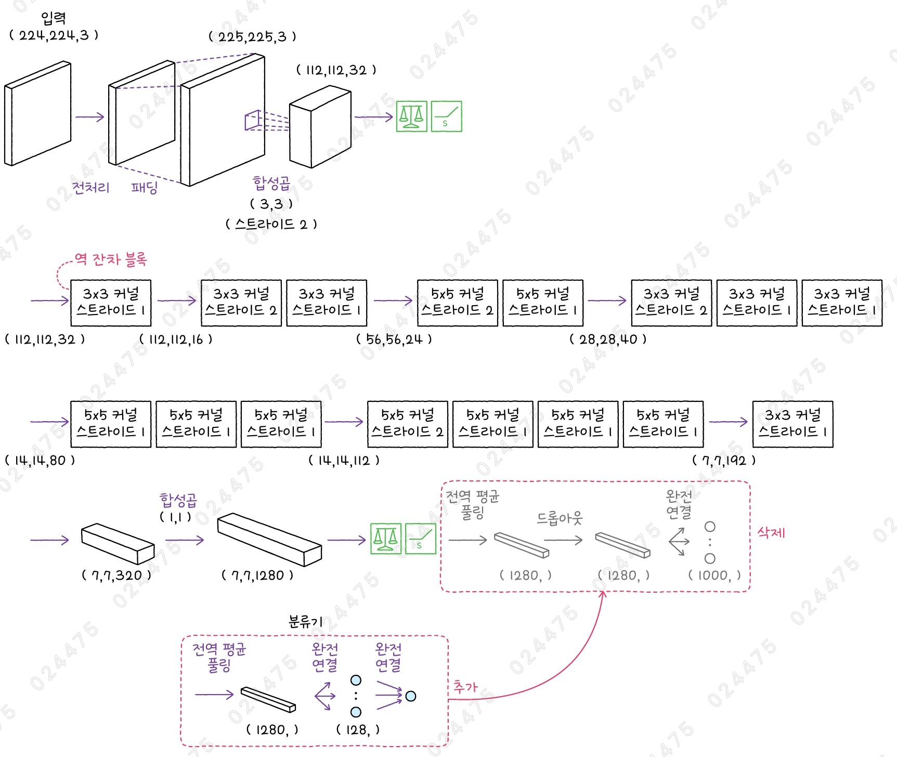

# ✔ 전이 학습으로 피스타치오 이미지 분류하기

> ['전이 학습으로 피스타치오 이미지 분류하기' 구글 코랩](https://colab.research.google.com/github/rickiepark/hm-dl/blob/main/03-3.ipynb)

## 1️⃣ 텐서플로 허브로 강아지 사진 분류하기

- TensorFlow Hub
- 텐서플로 허브: 사전 훈련된 모델을 제공하는 저장소이자 라이브러리
  - 케라스의 백엔드로 텐서플로를 사용하고 있다면 케라스에 내장된 모델 외에도 텐서플로 허브에서 제공하는 다양한 사전 훈련된 모델을 다운로드하여 사용할 수 있음
  - 텐서플로 허브에 있던 사전 훈련된 모델이 2023년 초 캐글 모델(Kaggle model)로 이전되어 라이브러리만 남음
  - 캐글로 이전하기는 했지만 텐서플로 허브 라이브러리를 사용하는 방법은 이전과 동일함
  - 텐서플로 허브 라이브러리를 사용해, 간편하게 캐글에 공개된 모델을 케라스 모델이나 층으로 통합할 수 있음
- 캐글: 머신러닝 경연대회를 위한 플랫폼으로, 머신러닝 대회뿐만 아니라 유용한 자료와 데이터를 많이 얻을 수 있음
  - 캐글 모델에는 CNN 모델뿐만 아니라 다른 종류의 모델들도 다양하게 제공하고 있음

#### 1. 캐글에서 EfficientNetB0 모델을 로드해보자

```py
import tf_keras as keras
from tf_keras import layers
import tensorflow_hub as hub

hub_efficientb0 = keras.Sequential([
    layers.Input(shape=(224, 224, 3)),
    layers.Rescaling(1.0 / 255.0),
    hub.KerasLayer("https://www.kaggle.com/models/tensorflow/efficientnet/frameworks/TensorFlow2/variations/b0-classification/versions/1")
])
```

- `KerasLayer` 클래스: 텐서플로 모델을 저장하는 SavedModel 포맷을 읽어 케라스층으로 반환함
  - 반환된 층은 보통의 케라스층처럼 Sequential 클래스나 함수형 API에 넣어 모델을 만들 수 있음

#### 2. 구글 드라이브에서 샘플 이미지를 다운로드하고 압축을 해제하자

```
!gdown 1xGkTT3uwYt4myj6eJJeYtdEFgTi2Sj8C
!unzip cat-dog-images.zip
```

#### 3. 강아지 이미지를 로드한 후, EfficientNetB0 모델로 예측해보자

```py
import numpy as np
from PIL import Image
from keras.applications import efficientnet

dog_png = np.array(Image.open('images/dog.png'))
predictions = hub_efficientb0.predict(dog_png[np.newaxis,:])
efficientnet.decode_predictions(predictions)
"""
[[('n02099712', 'Labrador_retriever', np.float32(0.3682942)),
  ('n02104029', 'kuvasz', np.float32(0.19339868)),
  ('n02099601', 'golden_retriever', np.float32(0.061458193)),
  ('n02111500', 'Great_Pyrenees', np.float32(0.05779694)),
  ('n02095889', 'Sealyham_terrier', np.float32(0.017902788))]]
"""
```

## 2️⃣ 허깅페이스로 강아지 사진 분류하기

- Huggingface
- 자연어 처리(NLP, Natural Language Processing)를 위한 트랜스포머스 라이브러리를 만든 회사로 유명해져, 이후 자연어 처리에 관련된 사전 훈련된 모델을 제공하고 있음
- 자연어 처리는 물론 컴퓨터 비전에 관한 모델까지 폭넓게 제공하고 있음
- 허깅페이스 모델 저장소는 커뮤니티 기반 플랫폼으로, 누구나 모델을 업로드하고 다운로드 받을 수 있음

#### 1. 허깅페이스에서 EfficientNetB0 모델을 로드해보자

```py
from transformers import pipeline

pipe = pipeline(task='image-classification', device=0,
                model='google/efficientnet-b0')
pipe('images/dog.png')
"""
[{'label': 'Labrador retriever', 'score': 0.36829379200935364},
 {'label': 'kuvasz', 'score': 0.19339875876903534},
 {'label': 'golden retriever', 'score': 0.06145830079913139},
 {'label': 'Great Pyrenees', 'score': 0.057797010987997055},
 {'label': 'Sealyham terrier, Sealyham', 'score': 0.01790277287364006}]
"""
```

- `task` 매개변수: 수행하려는 작업 지정
  - 'image-classification': 이미지 분류
- `model` 매개변수: 사용하려는 모델 이름 지정
- `device` 매개변수
  - -1(또는 cpu): CPU에서 실행됨
  - 0: GPU에서 실행됨
  - 기본값: -1
- `pipe` 객체는 이미지에 대한 URL, 로컬 경로 또는 PIL 이미지 객체를 처리할 수 있음

## 3️⃣ 전이 학습으로 피스타치오 품종 분류하기

- 전이 학습(Transfer Learning): 사전 훈련된 신경망의 대부분은 그대로 두고 최상위 일부 층만 다시 훈련하여 새로운 문제에 적응시키는 방법
  - 대규모 데이터셋에서 훈련된 신경망을 문제에 적용할 수 있는 아주 유용한 방법임
  - 이미지 처리 분야 뿐만 아니라 텍스트를 처리할 때도 널리 사용되는 기법임
  - 베이스 모델을 동결한 후 주어진 데이터셋으로 모델을 훈련함
- 미세 튜닝(Fine Tuning): 훈련 데이터가 충분할 경우, 베이스 모델의 일부 층을 동결하지 않고 새로 추가된 분류층과 함께 훈련하는 방법
- 이를 통해, 이미지넷 데이터셋에서 훈련된 베이스 모델의 특성을 추출하는 성능을 활용한 높은 수준의 이미지 분류 모델을 비교적 손쉽게 얻을 수 있음

### 사전 훈련된 모델로 피스타치오 품종 분류하기

- 사전 훈련된 모델인 EfficientNet으로 1,000개의 클래스에 속해 있지 않은 피스타치오 이미지를 분류해보자
- 캐글에는 피스타치오 이미지 데이터셋을 공개하고 있음
  - 1,232개의 키르미지 피스타치오와 916개의 시이리트 피스타치오 두 종류의 사진이 ㅣㅆ음

#### 1. 구글 드라이브에서 피스타치오 이미지 데이터셋을 다운로드하고 압축을 해제하자

```
!gdown 10bnEC6-ZfXZFZ2mb3zoWd38TjYufanWo
!unzip -q Pistachio_Image_Dataset.zip
```

#### 2. 피스타치오 이미지 하나를 선택해 크기를 확인해보자

```py
pistachio_sample = np.array(Image.open('Pistachio_Image_Dataset/Kirmizi_Pistachio/kirmizi (1).jpg'))
pistachio_sample.shape  # (600, 600, 3)
```

- 'Pistachio_Image_Dataset' 폴더에는 'Kirmizi_Pistachio' 폴더와 'Siirt_Pistachio' 폴더로 나뉘어 있음
- 피스타치오 이미지 크기가 우연찮게 EfficientNetB7 모델의 입력 크기와 같음

#### 3. 피스타치오 이미지를 EfficientNetB7 모델로 예측해보자

```py
efficientb7 = keras.applications.EfficientNetB7()
predictions = efficientb7.predict(pistachio_sample[np.newaxis,:])
efficientnet.decode_predictions(predictions)
"""
[[('n01950731', 'sea_slug', np.float32(0.23482428)),
  ('n01924916', 'flatworm', np.float32(0.20674421)),
  ('n01943899', 'conch', np.float32(0.08622336)),
  ('n01945685', 'slug', np.float32(0.08500543)),
  ('n01955084', 'chiton', np.float32(0.02824293))]]
"""
```

- 피스타치오 이미지를 '바다 민달팽이(sea slug)'나 '편형동물(flatworm)'로 인식하고 있음
- 이미지넷 데이터셋에서 훈련한 모델이다 보니, 이미지넷 데이터셋에 포함되어 있지 않은 피스타치오 이미지를 적절하게 분류하지 못함

### 전이 학습으로 피스타치오 품종 분류하기

#### 케라스의 image_dataset_from_directory() 함수

- 로컬 디렉토리에 폴더별로 나뉘어 있는 이미지를 간편하게 로드해줌
- 특히 이미지가 여러 하위 폴더로 분류되어 있을 때 유용하며, 각각의 하위 폴더가 클래스 레이블을 나타낸다고 가정함
- 기본적으로 폴더이 이름 순으로 클래스 레이블을 부여함
- `directory` 매개변수: 이미지 폴더가 들어 있는 폴더의 최상위 디렉토리 경로를 지정
- `labels` 매개변수: 레이블을 어떻게 할당할지 결정함
  - 기본값인 inferred로 지정하면 각 하위 폴더의 이름을 자동으로 레이블로 사용함
- `image_size` 매개변수: 원하는 입력의 크기를 (높이, 너비)의 형태로 지정하면 이미지 크기를 자동으로 변환해줌
- `batch_size` 매개변수: 모델 학습 한 번에 처리할 이미지 개수를 결정함
  - 기본값: 32
- `shuffle` 매개변수: 데이터셋을 섞을지 여부를 설정
  - 데이터의 순서를 랜덤하게 만들어 과대적합을 방지함
  - 기본값: True
- `validation_split` 매개변수: 전체 데이터에서 검증 세트로 떼어낼 비율을 지정
- `subset` 매개변수: 훈련 세트와 검증 세트 중 어떤 것을 반환할지를 지정함
  - 'train': 훈련 세트를 반환
  - 'validation': 검증 세트를 반환
  - 'both': 둘 다 반환
- `seed` 매개변수: 데이터 셔플이나 분할의 일관성을 유지함
  - shuffle이나 validation_split과 함께 사용
  - 항상 같은 데이터 순서를 보장하고, 매번 동일하게 훈련 세트와 검증 세트가 나뉘도록 보장함

#### 케라스의 RMSprop 옵티마이저

- Root Mean Square Propagation
- 복잡하고 노이즈가 있는 데이터셋에서 학습률을 조정해 학습의 안정성을 높이고, 각각의 매개변수 업데이트를 조절하는 알고리즘

#### 사전 훈련된 EfficientNet 모델의 전이 학습



- 분류층(또는 분류기): 합성곱 신경망에서 모델의 합성곱층 또는 합성곱 블록에서 생성한 특성 맵을 사용해 분류 작업을 수행하는 층
- EfficientNet 모델에 전이 학습을 수행하려면 분류층을 새로 갈아 끼워야 함
- 베이스 모델(Base Model): EfficientNet 모델의 역 잔차 블록까지를 의미함
- 밀집층은 입력에 따라서 가중치 크기가 결정되기 때문에, 사전 훈련된 모델에 밀집층이 있을 때 신경망의 입력 크기를 바꾸면 오류가 발생함
- 하지만, 밀집층이 있는 부분을 빼고 베이스 모델을 가져오면 신경망에 다른 입력을 전달해도 문제가 되지 않음

#### 1. EfficientNetB0 베이스 모델을 로드해, 피스타치오 이미지의 특성 맵을 추출해보자

```py
keras_efficientb0_base = keras.applications.EfficientNetB0(include_top=False)
feature_map = keras_efficientb0_base(pistachio_sample[np.newaxis,:])
feature_map.shape  # TensorShape([1, 18, 18, 1280])
```

- EfficientNetB0 모델은 기본적으로 입력 크기가 (224, 224, 3)일 것이라고 가정하지만, 베이스 모델을 가져왔기 때문에 (600, 600, 3) 크기의 피스타치오 이미지를 전달했음
- `include_top` 매개변수: False로 지정하면, 분류기를 제외해 줌
  - 즉, 베이스 모델을 불러올 수 있음
  - 기본값: True

#### 2. 텐서플로 데이터셋에서 피스타치오 이미지를 로드해보자

```py
train_ds, val_ds = keras.utils.image_dataset_from_directory(
    'Pistachio_Image_Dataset', image_size=(224, 224), batch_size=16,
    validation_split=0.2, subset='both', seed=42
)
"""
Found 2148 files belonging to 2 classes.
Using 1719 files for training.
Using 429 files for validation.
"""
```

- 기본적으로 폴더의 이름 순으로 클래스 레이블을 부여하기 때문에, Kirmizi_Pistachio 폴더에 있는 이미지는 클래스 0이 되고, Siirt_Pistachio 폴더에 있는 이미지는 클래스 1이 됨

#### 3. EfficientNetB0 베이스 모델에 분류층을 연결해보자

```py
keras_efficientb0_base.trainable = False
```

- 모델을 만들어 훈련할 때 keras_efficientb0_base의 가중치가 함께 변경되면 이미지넷에서 사전 훈련된 특성을 제대로 활용하지 못할 수 있음
- `trainable` 속성: False로 지정하면, 기존 모델의 가중치는 변하지 않음

```py
inputs = keras.Input(shape=(224, 224, 3))
x = keras_efficientb0_base(inputs)
x = layers.GlobalAveragePooling2D()(x)
x = layers.Dense(128, activation='relu')(x)
outputs = layers.Dense(1, activation="sigmoid")(x)
model = keras.Model(inputs, outputs)
```

#### 4. 모델을 컴파일한 후 훈련하자

```py
rmsprop = keras.optimizers.RMSprop(learning_rate=5e-5)
model.compile(optimizer=rmsprop, loss='binary_crossentropy', metrics=['accuracy'])
hist = model.fit(train_ds, epochs=20, validation_data=val_ds)
```


- 실행 결과를 보니, 피스타치오 품종을 97%에 가까운 정확도로 분류하고 있음

#### 5. 손실과 정확도 그래프를 그려보자

```py
import matplotlib.pyplot as plt

fig, axs = plt.subplots(1, 2, figsize=(12, 4))
axs[0].plot(range(1, 21), hist.history['loss'], label='loss')
axs[0].plot(range(1, 21), hist.history['val_loss'], label='val_loss')
axs[0].set_xticks(range(1, 21))
axs[0].set_xlabel('epoch')
axs[0].set_ylabel('loss')
axs[0].legend()

axs[1].plot(range(1, 21), hist.history['accuracy'], label='accuracy')
axs[1].plot(range(1, 21), hist.history['val_accuracy'], label='val_accuracy')
axs[1].set_xticks(range(1, 21))
axs[1].set_xlabel('epoch')
axs[1].set_ylabel('accuracy')
axs[1].legend()
plt.show()
```


## cf) 캐글 모델로 피스타치오 품종 분류하기

- 캐글에서 제공하는 EfficientNet은 입력 값을 255로 나누어 0~1 사이의 값으로 정규화해야 함
- 캐글 모델 사이트에서 베이스 모델을 얻으려면 VARIATION 목록에 'b0-feature-vector'를 선택해야 함
- b0-feature-vector는 EfficientNetB0 모델의 전역 풀링층의 출력을 반환하기 때문에 추가로 전역 풀링층을 추가하여 차원을 축소할 필요가 없음
- 또한, 텐서플로 허브의 KerasLayer() 클래스는 기본적으로 반환된 층의 가중치를 동결함

#### 1. 캐글에서 EfficientNetB0 베이스 모델을 로드한 후, 분류층을 연결해보자

```py
kaggle_efficientb0_base = hub.KerasLayer('https://www.kaggle.com/models/tensorflow/efficientnet/frameworks/TensorFlow2/variations/b0-feature-vector/versions/1')

inputs = keras.Input(shape=(224, 224, 3))
x = layers.Rescaling(1.0 / 255.0)(inputs)
x = kaggle_efficientb0_base(x)
x = layers.Dense(128, activation='relu')(x)
outputs = layers.Dense(1, activation='sigmoid')(x)
model = keras.Model(inputs, outputs)
```

#### 2. 모델을 컴파일한 후 훈련해보자

```py
rmsprop = keras.optimizers.RMSprop(learning_rate=1e-4)
model.compile(optimizer=rmsprop, loss='binary_crossentropy', metrics=['accuracy'])
hist = model.fit(train_ds, epochs=20, validation_data=val_ds)
```


- 실행 결과를 보니, 피스타치오 품종을 99%가 넘는 정확도로 분류하고 있음

#### 3. 손실과 정확도 그래프를 그려보자

```py
fig, axs = plt.subplots(1, 2, figsize=(12, 4))
axs[0].plot(range(1, 21), hist.history['loss'], label='loss')
axs[0].plot(range(1, 21), hist.history['val_loss'], label='val_loss')
axs[0].set_xticks(range(1, 21))
axs[0].set_xlabel('epoch')
axs[0].set_ylabel('loss')
axs[0].legend()

axs[1].plot(range(1, 21), hist.history['accuracy'], label='accuracy')
axs[1].plot(range(1, 21), hist.history['val_accuracy'], label='val_accuracy')
axs[1].set_xticks(range(1, 21))
axs[1].set_xlabel('epoch')
axs[1].set_ylabel('accuracy')
axs[1].legend()
plt.show()
```


