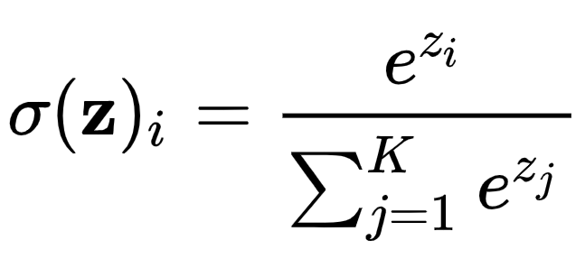
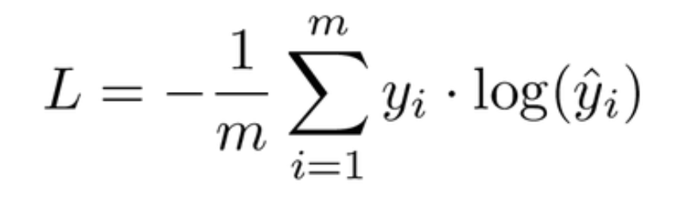

# ✔ 패션 상품 이미지 분류하기

> ['패션 상품 이미지 분류하기' 구글 코랩](https://colab.research.google.com/github/rickiepark/hm-dl/blob/main/01-3.ipynb)

## 1️⃣ LeNet 모델 만들기

### 활성화 함수

- 뉴런은 입력을 받아 선형 변환을 적용하며, 활성화 함수는 그 결괏값을 어떻게 변환할지 결정하는 역할을 함
- 활성화 함수(activation function): 비선형(non-linear) 변환을 수행
  - ex) 시그모이드 함수, 렐루 함수 등
- LeNet-5를 비롯한 예전 신경망에서는 시그모이드 함수를 주로 사용했지만, 최근에는 기울기 소실 문제를 개선하기 위해 렐루 함수와 렐루 함수의 다양한 변종들이 폭넓게 적용되고 있음
  - 기울기 소실(gradient vanishing) 문제: 신경망이 경사 하강법을 사용해 훈련하기 때문에, 기울기가 완만하면 오차에 대한 조정이 더뎌지는 문제

#### 시그모이드 함수


- Sigmoid function
- 로지스틱 함수(logistic function)이라고도 부름
- 그래프로 그리면 S자 형태를 띔
- x가 큰 양수일 때는 1에 가까워지고, x가 큰 음식일 때는 0에 가까워짐
- 즉, 입력값을 0과 1 사이의 값으로 변환해줌

#### 렐루 함수


- ReLU, Rectified Linear Unit function
- x가 양수이면 x 그대로 두고, x가 음수이면 0으로 바꿈
- 즉, 출력값에서 양수는 그대로 보내고, 음수는 제거하는 방식

#### 소프트맥스 함수



- 딥러닝에서 분류 문제를 해결할 때 자주 사용하는 함수로, 특히 모델이 여러 카테고리 중 하나를 예측할 때 사용됨
- k개 유닛에서 나오는 소프트맥스 출력을 모두 더하면 1이 됨
- 따라서, 소프트맥스 함수를 통해 모델이 내놓은 예측값이 얼마나 가능성이 높은지를 확률처럼 해석할 수 있음

#### 1. 시그모이드 함수와 렐루 함수 그래프를 직접 그려보자

```py
import numpy as np
import matplotlib.pyplot as plt
from scipy.special import expit

x = np.arange(-10, 10, 0.2)

fig, axs = plt.subplots(1, 2, figsize=(12, 4))
axs[0].plot(x, expit(x))
axs[0].set_title('sigmoid function')
axs[0].set_xlabel('x')
axs[0].set_ylabel('f(x)')
axs[1].plot(x, x.clip(0))
axs[1].set_title('relu function')
axs[1].set_xlabel('x')
axs[1].set_ylabel('f(x)')
plt.show()
```


- 시그모이드 함수는 사이파이의 `expit()` 함수를 사용해 쉽게 구현할 수 있음
- 렐루 함수는 넘파이 배열의 `clip()` 메서드를 사용해 쉽게 구현할 수 있음
  - `clip()`: 전달된 매개변수보다 작은 값을 모두 0으로 만듦

### LeNet 모델

#### 1. LeNet-5 모델을 만들어보자

```py
import keras
from keras import layers

lenet5 = keras.Sequential()
lenet5.add(layers.Input(shape=(28, 28, 1)))
lenet5.add(layers.Conv2D(filters=6, kernel_size=5, activation='sigmoid',
                         padding='same'))
lenet5.add(layers.AveragePooling2D(pool_size=2))
lenet5.add(layers.Conv2D(filters=16, kernel_size=5, activation='sigmoid'))
lenet5.add(layers.AveragePooling2D(pool_size=2))
lenet5.add(layers.Flatten())
lenet5.add(layers.Dense(120, activation='sigmoid'))
lenet5.add(layers.Dense(84, activation='sigmoid'))
lenet5.add(layers.Dense(10, activation='softmax'))
```

#### 2. LeNet-5 모델의 구조를 확인해보자

```py
lenet5.summary()
```


- Output Shape 열에 있는 None은 아직 첫 번째 차원인 샘플 차원(배치 차원)의 크기가 결정되지 않았다는 의미임
  - 신경망에 전달되는 샘플의 개수는 모델을 훈련하거나 모델을 사용해 예측을 만들 때 결정되므로 그 크기를 미리 결정할 수 없어 None으로 표시함

1. 첫 번째 합성곱층

   - (28, 28, 1) 크기의 입력을 받아 6개의 합성곱 필터를 적용해 (28, 28, 6) 크기의 특성 맵을 만듦
   - 실제, LeNet-5의 경우 첫 번째 합성곱에서 (32, 32) 크기의 이미지를 (28, 28)로 줄임
   - 하지만, 나중에 사용할 패션 MNIST 데이터 크기가 (28, 28)이므로 특성 맵의 높이와 너비가 줄어들지 않도록 세임 패딩을 사용함
   - 파라미터 개수 = 5 x 5 x 1 x 6 + 6= 156

2. 두 번째 합성곱층

   - (14, 14, 6) 크기의 입력을 받아 16개의 합성곱 필터를 적용해 (10, 10, 16) 크기의 특성 맵을 만듦
   - 파라미터 개수 = 5 x 5 x 6 x 16 + 16 = 2,416

3. 분류층

   - Flatten층 다음에 오는 세 개의 밀집층
   - 마지막 밀집층은 분류하려는 클래스의 개수에 맞춰 10개의 유닛을 사용함
     - 다중 분류의 문제이므로 소프트맥스 활성화 함수를 사용함
   - 첫번째 밀집층의 파라미터 개수 = 400 x 120 + 120 = 48,120
   - 두번째 밀집층의 파라미터 개수 = 120 x 84 + 84 = 10,164
   - 세번째 밀집층의 파라미터 개수 = 84 x 10 + 10 = 850

## 2️⃣ LeNet 모델 훈련하기

### 크로스 엔트로피



- Cross Entropy
- 두 확률 값의 차이를 측정하는 도구
- 크로스 엔트로피 공식
  - m: 클래스 개수
  - y: 타깃
  - ŷ: 정답 클래스에 해당하는 모델의 예측 확률
- ŷ가 0에 가까워지면 log(ŷ)은 큰 음수가 되어 손실 값이 커짐
- ŷ가 1에 가까워지면 log(ŷ)은 0에 가까워지므로 손실 값이 최소가 됨
- 따라서, 크로스 엔트로피 함수를 사용해 모델을 훈련하면 정답 클래스에 해당하는 예측이 1에 가까워지도록(손실 값이 최소가 되도록) 훈련할 수 있음

### 훈련 데이터 준비하기

- MNIST: 손으로 쓴 0~9까지의 숫자 이미지 7만개로 이루어진 데이터셋
  - Mixed National Institute of Standards and Technology
  - 각 이미지는 28x28 픽셀로 구성됨
- 패션 MNIST: 옷, 신발 등의 패션 아이템 이미지 7만개로 이루어진 데이터셋
  - 각 이미지는 28x28 픽셀로 구성됨

#### 1. 패션 MNIST 데이터를 로드하자

```py
(train_input, train_target), (test_input, test_target) = keras.datasets.fashion_mnist.load_data()
```

- `fashion_mnist.load_data()`: 구글 클라우드 플랫폼에 저장된 패션 MNIST 데이터셋을 로드함
  - 훈련 세트와 테스트 세트를 나누어 제공함

```py
print(train_target)  # [9 0 0 ... 3 0 5]
```

- 타깃 데이터를 확인해 보면 각 샘플의 타깃 값이 하나의 정수인 것을 알 수 있음
- 타깃 값이 정수인지 혹은 원-핫 인코딩된 벡터인지에 따라 모델을 훈련하는 방법이 조금 다름
  - 원-핫 인코딩: 정수 값을 배열의 인덱스로 생각해 해당 인덱스 위치의 원소만 1로, 나머지는 모두 0인 벡터로 변환하는 인코딩 방식

```py
print(train_input.shape, train_target.shape)
# (60000, 28, 28) (60000,)
```

- 패션 MNIST 훈련 데이터는 크기가 28x28인 이미지 60,000개로 이루어짐

#### 2. 훈련 데이터의 일부 샘플 이미지를 확인해보자

```py
import matplotlib.pyplot as plt

fig, axs = plt.subplots(1, 10, figsize=(10,10))
for i in range(10):
    axs[i].imshow(train_input[i], cmap='gray_r')
    axs[i].axis('off')
plt.show()
```


#### 3. 데이터를 표준화하자

```py
train_input = train_input.reshape(-1, 28, 28, 1) / 255.0
```

- 첫 번째 합성곱층에서 입력 샘플 하나의 크기를 (28, 28, 1)로 지정했으므로, train_input의 마지막 차원 하나를 더 추가하여 (60,000, 28, 28, 1)로 만들어야 함
- reshape() 메서드를 사용해 마지막 차원에 1을 추가함
  - -1은 차원의 크기를 명시적으로 정의하지 않으니 넘파이가 알아서 나머지 차원을 고려하여 채워 넣으라는 의미임
- 신경망은 보통 0~1 사이의 값 또는 -1~1 사이의 값에서 잘 동작하기 때문에 255.0으로 모든 배열의 값을 나눔

#### 4. 검증 세트를 만들자

```py
from sklearn.model_selection import train_test_split

train_scaled, val_scaled, train_target, val_target = train_test_split(
    train_input, train_target, test_size=0.2, random_state=42)
```

- 모델이 훈련 세트에서 잘 훈련되었는지 비교하기 위해서는 별도의 데이터 세트(검증 세트)가 필요함
- 훈련 세트 중 20%를 검증 세트로 떼어 놓음

### 모델 훈련하기

#### 1. 콜백을 정의하자

```py
checkpoint_cb = keras.callbacks.ModelCheckpoint('lenet5-model.keras',
                                                save_best_only=True)
early_stopping_cb = keras.callbacks.EarlyStopping(patience=2,
                                                  restore_best_weights=True)
```

- 케라스 콜백을 사용하면 훈련 도중 최상의 모델을 저장하고, 검증 세트에 대한 손실이 증가하기 전에 조기 종료할 수 있어 과대적합을 막는데에도 유용함
- 과대적합(overfitting): 모델이 훈련 세트에 너무 과하게 맞춰져서 테스트 세트에서 성능이 떨어지는 현상
  - 훈련 데이터의 세부 패턴이나 잡음까지 훈련해버려서 일반화 능력이 떨어지는 상태

#### 2. 모델을 컴파일하자

```py
lenet5.compile(loss='sparse_categorical_crossentropy',
               metrics=['accuracy'])
```

- `compile()` 메서드: 손실 함수를 비롯해 훈련에 필요한 몇 가지 요소를 지정함
- `loss` 매개변수: 손실 함수 지정
  - 'binary_crossentropy': 이진 분류인 경우
  - 'categorical_crossentropy': 다중 분류 문제에서 타깃 값이 원-핫 인코딩된 경우
  - 'sparse_categorical_crossentropy': 다중 분류 문제에서 타깃 값이 정수인 경우
- `metrics` 매개변수: 훈련 과정을 평가할 측정 지표를 지정
  - 기본적으로 모델이 훈련을 하는 동안 손실 함수 값을 계산하여 보여줌

#### 3. 20번의 에포크동안 모델을 훈련하자

```py
hist = lenet5.fit(train_scaled, train_target, epochs=20,
                  validation_data=(val_scaled, val_target),
                  callbacks=[checkpoint_cb, early_stopping_cb])
```


- 에포크: 모델이 전체 데이터셋을 한 번 학습하는 과정
  - 처음부터 끝까지 훈련 데이터를 모두 처리한 횟수
  - 에포크가 많을수록 모델은 데이터를 더 많이 학습할 수 있지만, 너무 많이 반복하면 과대적합 문제가 생길 수 있음

### 모델 성능 확인하기

#### 1. 손실과 정확도 그래프를 그려보자

```py
epochs = range(1, len(hist.history['loss'])+1)

fig, axs = plt.subplots(1, 2, figsize=(12, 4))
axs[0].plot(epochs, hist.history['loss'])
axs[0].plot(epochs, hist.history['val_loss'])
axs[0].set_xticks(epochs)
axs[0].set_xlabel('epoch')
axs[0].set_ylabel('loss')
axs[1].plot(epochs, hist.history['accuracy'])
axs[1].plot(epochs, hist.history['val_accuracy'])
axs[1].set_xticks(epochs)
axs[1].set_xlabel('epoch')
axs[1].set_ylabel('accuracy')
plt.show()
```


