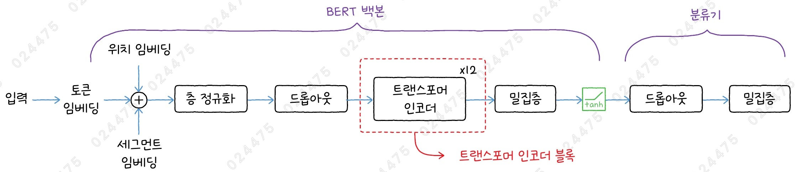
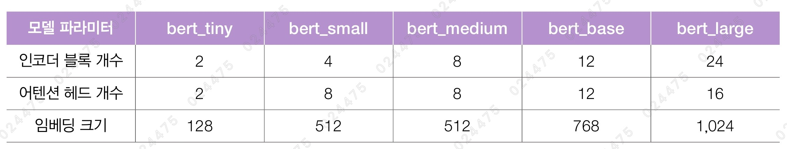
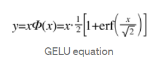

# ✔ 전이 학습으로 영화 리뷰 텍스트의 감성 분류하기

> ['전이 학습으로 영화 리뷰 텍스트의 감성 분류하기' 구글 코랩](https://colab.research.google.com/github/rickiepark/hm-dl/blob/main/04-2.ipynb)

## 1️⃣ 트랜스포머 인코더 기반 언어 이해 모델 - BERT

- Bidirectional Encoder Representations from Transformers
- 2018년 구글의 연구원들이 발표한 트랜스포머 인코더 기반의 대규모 언어 모델(Large Language Model, LLM)
- 트랜스포머 인코더 모델은 입력된 문장의 단어 간의 관계를 이해하며 문맥 정보를 추출하는 강력한 도구임
- 이전의 모델들이 한 방향(왼 → 오, 오 → 왼)으로만 단어를 이해한 것과 달리, BERT는 단어의 양방향 문맥을 동시에 학습함
- 대규모 텍스트 데이터를 활용해 사전 학습을 수행한 뒤, 다양한 자연어 처리 작업에 쉽게 적용할 수 있는 범용 모델로 설계됨
  - 북코퍼러스(8억 개 단어)와 위키피디아(25억 개 단어) 데이터를 사용해 사전 훈련됨
  - 2가지 사전 훈련 방식을 사용함

### 사전 훈련 방식

1. 마스크드 언어 모델링

   - Masked Language Model, MLM
   - 입력 데이터의 일부 토큰을 가린(마스킹) 다음, 모델이 가려진 단어를 예측

2. 다음 문장 예측
   - Next Sequence Prediction, NSP
   - 두 문장이 제시됐을 때, 두 번째 문장이 첫 번째 문장에 이어지는 다음 문장인지를 예측

### BERT 구조



- 여러 개의 트랜스포머 인코더 블록을 포함하고 있는 'BERT 백본'과 '분류기'로 구성되어 있음
  - 백본(backbone) 또는 베이스(base): 학습된 출력 벡터를 기반으로 수행되는 별도의 분류기를 제외한 나머지 부분

1. 입력 구성

   - 입력은 토큰 임베딩, 위치 임베딩, 세그먼트 임베딩을 더해 구성됨
   - BERT는 다음 문장 예측(NSP) 작업을 위해 두 개의 문장을 구분해서 입력해야 함
   - 세그먼크 임베딩(Segment Embedding)은 0과 1로 각 토큰이 두 개의 문장 중 어디에 속하는지를 표시함

2. 트랜스포머 인코더 블록

   - 멀티 헤드 어텐션, 피드 포워드 네트쿼크, 층 정규화층으로 구성된 트랜스포머 인코더를 반복적으로 쌓아올림
   - 인코더 블록의 출력은 tanh 활성화 함수를 가진 밀집층을 통과

3. 분류기
   - 문제의 클래스 개수만큼 출력을 만들어 분류 작업을 수행

### BERT 버전



- 모델 파라미터 크기에 따라 여러 버전을 가짐

### GELU 함수




- Gaussian Error Linear Unit
- BERT는 위치별 피드 포워드 네트워크에 GELU 활성화 함수를 사용함
- 스위시 함수와 비슷한 형태를 띠는 활성화 함수
- 입력값 $x$에 표준 정규 분포의 누적 분포 함수 $Φ(x)$를 곱함
- 누적 분포 함수 $Φ(x)$는 오차 함수(error function, erf)로 바꿔 쓸 수 있음
- 오차 함수 대신 tanh를 사용하는 근사식으로도 나타낼 수 있음
- $x$가 음수인 경우에도 GELU의 출력은 0이 되지 않음

#### 1. GELU 함수의 그래프를 그려보자

```py
import numpy as np
import matplotlib.pyplot as plt
from scipy.special import erf

def gelu(x):
    cdf = 0.5 * (1.0 + erf(x / np.sqrt(2.0)))
    return x * cdf

x = np.arange(-5, 5, 0.2)

plt.plot(x, x.clip(0), label='relu')
plt.plot(x, gelu(x), label='gelu')
plt.xlabel('x')
plt.ylabel('f(x)')
plt.legend()
plt.show()
```


### BERT 모델 만들기

#### 1. bert_base 모델을 위한 모델 파라미터를 정의해보자

```py
import keras_nlp

# BERT 베이스
vocab_size = 30522   # 어휘사전 크기
num_layers = 12
num_heads = 12
hidden_dim = 768
dropout = 0.1
activation = 'gelu'
max_seq_len = 512    # 위치 임베딩을 위한 시퀀스 최대 길이
```

- KerasNLP: 최신 자연어 처리(NLP) 모델은 물론, 이를 구현하기 위한 다양한 구성 요소를 제공하는 케라스 버전3 기반의 자연어 처리 라이브러리
- 어휘사전: 자연어 처리에서 모델이 이해할 수 있는 토큰의 집합
  - 모델은 토큰을 숫자로 변환하여 문장을 처리하는데, 이 숫자는 어휘사전에서 단어의 위치에 해당함

#### 2. bert_base 모델을 만들어보자

```py
import keras
from keras import layers

token_ids = keras.Input(shape=(None,))
segment_ids = keras.Input(shape=(None,))
padding_mask = keras.Input(shape=(None,))

token_embedding = layers.Embedding(vocab_size, hidden_dim)(token_ids)
pos_embedding = keras_nlp.layers.PositionEmbedding(max_seq_len)(token_embedding)
seg_embedding = layers.Embedding(2, hidden_dim)(segment_ids)

x = layers.Add()((token_embedding, pos_embedding, seg_embedding))
x = layers.LayerNormalization()(x)
x = layers.Dropout(dropout)(x)

for _ in range(num_layers):
    x = transformer_encoder(x, padding_mask, dropout, activation)

outputs = layers.Dense(hidden_dim, activation='tanh')(x[:,0,:])
model = keras.Model(inputs=(token_ids, segment_ids, padding_mask),
                    outputs=(outputs))
```

- `PositionEmbedding` 클래스: 위치 임베딩
  - 시퀀스의 최대 길이를 지정해야 함
  - 임베딩 크기를 지정하지 않으면 호출할 때 전달된 token_embedding의 크기에 자동으로 맞춤
- 다음 문장 예측을 위해 입력되는 문장의 개수가 2개이므로, 세그먼트 임베딩의 크기는 2임
- 트랜스포머 인코더 출력의 첫 번째 토큰에 분류 작업에 대한 결과가 저장되어 있으므로, 밀집층을 호출할 때 x[:,0,:]으로 지정해 첫 번째 토큰의 결과만 입력으로 사용함

#### 3. 모델의 구조를 확인해보자

```py
model.summary()
```


- bert_base 모델의 파라미터 개수는 1억 개(417MB)가 넘음

## 2️⃣ KerasNLP로 영화 리뷰 텍스트의 감성 분류하기

- IMDB(Internet Movie Database) 데이터셋은 영화 리뷰를 긍정과 부정의 감정 레이블로 분류해 놓은 표준 데이터셋으로, 감성 분석(Sentiment Analysis) 작업에 널리 사용되고 있음
- 사전 훈련된 대규모 언어 모델을 사용하면 약간의 훈련만으로도 높은 성능을 달성할 수 있음

### KerasNLP로 BERT 모델 로드하기

#### 1. 구글 드라이브에서 IMDB 데이터셋을 다운로드하고 압축을 해제하자

```
!gdown 15ZSv_07b3HCKKn08jSDLl4JO4EFy8t-t
!tar -xzf aclImdb_v1.tar.gz
# 비지도 학습에 사용하는 데이터는 삭제합니다.
!rm -r aclImdb/train/unsup
```

- aclImdb 폴더 안에 train과 test 폴더가 생성되고, 각 폴더 안에는 부정적인 감성 텍스트가 포함된 neg 폴더와 긍정적인 감성 텍스트가 포함된 pos 폴더가 있음

#### 2. aclImdb 폴더에 있는 데이터를 읽어와 훈련 세트, 검증 세트, 테스트 세트를 만들자

```py
train_ds, val_ds = keras.utils.text_dataset_from_directory('aclImdb/train', subset='both', validation_split=0.2, seed=42)
test_ds = keras.utils.text_dataset_from_directory('aclImdb/test')
"""
Found 25000 files belonging to 2 classes.
Using 20000 files for training.
Using 5000 files for validation.
Found 25000 files belonging to 2 classes.
"""
```

- `text_dataset_from_directory()` 함수: 텍스트 데이터를 읽어들임

#### 3. 훈련 세트에서 샘플 하나를 추출해 확인해보자

```py
feature, target = train_ds.unbatch().take(1).get_single_element()

print(feature.numpy()[:100])
# b'"Pandemonium" is a horror movie spoof that comes off more stupid than funny. Believe me when I tell '

print(target.numpy())
# 0
```

- text_dataset_from_directory() 함수는 기본적으로 크기가 32인 배치 데이터셋을 만들기 때문에, unbatch() 함수로 배치를 해체한 다음 take(1)을 호출해 첫 번째 원소를 가져옴
- 타깃 0은 부정, 1은 긍정을 나타냄

#### 4. KerasNLP에서 사전 훈련된 bert_tiny 모델을 로드해보자

```py
classifier = keras_nlp.models.BertClassifier.from_preset(
    "bert_tiny_en_uncased",
    num_classes=2
)
```

- KerasNLP 패키지에서 제공하는 사전 훈련된 언어 모델은 `keras_nlp.models` 아래에 위치해 있음
- `BertBackbone` 클래스: BERT 백본 모델
- `BertClassifier` 클래스: BERT 백본 모델 + 토크나이저 + 분류기
- `from_preset()` 메서드를 사용하면 사전 훈련된 가중치를 포함해 BERT 모델을 쉽게 구성할 수 있음
- 토크나이저: 텍스트를 모델에 입력할 때 먼저 모델이 이해할 수 있는 형식으로 텍스트를 변환하는 작업
- '\_en': 영어 텍스트 말뭉치에서 훈련된 모델
- '\_uncased': 영어의 대문자를 모두 소문자로 전처리한 후에 모델을 훈련함

#### 5. 모델의 구조를 확인해 보자

```py
classifier.summary()
```


- Preprocessor 아래에 있는 BertTokenizer는 원본 텍스트에서 BERT 모델의 입력(token_ids, segment_ids, padding_mask)을 만들어 주는 역할을 함

### BERT 모델 미세 튜닝하기

#### 1. IMDB 데이터셋으로 bert_tiny 모델을 미세 튜닝해보자

```py
classifier.fit(train_ds, validation_data=val_ds, epochs=5)
```


- 기본적으로 BertClassifier에 포함된 백본 모델은 훈련이 가능함
- 즉, IMDB 데이터셋을 classifier 객체를 훈련할 때 백본 모델도 미세 튜닝됨
- `classifier.backbone.trainable = False`로 지정하면 백본 모델의 가중치는 훈련하지 않을 수 있음
- 훈련 결과를 보니, 검증 세트에 대한 정확도가 88%에 달함

#### 2. num_classes를 1로 지정해 다시 bert_tiny 모델을 불러온 후 훈련해보자

```py
classifier = keras_nlp.models.BertClassifier.from_preset(
    "bert_tiny_en_uncased",
    num_classes=1,
    activation='sigmoid'
)

rmsprop = keras.optimizers.RMSprop(learning_rate=0.001)
classifier.compile(loss='binary_crossentropy',
                   optimizer=rmsprop,
                   metrics=["accuracy"])

early_stopping_cb = keras.callbacks.EarlyStopping(patience=3,
                                                  restore_best_weights=True)
hist = classifier.fit(train_ds, validation_data=val_ds, epochs=20,
                      callbacks=[early_stopping_cb])
```


- 사실 이진 분류 문제이므로 마지막 Dense 층의 유닛이 하나만 있어도 됨
- 위에서는 fit() 메서드로 바로 훈련했지만, `compile()` 메서드를 통해 필요한 설정을 바꾼 후 훈련할 수 있음
- 훈련 결과를 보면 검증 세트에 대한 점수가 87% 이상임

#### 3. 손실과 정확도 그래프를 그려보자

```py
epochs = np.array(hist.epoch) + 1
fig, axs = plt.subplots(1, 2, figsize=(12, 4))
axs[0].plot(epochs, hist.history['loss'], label='loss')
axs[0].plot(epochs, hist.history['val_loss'], label='val_loss')
axs[0].set_xticks(epochs)
axs[0].set_xlabel('epoch')
axs[0].set_ylabel('loss')
axs[0].legend()
axs[1].plot(epochs, hist.history['accuracy'], label='accuracy')
axs[1].plot(epochs, hist.history['val_accuracy'], label='val_accuracy')
axs[1].set_xticks(epochs)
axs[1].set_xlabel('epoch')
axs[1].set_ylabel('accuracy')
axs[1].legend()
plt.show()
```


### 텍스트 전처리하기 - BERT 토크나이저

- 토큰화(tokenization): 언어 모델이 텍스트 문자열을 모델이 처리할 수 있는 작은 부분(토큰)으로 분리하는 과정
  - 보통 하나의 단어가 한 개 이상의 토큰에 대응됨
- 어휘사전(vocabulary): 고유한 토큰의 집합
- 토크나이저(tokenizer): 토큰화를 수행하는 방법 혹은 객체
- 모델은 어휘사전을 바탕으로 새로운 텍스트를 토큰으로 분할하기 때문에 토크나이저와 어휘사전이 모델의 성능에 큰 영향을 미침
- BERT 모델은 워드피스 토큰화 방법을 사용함

#### 워드피스 토큰화

- WordPiece Tokenization
- 단어를 더 작은 단위(부분단위)의 단어로 분리하는 부분단어 토큰화(subword tokenization) 방법 중 하나임
- 기존의 바이트 페어 인코딩(Byte-Pair Encoding, BPE)의 변형임
- BPE는 가장 빈번하게 등장하는 부분단어를 어휘사전의 최대 길이에 도달할 때까지 추가함
- 워드피스 토큰화는 부분단어의 빈도를 개별 토큰의 빈도로 나눈 점수를 계산하고, 이 점수가 높은 부분단어를 어휘사전에 추가함
- ex) 'ng', 'de' 토큰의 등장 빈도가 각 10, 15인 경우

  - BPE 토큰화: 등장 빈도가 높은 'de'가 먼저 어휘사전에 추가됨
  - 워드피스 토큰화: 'ng'를 구성하는 'n'과 'g', 'de'를 구성하는 'd'와 'e'의 빈도를 고려해 점수를 계산함 (빈도는 각각 12, 16, 20, 30)

    ```
    ng_점수 = 10 / (12 x 16) = 0.052 👈 어휘사전에 먼저 추가됨
    de_점수 = 15 / (20 x 30) = 0.025
    ```

#### 1. 텍스트 샘플 하나를 BERT 토크나이저로 전처리해보자

```py
prep_data = classifier.preprocessor(feature)
print(len(prep_data['token_ids']), prep_data['token_ids'][:10])
"""
512 tf.Tensor([  101  1000  6090  3207 26387  1000  2003  1037  5469  3185], shape=(10,), dtype=int32)
"""
```

- BertClassifier 클래스는 텍스트 전처리를 위한 객체를 가지고 있으며, `preprocessor` 속성으로 참조할 수 있음
- 샘플 데이터로 preprocessor 객체를 호출하면 토큰 아이디, 세그먼트 아이디, 패딩 마스크에 해당하는 'token_ids', 'segment_ids', 'padding_mask'를 키로 갖는 딕셔너리가 반환됨
- BERT 모델의 최대 입력 시퀀스 길이가 512이기 때문에, token_ids의 길이가 512로 출력됨

```py
prep_data['token_ids'][-10:]
"""
<tf.Tensor: shape=(10,), dtype=int32, numpy=array([0, 0, 0, 0, 0, 0, 0, 0, 0, 0], dtype=int32)>
"""
```

- 이 샘플의 길이는 512보다 작기 때문에 나머지 token_ids가 0으로 채워졌음

```py
sum(prep_data['padding_mask'].numpy())
# np.int64(197)
```

- padding_mask에서 토큰이 있는 자리는 1, 그외 자리는 모두 0이므로 1을 모두 더하면 샘플 텍스트의 전체 길이를 알 수 있음

#### 2. 토큰 아이디를 원본 문자열로 바꿔 보자

```py
bert_tokenizer = classifier.preprocessor.tokenizer
bert_tokenizer.detokenize(prep_data['token_ids'][:10])
# [CLS] " pandemonium " is a horror movie
```

- preprocessor 객체의 `tokenizer` 속성에 워드피스 토크나이저가 저장되어 있음
- `detokenize()` 메서드: 토큰 아이디 정수값을 원본 문자열로 변환해줌

```py
tokens = []
for id in prep_data['token_ids'][:10]:
    tokens.append(bert_tokenizer.id_to_token(id))

print(tokens)
# ['[CLS]', '"', 'pan', '##de', '##monium', '"', 'is', 'a', 'horror', 'movie']
```

- `id_to_token()` 메서드: 토큰 아이디를 토큰으로 변환해 줌
- 실행결과를 보면, 'pandemonium'가 3개의 부분단어로 나뉘어졌음을 알 수 있음
- `##`: 해당 토큰이 단어의 중간이나 끝에 들어가는 부분단어임을 나타냄
- `[CLS]`: 텍스트 분류를 위한 특수 토큰으로, 샘플 텍스트의 맨 앞에 위치함

## 3️⃣ 허깅페이스로 영화 리뷰 텍스트의 감성 분류하기

- `transformers`: 허깅페이스에서 제공하는 딥러닝 기반의 자연어 처리 라이브러리
  - 저수준 딥러닝 라이브러리인 파이토치와 텐서플로를 모두 지원함
  - 허깅페이스에서 공유되고 있는 수많은 사전 훈련된 트랜스포머 모델을 쉽게 사용할 수 있는 인터페이스를 제공함
- 허깅페이스에서는 훈련 데이터를 위한 `datasets`, 모델 훈련을 위한 `accelerate`, 모델 평가를 위한 `evaluate` 라이브러리를 제공함
- 허깅페이스의 datasets 패키지를 사용하면 사용자들이 [Datasets] 페이지에 올린 데이터를 손쉽게 다운로드할 수 있음

### 네이버 영화 리뷰 데이터셋 준비하기

#### 1. 네이버 영화 리뷰 데이터셋을 로드하자

```py
from datasets import load_dataset

nsmc = load_dataset("Blpeng/nsmc")
print(nsmc)
"""
DatasetDict({
    train: Dataset({
        features: ['Unnamed: 0', 'id', 'document', 'label'],
        num_rows: 150000
    })
    test: Dataset({
        features: ['Unnamed: 0', 'id', 'document', 'label'],
        num_rows: 50000
    })
})
"""
```

- nsmc 변수는 DatasetDict 클래스의 객체임
- features: 해당 데이터셋이 가지고 있는 특성
  - 'id': 샘플 아이디
  - 'document': 리뷰 텍스트
  - 'label': 모델이 예측할 타깃 값
- num_rows: 샘플 개수
  - 훈련 세트 150,000개와 테스트 세트 50,000개로 구성되어 있음

#### 2. 훈련 데이터셋에 있는 첫 번째 샘플을 확인해보자

```py
nsmc['train'][0]
# {'id': 9976970, 'document': '아 더빙.. 진짜 짜증나네요 목소리', 'label': 0}
```

### 백본 모델 선택하기

#### 1. 한글 데이터로 사전 훈련한 bert_small 모델을 로드해보자

```py
from transformers import AutoModelForSequenceClassification

bert_kor = AutoModelForSequenceClassification.from_pretrained(
    'bongsoo/bert-small-kor-v1',
    num_labels=2)
```

- 허깅페이스에는 매우 많은 모델이 있기 떄문에 KerasNLP처럼 모든 모델이 독자적인 클래스로 제공되지 않음
- 대신, 작업마다 공통으로 사용할 수 있는 클래스인 Auto 클래스를 제공함
- `AutoModelForSequenceClassification` 클래스: 텍스트 분류에 해당하는 Auto 클래스
- `num_labels` 매개변수: 예측할 레이블의 개수를 지정함

#### 2. 모델의 구조를 확인해보자

```py
print(bert_kor)
"""
BertForSequenceClassification(
  (bert): BertModel(
    (embeddings): BertEmbeddings(
      (word_embeddings): Embedding(10022, 512, padding_idx=0)
      (position_embeddings): Embedding(512, 512)
      (token_type_embeddings): Embedding(2, 512)
      (LayerNorm): LayerNorm((512,), eps=1e-12, elementwise_affine=True)
      (dropout): Dropout(p=0.1, inplace=False)
    )
    (encoder): BertEncoder(
      (layer): ModuleList(
        (0-3): 4 x BertLayer(
          (attention): BertAttention(
            (self): BertSdpaSelfAttention(
              (query): Linear(in_features=512, out_features=512, bias=True)
              (key): Linear(in_features=512, out_features=512, bias=True)
              (value): Linear(in_features=512, out_features=512, bias=True)
              (dropout): Dropout(p=0.1, inplace=False)
            )
            (output): BertSelfOutput(
              (dense): Linear(in_features=512, out_features=512, bias=True)
              (LayerNorm): LayerNorm((512,), eps=1e-12, elementwise_affine=True)
              (dropout): Dropout(p=0.1, inplace=False)
            )
          )
          (intermediate): BertIntermediate(
            (dense): Linear(in_features=512, out_features=2048, bias=True)
            (intermediate_act_fn): GELUActivation()
          )
          (output): BertOutput(
            (dense): Linear(in_features=2048, out_features=512, bias=True)
            (LayerNorm): LayerNorm((512,), eps=1e-12, elementwise_affine=True)
            (dropout): Dropout(p=0.1, inplace=False)
          )
        )
      )
    )
    (pooler): BertPooler(
      (dense): Linear(in_features=512, out_features=512, bias=True)
      (activation): Tanh()
    )
  )
  (dropout): Dropout(p=0.1, inplace=False)
  (classifier): Linear(in_features=512, out_features=2, bias=True)
)
"""
```

### 입력 데이터 토큰화하기

#### 1. 한글 데이터로 사전 훈련한 bert_small 모델에서 사용된 토크나이저를 로드하자

```py
from transformers import AutoTokenizer

bert_kor_tokenizer = AutoTokenizer.from_pretrained('bongsoo/bert-small-kor-v1')
```

- `AutoTokenizer` 클래스: 자동 토크나이저 클래스

#### 2. 토크나이저에 훈련 데이터셋에 있는 첫 번째 샘플을 전달해 변환하자

```py
prep_data = bert_kor_tokenizer(nsmc['train'][0]['document'])
[key for key in prep_data.keys()]
# ['input_ids', 'token_type_ids', 'attention_mask']
```

- 'input_ids': 토큰 아이디
- 'token_type_ids': 세그먼트 아이디
- 'attention_mask': 패딩 마스크

#### 3. 토큰 아이디를 확인해보자

```py
prep_data['input_ids']
# [2, 606, 261, 1519, 17, 17, 4668, 766, 1400, 1132, 1464, 1130, 2889, 3]
```

#### 4. 토큰 아이디를 토큰으로 바꿔보자

```py
tokens = bert_kor_tokenizer.convert_ids_to_tokens(prep_data['input_ids'])
print(tokens)
"""
['[CLS]', '아', '더', '##빙', '.', '.', '진짜', '짜', '##증', '##나', '##네', '##요', '목소리', '[SEP]']
"""
```

- `convert_ids_to_tokens()` 메서드: 토큰 아이디를 토큰으로 변환해 줌
- `convert_tokens_to_string()` 메서드: 토큰을 원본 문자열로 변환해 줌
- `[CLS]`: 분류에 사용하는 특수 토큰
- `[SEP]`: 다음 문장 예측에서 두 문장을 구분하는 특수 토큰

#### 5. 배치 데이터가 전달되면 문자열을 전처리하는 tokenize 함수를 정의해보자

```py
def tokenize(batch):
    return bert_kor_tokenizer(batch['document'], padding=True, truncation=True)
```

- `padding` 매개변수: True로 설정하면, 배치에서 가장 길이가 긴 샘플에 맞춰 짧은 샘플에 패딩을 추가함
- `truncation` 매개변수: True로 설정하면, 모델이 입력받을 수 있는 최대 길이보다 긴 샘플을 자름

#### 6. tokenize 함수를 사용해 nsmc 전체 데이터셋을 토큰화하자

```py
nsmc_tokenized = nsmc.map(tokenize, batched=True, batch_size=None)
```

- batched=True, batch_size=None으로 지정해 배치 하나에 모든 샘플을 담음

#### 7. 토큰화된 nsmc 데이터셋의 구조를 확인해보자

```py
print(nsmc_tokenized)
"""
DatasetDict({
    train: Dataset({
        features: ['id', 'document', 'label', 'input_ids', 'token_type_ids', 'attention_mask'],
        num_rows: 149995
    })
    test: Dataset({
        features: ['id', 'document', 'label', 'input_ids', 'token_type_ids', 'attention_mask'],
        num_rows: 49997
    })
})
"""
```

- 기존 nsmc 데이터셋에는 없던 'input_ids', 'token_type_ids', 'attention_mask'가 추가 됐음

#### 8. 훈련 시간을 줄이기 위해, 데이터셋 중 일부만 준비해보자

```py
nsmc_train = nsmc_tokenized["train"].shuffle(seed=42).select(range(1000))
nsmc_test = nsmc_tokenized["test"].shuffle(seed=42).select(range(100))
```

### BERT 모델 미세 튜닝하기

- transformers 라이브러리로 모델을 훈련하려면 모델의 성능을 평가하는 함수를 정의해서 전달해야 함

#### 1. 정확도 지표를 계산하는 함수를 만들자

```py
import evaluate
import numpy as np

metric = evaluate.load("accuracy")

def compute_metrics(eval_pred):
    # (100, 2), (100,)
    logits, labels = eval_pred
    predictions = np.argmax(logits, axis=-1)
    return metric.compute(predictions=predictions, references=labels)
```

- 위 함수는 모델의 훈련 과정에서 에포크가 끝날 때마다 검증 데이터셋의 정확도를 계산하기 위해 호출됨
- `metric_객체.compute()` 메서드: 모델의 정확도 계산
  - 모델 예측 값, 정답 레이블 매개변수가 필요

#### 2. 훈련 매개변수를 준비해보자

```py
from transformers import TrainingArguments, Trainer

training_args = TrainingArguments(output_dir='bert_kor_nsmc',
                                  num_train_epochs=5,
                                  eval_strategy='epoch',
                                  save_strategy='epoch',
                                  logging_steps=len(nsmc_train)//8,
                                  load_best_model_at_end=True,
                                  report_to="none")
```

- `TrainingArguments` 클래스: 모델 훈련에 필요한 여러 옵션 지정 가능
- `output_dir` 매개변수: 모델 훈련 시 생성되는 파일을 저장할 디렉토리 지정
- `num_train_epochs` 매개변수: 훈련 에포크 수
- `evaluation_strategy` 매개변수: 검증 세트를 사용해 모델을 평가할 시점을 지정
  - no: 훈련 중에 모델을 평가하지 않음 (기본값)
  - steps: eval_steps 매개변수에 지정한 횟수만큼 훈련 스텝을 진행한 후 모델을 평가
  - epoch: 에포크가 끝날 때마다 모델을 평가
- `save_strategy` 매개변수: 모델의 저장 간격을 지정
- `load_best_model_at_end` 매개변수: True로 지정하면, 훈련이 끝난 후 가장 좋은 성능을 내는 모델을 자동으로 복원함
  - 이 옵션을 사용하려면 save_strategy가 evaluation_strategy와 같아야 함
- `logging_steps` 매개변수: 손실 값을 계산하고 출력하는 단계
  - 에포크가 끝날 때마다 손실을 계산하고 출력하기 위해, 훈련 세트의 개수를 기본적인 배치 크기인 8로 나눈 배치 개수로 지정함
- `report_to` 매개변수: 결과와 로그를 전송할 외부 도구 지정

#### 3. 사전 훈련된 bert-small 모델을 네이버 영화 리뷰 데이터셋으로 미세 튜닝 해보자

```py
trainer = Trainer(model=bert_kor,
                  train_dataset=nsmc_train,
                  eval_dataset=nsmc_test,
                  args=training_args,
                  compute_metrics=compute_metrics)
trainer.train()
```


- `Trainer` 클래스에 모델, 훈련 데이터셋, 검증 데이터셋, TrainingArguments의 객체, 성능을 계산하기 위한 compute_metrics() 함수를 전달헤 trainer 객체 생성
- `train()` 메서드를 호출하면 훈련이 시작됨
- 실행 결과를 보면, 정확도가 80%인 것을 알 수 있음

#### 4. 미세 튜닝한 bert-small 모델로 예측해보자

```py
preds_output = trainer.predict(nsmc_test)

print(preds_output.predictions[:7])
print(preds_output.label_ids[:7])
"""
[[-0.24911003  0.22555055]  👈 예측: 1 ❌
 [ 0.2748425  -0.55586386]  👈 예측: 0 ⭕
 [-0.8552958   0.4519694 ]  👈 예측: 1 ⭕
 [ 0.74438095 -0.65480155]  👈 예측: 0 ❌
 [ 0.30120525 -0.39652988]  👈 예측: 0 ⭕
 [-0.21141987  0.1260046 ]  👈 예측: 1 ❌
 [-0.10130829 -0.06213012]] 👈 예측: 0 ⭕
[0 0 1 1 0 0 0]
"""
```

- `predictions` 속성: 모델이 예측한 로짓 값
  - 모델이 예측한 로짓 값에서 더 큰 로짓 값을 가진 클래스가 모델의 예측에 해당함
- `label_ids` 속성: 정답 레이블

## cf) 미세 튜닝된 모델로 감성 분석하기

- `trainer_객체.push_to_hub()` 메서드: 미세 튜닝한 모델을 허깅페이스에 다시 업로도 가능
- 사실, 이미 허깅페이스에는 감성 분석에 미세 튜닝된 BERT 모델 'WhitePeak/bert-base-cased-Korean-sentiment'가 업로드되어 있음

#### 1. 감성 분석에 미세 튜닝된 bert-base 모델을 로드해보자

```py
from transformers import pipeline

pipe = pipeline(task='text-classification', device=0,
                model='WhitePeak/bert-base-cased-Korean-sentiment')
```

#### 2. bert-base 모델을 사용해 샘플 텍스트를 예측해보자

```py
pipe('아 더빙.. 진짜 짜증나네요 목소리')
# [{'label': 'LABEL_0', 'score': 0.997101366519928}]
```

- 이 텍스트를 부정적 감성으로 분류했고, 이에 대한 점수(99.7%)도 매우 높은 것을 알 수 있음
