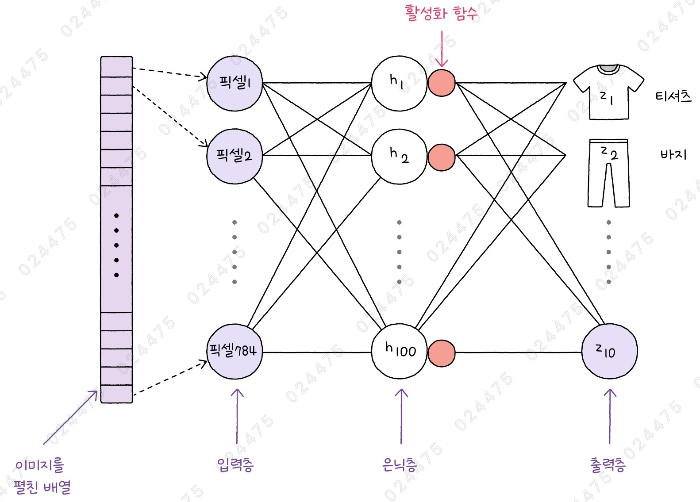
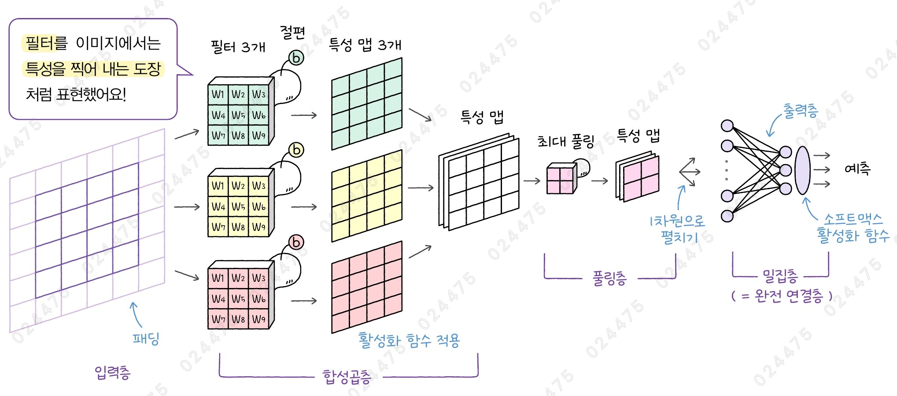
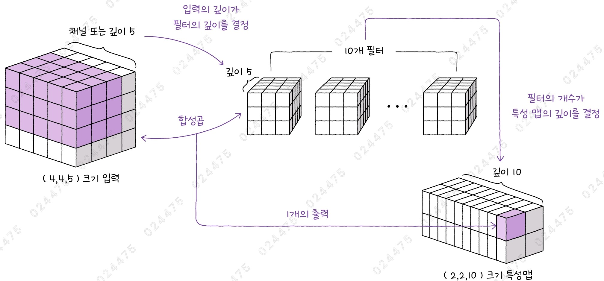

# ✔ 합성곱 신경망(CNN) 모델 이해하기

> ['합성곱 신경망(CNN) 모델 이해하기' 구글 코랩](https://colab.research.google.com/github/rickiepark/hm-dl/blob/main/01-2.ipynb)

## 1️⃣ 최초의 CNN 모델 - LeNet

- 페이스북의 얀 르쿤이 개발한 딥러닝 모델
- 필기 숫자 인식을 위해 설계됨
  - 미국 우편 서비스에서 우편물의 우편 번호를 자동으로 인식하기 위해 처음 합성곱 신경망이 적용됨
- LeNet 이라고 하면 보통 LeNet-5 모델을 말함
- LeNet-5는 요즘의 신경망 구조와는 조금 다른 기법을 사용했지만, 크게 보면 두 개의 합성곱층과 세 개의 밀집층으로 구성됨

### 인공 신경망



- 입력층과 은닉층, 출력층을 거쳐 데이터를 처리함
- 비교적 간단한 텍스트 분류 작업이나 금융 데이터 예측에 사용함
- 인공 신경망의 기본 계산 단위를 뉴런 또는 유닛이라고 부름
  - 뉴런에서 일어나는 일은 선형 계산이 전부임
  - 밀집층에서는 보통 한 개 이상의 유닛을 가짐

1. 입력층

   - 처음 들어오는 데이터를 받는 곳
   - 원본 데이터를 전달하는 역할

2. 은닉층

   - 입력층과 출력층 사이에 있느 모든 층
   - 입력 데이터의 패턴을 찾고, 중요한 특징을 뽑아냄

3. 출력층

   - 최종 결과를 내는 곳

### 합성곱 신경망



- 이미지 분류, 객체 탐지 등을 위한 신경망 모델
- 국부적 특징을 추출하는 합성곱층과 풀링층을 통해 이미지의 중요 패턴을 자동으로 학습하며, 이어지는 밀집층에서 최종 분류 작업을 수행함
- 특히, 얼굴 인식이나 이미지 분석 등 시각적 또는 공간적 데이터를 처리하는 데 탁월함
- 합성곱 신경망에서는 기본 계산 단위를 필터 또는 커널이라고 부름
  - 케라스 API에서는 필터를 뉴런의 개수로, 커널을 입력에 곱해지는 가중치로 정의함
- 합성곱층과 풀링층을 반복해서 쌓는 것이 특징임

1. 합성곱층 (Convolutional layer)

   - 이미지의 작은 부분을 스캔하여 중요한 특성을 추출하는 층
   - 합성곱 계산을 통해 압축적으로 얻은 출력을 특성 맵(feature map)이라고 부름

2. 풀링층 (Pooling layer)

   - 합성곱층에서 추출된 특성 맵을 축소해 처리 속도를 높이고, 모델이 더 중요한 패턴에 집중하도록 만드는 층

3. 밀집층 (Dense layer)

   - 이전 층에서 추출된 특성을 바탕으로 최종 결과를 도출하는 층

## 2️⃣ 합성곱층 - Conv2D

### 패딩

- Padding
- 이미지의 가장자리에 빈 공간을 추가해 이미지 가장자리 부분의 픽셀이 충분히 처리될 수 있도록 기회를 부여함
- 입력된 이미지보다 더 큰 입력 크기를 만들어 일정한 크기의 출력을 만들어냄
- 0으로 채워져 있어 합성곱 계산에 영향을 미치지 않음

1. 세임 패딩 (Same Padding)

   - 입력과 특성 맵의 크기를 동일하게 만들기 위해 입력 주위에 적절한 개수의 패딩을 추가하는 방식

2. 밸리드 패딩 (Valid Padding)

   - 패딩 없이 순순한 입력 배열에 대해서만 합성곱을 수행해 특성 맵을 만드는 방식
   - 밸리드 패딩을 수행하면 입력의 크기보다 특성 맵의 크기가 줄어듬

### 스트라이드

- Stride
- 필터가 이미지 위를 이동하는 속도
- 이미지 위를 몇 칸씩 이동하는지를 결정
- 스트라이드가 크면 이미지를 처리하는 계산량이 줄어들지만, 세밀한 패턴을 놓칠 수 있음
- 스트라이드가 작으면 보다 정밀하게 분석할 수 있지만, 이미지를 처리하는 계산량이 늘어날 수 있음
- 기본값: 1

### 필터



- 필터의 깊이는 기본적으로 입력의 깊이(또는 채널)와 같음
- 하나의 필터가 하나의 특성 맵을 만들기 때문에, 필터의 개수가 곧 특성 맵의 깊이가 됨
- 패딩을 추가하지 않으면 합성곱 연산이 공간 방향의 차원을 줄이게 됨
- 즉, 합성곱 연산은 특성 맵의 깊이가 깊어지면서 모델이 점점 더 복잡한 정보와 세부적인 패턴을 이해하게 만들고, 이미지의 가로와 세로 크기를 점점 작게 만들어 점점 중요한 특성을 남기는 과정임

#### 1. 필터가 10개, 커널 크기가 3인 합성곱층을 만들어보자

```py
import keras
from keras import layers

conv1 = layers.Conv2D(filters=10, kernel_size=(3, 3))
```

- `Conv2D` 클래스: 2차원 합성곱을 수행하는 층
- 1차원 합성곱을 수행하는 `Conv1D` 클래스와 3차원 합성곱을 수행하는 `Conv3D` 클래스도 있음
- `filters` 매개변수: 필터의 개수
  - 합성곱층 출력의 마지막 차원을 결정함
  - 정수 값 하나로 지정
- `kernel_size` 매개변수: 커널의 크기
  - 필터의 처음 두 차원에 해당하는 너비와 높이를 말함
  - 필터의 마지막 세 번째 차원은 입력의 채널 개수에 따라 결정됨
  - 한 개의 정수 또는 두 개의 정수로 구성된 튜플로 지정

#### 2. 다차원 배열 입력 데이터를 합성곱층에 통과시켜보자

```py
import numpy as np

x = np.random.normal(size=(10, 28, 28, 1))
conv_out = conv1(x)
print(conv_out.shape)  # (10, 26, 26, 10)
```

- `normal()` 함수: 정규 분포(normal distribution)를 따르는 난수를 생성함
  - loc 매개변수: 정규 분포의 평균을 지정 (기본값: 0.0)
  - scale 매개변수: 정규 분포의 표준편차를 지정 (기본값: 1.0)
  - size 매개변수: 생성하려는 배열의 크기를 지정
- `uniform()` 함수: 균등 분포(uniform distribution)를 따르는 난수를 생성함
  - low 매개변수: 균등 분포의 최솟값을 지정 (기본값: 0.0)
  - high 매개변수: 균등 분포의 최댓값을 지정 (기본값: 1.0)
  - 세 번째 매개변수는 생성하려는 배열의 크기를 나타내는 리스트임
- 실행 결과 = (배치, 높이, 너비, 채널 혹은 특성 맵의 깊이)
  - 커널의 크기가 (3,3)이고 패딩을 추가하지 않았기 때문에 높이와 너비가 2씩 줄어들음
  - 필터의 개수가 10이므로 특성 맵의 깊이가 10으로 결정됨

#### 3. 필터가 10개, 커널 크기가 3, 스트라이드가 2인 합성곱층을 만들어보자

```py
conv2 = layers.Conv2D(filters=10, kernel_size=(3, 3), strides=(2, 2))
print(conv2(x).shape)  # (10, 13, 13, 10)
```

- `strides` 매개변수: 높이와 너비 방향 스트라이드를 지정
  - 한 개의 정수 또는 두 개의 정수로 구성된 튜플로 지정
  - 기본값: (1, 1)

#### 4. 필터가 10개, 커널 크기가 3, 스트라이드가 2, 세임 패딩인 합성곱층을 만들어보자

```py
conv3 = layers.Conv2D(filters=10, kernel_size=(3, 3), strides=(2, 2), padding='same')
print(conv3(x).shape)  # (10, 14, 14, 10)
```

- `padding` 매개변수: 입력 텐서의 테두리에 패딩을 추가하는 방법을 결정
  - 'valid': 밸리드 패딩으로, 패딩을 추가하지 않음
  - 'same': 세임 패딩으로, 입력과 특성 맵이 동일한 크기가 되도록 패딩을 추가함
  - 기본값: 'valid'

#### 5. 필터가 10개, 커널 크기가 3, 세임 패딩인 합성곱층을 만들어보자

```py
conv4 = layers.Conv2D(filters=10, kernel_size=(3, 3), padding='same')
print(conv4(x).shape)  # (10, 28, 28, 10)
```

## 3️⃣ 풀링층과 밀집층 - AveragePooling2D, Dense

### 풀링층

- 풀링: 입력된 텐서의 높이와 너비를 줄이면서 픽셀 값을 압축하는 기능을 수행
- 합성곱층에서 추출된 중요 정보를 압축하는 과정
- 풀링 윈도(pooling window)라고 부르는 사각 영역이 입력 텐서 위를 지나가면서 평균값을 계산하거나 최댓값을 선택함
- 입력에 곱해지는 값은 없음

1. 평균 풀링

   - Average Pooling
   - 작은 사각 영역에서 이미지의 전체적인 특성(평균값)을 출력
   - 케라스에서 AveragePooling2D 클래스로 제공

2. 최대 풀링

   - Max Pooling
   - 작은 사각 영역에서 가장 강한 특성(가장 큰 값)을 출력
   - 케라스에서 MaxPooling2D 클래스로 제공

#### 1. 평균 풀링층을 만들자

```py
pool1 = layers.AveragePooling2D(pool_size=2)
pool2 = layers.AveragePooling2D(pool_size=3)

print(pool1(x).shape)  # (10, 14, 14, 1)
print(pool2(x).shape)  # (10, 9, 9, 1)
```

- `AveragePooling2D` 클래스: 평균 풀링층
- `pool_size` 매개변수: 풀링 크기(풀링 윈도의 크기) 지정
- `strides` 매개변수: 스트라이드 지정
  - 스트라이드의 크기는 항상 풀링 크기와 같음
  - 'None': 자동으로 풀링 크기에 맞춰 스트라이드가 설정됨
  - 기본값: 'None'
- `padding` 매개변수: 패딩 지정
  - 기본값: 'valid'

### 밀집층

- 입력과 가중치의 점곱(dot product)을 수행
- 점곱: 입력과 커널의 곱셈을 간단하게 표현하는 수학적 표기법
  - $y = x · W + b$
- 처음에는 가중치가 랜덤한 값으로 설정되지만, 데이터로 모델을 훈련시키면서 입력에 곱해야 할 적절한 값으로 바뀌게 됨
- 보통 분류 문제의 경우, 마지막 밀집층에 분류하려는 클래스 개수만큼 유닛을 두어 각 클래스에 대한 확률을 출력함

#### 1. 유닛이 3개이고 입력 특성이 2개인 밀집층을 만들자

```py
import numpy as np

dense1 = layers.Dense(3)

x2 = np.array([[5, 7]])
print(dense1(x2).shape)  # (1, 3)
```

- 밀집층의 커널 크기 = (입력 크기, 유닛 개수)
  - 즉, 유닛마다 입력 크기만큼의 가중치 값이 있음

#### 2. 밀집층의 가중치 크기를 확인해보자

```py
print(dense1.get_weights())
"""
[array([[ 0.36496258,  0.8256315 ,  0.29854286],
       [-1.0167047 , -0.52185035,  0.40097725]], dtype=float32), array([0., 0., 0.], dtype=float32)]
"""
```

- `get_weights()` 메서드: 가중치의 크기를 출력함
- (2, 3) 크기의 커널과 (3,) 크기의 절편을 반환했음
- 결과를 보면 난수로 설정된 것을 확인할 수 있음

#### 3. 가중치를 난수 대신 간단한 값으로 설정한 후, 점곱 계산과 비교해보자

```py
dense1.set_weights([
    np.array([[1, 2, 3], [4, 5, 6]]),
    np.array([0, 0, 0])
])
print(dense1(x2))
# tf.Tensor([[33. 45. 57.]], shape=(1, 3), dtype=float32)

weight = dense1.get_weights()[0]
print(np.dot(x2, weight))
# [[33. 45. 57.]]
```

- `dot()` 함수: 점곱 계산
- 입력과 가중치를 직접 점곱 계산한 값과 Dense 층이 계산한 점곱의 값이 같은 것을 알 수 있음
