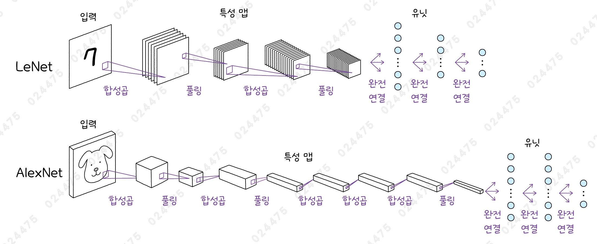
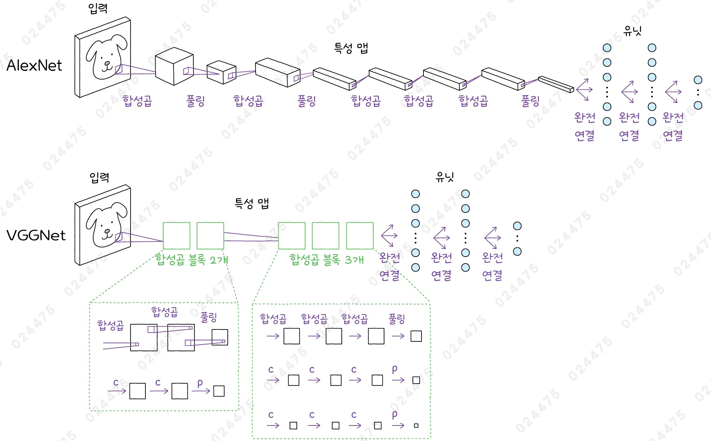
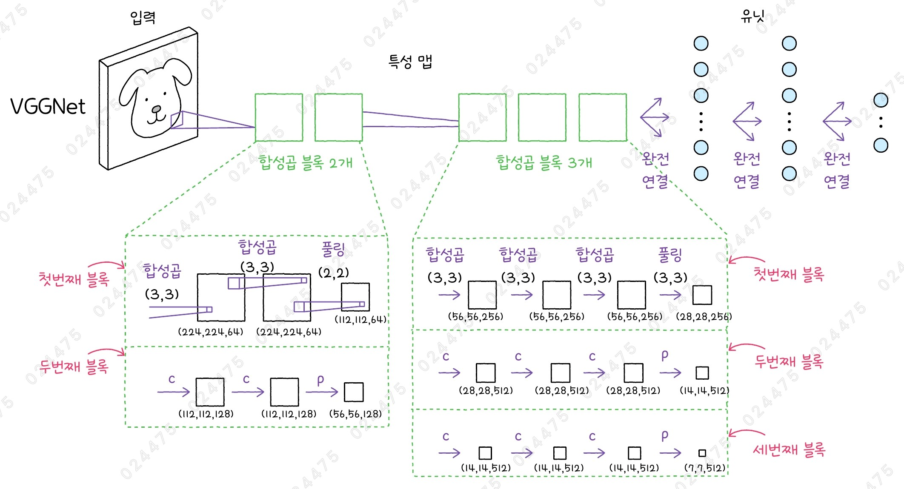

# ✔ 이미지 분류 CNN 모델 만들기

> ['이미지 분류 CNN 모델 만들기' 구글 코랩](https://colab.research.google.com/github/rickiepark/hm-dl/blob/main/02-1.ipynb)

## 1️⃣ 이미지넷 대회에서 우승한 최초의 CNN 모델 - AlexNet

- 이미지넷: 1,000개의 클래스와 1백만 개 이상의 이미지로 구성된 이미지 데이터베이스
- 이미지넷 대회: 2010년부터 2017년까지 이미지넷 프로젝트가 컴퓨터 비전 알고리즘을 평가하기 위해 개최한 이미지 인식 경연 대회
- AlexNet: 2012년 제프리 힌튼 팀이 만든 모델로, 그 해 이미지넷 대회에 CNN을 처음 도입하여 큰 차이로 우승을 차지함
  - 이미지 원본 픽셀을 그대로 사용하면서 다른 모델들과 비교해 성능 면에서 압도적인 차이를 보여줌

### LeNet-5와의 차이점



1. AlexNet 모델은 LeNet-5 모델보다 많은 층을 사용함

   - 2개의 합성곱층과 풀링층 → 3개의 합성곱층 → 1개의 풀링층 → 2개의 밀집층과 드롭아웃층 → 출력층으로 구성됨

2. AlexNext 모델은 LeNet-5 모델에서 사용한 활성화 함수인 시그모이드 함수 대신 렐루 함수를 사용함

   - 시그모이드 함수는 입력값이 커지고 작아짐에 따라 함수의 기울기가 급격하게 줄어듦
   - 기울기는 모델을 훈련할 때 파라미터를 업데이트하기 위해 필요함
   - 여러 개의 층을 가진 신경망의 경우, 시작 부분의 층을 업데이트하려면 뒤쪽 층에 있는 기울기부터 누적해야 함
   - 만약 기울기가 작다면 누적된 기울기도 작아지고, 파라미터를 업데이트하는 데 거의 영향을 미치지 못함 (그레이디언트 소실 문제)
   - 따라서, AlexNet 모델은 렐루 함수를 사용해 활성화 함수로 인한 그레이디언트 소실 문제를 개선해 모델의 성능을 향상시킴

3. 평균 풀링 대신 최대 풀링을 사용함

   - 평균 풀링은 풀링 영역 안에 있는 값의 평균으로 처리하기 때문에 (특성 맵에서 높은 값으로 나타나는)중요한 특징을 희석시킬 수 있음
   - 반면, 최대 풀링은 특성 맵에 있는 중요 정보를 희석시키지 않고 다음 층으로 전달할 수 있음
   - 일반적인 풀링은 스트라이드 크기와 풀링 크기가 같지만, AlexNext 모델은 스트라이드 크기가 풀링 크기보다 작아 중첩된 풀링을 수행함

4. AlexNet 모델은 밀집층의 과대적합을 막기 위해 유닛의 출력을 랜덤하게 끄는 드롭아웃을 사용함

### AlexNet 이미지 데이터

- 이미지넷에 있는 이미지의 크기는 다양함
- 가장 작은 크기가 256 픽셀이고, 최대 512 픽셀을 넘지 않음
- AlexNet은 227x227로 이미지 크기를 줄여서 훈련에 사용함
- 또한, 컬러 이미지이므로 입력 채널은 3이 됨

### AlexNext 모델 만들기

#### 1. AlexNet 모델을 만들자

```py
import keras
from keras import layers

alexnet = keras.Sequential()
alexnet.add(layers.Input(shape=(227, 227, 3)))
alexnet.add(layers.Conv2D(filters=96, kernel_size=11, strides=4,
                          activation='relu'))
alexnet.add(layers.MaxPooling2D(pool_size=3, strides=2))
alexnet.add(layers.Conv2D(filters=256, kernel_size=5, padding='same',
                          activation='relu'))
alexnet.add(layers.MaxPooling2D(pool_size=3, strides=2))
alexnet.add(layers.Conv2D(filters=384, kernel_size=3, padding='same',
                          activation='relu'))
alexnet.add(layers.Conv2D(filters=384, kernel_size=3, padding='same',
                          activation='relu'))
alexnet.add(layers.Conv2D(filters=256, kernel_size=3, padding='same',
                          activation='relu'))
alexnet.add(layers.MaxPooling2D(pool_size=3, strides=2))
alexnet.add(layers.Flatten())
alexnet.add(layers.Dense(4096, activation='relu'))
alexnet.add(layers.Dropout(0.5))
alexnet.add(layers.Dense(4096, activation='relu'))
alexnet.add(layers.Dropout(0.5))
alexnet.add(layers.Dense(1000, activation='softmax'))
```

#### 2. 모델의 구조를 확인하자

```py
alexnet.summary()
```


```
output_size = (input_size - kernel_size) // stride_size + 1
```

1. 첫 번째 합성곱층

   - 채널 크기 = 96
     - 11x11 크기의 필터를 96개 사용
   - 출력 크기 = (227 - 11) // 4 + 1 = 55
     - 커널 크기는 11
     - 스트라이드는 4
     - valid 패딩

2. 첫 번째 풀링층

   - 채널 크기 = 96
     - 풀링층은 이미지의 가로와 세로 크기를 줄이지만 채널의 수는 바꾸지 않음
   - 출력 크기 = (55 - 3) // 2 + 1 = 27
     - 풀링 크기는 3
     - 스트라이드는 2

3. 두 번째 합성곱층

   - 채널 크기 = 256
     - 5x5 크기의 필터를 256개 사용
   - 출력 크기 = 27
     - same 패딩

4. 두 번째 풀링층

   - 채널 크기 = 256
   - 출력 크기 = (27 - 3) // 2 + 1 = 13
     - 풀링 크기는 3
     - 스트라이드는 2

5. 3개의 합성곱층
   - 채널 크기 = 384 → 384 → 256
   - 출력 크기 = 13
     - same 패딩

## 2️⃣ 사전 훈련된 CNN 모델 - VGGNet

- 이미지넷 데이터셋처럼 대용량 데이터를 사용해 모델을 훈련하려면 GPU가 장착된 고성능 컴퓨터가 필요함
- 아쉽게도 AlexNet은 케라스를 사용해 구현한 모델이 아니기 때문에, AlexNet 모델의 가중치를 우리가 케라스로 만든 모델에 적용하는게 어려움
- VGGNet: 옥스포드 대학교의 Visual Geometry Group에서 만든 합성곱 신경망 구조로, 2014년 이미지넷 대회에서 준우승한 모델임
- VGGNet은 합성곱층과 밀집층을 합쳐서 층의 개수가 16개(VGG16)인 경우와 19개(VGG19)인 경우를 많이 사용함
  - 케라스에는 VGG16과 VGG19 모델이 포함되어 있기 때문에 쉽게 가져다 쓸 수 있음
  - AlexNet 모델에는 사전 훈련된 가중치가 공개되어 있지 않지만, VGGNet 모델에는 이미지넷 데이터셋에서 훈련된 모델의 가중치가 공개되어 있음

### 이전 합성곱 신경망과의 차이점



1. 합성곱층과 풀링층을 교대로 반복하는 대신, 여러 번의 합성곱층을 적용한 다음 풀링층을 적용함

   - 풀링층은 특성 맵의 높이와 너비를 줄이기 때문에 많이 사용하면 깊은 네트워크를 만들기가 어려움
   - 높은 성능을 내기 위해서는 네트워크에 많은 층을 추가해야 함

2. 동일한 여러 개의 합성곱층과 풀링층의 구조를 반복하는 블록(block)을 적용함
3. 큰 필터를 사용하는 하나의 합성곱층 대신, 3x3 크기의 작은 필터를 사용하는 여러 개의 합성곱층을 적용함

### VGGNet 모델 만들기



- 위 이미지는 VGG16 모델 구조로, 동일한 합성곱 블록 2개와 3개가 반복됨
  - 2개의 블록 = 합성곱층 2개 + 풀링층 1개 적용
  - 3개의 블록 = 합성곱층 3개 + 풀링층 1개 적용

#### 1. VGG16 모델을 만들자

```py
vggnet = keras.Sequential()
vggnet.add(layers.Input(shape=(224, 224, 3)))

# 1, 2번째 블록
for n_filters in [64, 128]:
    for _ in range(2):
        vggnet.add(layers.Conv2D(filters=n_filters, kernel_size=3,
                                 padding='same', activation='relu'))
    vggnet.add(layers.MaxPooling2D(pool_size=2))

# 3, 4, 5번째 블록
for n_filters in [256, 512, 512]:
    for _ in range(3):
        vggnet.add(layers.Conv2D(filters=n_filters, kernel_size=3,
                                 padding='same', activation='relu'))
    vggnet.add(layers.MaxPooling2D(pool_size=2))

vggnet.add(layers.Flatten())
vggnet.add(layers.Dense(4096, activation='relu'))
vggnet.add(layers.Dense(4096, activation='relu'))
vggnet.add(layers.Dense(1000, activation='softmax'))
```

#### 2. 모델의 구조를 확인해보자

```py
vggnet.summary()
```


