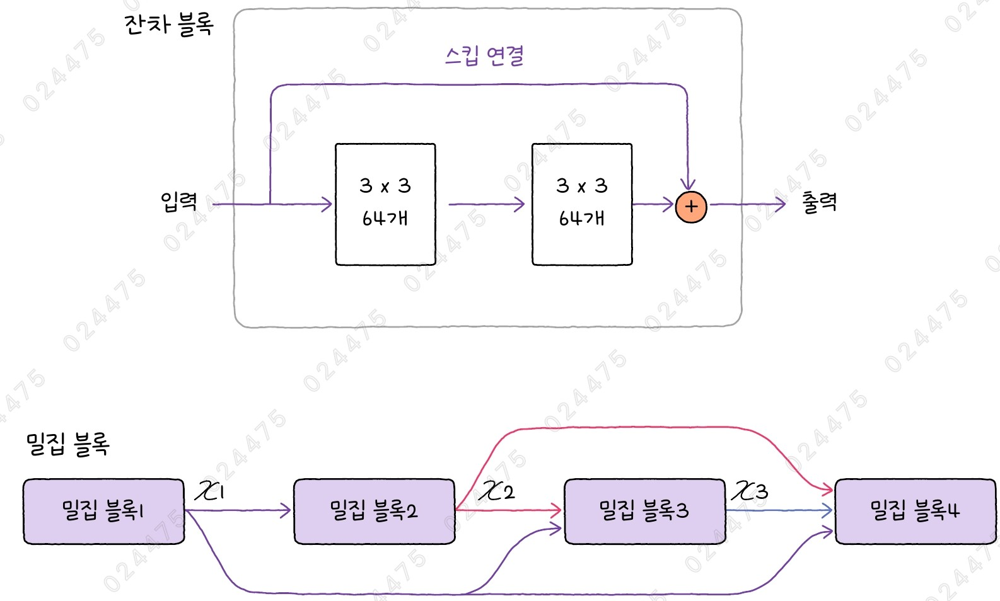
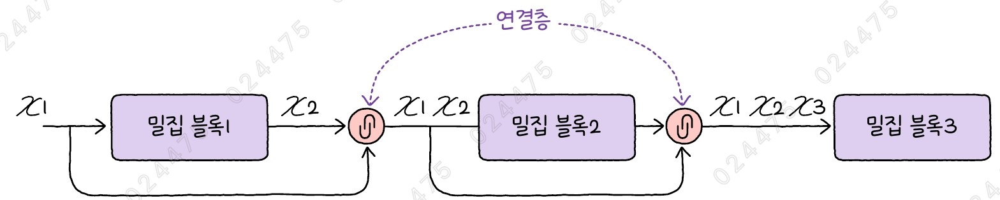
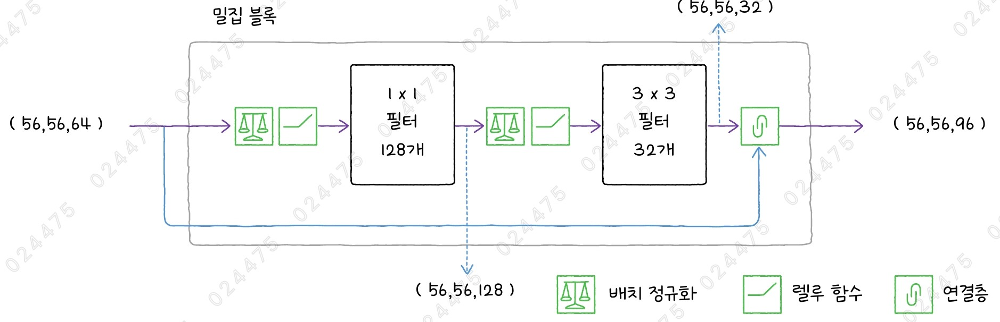
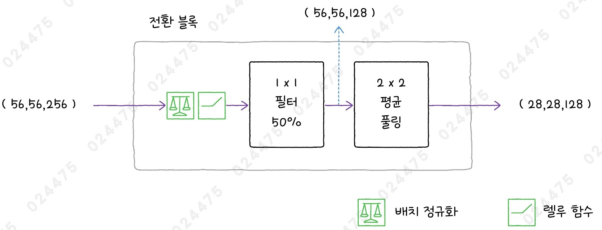
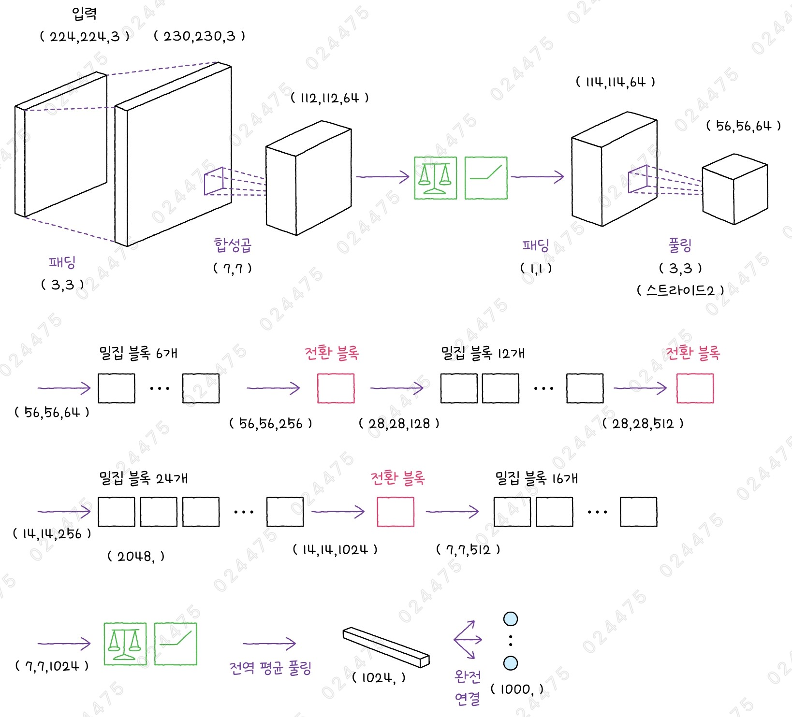
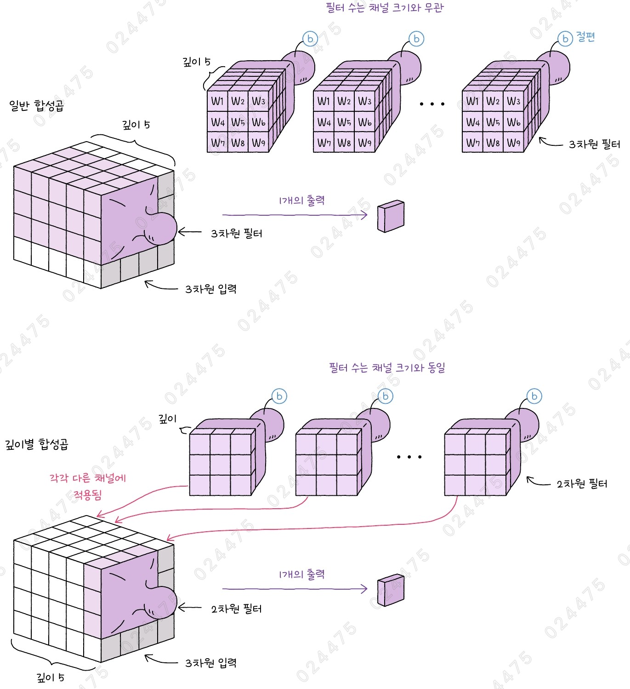
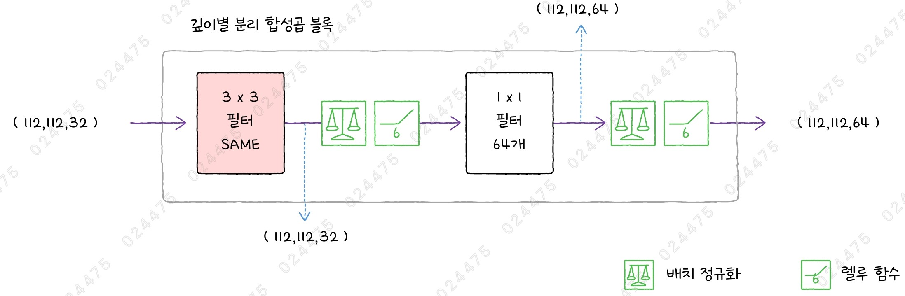
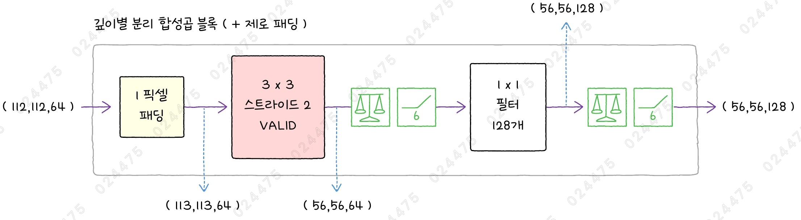
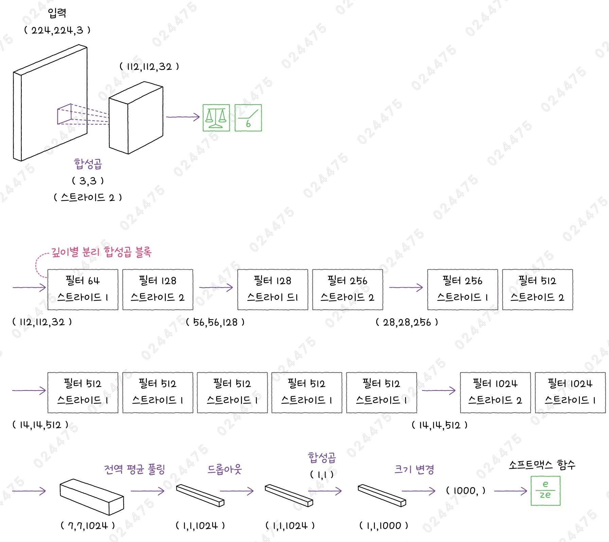

# ✔ 이미지 분류 모델의 효율성 최적화하기

> ['이미지 분류 모델의 효율성 최적화하기' 구글 코랩](https://colab.research.google.com/github/rickiepark/hm-dl/blob/main/03-1.ipynb)

## 1️⃣ ResNet의 확장 모델 - DenseNet

- ResNet 모델의 아이디어를 확장한 모델
  - 둘 다 깊은 신경망을 다루는 모델이지만, 정보를 전달하는 방식에 차이가 있음
- 잔차 연결을 사용한 밀집 블록과 특성 맵의 크기를 줄이는 전환 블록을 반복적으로 쌓아 구성함
- 신경망에 사용되는 층의 개수에 따라 DenseNet-121, DenseNet-169, DenseNet-201, DenseNet-264가 있음

### 밀집 연결



- Dense Connectivity
- ResNet은 잔차 연결(스킵 연결)을 사용해 기존 층을 건너뛰어 마지막 합성곱 출력에 입력을 더함
- DenseNet은 이전 층의 모든 출력을 현재 층의 입력으로 사용함
  - 즉, 입력과 출력을 더하는 것이 아니라 연결함



- 실제, 밀집 연결을 구현할 때는 연결층을 사용하여 차곡차곡 입력을 쌓아 다음 밀집 블록으로 계속 전달함

### 밀집 블록



- Dense Block
- 밀집 블록을 통해 그레이디언트 소실 문제를 해결하고, 더 깊은 층을 쌓을 수 있음
- 이전 밀집 블록의 출력을 모두 사용함

1. 첫 번째 합성곱층

   - 1x1 크기의 필터 128개를 사용
   - 특성 맵의 너비와 높이는 바뀌지 않고, 채널 차원만 늘어남

2. 두 번째 합성곱층

   - 3x3 크기의 필터 32개를 사용
   - 세임 패딩 사용
   - 특성 맵의 너비와 높이는 바뀌지 않고, 채널 차원만 늘어남

3. 연결층
   - 밀집 블록의 입력과 마지막 합성곱층의 출력을 연결
   - 채널 차원으로 이어 붙임

### 전환 블록



- Transition Block
- 전환 블록은 밀집 블록이 여러 번 반복된 후에 등장함
- 밀집 블록을 반복해서 쌓으면 채널의 깊이가 점점 깊어지기 때문에, 모델 파라미터의 크기가 늘어나고 연산량이 증가함
- 따라서, 전환 블록을 통해 특성 맵의 너비와 높이, 채널을 줄여줄 필요가 있음

1. 합성곱층

   - 1x1 크기의 필터를 사용
   - 필터 개수는 입력 채널의 절반임

2. 풀링층
   - 2x2 평균 풀링을 사용해 너비와 높이를 절방으로 줄임

### DenseNet 모델 준비하기

#### 1. 밀집 블록을 만들자

```py
import keras
from keras import layers

def dense_block(x, blocks):
    for _ in range(blocks):
        x1 = layers.BatchNormalization(epsilon=1e-5)(x)
        x1 = layers.Activation('relu')(x1)
        x1 = layers.Conv2D(128, 1, use_bias=False)(x1)
        x1 = layers.BatchNormalization(epsilon=1e-5)(x1)
        x1 = layers.Activation('relu')(x1)
        x1 = layers.Conv2D(32, 3, padding='same', use_bias=False)(x1)
        x = layers.Concatenate()([x, x1])
    return x
```

- `Concatenate()` 클래스: 두 텐서를 연결함
- 배치 정규화층은 입력의 평균을 0으로 맞추는 역할을 하므로, 그 다음에 등장하는 층에서 절편을 학습할 필요가 없음

#### 2. 전환 블록을 만들자

```py
def transition_block(x):
    x = layers.BatchNormalization(epsilon=1e-5)(x)
    x = layers.Activation('relu')(x)
    x = layers.Conv2D(int(x.shape[-1]/2), 1, use_bias=False)(x)
    x = layers.AveragePooling2D(2)(x)
    return x
```

### DenseNet-121 모델 만들기



- 모델들의 세 번째, 네 번째 밀집 블록에 포함된 층의 개수가 다른 것을 제외하면 위 구조가 동일함
  - DenseNet-121 모델: 6, 12, 24, 16개의 밀집 블록
  - DenseNet-169 모델: 6, 12, 32, 32개의 밀집 블록
  - DenseNet-201 모델: 6, 12, 48, 32개의 밀집 블록
  - DenseNet-264 모델: 6, 12, 64, 48개의 밀집 블록

#### 1. 모델을 만들자

```py
inputs = layers.Input(shape=(224, 224, 3))

x = layers.ZeroPadding2D(padding=3)(inputs)
x = layers.Conv2D(64, 7, strides=2, use_bias=False)(x)
x = layers.BatchNormalization(epsilon=1e-5)(x)
x = layers.Activation('relu')(x)
x = layers.ZeroPadding2D(padding=1)(x)
x = layers.MaxPooling2D(3, strides=2)(x)

for blocks in (6, 12, 24):
    x = dense_block(x, blocks)
    x = transition_block(x)
x = dense_block(x, 16)

x = layers.BatchNormalization(epsilon=1e-5)(x)
x = layers.Activation('relu')(x)
x = layers.GlobalAveragePooling2D()(x)
outputs = layers.Dense(1000, activation='softmax')(x)

model = keras.Model(inputs, outputs)
```

- 밀집 블록 6번 반복 → 전환 블록 → 밀집 블록 12번 반복 → 전환 블록 → 밀집 블록 24번 반복 → 전환 블록 → 밀집 블록 16번 반복

#### 2. 모델의 구조를 확인해보자

```py
model.summary()
```


### DenseNet-201 모델로 강아지 사진 분류하기

- 케라스는 DenseNet에 대해서도 사전 훈련된 모델을 제공함

#### 1. 구글 드라이브에서 샘플 이미지를 다운로드하고 압축을 해제하자

```
!gdown 1xGkTT3uwYt4myj6eJJeYtdEFgTi2Sj8C
!unzip cat-dog-images.zip
```

#### 2. 강아지 이미지를 로드한 후, 전처리하자

```py
import numpy as np
from PIL import Image
from keras.applications import densenet

dog_png = np.array(Image.open('images/dog.png'))
dense_prep_dog = densenet.preprocess_input(dog_png)
```

- DenseNet의 전처리는 단순히 입력 값을 255로 나누어 0~1 사이의 값으로 만드는 것임

#### 3. DenseNet-201 모델을 로드한 후, 강아지 이미지를 예측해보자

```py
densenet201 = keras.applications.DenseNet201()
predictions = densenet201.predict(dense_prep_dog[np.newaxis,:])
densenet.decode_predictions(predictions)
"""
[[('n02099712', 'Labrador_retriever', np.float32(0.5281199)),
  ('n04409515', 'tennis_ball', np.float32(0.1985785)),
  ('n02104029', 'kuvasz', np.float32(0.060605202)),
  ('n02111500', 'Great_Pyrenees', np.float32(0.027188253)),
  ('n02099601', 'golden_retriever', np.float32(0.017613854))]]
"""
```

- 52.8%의 확률로 '래브라도 리트리버'를 예측함
- ResNet 모델이 예측했던 결과(38.5%)보다 훨씬 더 강아게 예측함

## 2️⃣ 모바일 환경(경량) 모델 - MobileNet

- 합성곱 신경망은 파라미터의 개수가 작을수록 실행 속도가 더 빠르고, 시스템 자원도 덜 소모함
- MobileNet은 깊이별 합성곱층을 사용해 용량 문제를 해결함
- 이후 발표한 MobileNetV2 모델은 역 잔차 블록(Inverted Residual Block)이라는 새로운 구조를 사용하며, MobileNetV3 모델은 역 잔차 블록에 SE 블록을 추가하여 모델 연산의 효율성과 성능을 높임

### 깊이별 합성곱



- Depthwise Convolution
- 프랑소와 숄레가 Xception 모델에서 처음 소개한 층임
- 별도의 필터, 단순한 연산, 각 채널의 독립적 처리를 통해 메모리와 처리 성능이 제한적인 환경에서 높은 성능을 발휘함
- 필터의 파라미터 수는 크게 줄고, 계산의 효율성은 높아짐

1. 일반 합성곱

   - 모든 채널을 동시에 처리하는 필터를 적용하여 각 채널 간의 상호작용을 만들어냄
   - 입력의 채널 개수 == 필터의 깊이
     - 전체 채널에 대해 입력과 필터를 곱하여 하나의 출력을 만듦
   - 필터의 개수 == 출력의 채널 개수
     - 입력의 채널 개수는 출력의 채널 개수에 영향을 미치지 못함

2. 깊이별 합성곱
   - 각 채널마다 합성곱이 따로 수행되는 필터를 사용해여 각 채널의 특성을 독립적으로 추출함
   - 필터의 깊이 == 1
   - 입력의 채널 개수 == 필터의 개수 == 출력의 채널 개수
     - 각 필터가 서로 다른 채널에 적용됨

### 깊이별 분리 합성곱 블록



- Depthwise Separable Convolution Block
- MobileNet 모델은 깊이별 분리 합성곱 블록을 반복적으로 쌓아서 구성됨
- 깊이별 합성곱, 일반 합성곱, 배치 정규화, 렐루 활성화 함수로 구성
- 이 깊이별 분리 합성곱 블록은 특성 맵의 너비와 높이가 변하지 않음

1. 깊이별 합성곱층

   - 각 입력 채널에 독립적으로 필터를 적용 (출력 채널 개수 == 입력 채널 개수)
   - same 패딩을 사용하므로, 출력의 너비와 높이가 입력과 동일함

2. 점별 합성곱층
   - 1x1 합성곱
   - 각 채널 간의 정보를 결합함
   - 점별 합성곱층에서 사용되는 필터 개수는 처음 64개에서 신경망이 깊어질수록 점차 늘어나게 됨

### 깊이별 분리 합성곱 블록 + 제로 패딩



- 신경망이 깊어질수록 특성 맵의 너비와 높이를 줄일 필요가 있음
- 따라서, 깊이별 합성곱층의 스트라이드를 2로 설정하고 패딩 옵션을 valid로 지정하는 깊이별 분리 합성곱 블록을 가짐
- 깊이별 합성곱층의 필터가 3x3이기 때문에, 112x112 크기를 절반으로 줄이기 위해 1픽셀을 추가함

### ReLU6 활성화 함수


- 렐루 활성화 함수의 최댓값을 6으로 제한한 함수
- 음수를 모두 0으로, 6보다 큰 값을 모두 6으로 만들어 활성화 값이 너무 커지지 않도록 함
- 계산량을 줄이고 그레이디언트가 커지는 것을 막아 모델의 훈련을 안정화하는 데 도움이 됨

### MobileNet 모델 준비하기

#### 1. 깊이별 분리 합성곱 블록을 만들자

```py
def depthwise_separable_block(inputs, filters, strides=1):
    if strides == 1:
        x = inputs
    else:
        x = layers.ZeroPadding2D(padding=((0, 1), (0, 1)))(inputs)

    x = layers.DepthwiseConv2D(3, padding='same' if strides == 1 else 'valid',
                               strides=strides, use_bias=False)(x)
    x = layers.BatchNormalization(epsilon=1e-5)(x)
    x = layers.ReLU(max_value=6.0)(x)
    x = layers.Conv2D(filters, 1, padding='same', use_bias=False)(x)
    x = layers.BatchNormalization(epsilon=1e-5)(x)
    x = layers.ReLU(max_value=6.0)(x)
    return x
```

- 두 버전의 깊이별 분리 합성곱 블록을 따로 만들지 않고, 하나의 함수에서 스트라이드 매개변수에 따라 패딩을 추가할 수 있게 구현함
- ZeroPadding2D 클래스의 padding 매개변수에 패딩을 지정하는 방법
  - 정수 하나를 지정하는 경우: 입력 텐서의 둘레에 동일한 양의 패딩을 추가함
  - 정수의 튜플을 지정하는 경우: (x, y)처럼 지정하면 입력의 위아래 x픽셀, 좌우 y픽셀을 추가함
  - 튜플의 튜플을 지정하는 경우: ((x, y), (a, b))처럼 지정하면 입력의 위에 x픽셀, 아래에 y픽셀, 왼쪽에 a픽셀, 오른쪽에 b픽셀을 추가함

### MobileNet 모델 만들기



#### 1. 모델을 만들자

```py
inputs = layers.Input(shape=(224, 224, 3))

x = layers.Conv2D(32, 3, padding='same', strides=2, use_bias=False)(inputs)
x = layers.BatchNormalization(epsilon=1e-5)(x)
x = layers.ReLU(max_value=6.0)(x)

for filters in (64, 128, 256):
    x = depthwise_separable_block(x, filters)
    x = depthwise_separable_block(x, filters*2, strides=2)
for _ in range(5):
    x = depthwise_separable_block(x, 512)
x = depthwise_separable_block(x, 1024, strides=2)
x = depthwise_separable_block(x, 1024)

x = layers.GlobalAveragePooling2D(keepdims=True)(x)
x = layers.Dropout(0.001)(x)
x = layers.Conv2D(1000, 1, padding='same')(x)
x = layers.Reshape((1000,))(x)
outputs = layers.Activation('softmax')(x)

model = keras.Model(inputs, outputs)
```

- `DepthwiseConv2D` 클래스: 깊이별 합성곱층
  - 입력의 채널 개수와 필터 개수가 동일하므로 필터 개수를 지정하는 매개변수가 없음

#### 2. 모델의 구조를 확인해보자

```py
model.summary()
```


- MobileNet 모델의 파라미터 개수가 약 4백만개(16MB) 정도인 것을 알 수 있음
- DenseNet 모델의 용량(30.44MB)에 비하면 매우 경량임

### MobileNet 모델로 강아지 사진 분류하기

#### 1. 강아지 이미지를 전처리한 후, MobileNet 모델로 예측해보자

```py
from keras.applications import mobilenet

mobile_prep_dog = mobilenet.preprocess_input(dog_png)
model = keras.applications.MobileNet()
predictions = model.predict(mobile_prep_dog[np.newaxis,:])
mobilenet.decode_predictions(predictions)
"""
[[('n02099712', 'Labrador_retriever', np.float32(0.4090388)),
  ('n02104029', 'kuvasz', np.float32(0.18954797)),
  ('n02110341', 'dalmatian', np.float32(0.14881594)),
  ('n02111500', 'Great_Pyrenees', np.float32(0.04276251)),
  ('n02099601', 'golden_retriever', np.float32(0.027608158))]]
"""
```

- MobileNet 모델의 전처리는 입력 값을 127.5로 나누고, -1을 빼서 0~1 사이의 값으로 만드는 것임
- 40.9%의 확률로 '래브라도 리트리버'를 예측함
- DenseNet201 모델의 1/5에 지나지 않는 파라미터 용량으로 크게 뒤지지 않는 성능을 보여줌
