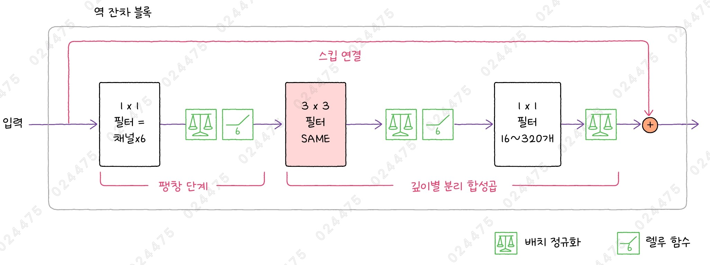
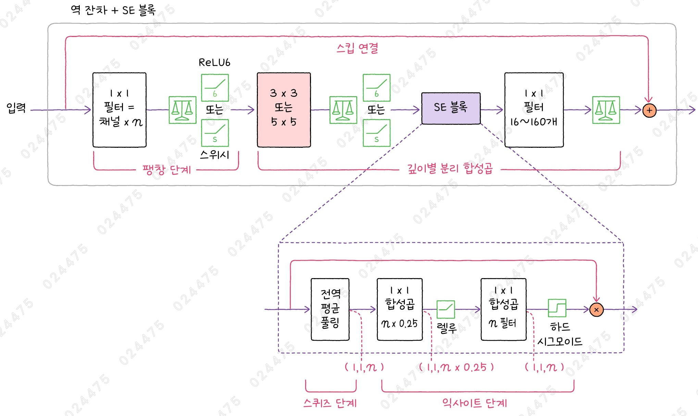
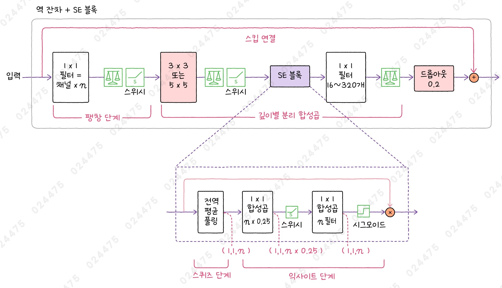
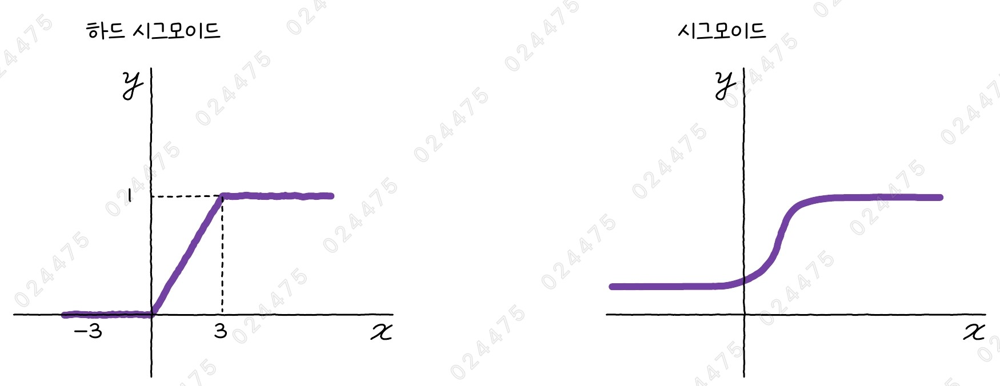
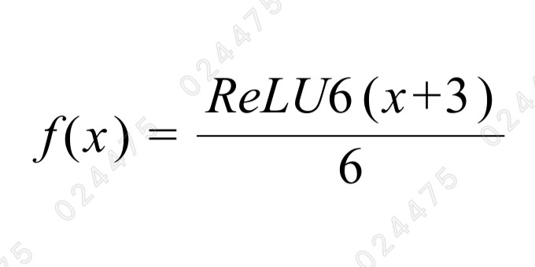
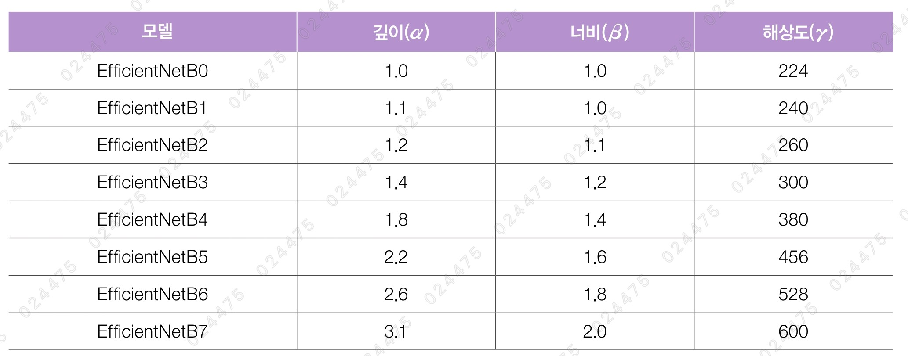
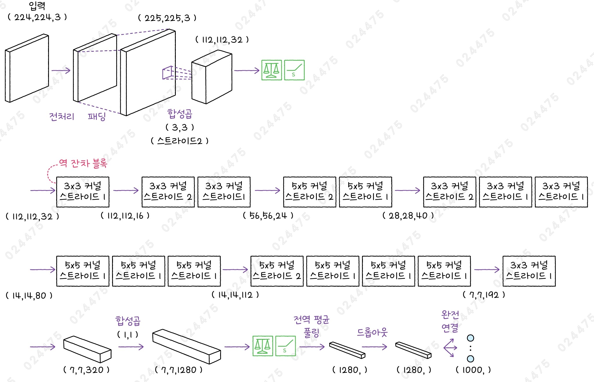

# ✔ 이미지 분류 모델의 성능 최적화하기

> ['이미지 분류 모델의 성능 최적화하기' 구글 코랩](https://colab.research.google.com/github/rickiepark/hm-dl/blob/main/03-2.ipynb)

## 1️⃣ 가장 높은 성능을 내는 모델 - EfficientNet

- 트랜스포머 기반 모델을 제외하면 순수한 CNN 기반 모델 중에서는 단연 이미지 분류에서 가장 높은 성능을 내는 모델임
- 구글 브레인 팀에서 만든 모델로, MobileNetV2와 MobileNetV3에서 제안한 역 잔차 블록을 약간 개선하여 사용함
  - MobileNetV3에서는 역 잔차 블록에 SE 블록을 추가함

### MobileNetV2의 역 잔차 블록



- Inverted Residual Block
- 잔차 블록: 압축 → 팽창의 순서를 거침
  - 1x1 합성곱층으로 입력의 채널을 압축한 다음, 3x3 합성곱을 수행하고 다시 1x1 합성곱으로 채널을 팽창시킴
- 역 잔차 블록: 팽창 → 압축의 순서를 거침
- 마지막 1x1 합성곱 다음에 렐루 함수를 넣으면 오히려 신경망의 성능을 떨어뜨리기 때문에 사용하지 않음 (선형 병목, linear bottleneck)
- 마지막으로 블록의 입력과 출력을 더하는 스킵 연결로 끝남
- 역 잔차 블록의 높이와 너비를 줄이기 위해, 두 번째 3x3 합성곱에서 스트라이드를 2로 설정하는 블록도 있음
  - 이 블록에서는 스킵 연결을 사용하지 않음

1. 첫 번째 1x1 합성곱층

   - 팽창 단계
   - 필터 개수를 입력 채널의 6배로 설정

2. 깊이별 분리 합성곱층

   - 각 채널별로 3x3 합성곱을 수행하기 때문에 팽창된 특성 맵을 처리하는 데 부담이 없음

3. 두 번째 1x1 합성곱층
   - 압축 단계
   - 신경망이 깊어질수록 1x1 합성곱의 필터 개수가 16개에서 320개까지 늘어남

### MobileNetV3의 역 잔차 블록 + SE 블록



- Squeeze and Excite Block
- SE 블록으 3x3 깊이별 합성곱과 1x1 점별 합성곱 사이에 추가됨
- SE 블록은 각 채널을 하나의 값으로 압축해 채널에 대한 가중치를 학습한 다음, 이 가중치를 다시 원본 채널에 곱하여 채널의 중요도를 조정하는 역할을 수행함
- 가중치를 학습하여 중요도가 높은 채널은 더 강조하고, 상대적으로 그렇지 않은 채널은 억제하는 효과를 냄
- 모델의 연산량은 크게 늘리지 않으면서 신경망의 성능을 향상할 수 있음

1. 스퀴즈(Squeeze) 단계

   - 전역 평균 풀링을 적용하여 특성 맵의 각 채널을 하나의 값으로 압축함

2. 익사이트(Excite) 단계
   - 두 개의 1x1 합성곱을 통과시켜 채널별 가중치를 학습함
   - 마지막에 이 가중치 값을 원본 입력에 곱하여 채널의 중요도를 조정함
   - 이때, 첫 번째 합성곱은 렐루 활성화 함수를 사용하고, 두 번째 합성곱은 하드 시그모이드(hard sigmoid) 함수를 사용함
   - 하드 시그모이드 외에도 스위시(swish) 함수를 활성화 함수로 사용함

### EfficientNet의 역 잔차 블록 + SE 블록



- 렐루 함수 대신 스위시 활성화 함수를 사용함
- 블록의 마지막 스킵 연결을 더하기 전에 드롭아웃 층을 적용함
  - 드롭아웃 비율은 0에서 시작해서 블록이 거듭할수록 0.2까지 증가함
- 일반적으로 드롭아웃은 특성 맵에서 일부 값을 랜덤하게 제거하지만, 역 잔차 블록에서는 특성 맵의 전체 값을 제거함
  - 즉, 역 잔차 블록의 출력 값을 20%의 확률로 모두 0으로 만듦
  - 스킵 연결로 전달된 입력이 그대로 역 잔차 블록의 출력이 되는 효과를 만듦 (확률적 깊이, stochastic depth)
  - 이로 인해, 층을 많이 쌓을수록 그레이디언트 소실로 신경망을 훈련하기가 어려워지는 문제를 완화시켜 줌

### 스위시 활성화 함수

$f(x) = x·σ(x)$

- Swish function
- 위 수식에서 $σ(x)$은 시그모이드 함수를 나타냄
  - 편리한 계산을 위해 시그모이드 함수 대신 ReLU6 함수를 대신 사용하기도 함
- 렐루와 비슷한 형태를 띠지만, 렐루 함수보다 부드럽고 유연하게 입력값을 처리해 신경망의 성능 향상에 큰 도움이 됨
- 렐루처럼 음수를 0으로 만들지 않고 모든 지점에서 미분이 가능하며, 그레이디언트를 0으로 만들지 않기 때문에 죽은 뉴런이 발생하지 않는다는 장점이 있음
  - 죽은 뉴런: 렐루 함수는 입력이 음수이면 출력을 0으로 만들고 그레이디언트도 0으로 만들기 때문에, 지속적으로 0을 출력하는 상태가 된다면 해당 뉴런의 가중치가 계속 갱신되지 않는(죽어버리는) 경우가 발생함

#### 스위시 함수 vs 렐루 함수

```py
import numpy as np
import matplotlib.pyplot as plt
from scipy.special import expit

x = np.arange(-10, 10, 0.2)

plt.plot(x, x.clip(0), label='relu')
plt.plot(x, x * expit(x), label='swish')
plt.xlabel('x')
plt.ylabel('f(x)')
plt.legend()
plt.show()
```


### 하드 스위시 활성화 함수

- Hard Swish function
- 시그모이드 함수 대신 하드 시그모이드 함수를 적용한 스위시 함수
- 하드 스위시 함수는 스위시 함수만큼 부드럽지는 않지만, 스위시 함수와 거의 비슷한 형태를 띔
- 스위시 함수보다 계산이 간단함

#### 하드 시그모이드 함수




- 시그모이드 함수의 부드러운 곡선을 간단한 직선으로 바꾼 것과 비슷함
- 시그모이드 함수와 매우 비슷하지만, 시그모이드 함수보다 계산이 쉬움
  - 따라서, MobileNetV3 모델은 시그모이드 함수를 사용하는 곳에 하드 시그모이드 함수를 사용함
- ReLU6 그래프를 왼쪽으로 3만큼 이동시키고 출력을 1/6로 줄인 것임

#### 스위시 함수 vs 하드 스위시 함수

```py
def relu6(x):
    return np.minimum(np.maximum(x, 0), 6)

x = np.arange(-10, 10, 0.2)

plt.plot(x, x * expit(x), label='swish')
plt.plot(x, x * relu6(x+3)/6, label='hard-swish')
plt.xlabel('x')
plt.ylabel('f(x)')
plt.legend()
plt.show()
```


### 성능과 효율을 동시에 잡는 방법 - 복합 스케일링

- 기존 모델에서는 모델의 성능을 높이기 위해 신경망의 층 수(깊이)를 늘리거나 특성 맵의 채널(너비)을 늘리고, 입력 이미지의 해상도를 높이는 방법을 주로 사용했음
- 하지만, 신경망의 깊이를 2배로 늘리면 연상량도 2배로 늘어나고, 너비와 해상도를 2배로 늘리면 연산량은 4배(제곱)로 늘어남

#### AutoML

- Automated Machine Learning
- 주어진 문제에 맞는 최적의 신경망 모델을 찾기 위해 데이터 준비, 모델 선택, 전처리 등의 과정들을 자동으로 수행하는 기술
- MobileNetV3와 EfficientNet 모델은 이전 모델처럼 블록을 단순하고 규칙적인 방식으로 반복하지 않고, AutoML 방법을 사용해 최적의 신경망 구조를 찾음
- MobileNetV3는 NAS(Network Architecture Search) 방법을 사용해 전체적인 구조를 결정하고, NetAdapt 알고리즘을 사용해 층의 필터 수를 찾음
  - 이를 통해 MobileNetV3-Large와 MobileNetV3-Small 모델을 만들었는데, AutoML을 사용해 신경망 구조를 결정했기 때문에 이전 모델처럼 블록의 구조가 일관되지는 않음
  - 실제로, 3x3 합성곱과 5x5 합성곱을 섞어서 쓰며, 역 잔차 블록에서 SE 블록을 쓰는 경우와 그렇지 않은 경우도 있음

#### 복합 스케일링



- Compound Scaling
- EfficientNet은 AutoML 기술을 사용해 작은 크기의 신경망을 만든 다음 층의 개수(깊이)와 특성 맵의 채널 개수(너비), 해상도, 이 3가지 요소를 체계적으로 늘려 신경망의 성능을 높이는 복합 스케일링 방식을 처음으로 제안함
- 신경망의 구조를 늘려 필요한 연산량의 총합을 제한하는 방식으로 각 요소를 조정함 ($α·β²·\gamma² ≈ 2$)
- 각 요소의 비율을 균형 있게 조정하는 복합 계수를 사용해 자원을 효율적으로 활용하면서 성능을 최적화함
  - 아래 $Φ$의 값에 따라 신경망의 크기를 결정함
  - $Φ = 1$일 때 깊이 1.2, 너비 1.1, 해상도 1.15가 최상의 성능을 나타내는 값임을 찾음
  - 논문에서 $Φ$의 값을 정확하게 언급하지는 않지만, 대략 0, 0.5, 1, 2, 3, 4, 5, 6으로 추정됨

1. 깊이

   - 신경망의 층 수를 늘려 모델의 깊이를 늘림
   - $d = α^Φ$

2. 너비

   - 특성 맵의 채널 수를 늘림
   - $w = β^Φ$

3. 해상도
   - 입력 이미지의 해상도를 높임
   - $r = \gamma^Φ$

## 2️⃣ EfficientNet 모델 만들기

### 역 잔차 블록 만들기

#### 1. 역 잔차 블록을 만들자

```py
def inv_res_block(inputs, filters_out, kernel_size, strides, dropout_rate, expand_ratio):
    # 팽창 단계
    filters_in = inputs.shape[-1]
    filters = filters_in * expand_ratio
    if expand_ratio > 1:
        x = layers.Conv2D(filters, 1, padding='same', use_bias=False)(inputs)
        x = layers.BatchNormalization()(x)
        x = layers.Activation('swish')(x)
    else:
        x = inputs

    # 깊이별 분리 합성곱
    if strides == 2:
        x = layers.ZeroPadding2D(padding=padding_size(x.shape, kernel_size))(x)
    x = layers.DepthwiseConv2D(kernel_size, strides=strides, use_bias=False,
                               padding='same' if strides == 1 else 'valid')(x)
    x = layers.BatchNormalization()(x)
    x = layers.Activation('swish')(x)

    # SE 블록
    se_input = x
    x = layers.GlobalAveragePooling2D(keepdims=True)(x)
    x = layers.Conv2D(int(filters_in * 0.25), 1, padding='same', activation='swish')(x)
    x = layers.Conv2D(filters, 1, padding='same', activation='sigmoid')(x)
    x = layers.Multiply()([se_input, x])

    # 출력 단계
    x = layers.Conv2D(filters_out, 1, padding='same', use_bias=False)(x)
    x = layers.BatchNormalization()(x)
    if strides == 1 and filters_in == filters_out:
        if dropout_rate > 0:
            x = layers.Dropout(dropout_rate, noise_shape=(None, 1, 1, 1))(x)
            x = layers.Add()([x, inputs])
    return x
```

- inv_res_block() 함수의 입력값
  - inputs: 입력 텐서
  - filters_out: 출력의 필터 수
  - kernel_size: 합성곱 커널 크기
  - strides: 스트라이드
  - dropout_rate: 드롭아웃 비율
  - expand_ratio: 팽창 비율

1. 팽창 단게

   - EfficientNet의 역 잔차 블록은 여섯 개 그룹으로 나눌 수 있음
   - 이중 첫 번째 그룹만 팽창 비율이 1이고, 나머지 그룹의 팽창 비율은 6임
   - 만약, 팽창 비율이 1이면 단순히 팽창 단계를 건너뜀

2. 깊이별 분리 합성곱 단계

   - padding_size() 함수를 사용해 입력의 크기와 커널 크기를 기준으로 패딩을 계산함
   - 커널 크기가 3인 경우 1픽셀을 패딩하고, 5인 경우 2픽셀을 패딩해 출력 크기를 줄이지 않고 그대로 유지함
   - 입력 크기가 짝수일 때는 입력의 위쪽과 왼쪽에 패딩을 하나 적게 추가함

3. SE 블록 단계

   - 시그모이드 함수로 생성된 가중치를 입력 채널 개수에 곱해 중요도가 높은 채널은 강조하고, 낮은 채널은 억제함

4. 출력 단계
   - 스트라이드가 1이고, 입력과 출력 필터 개수가 같으면(즉, 각 블록 그룹에서 첫 번째 블록을 제외한 나머지 블록에) 입력과 출력을 더함
   - 드롭아웃 비율은 가장 첫 번쨰 블록이 0, 마지막 블록에서 0.2가 되어 선형적으로 증가함
   - 드롭아웃은 확률적 깊이 알고리즘을 구현하기 위해(드롭아웃이 각 채널 전체에 일관되게 적용되도록) noise_shape 매개변수에 드롭아웃 필터의 크기를 단일값으로 지정함

#### 2. padding_size() 함수를 정의해보자

```py
def padding_size(input_size, kernel_size):
    # 입력 크기가 짝수이면 위쪽과 왼쪽 패딩을 하나 줄입니다.
    padding = kernel_size // 2
    if input_size[1] % 2 == 0:
        return ((padding - 1, padding),
                (padding - 1, padding))
    else:
        return padding
```

- 입력 크기와 커널 크기에 따라 패딩 값을 동적으로 결정함
- 기본적으로 패딩의 크기는 커널 크기를 2로 나눈 몫임
- 입력 크기가 짝수이면, 왼쪽과 위쪽에 패딩을 하나씩 줄임
- 입력 크기가 홀수이면, 모든 방향에 동일하게 계산된 패딩 값을 적용함

#### 3. round_repeats() 함수를 정의해보자

```py
import math

def round_repeats(repeats, depth):
    """repeats * depth 보다 큰 정수를 반환합니다"""
    return int(math.ceil(repeats * depth))
```

- 깊이($α$) 값에 따라 역 잔차 블록을 반복하는 횟수를 조정하는 함수
- 신경망의 깊이를 조절
- 블록의 반복 횟수(repeats)에 depth 값을 곱한 후 올림함

#### 4. round_filters() 함수를 정의해보자

```py
def round_filters(filters, width):
    """filters * width 보다 크고 8의 배수가 되도록 만듭니다"""
    filters *= width
    new_filters = max(8, int(filters + 4) // 8 * 8)
    if new_filters < 0.9 * filters:
        new_filters += 8
    return int(new_filters)
```

- 너비($β$) 값에 따라 필터 개수를 조정하는 함수
- 모델의 너비를 최적화하기 위해 필터 개수와 width를 곱한 값을 기준으로 필터 수가 8의 배수가 되도록 조정함
- 안정적인 필터 크기를 제공하기 위해 새로 계산된 new_filters 값이 기존의 filters \* width 값보다 너무 작아지지 않도록 보장함

### EfficientNetB0 모델 만들기



#### 1. 이미지 입력값을 정규화한 후, 필터와 패딩을 조정해 첫 번째 합성곱층을 적용하자

```py
import keras
from keras import layers

width = 1.0
depth = 1.0
inputs = layers.Input(shape=(224, 224, 3))

x = layers.Rescaling(1.0 / 255.0)(inputs)
x = layers.Normalization()(x)
x = layers.Rescaling(1.0 / np.sqrt([0.229, 0.224, 0.225]))(x)
x = layers.ZeroPadding2D(padding=padding_size(x.shape, 3))(x)
x = layers.Conv2D(round_filters(32, width), 3, strides=2, padding='valid', use_bias=False)(x)
x = layers.BatchNormalization()(x)
x = layers.Activation('swish')(x)
```

- Rescaling 층을 사용해 입력 이미지를 0~1 사이의 값으로 정규화함
- Normalization 층을 사용해 평균과 표준편차를 기준으로 입력값이 고르게 분포되도록 정규화함
- 원본 EfficientNet에서는 표준편차 대신에 분산으로 나누었으므로, Rescaling 층을 적용해 입력을 표준편차로 다시 나눔
  - 이렇게 하면 표준화 공식의 분모에서 표준편차를 분산으로 바꾸는 셈이 됨
- EfficientNetB0 모델의 width(너비, $β$) 값은 1.0이므로, round_filters() 함수로 필터가 늘어나진 않음

#### 2. 6개의 역 잔차 블록 그룹을 반복하자

```py
blocks_params = [
    {
        "kernel_size": 3,
        "repeats": 1,
        "filters_out": 16,
        "strides": 1
    },
    {
        "kernel_size": 3,
        "repeats": 2,
        "filters_out": 24,
        "strides": 2
    },
    {
        "kernel_size": 5,
        "repeats": 2,
        "filters_out": 40,
        "strides": 2
    },
    {
        "kernel_size": 3,
        "repeats": 3,
        "filters_out": 80,
        "strides": 2
    },
    {
        "kernel_size": 5,
        "repeats": 3,
        "filters_out": 112,
        "strides": 1
    },
    {
        "kernel_size": 5,
        "repeats": 4,
        "filters_out": 192,
        "strides": 2
    },
    {
        "kernel_size": 3,
        "repeats": 1,
        "filters_out": 320,
        "strides": 1
    },
]
```

- 역잔차 블록 매개변수
  - kernel_size: 각 블록에서 사용할 합성곱 커널의 크기
  - repeats: 역 잔차 블록 반복 횟수
  - filters_out: 각 블록에서 출력할 특성 맵의 채널 크기
  - strides: 블록 내 합성곱 연산의 스트라이드

```py
filter_expand_ratio = 1
block_count = 0
total_blocks = float(sum(round_repeats(params["repeats"], depth) for params in blocks_params))
for params in blocks_params:
    # depth에 따라 블록의 입력과 출력 필터를 늘립니다.
    filters_out = round_filters(params['filters_out'], width)
    strides = params["strides"]
    for j in range(round_repeats(params["repeats"], depth)):
        # 반복의 첫 번째 블록을 제외한 나머지 블록은 스트라이드 1입니다.
        if j > 0:
            strides = 1
        dropout_rate = 0.2 * block_count / total_blocks
        x = inv_res_block(x, filters_out, params['kernel_size'],
                          strides, dropout_rate, filter_expand_ratio)
        block_count += 1
    filter_expand_ratio = 6
```

- 첫 번째 블록은 팽창 단계에서 필터 수를 늘리지 않지만, 나머지 블록은 모두 6배로 늘림

#### 3. 마지막으로 분류층을 연결해 모델을 완성하자

```py
x = layers.Conv2D(round_filters(1280, width), 1, padding='same', use_bias=False)(x)
x = layers.BatchNormalization()(x)
x = layers.Activation('swish')(x)

x = layers.GlobalAveragePooling2D()(x)
x = layers.Dropout(0.2)(x)
outputs = layers.Dense(1000, activation='softmax')(x)

model = keras.Model(inputs, outputs)
```

#### 4. 모델의 구조를 확인해보자

```py
model.summary()
```


- 전체 파라미터가 약 530만 개(20MB) 정도임
- MobileNet(약 450만 개, 16MB)에 비하면 조금 많지만 ResNet, DenseNet(약 790만 개, 30MB)에 비하면 확실히 적음
- EfficientNet은 역 잔차 블록, SE 블록과 같은 새로운 기술을 도입해 높은 성능을 달성하면서도 파라미터의 수는 크게 늘리지 않았기 때문에 많은 사람들이 선호하는 신경망이 됨

## 3️⃣ EfficientNet 모델로 강아지 사진 분류하기

- 케라스에는 EfficientNetB0 클래스부터 EfficientNetB7 클래스까지 모두 준비되어 있음

#### 1. 구글 드라이브에서 샘플 이미지를 다운로드하고 압축을 해제하자

```
!gdown 1xGkTT3uwYt4myj6eJJeYtdEFgTi2Sj8C
!unzip cat-dog-images.zip
```

#### 2. 강아지 이미지를 로드 한후, EfficientNetB0 모델로 예측해보자

```py
import numpy as np
from PIL import Image
from keras.applications import efficientnet

dog_png = np.array(Image.open('images/dog.png'))
efficientb0 = keras.applications.EfficientNetB0()
predictions = efficientb0.predict(dog_png[np.newaxis,:])
efficientnet.decode_predictions(predictions)
"""
[[('n02099712', 'Labrador_retriever', np.float32(0.36829436)),
  ('n02104029', 'kuvasz', np.float32(0.19339839)),
  ('n02099601', 'golden_retriever', np.float32(0.06145825)),
  ('n02111500', 'Great_Pyrenees', np.float32(0.057796903)),
  ('n02095889', 'Sealyham_terrier', np.float32(0.017902784))]]
"""
```

- EfficientNet의 경우 모델에서 입력을 직접 전처리하기 때문에, 따로 전처리할 필요가 없음
- 약 40.5%의 확률로 '래브라도 리트리버'를 예측함
