# ✔ 트랜스포머 인코더 모델 이해하기

> ['트랜스포머 인코더 모델 이해하기' 구글 코랩](https://colab.research.google.com/github/rickiepark/hm-dl/blob/main/04-1.ipynb)

## 1️⃣ 어텐션 메커니즘

- 어텐션 메커니즘: 모델에 입력된 데이터의 모든 단어들 중 특정 단어와 관련이 높은 단어에 집중해 데이터를 처리하도록 설계된 기법
- 셀프 어텐션: 어텐션 메커니즘의 한 방식으로, 문장의 모든 단어가 서로를 참고해 각각 다른 단어와의 관련성을 파악(계산)하는 방법
- 멀티 헤드 어텐션: 여러 개의 셀프 어텐션(헤드)을 동시에 수행해 이 관련성을 다양한 관점에서 더 깊게 이해할 수 있도록 확장한 방법

### 인코더-디코더 순환 신경망(RNN)

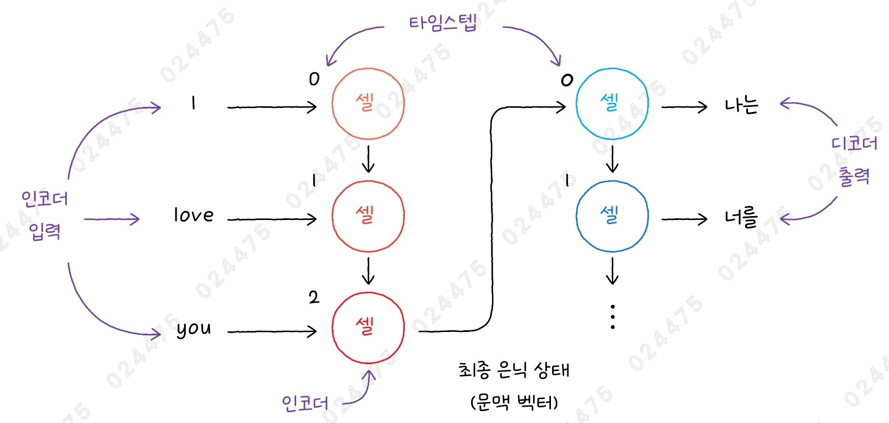

- 인코더 RNN: 먼저 입력된 문장을 처리하여 최종 은닉 상태(hidden state) 또는 문맥 벡터(context vector)를 만듦
  - 문장의 중요 정보가 담긴 일종의 요약본이라 할 수 있음
- 디코더 RNN: 인코더로부터 받은 문맥 벡터를 사용해 새로운 문장, 즉 번역된 문장을 생성함
- 하지만, 인코더에 입력되는 텍스트가 길수록 중요한 단어와 덜 중요한 단어가 섞여 있어, 문백 벡터만으로는 오래된 단어의 정보를 기억하기가 힘듦
  - 이유: 그레이디언트가 여러 타임스텝에 걸쳐 전파되면서 점점 약해지기 때문

### 어텐션 메커니즘

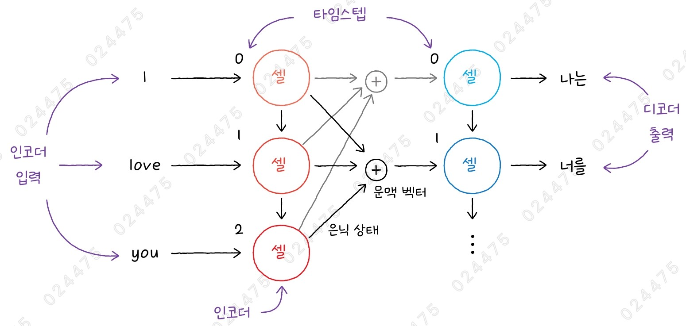

- Attention Mechanism
- 인코더-디코더 순환 신경망을 사용하던 기계 번역의 성능을 높이기 위해 2014년에 처음 고안됨
- 인코더의 마지막 타임스텝에서 얻은 은닉 상태뿐만 아니라, 인코더의 모든 은닉 상태를 디코더가 텍스트를 생성할 때마다 참고하도록 함
- 문장에서 특히 중요한 단어들에 더 집중하도록 도와줌으로써 번역의 정확도를 높임
- 디코더는 번역 문장을 만들 때 어떤 단어에 주의(어텐션)를 기울여야 할지 결정함
- 어텐션 메커니즘이 발표된 후, LSTM(Long Short-Term Memory)이나 GRU(Gated Recurrent Unit)층을 사용하는 순환 신경망에 어텐션을 추가하는 형태로 발전함
- 하지만, 순환 신경망을 사용하기 때문에 여전히 입력되는 텍스트를 순차적으로 처리해야하는 단점이 있었음

#### 어텐션 메커니즘의 문맥 벡터 수식

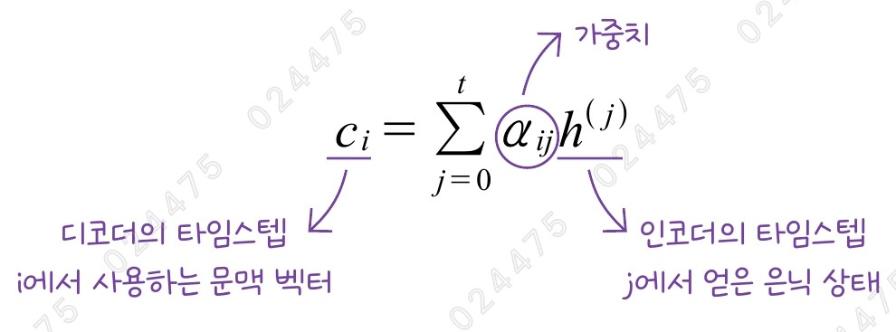

- 디코더에서 사용하는 문맥 벡터는 인코더가 각 타임스텝에서 생성하는 모든 은닉 상태의 가중치 합임
- 디코더는 인코더의 은닉 상태에 곱해지는 가중치인 $α_{ij}$를 통해 어떤 은닉 상태, 즉 어떤 단어에 주의를 기울일지를 결정할 수 있음
- 가중치 $α_{ij}$에서 인코더의 출력과 디코더의 은닉 상태를 더하는지 곱하는지에 따라 각각 덧셈 어텐션, 점곱 어텐션으로 부름
  - 케라스에서는 이 두 가지 방식의 어텐션 모두 layers.Attention 클래스로 제공함
  - score_mode 매개변수에서 'dot'(기본값)을 지정하면 점곱 어텐션을 수행
  - score_mode 매개변수에서 'concat'을 지정하고, use_scale 매개변수에서 'True'로 지정하면 덧셈 어텐션을 수행

##### 1. 덧셈 어텐션

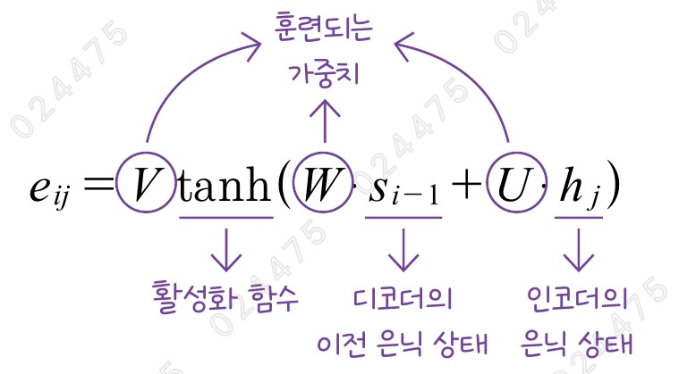
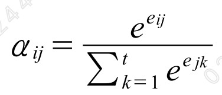

- 인코더의 은닉 상태와 디코더의 은닉 상태를 더하는 어텐션
- $e_{ij}$의 결과를 소프트맥스 함수에 통과시켜 $α_{ij}$의 값을 얻을 수 있음
  - 인코더의 각 은닉 상태에 대한 가중치 $α_{ij}$를 모두 더하면 1이 됨
- 논문 발표자 이름을 따서 바흐다나우 어텐션(Bahdanau attention)이라고 부르기도 하고, 연결 어텐션이라고도 부름

##### 2. 점곱 어텐션

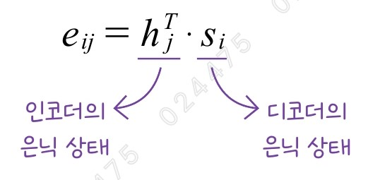

- 인코더의 은닉 상태와 디코더의 은닉 상태를 곱하는 어텐션
- 논문 발표자의 이름을 따서 루옹 어텐션(luong attention)이라고도 부름

### 트랜스포머

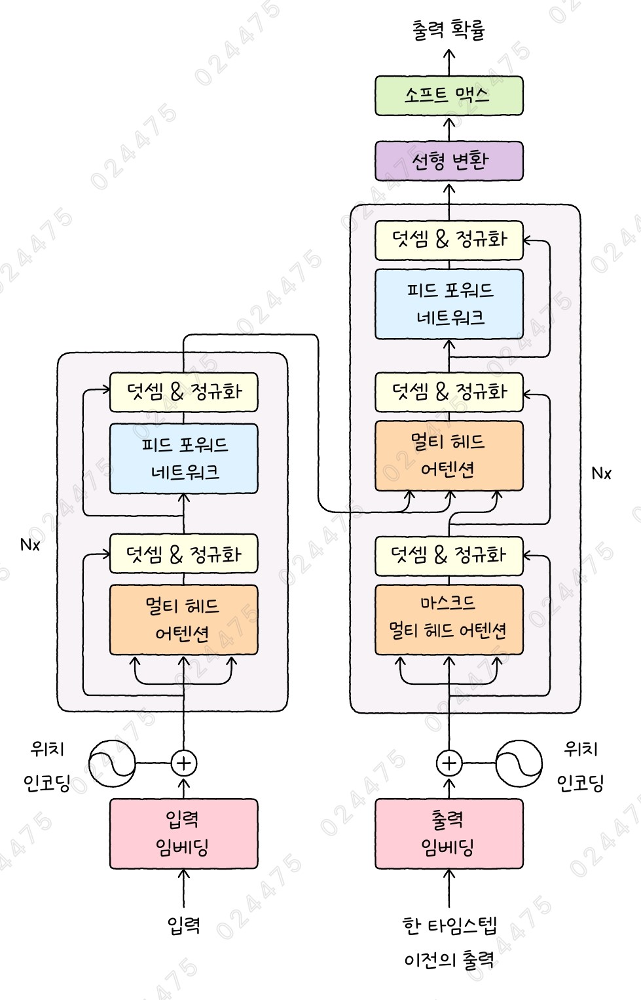

- Transformer
- 2017년에 순환 신경망 없이 어텐션만으로 만든 인코더-디코더 트랜스포머 모델이 등장함
- 순환 신경망의 순차적인 처리 방식과는 달리, 모든 데이터를 동시에(병렬로) 처리해 RNN보다 훨씬 빠르고 효율적으로 학습할 수 있음
- 기존의 어텐션 메커니즘을 하나의 텍스트 시퀀스에 적용시킨 셀프 어텐션을 사용함

### 셀프 어텐션

- 기본 어텐션 메커니즘: 입력된 문장을 처리한 인코더의 은닉 상태와 다음 단어를 출력하기 위한 디코더의 은닉 상태를 비교해 어떤 단어가 가장 중요한지를 나타내는 어텐션 점수를 계산함
- 트랜스포머: 인코더에서 입력 토큰을 임베딩한 벡터만으로 어텐션 점수를 계산함
  - 입력 토큰: 모델에 입력하려는 텍스트를 잘게 나눈 단위를 말하며, 일반적으로 하나의 단어는 한 개 이상의 토큰으로 나뉨
  - 임베딩: 신경망이 토큰을 처리할 수 있도록 고정 크기의 벡터로 변환한 것
- 디코더의 은닉 상태 없이 입력 토큰만으로 어텐션 점수를 계산하기 때문에 셀프 어텐션이라도 부름
- 입력된 문장 속 단어들이 서로 얼마나 중요한지를 계산하는 과정이라고 할 수 있음
- 셀프 어텐션은 스케일드 점곱 어텐션이라는 방식을 사용해, 각각의 단어가 다른 단어들과 얼마나 관련이 있는지를 계산함

#### 스케일드 점곱 어텐션

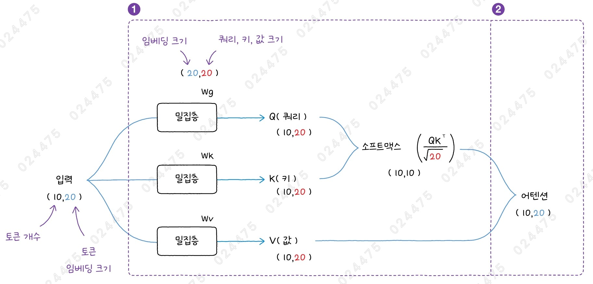

- Scaled Dot-product Attention

1. 입력을 세 개의 다른 벡터로 변환

   - 먼저, 입력 토큰의 임베딩을 세 개의 서로 다른 밀집층에 통과시켜 쿼리(query), 키(key), 값(value) 벡터로 만듦
   - 쿼리: 이 단어가 어떤 정보를 찾고 있는지를 나타냄 (계산의 기준)
   - 키: 가지고 있는 정보가 무엇인지를 나타냄 (비교의 기준)
   - 값: 이 정보를 제공하면 어떤 결과가 나오는지를 나타냄 (실제 정보의 내용)
   - 일반적으로 쿼리, 키, 값의 길이는 토큰 임베딩의 길이와 동일함
   - 쿼리, 키, 값을 만들기 위한 밀집층의 가중치 $W_q$, $W_k$, $W_v$는 모두 훈련될 때 역전파를 통해 학습되는 파라미터임
   - 이 가중치를 통해 입력 토큰에서 어떤 단어에 주목할지를 결정하는 데 도움을 주는 어텐션 점수를 계산할 수 있음

2. 벡터 간 관계(유사도) 및 최종 결과 계산
   - 각각의 벡터들이 얼마나 관련이 있는지를 계산하기 위해 쿼리, 키에 대한 점곱을 수행하고, 임베딩 길이의 제곱곤으로 나눠 스케일링함
   - 그리고 각 단어에 계산된 중요도를 확률처럼 확인할 수 있도록 소프트맥트 함수에 통과시켜 합이 1이 되도록 어텐션 점수를 정규화함
   - 마지막으로, 계산된 어텐션 점수와 값 벡터를 곱하면 각 단어의 중요도를 기반으로 새로운 벡터가 만들어짐

#### 1. 셀프 어텐션을 만들어보자

```py
import keras
from keras import layers

def self_attention(inputs, att_dim):
    # (n_batch, n_token, embed_dim) --> (n_batch, n_token, att_dim)
    query = layers.Dense(att_dim)(inputs)
    key = layers.Dense(att_dim)(inputs)
    value = layers.Dense(att_dim)(inputs)
    # score: (n_batch, n_token, n_token)
    key_t = keras.ops.transpose(k, axes=(0, 2, 1))
    query_key_dot = keras.ops.matmul(query, key_t) / keras.ops.sqrt(att_dim)
    score = keras.activations.softmax(query_key_dot)
    # (n_batch, n_token, att_dim)
    return keras.ops.matmul(score, value)
```

- `keras.ops`: 넘파이, 선형대수 연산 등 딥러닝 모델을 만들 때 편리하게 사용할 수 있는 딥러닝 연산 함수를 제공함
- (n_batch, n_token, embed_dim) 크기의 inputs를 3개의 Dense 층에 통과시켜 (n_batch, n_token, att_dim) 크기의 쿼리, 키, 값을 만듦
  - 각 Dense 층에는 (embed_dim, att_dim) 크기의 가중치와 (att_dim) 크기의 절편이 있음
- `transpose()` 함수: 요소의 위치를 바꿔 줌
  - axes=(0, 2, 1)로 지정해 배치 차원을 제외하고 나머지 두 차원을 바꿔줌
- `matmul()` 함수: 행렬 곱셈 함수

### 멀티 헤드 어텐션

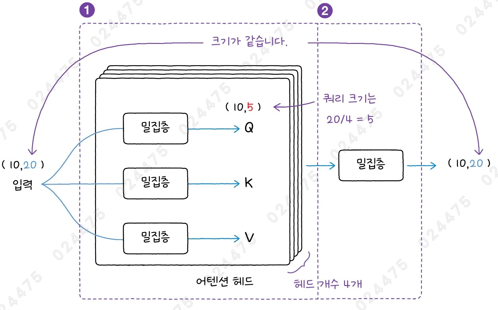

- Multi-Head Attention
- 여러 개의 셀프 어텐션 (어텐션 헤드)
- 여러 개의 어텐션 헤드를 실행해 서로 다른 관점에서 단어 간의 중요도를 계산해 문장의 의미를 더 깊게 이해할 수 있음

1. 어텐션 계산

   - 각각의 헤드가 독립적으로 셀프 어텐션을 실행하고, 각 헤드에서 계산된 출력을 하나로 연결함
   - 멀티 헤드 어텐션에서 쿼리, 키, 값의 크기는 입력의 크기를 헤드 개수로 나눈 값을 사용하는 경우가 많음

2. 최종 변환
   - 하나로 연결된 멀티 헤드 어텐션의 결과를 밀집층에 통과시켜 원본 임베딩 크기로 변환함

#### 1. 멀티 헤드 어텐션을 만들어보자

```py
inputs = keras.Input(shape=(10, 20))
x = layers.MultiHeadAttention(num_heads=4, key_dim=5)(query=inputs,
                                                      value=inputs)
model = keras.Model(inputs, x)
```

- `MultiHeadAttention` 클래스: 멀티 헤드 어텐션 기능을 제공
  - query 매개변수에 쿼리, value 매개변수에 값을 전달해야 함
  - 셀프 어텐션은 한 시퀀스 안에 있는 토큰 사이의 관계를 분석하기 위해 쿼리와 값에 동일한 값을 사용함
  - value 매개변수에 전달된 값을 키로 사용하지만, key 매개변수에 별도로 지정할 수도 있음
- `num_heads` 매개변수: 어텐션 헤드의 개수를 지정
- `key_dim` 매개변수: 키 벡터의 차원을 결정
  - 쿼리와 값의 크기는 키의 크기와 동일하게 설정됨
  - 일반적으로 쿼리, 키, 값의 크기는 입력 크기를 헤드 개수로 나눈 값을 사용함
- `value_dim` 매개변수: 값 벡터의 차원을 따로 지정

#### 2. 멀티 헤드 어텐션의 구조를 확인해보자

```py
model.summary()
```


1. 어텐션 계산 단계

   - 쿼리, 키, 값을 만들기 위한 밀집층의 가중치는 (20, 5) 크기임
   - 파라미터 = ((20 x 5 + 5) x 3) x 4개의 헤드 = 1,260개

2. 최종 변환 단계
   - (10, 5) 크기의 어텐션 헤드 4개의 출력을 연결한 (10, 20) 크기의 입력을 받아 (10, 20) 크기의 출력을 만드는 밀집층을 통과함
   - 따라서 밀집층의 가중치는 (20, 20) 크기임
   - 파라미터 = 20 x 20 + 20 = 420개

## 2️⃣ 위치 인코딩과 층 정규화

- 셀프 어텐션은 입력 토큰 사이의 중요도를 감지하는데 뛰어난 역할을 하지만, 순환 신경망처럼 토큰이 순서대로 입력되지 않기 때문에 토큰과 토큰 사이의 거리를 감지하지 못함
  - 따라서, 문장의 순서를 이해하는 과정이 필요 (by 위치 인코딩)
- 어텐션 메커니즘의 밀집층에서 연산 과정을 반복하다 보면 계산된 값이 너무 커지거나 작아질 수 있음
  - 따라서, 모델을 안정적으로 학습하는 과정이 필요 (by 층 정규화)

### 순서 정보 더하기 - 위치 인코딩

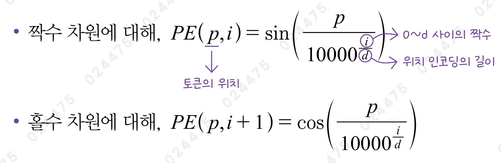

- Positional Encoding (PE)
- 단어의 순서에 대한 정보를 보완하기 위해 토큰 임베딩에 추가하는 값
- 삼각함수를 사용해 토큰의 위치 정보를 만들 수 있음
- 삼각함수를 사용하면 벡터화된 위치를 쉽게 계산할 수 있고, 삼각함수의 주기적이고 매끄러운 패턴을 이용해 위치의 연관성을 자연스럽게 나타낼 수 있음
- 짝수 위치에는 sin 함수를 사용하고, 홀수 위치에는 cos 함수를 사용함
- 토큰 임베딩에 위치 인코딩을 더하기 때문에, 위치 인코딩 길이 d는 일반적으로 토큰 임베딩의 길이와 같음

#### 1. 위치 인코딩을 만들어보자

```py
import numpy as np
import matplotlib.pyplot as plt

d = 500
n_token = 200
pos_encoding = np.zeros((d, n_token))
for p in range(n_token):
    for i in range(0, d, 2):
        pos_encoding[i, p] = np.sin(p/10000**(i/d))
        pos_encoding[i+1, p] = np.cos(p/10000**(i/d))

plt.figure(figsize=(10, 3))
plt.imshow(pos_encoding, interpolation="quadric", aspect="auto")
plt.axis([0, n_token, 0, 200])
plt.xlabel('token position')
plt.ylabel('position encoding')
plt.colorbar()
plt.show()
```


- pos_encoding 배열을 `imshow()` 함수로 출력하면 -1~1 사이의 인코딩 값을 색으로 구분할 수 있음
  - `interpolation` 매개변수: 픽셀 사이의 보간 방식을 정의
  - `aspect` 매개변수: 'auto'로 지정하면 figure 함수에서 정의한 그래프 크기에 맞춰 자동으로 이미지를 늘림
- `colorbar()` 함수: 색깔의 강도에 따른 값의 크기를 표시
- 실행 결과를 보면, 0~200까지의 토큰이 모두 다른 위치 인코딩을 가지는 것을 알 수 있음

### 위치 임베딩

- Positional Embedding
- 훈련을 통해 정수 위치에 해당하는 인코딩을 모델이 학습하는 방법

#### 1. 위치 임베딩을 만들어보자

```py
vocab_size = 10000  # 어휘 사전 크기
embed_dim = 768     # 임베딩의 크기
max_seq_len = 512   # 입력 시퀀스의 최대 길이

inputs = keras.Input(shape=(None,))
token_embedding = layers.Embedding(vocab_size, embed_dim)(inputs)
token_pos = keras.ops.arange(n_token)
pos_embedding = layers.Embedding(max_seq_len, embed_dim)(token_pos)
encoder_inputs = token_embedding + pos_embedding
```

- 입력 토큰의 길이만큼 정수 인덱스를 생성한 후, `layers.Embedding` 클래스로 토큰 위치를 위치 임베딩으로 변환함
- 토큰 임베딩과 위치 임베딩을 더해 최종 입력을 준비할 수 있음

### 훈련 안정화하기 - 층 정규화

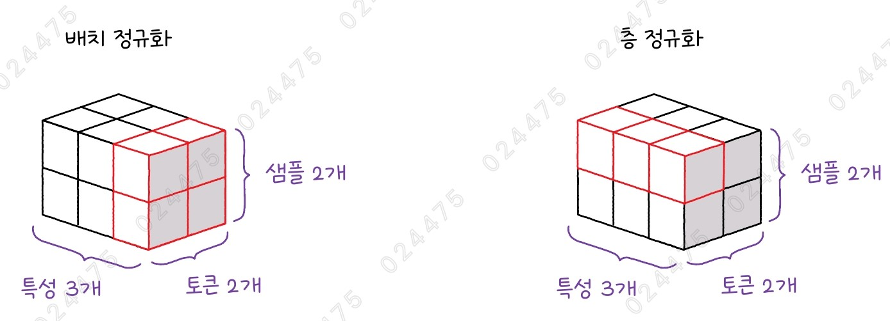

- Layer Normalization
- 입력 데이터가 신경망의 여러 층을 통과하면서 틀어지는 데이터 분포를 다시 정규화함으로써 훈련의 안정성과 속도를 높일 수 있음
- 배치 정규화: 배치 단위로 각 층의 출력(특성)을 정규화함
- 층 정규화: 배치 단위가 아니라 각 샘플의 특성을 정규화함
  - 텍스트 시퀀스에 있는 토큰마다 정규화

#### 1. (2, 2, 3) 크기의 샘플 데이터를 만들어보자

```py
data = np.arange(12, dtype="float32").reshape(2, 2, 3)
print(data)
"""
[[[ 0.  1.  2.]
  [ 3.  4.  5.]]

 [[ 6.  7.  8.]
  [ 9. 10. 11.]]]
"""
```

#### 2. 배치 정규화층을 사용해 샘플 데이터를 처리해보자

```py
batchnorm = layers.BatchNormalization()
print(batchnorm(data, training=True).numpy())
"""
[[[-1.3415811  -1.3415811  -1.3415811 ]
  [-0.44719368 -0.44719374 -0.44719374]]

 [[ 0.44719374  0.44719374  0.44719374]
  [ 1.3415811   1.341581    1.3415812 ]]]
"""

temp = np.array([0, 3, 6, 9])
(temp - np.mean(temp)) / (np.sqrt(np.var(temp) + 1e-3))
# array([-1.34158116, -0.44719372,  0.44719372,  1.34158116])
```

- BatchNormalization 클래스는 훈련할 때만 샘플 간의 평균과 분산을 계산하므로 `training` 매개변수를 True로 설정함
  - 이 매개변수를 지정하지 않으면 평균을 0, 분산을 1로 사용하여 정규화를 수행함
- 실행 결과를 보면, 0, 3, 6, 9가 -1.34, -0.45, 0.45, 1.34로 변환된 것을 알 수 있음
- 즉, 모든 샘플과 모든 토큰에 있는 첫 번째 특성을 정규화함

#### 3. 층 정규화층을 사용해 샘플 데이터를 처리해보자

```py
layernorm = layers.LayerNormalization()
print(layernorm(data).numpy())
"""
[[[-1.2238274  0.         1.2238274]
  [-1.2238274  0.         1.2238274]]

 [[-1.2238274  0.         1.2238274]
  [-1.2238274  0.         1.2238274]]]
"""

temp = np.array([0, 1, 2])
(temp - np.mean(temp)) / (np.sqrt(np.var(temp) + 1e-3))
# array([-1.22382734,  0.        ,  1.22382734])
```

- 실행 결과를 보면, 0, 1, 2가 -1.22, 0, 1.22로 변환된 것을 알 수 있음

## 3️⃣ 트랜스포머 인코더 모델 만들기

### 패딩 토큰

- Padding Token
- 입력 데이터의 길이를 동일하게 맞추기 위해 추가하는 빈자리 표시
- 패딩 토큰은 의미가 없는 빈자리를 나타내므로, 어텐션 계산에서 제외되어야 함
- 따라서, 모델을 구현할 때는 패딩 토큰을 무시하는 표시인 `padding_mask`를 지정함
- padding_mask: 입력된 문장에서 유효한 단어를 1로, 패딩 토큰을 0으로 나타내 패딩 토큰을 무시하도록 패딩 토큰의 위치를 알려주는 마스크(mask)
- 모델은 padding_mask를 통해 패딩 토큰을 무시하게 되고, 실제로 의미 있는 단어들만 학습하게 됨

### 트랜스포머 인코더

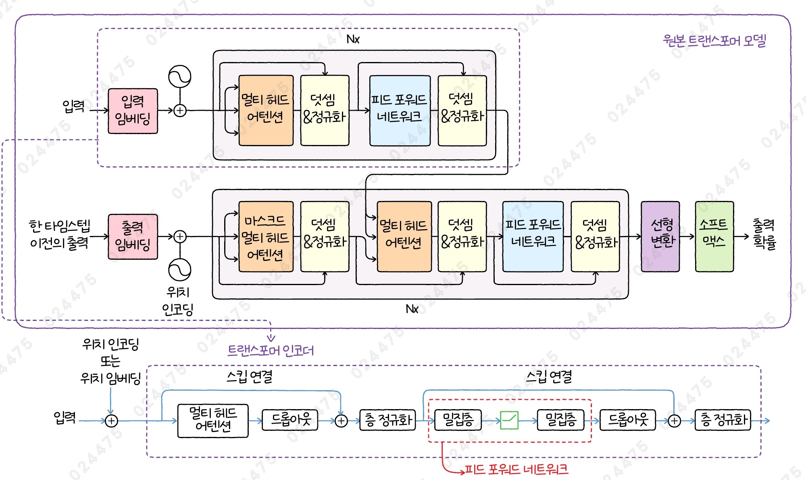

- 멀티 헤드 어텐션층 다음에는 과대적합을 막기 위해 훈련 단계에서 뉴런의 일부를 무작위로 비활성화하는 드롭아웃층이 놓임
  - 어텐션 드롭아웃: 어텐션층에서 적용한 드롭아웃
- 드롭아웃층의 출력은 어텐션의 입력과 더해져(스킵 연결) 층 정규화를 통과함
- 그리고, 위치별 피드 포워드 네트워크라고 부르는 두 개의 밀집층을 지남
- 이어서 드롭아웃층을 지나 스킵 연결을 통과한 다음, 층 정규화를 적용해 인코더의 최종 출력을 만듦
  - 잔차 드롭아웃: 스킵 연결 직전에 통과하는 드롭아웃

#### 위치별 피드 포워드 네트워크

- Position-wise Feed-forward Network
- 그냥 피드 포워드 네트워크라고 부르기도 함
- 원본 트랜스포머 모델은 첫 번째 밀집층의 유닛 개수를 임베딩 벡터의 4배로 두고, 두 번째 밀집층의 유닛 개수는 4배로 줄여 원래 임베딩 벡터 크기로 되돌림

1. 첫 번째 밀집층

   - 입력 벡터의 차원을 확장하는 단계
   - 렐루 활성화 함수를 사용함

2. 두 번째 밀집층
   - 다시 원래의 임베딩 차원으로 축소하는 단계
   - 활성화 함수를 사용하지 않음

#### 1. 트랜스포머 인코더 모듈을 만들어보자

```py
# x는 토큰 임베딩과 위치 임베딩을 더한 값입니다.
def transformer_encoder(x, padding_mask, dropout, activation='relu'):
    residual = x
    key_dim = hidden_dim // num_heads
    # 멀티 헤드 어텐션을 통과합니다.
    x = layers.MultiHeadAttention(num_heads, key_dim, dropout=dropout)(
        query=x, value=x, attention_mask=padding_mask)
    x = layers.Dropout(dropout)(x)
    # 스킵 연결
    x = x + residual
    x = layers.LayerNormalization()(x)
    residual = x
    # 위치별 피드 포워드 네트워크
    x = layers.Dense(hidden_dim * 4, activation=activation)(x)
    x = layers.Dense(hidden_dim)(x)
    x = layers.Dropout(dropout)(x)
    # 스킵 연결
    x = x + residual
    x = layers.LayerNormalization()(x)
    return x
```

- 임베딩 벡터 크기 == 임베딩 크기 == 은닉 크기
- 패딩 토큰을 무시하도록 하기 위해 `attention_mask` 매개변수에 padding_mask를 전달함
