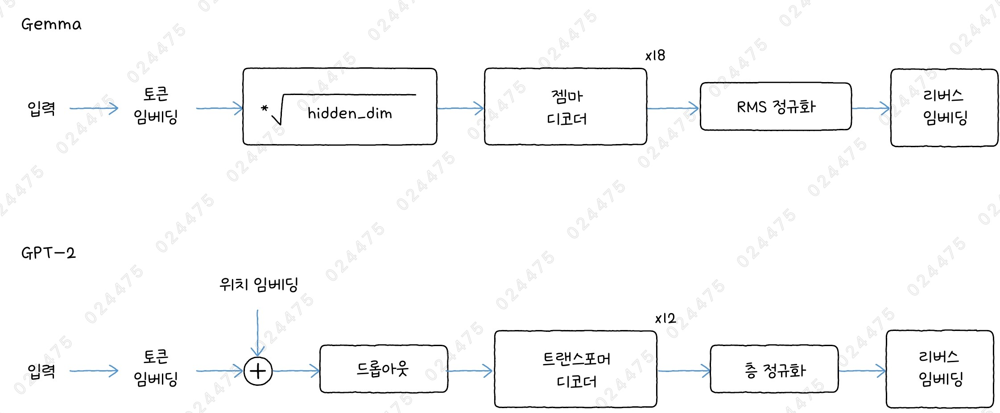
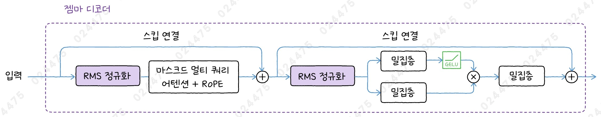
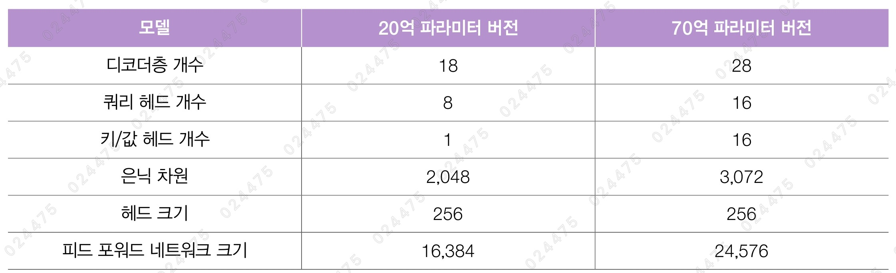
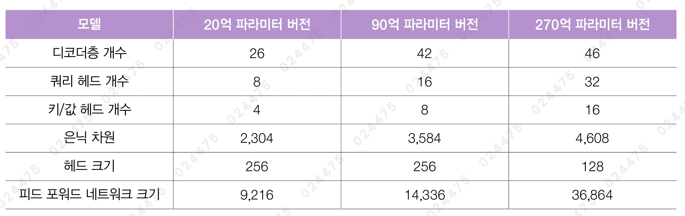
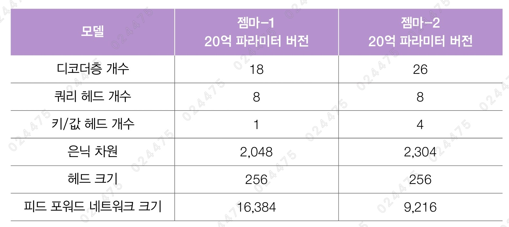
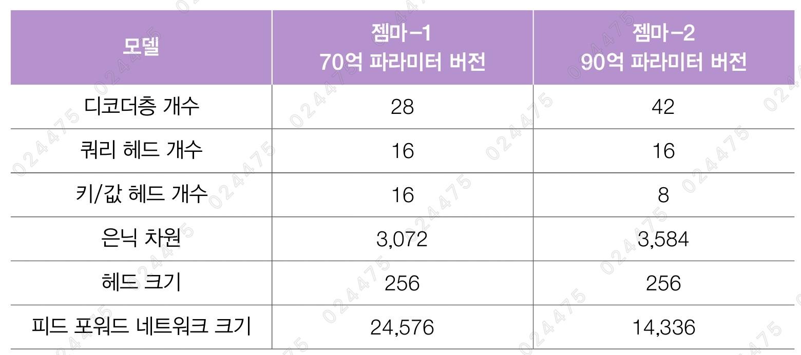
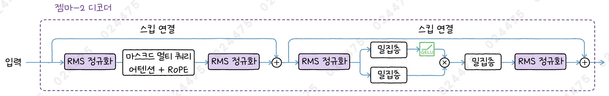

# ✔ Gemma 모델로 텍스트 생성하기

> ['Gemma 모델로 텍스트 생성하기' 구글 코랩](https://colab.research.google.com/github/rickiepark/hm-dl/blob/main/05-3-gemma.ipynb)

> ['Gemma 모델로 텍스트 생성하기-ko' 구글 코랩](https://colab.research.google.com/github/rickiepark/hm-dl/blob/main/05-3-gemma-ko.ipynb)

## 1️⃣ Gemma 모델 이해하기

- 2024년 2월에 공개됨
- 20억, 70억 파라미터 버전의 모델이 있음
  - 각각 3조 개, 6조 개의 토큰을 사용해 훈련함
- 문맥 길이: 8,192
- 어휘사전의 크기: 256,128
- 센텐스피스 토크나이저를 사용
- 로터리 위치 임베딩을 사용
- 20억 파라미터 버전은 멀티 쿼리 어텐션, 70억 파라미터 버전은 멀티 헤드 어텐션을 사용함

### Gemma 구조



- GPT-2처럼 마지막 출력층에 임베딩층의 가중치를 재사용함
- 디코더 블록을 반복하기 전, 토큰 임베딩에 은닉 차원의 제곱근을 곱함
- RMS 정규화를 사용
  - 라마의 경우, 감마 파라미터에 해당하는 스케일 가중치를 1로 초기화함
  - 젬마의 경우, 스케일 가중치를 0으로 초기화하는 대신 스케일 가중치를 적용할 때 1을 더함

### Gemma 디코더



- 피드 포워드 네트워크에 GELU 함수를 사용하는 GeGLU 함수를 적용함

### Gemma 버전



- 일반적으로 트랜스포머 디코더 모델은 쿼리, 키, 값의 헤드 크기를 설정할 때 은닉 차원을 헤드 개수로 나눈 값으로 함
- 하지만, 70억 버전의 젬마는 기존 계산식에 따라 헤드 크기를 계산하면 3072/16 = 192지만, 256으로 설정함

## 2️⃣ KerasNLP로 Gemma 모델 만들기

#### 1. Gemma 디코더를 만들자

```py
from keras_nlp.src.models.gemma.gemma_attention import CachedGemmaAttention
from keras_nlp.src.models.gemma.rms_normalization import RMSNormalization

def gemma_decoder(x, padding_mask, num_query_heads, num_key_value_heads,
                  interm_dim, hidden_dim, head_dim):
    # 어텐션 마스크를 계산합니다.
    attention_mask = AttentionMask()(padding_mask)
    # 스킵 연결을 준비합니다.
    residual = x
    x = RMSNormalization()(x)
    # 멀티 헤드 어텐션을 통과합니다.
    gemma_attention = CachedGemmaAttention(head_dim=head_dim,
                                           num_query_heads=num_query_heads,
                                           num_key_value_heads=num_key_value_heads,
                                           dropout=0.0)
    x = gemma_attention(x, attention_mask)
    # 스킵 연결
    x = x + residual
    # 스킵 연결을 준비합니다.
    residual = x
    # 위치별 피드 포워드 네트워크
    x = RMSNormalization()(x)
    x1 = layers.Dense(interm_dim // 2, activation='gelu', use_bias=False)(x)
    x2 = layers.Dense(interm_dim // 2, use_bias=False)(x)
    x = x1 * x2
    x = layers.Dense(hidden_dim, use_bias=False)(x)
    # 스킵 연결
    x = x + residual
    return x
```

#### 2. 20억 파라미터 버전의 Gemma 모델을 위한 모델 파라미터를 정의하자

```py
# Gemma 2B
vocab_size = 256000
num_layers = 18
num_query_heads = 8
num_key_value_heads = 1
interm_dim = 32768
hidden_dim = 2048
head_dim = 256
```

#### 3. Gemma 모델을 만들어보자

```py
from keras_nlp.layers import ReversibleEmbedding

token_ids = keras.Input(shape=(None,))
padding_mask = keras.Input(shape=(None,))

token_embedding_layer = ReversibleEmbedding(vocab_size, hidden_dim)
x = token_embedding_layer(token_ids)
x = layers.Lambda(lambda x: x * keras.ops.sqrt(hidden_dim))(x)

for _ in range(num_layers):
    x = gemma_decoder(x, padding_mask, num_query_heads, num_key_value_heads,
                      interm_dim, hidden_dim, head_dim)

x = RMSNormalization()(x)
outputs = token_embedding_layer(x, reverse=True)
model = keras.Model(inputs=(token_ids, padding_mask),
                    outputs=(outputs))
```

- `layers.Lambda` 클래스: 임의의 함수를 케라스층으로 만들어 줌

#### 4. 모델의 구조를 확인해보자

```py
model.summary(line_length=100)
```


## 3️⃣ Gemma 모델로 텍스트 생성하기

- 젬마 모델을 사용하려면 먼저 사용 허가를 요청해야함
- 젬마는 라마와 달리 구글에 따로 사용 허가를 받지 않고 캐글에서만 신청하면 됨

### Gemma 모델로 텍스트 생성하기

#### 1. kaggle 디렉토리로 kaggle.json 파일을 옮기자

```
!mkdir ~/.kaggle/
!mv kaggle.json ~/.kaggle/
```

#### 2. KerasNLP에서 gemma_2b 모델을 로드하자

```py
gemma = keras_nlp.models.GemmaCausalLM.from_preset('gemma_2b_en')
```

#### 3. 모델의 구조를 확인해보자

```py
gemma.summary()
```


#### 4. gemma_2b 모델을 사용해 텍스트를 생성해보자

```py
sampler = keras_nlp.samplers.TopPSampler(p=0.8, seed=42)
gemma.compile(sampler=sampler)
gemma.generate('stay hungry, stay', max_length=20)
"""
stay hungry, stay foolish! This legendary t-shirt design was born from the conception of taking
"""
```

```py
gemma.generate('봄이 오면', max_length=20)
"""
봄이 오면 녹아 쓴다. 밤이 오면 더 쓴
"""
```

- 젬마의 훈련 데이터 대부분은 영어지만, 다국어도 일부 포함되어 있음

#### 5. 허깅페이스에서 gemma-ko-2b 모델을 로드한 후, 한글 프롬프트를 넣어 텍스트를 생성해보자

```py
from transformers import pipeline, set_seed

gemma_pipe = pipeline("text-generation", model="beomi/gemma-ko-2b")

set_seed(42)
gemma_pipe('봄이 오면', max_length=20, truncation=True)
"""
[{'generated_text': '봄이 오면서 겨울이 빨리 지나가는 것 같아'}]
"""
```

- gemma-ko-2b 모델: 젬마를 한국어 데이터로 미세 튜닝한 모델

## 4️⃣ Gemma-2 모델로 텍스트 생성하기

- 2024년 10월에 공개됨
- 20억, 90억, 270억 파라미터 버전의 모델이 있음
- 젬마-2의 기본적인 구조와 구성 요소는 젬마-1과 같음

### Gemma-2 버전



- 모든 버전이 그룹 쿼리 어텐션을 사용함
- 쿼리 헤드와 키/값 헤드의 비율을 일정하게 두 배로 유지함
- 피드 포워드 네트워크 크기는 젬마-1에 비해 크게 줄음
- 젬마-2는 피드 포워드 네트워크의 크기를 지정할 때 2로 나누지 않음

#### 20억 파라미터 버전



- 은닉 차원은 거의 비슷함
- 디코더 층을 18개에서 26개로 늘림
- 젬마-1은 멀티 쿼리 어텐션을 사용했지만, 젬마-2는 그룹 쿼리 어텐션을 사용함

#### 90억 파라미터 버전



- 젬마-1에 비해 키/값 헤드 개수가 절반으로 줄어듦
- 피드 포워드 네트워크 크기도 절반 가까이 줄어듦
- 은닉 차원은 소폭 증가함
- 디코더층의 개수가 28개에서 42개로 크게 늘림

#### 270억 파라미터 버전

- 90억 파라미터 버전보다 쿼리 헤드와 키/값 헤드 개수가 모두 두 배 증가함
- 헤드 크기는 절반으로 줄어듦
- 디코더층을 더 많이 쌓고, 은닉 차원의 크기도 증가함
- 피드 포워드 네트워크의 크기도 두 배 이상 증가함

### Gemma-2 디코더



- RMS 정규화를 어텐션 블록과 피드 포워드 네트워크 전후에 모두 적용함
  - 어텐션 블록과 피드 포워드 네트워크의 입력과 출력을 모두 정규화함으로써 훈련의 안정성을 높임
- 젬마-2의 어텐션에는 슬라이딩 윈도 어텐션이라는 기법이 적용됨

#### 슬라이딩 윈도 어텐션

- Sliding Window Attention
- 현재 토큰을 중심으로 윈도 크기만큼 주변의 토큰만 어텐션 계산에 참여하는 방법
- 젬마-2에서 사용하는 슬라이딩 윈도의 크기는 모델의 파라미터 크기에 상관없이 모두 4,096임
- 장점: 어텐션 계산에 필요한 메모리를 줄이고, 계산 속도를 높일 수 있음

### Gemma-2 모델 만들기

#### 1. Gemma-2 디코더를 만들자

```py
from keras_nlp.src.models.gemma.gemma_attention import CachedGemmaAttention
from keras_nlp.src.models.gemma.rms_normalization import RMSNormalization

def gemma2_decoder(x, padding_mask, num_query_heads, num_key_value_heads,
                  interm_dim, hidden_dim, head_dim):
    # 어텐션 마스크를 계산합니다.
    attention_mask = AttentionMask()(padding_mask)
    # 스킵 연결을 준비합니다.
    residual = x
    x = RMSNormalization()(x)
    # 멀티 헤드 어텐션을 통과합니다.
    gemma_attention = CachedGemmaAttention(head_dim=head_dim,
                                           num_query_heads=num_query_heads,
                                           num_key_value_heads=num_key_value_heads,
                                           use_sliding_window_attention=True,
                                           dropout=0.0)
    x = gemma_attention(x, attention_mask)
    # 포스트 정규화
    x = RMSNormalization()(x)
    # 스킵 연결
    x = x + residual
    # 스킵 연결을 준비합니다.
    residual = x
    # 위치별 피드 포워드 네트워크
    x = RMSNormalization()(x)
    x1 = layers.Dense(interm_dim, activation='gelu', use_bias=False)(x)
    x2 = layers.Dense(interm_dim, use_bias=False)(x)
    x = x1 * x2
    x = layers.Dense(hidden_dim, use_bias=False)(x)
    # 포스트 정규화
    x = RMSNormalization()(x)
    # 스킵 연결
    x = x + residual
    return x
```

- `use_sliding_window_attention` 매개변수: True이면, 슬라이딩 윈도 어텐션 기법을 수행
- `sliding_window_size` 매개변수: 슬라이딩 윈도의 크기
  - 기본값: 4,096

#### 2. 20억 파라미터 버전의 Gemma2 모델을 위한 모델 파라미터를 정의하자

```py
# Gemma2 2B
vocab_size = 256000
num_layers = 26
num_query_heads = 8
num_key_value_heads = 4
interm_dim = 9216
hidden_dim = 2304
head_dim = 256
```

#### 3. Gemma2 모델을 만들어보자

```py
from keras_nlp.layers import ReversibleEmbedding

token_ids = keras.Input(shape=(None,))
padding_mask = keras.Input(shape=(None,))

token_embedding_layer = ReversibleEmbedding(vocab_size, hidden_dim)
x = token_embedding_layer(token_ids)
x = layers.Lambda(lambda x: x * keras.ops.sqrt(hidden_dim))(x)

for _ in range(num_layers):
    x = gemma2_decoder(x, padding_mask, num_query_heads, num_key_value_heads,
                      interm_dim, hidden_dim, head_dim)

x = RMSNormalization()(x)
outputs = token_embedding_layer(x, reverse=True)
model = keras.Model(inputs=(token_ids, padding_mask),
                    outputs=(outputs))
```

#### 4. 모델의 구조를 확인해보자

```py
model.summary(line_length=100)
```


### Gemma-2 모델로 텍스트 생성하기

#### 1. kaggle 디렉토리로 kaggle.json 파일을 옮기자

```
!mkdir ~/.kaggle/
!mv kaggle.json ~/.kaggle/
```

#### 2. KerasNLP에서 gemma2_2b 모델을 로드하자

```py
gemma = keras_nlp.models.GemmaCausalLM.from_preset('gemma2_2b_en')
```

#### 3. gemma2_2b 모델을 사용해 텍스트를 생성해보자

```py
sampler = keras_nlp.samplers.TopPSampler(p=0.8, seed=42)
gemma.compile(sampler=sampler)
gemma.generate('봄이 오면', max_length=20)
"""
봄이 오면 많은 사람들이 물론 대부분 자외선 차단제를
"""
```

### cf) PaliGemma

- 2024년 5월, 12월에 PaliGemma와 PaliGemma2를 공개함
- 젬마 기반의 멀티 모달 모델
- 이미지를 입력한 후, 이에 대해 질문할 수 있음
- 영문은 물론 한국어에서도 높은 성능을 보여줌

### cf) Gemma-3

- 2025년 3월에 공개함
- 10억, 40억, 120억, 270억 파라미터 버전의 모델이 있음
- 10억 파라미터 버전을 제외한 나머지 모겔 전부 멀티 모달 모델임
