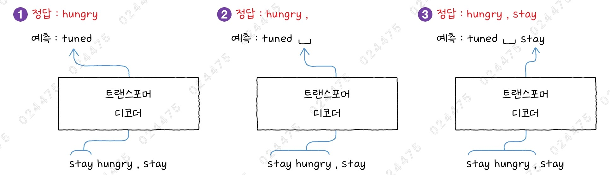
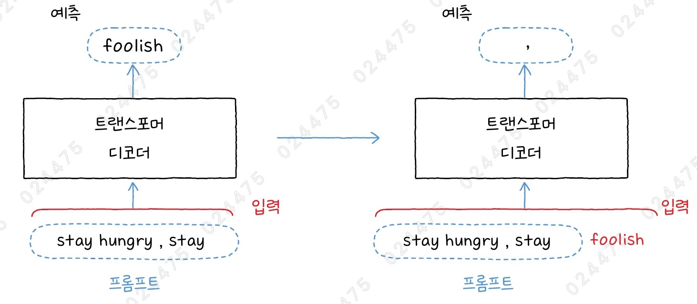
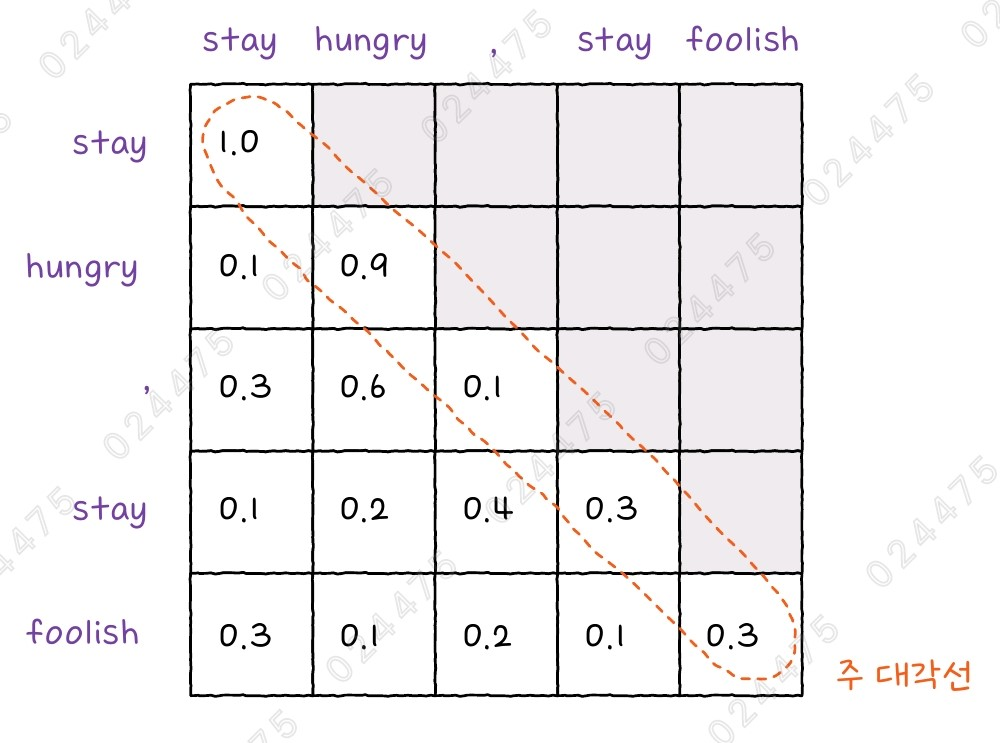
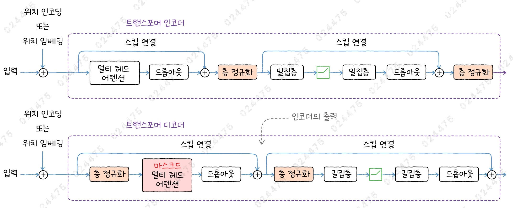
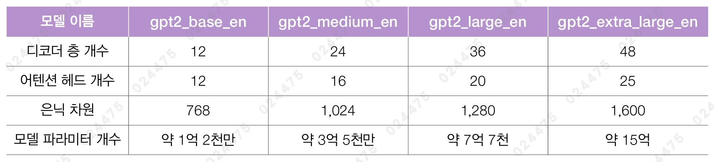
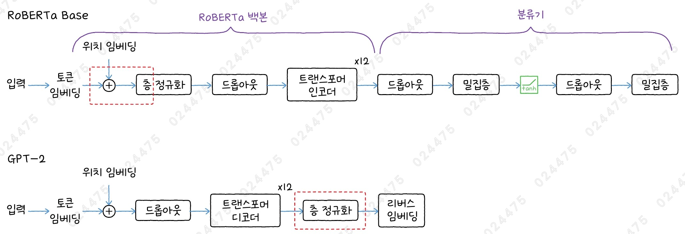

# ✔ GPT-2 모델로 텍스트 생성하기

> ['GPT-2 모델로 텍스트 생성하기' 구글 코랩](https://colab.research.google.com/github/rickiepark/hm-dl/blob/main/05-1.ipynb)

## 1️⃣ 마스크드 멀티 헤드 어텐션

- 트랜스포머 디코더 모델은 프롬프트가 입력되면 프롬프트 다음에 등장할 토큰을 생성하는 역할을 함
  - 프롬프트(prompt): 다음 단어를 예측하기 위한 최초의 입력 텍스트
- 따라서, 모델을 훈련할 때의 타깃은 입력되는 텍스트 데이터의 다음 토큰이 됨

### 자기지도 학습



- Self-Supervised Learning
- 코잘 언어 모델링(Causal Language Modeling)이라고도 부름
- 텍스트 생성 모델인 트랜스포머 디코더 모델이 입력 텍스트의 다음 토큰을 타깃으로 사용하는 훈련 방식
  - 예측한 단어와 정답인 단어의 차이가 손실이 되고, 이 손실을 통해 모델의 가중치를 학습함
  - 훈련 과정에서 모델이 이전 단계에 예측한 단어를 모델의 입력으로 사용하지 않음
- 자기지도 학습을 사용하면 훈련 데이터를 레이블링하는 수고를 들이지 않고도 많은 양의 텍스트 데이터로부터 대규모 언어 모델을 훈련할 수 있음
- 이때, 모델이 훈련 과정 중에 입력에 있는 다음 토큰을 훔쳐봐서는 안됨

### 자기회귀 모델



- Auto-Regressive Model
- 트랜스포머 디코더 기반의 모델을 훈련할 때는 정답 텍스트가 있었기 때문에 예측된 토큰 대신 정답 토큰을 입력으로 사용해 다음 토큰을 예측함
- 하지만, 훈련된 모델로 새로운 텍스트를 생성할 때는 정답 텍스트가 없기 때문에 초기 프롬프트에서 다음 토큰을 예측하고, 이를 다시 프롬프트에 이어 붙인 후, 그 다음 단어를 예측하는 식으로 반복됨 (자기회귀 모델)

### 마스크드 멀티 헤드 어텐션



- Masked Multi-Head Attention
- 어텐션 점수를 계산할 때 현재 토큰에서 미래의 토큰을 바라보지 못하도록 마스킹해 학습을 제한함
- 위 5x5 크기의 어텐션 행렬은 셀프 어텐션 계산식의 쿼리와 키를 곱한 결과로, (n_token, n_token) 크기의 행렬임
- 이 어텐션 행렬에서 주 대각선 윗부분의 점수를 가리면, 'hungry' 토큰을 처리할 때 그 다음에 나오는 ',', 'stay', 'foolish' 토큰에 대한 점수를 사용할 수 없음
- 케라스 `MultiHeadAttention` 클래스의 `attention_mask` 매개변수에 이러한 마스킹 정보를 전달하기만 하면 자동으로 마스크드 멀티 헤드 어텐션이 수행됨
  - 이 마스킹을 코잘 마스킹(causal masking)이라고 부름

### attention_mask에 패딩 마스크와 코잘 마스킹을 함께 전달하기

#### 1. 코잘 마스킹을 만드는 함수를 정의해보자

```py
import keras
from keras import layers
import keras_nlp

def make_causal_mask(seq_len):
    n_hori = keras.ops.arange(seq_len)
    n_vert = keras.ops.expand_dims(n_hori, axis=-1)
    mask = n_vert >= n_hori
    return mask
```

- 코잘 마스킹은 입력되는 토큰의 값과 무관하며, 토큰의 길이에 따라 달라짐
  - ex) 입력되는 토큰의 개수가 10개이면 (10, 10) 크기의 마스크 행렬을 만들어야 함
- `expand_dims()` 함수로 마지막 차원을 추가하면, (seq_len, ) 크기의 1차원 텐서가 (seq_len, 1) 크기의 2차원 텐서로 바뀜
- n_vert와 n_hori 텐서에 비교 연산자를 적용해, n_hori가 n_vert의 각 원소와 비교 연산을 함

#### 2. 길이가 5인 토큰 시퀀스를 위한 코잘 마스킹 행렬을 만들어보자

```py
causal_mask = make_causal_mask(5)
causal_mask
"""
<tf.Tensor: shape=(5, 5), dtype=bool, numpy=
array([[ True, False, False, False, False],
       [ True,  True, False, False, False],
       [ True,  True,  True, False, False],
       [ True,  True,  True,  True, False],
       [ True,  True,  True,  True,  True]])>
"""
```

#### 3. 코잘 마스킹 행렬에 토큰 개수가 3인 패딩 마스크를 합쳐보자

```py
padding_mask = [1, 1, 1, 0, 0]
keras.ops.minimum(causal_mask, padding_mask)
"""
<tf.Tensor: shape=(5, 5), dtype=int32, numpy=
array([[1, 0, 0, 0, 0],
       [1, 1, 0, 0, 0],
       [1, 1, 1, 0, 0],
       [1, 1, 1, 0, 0],
       [1, 1, 1, 0, 0]], dtype=int32)>
"""
```

- `keras.ops.minimum()` 함수는 causal_mask의 불리언 값을 정수 1과 0으로 변환하여 각 행마다 padding_mask와 비교함

#### 4. 패딩 마스크와 코잘 마스킹을 합친 어텐션 마스크를 만드는 함수를 정의해보자

```py
def make_attention_mask(padding_mask):
    # padding_mask 크기가 (2, 5)라고 가정해 보죠.
    batch_size, seq_len = keras.ops.shape(padding_mask)
    # causal_mask 크기는 (5, 5)가 됩니다.
    causal_mask = make_causal_mask(seq_len)
    # 배치 차원을 추가해 (2, 5, 5)로 만듭니다.
    causal_mask = keras.ops.broadcast_to(causal_mask, (batch_size, seq_len, seq_len))
    # 브로드캐스팅을 위해 padding_mask 크기를 (2, 1, 5)로 만듭니다.
    padding_mask = keras.ops.expand_dims(padding_mask, axis=1)
    return keras.ops.minimum(causal_mask, padding_mask)
```

#### 4. make_attention_mask 함수를 테스트 해보자

```py
make_attention_mask([[1, 1, 0, 0, 0], [1, 1, 1, 1, 0]])
"""
<tf.Tensor: shape=(2, 5, 5), dtype=int32, numpy=
array([[[1, 0, 0, 0, 0],
        [1, 1, 0, 0, 0],
        [1, 1, 0, 0, 0],
        [1, 1, 0, 0, 0],
        [1, 1, 0, 0, 0]],

       [[1, 0, 0, 0, 0],
        [1, 1, 0, 0, 0],
        [1, 1, 1, 0, 0],
        [1, 1, 1, 1, 0],
        [1, 1, 1, 1, 0]]], dtype=int32)>
"""
```

## 2️⃣ 트랜스포머 디코더 모듈 만들기



- 인코더와 달리, 디코더는 층 정규화가 스킵 연결 시작 부분으로 옮겨왔고 멀티 헤드 어텐션이 아닌 마스크드 멀티 헤드 어텐션으로 구성됨
  - 사실, 트랜스포머 인코더에서도 층 정규화를 스킵 연결 시작 부분에 둘 수 있고, 반대로 트랜스포머 디코더에서도 층 정규화를 드롭아웃 다음에 둘 수 있음
- 원본 트랜스포머 모델처럼 인코더-디코더 구조에서 사용될 때와 달리, 디코더 전용 모델에서는 인코더의 입력을 받아 처리하는 곳이 없음
- 인코더와 마찬가지로, 디코더의 피드 포워드 네트워크도 두 개의 밀집층으로 구성됨
  - 첫 번쨰 밀집층의 유닛 개수는 은닉 차원으 4배이고, 활성화 함수로는 렐루 함수를 기본으로 사용함
  - 렐루 함수의 변종인 GELU 함수도 많이 사용됨

#### 1. AttentionMask 클래스를 만들자

```py
class AttentionMask(keras.Layer):
    def call(self, padding_mask):
        return make_attention_mask(padding_mask)
```

- 아쉽게도 현재 케라스에서 입력 텐서에 대해 keras.ops 연산자를 사용하는 경우 사용자 정의층을 만들어야 함
- make_attention_mask() 함수를 사용해 케라스 모델을 만들려면 위와 같이 keras.Layer 클래스를 상속하는 AttentionMask 클래스를 만들어야 함

#### 2. 트랜스포머 디코더 모듈을 만들자

```py
def transformer_decoder(x, padding_mask, dropout,
                        activation='relu', norm_first=True):
    # 어텐션 마스크를 계산합니다.
    attention_mask = AttentionMask()(padding_mask)
    # 스킵 연결을 준비합니다.
    residual = x
    key_dim = hidden_dim // num_heads
    if norm_first:
        x = layers.LayerNormalization()(x)
    # 멀티 헤드 어텐션을 통과합니다.
    x = layers.MultiHeadAttention(num_heads, key_dim, dropout=dropout)(
        query=x, value=x, attention_mask=attention_mask)
    x = layers.Dropout(dropout)(x)
    # 스킵 연결
    x = x + residual
    if not norm_first:
        x = layers.LayerNormalization()(x)
    # 스킵 연결을 준비합니다.
    residual = x
    # 위치별 피드 포워드 네트워크
    if norm_first:
        x = layers.LayerNormalization()(x)
    x = layers.Dense(hidden_dim * 4, activation=activation)(x)
    x = layers.Dense(hidden_dim)(x)
    x = layers.Dropout(dropout)(x)
    # 스킵 연결
    x = x + residual
    if not norm_first:
        x = layers.LayerNormalization()(x)
    return x
```

- MultiHeadAttention 클래스의 attention_mask 매개변수에 패딩 마스크와 코잘 마스킹을 합친 attention_mask를 입력했음

## 3️⃣ GPT-2 모델로 텍스트 생성하기

### OpenAI GPT 시리즈

1. GPT-1

   - 2018년에 발표됨
   - 북코퍼러스 데이터셋을 사용해 훈련됨
   - 12개의 헤드를 가진 멀티 헤드 어텐션층으로 구성된 트랜스포머 디코더 12개를 쌓음
   - 은닉 차원: 768
   - 어휘사전 크기: 40,478
   - 최대 입력 토큰의 길이: 512개

2. GPT-2

   - 2019년에 발표됨
   - GPT-1에 비해 모델 크기와 데이터셋을 크게 확장함
   - 레딧 사이트에서 적어도 세 번의 추천을 받은 링크를 대상으로 직접 인터넷 문서를 스크래핑함 (WebText, 약 40GB)
   - GPT-1과 달리 층 정규화를 스킵 연결 시작 부분으로 옮김
   - 어휘사전 크기: 50,257
   - 최대 입력 토큰의 길이: 1,024개

3. 이후 모델
   - 오픈 소스로 공개하지 않고 있음
   - chatgpt.com과 API를 통해서만 GPT 후속 모델을 사용할 수 있음

### GPT-2 버전



- 최대 1,024개의 토큰을 입력으로 받을 수 있기 때문에, 생성되는 텍스트도 최대 1,024개 토큰이 됨
- 바이트 수준의 BPE 토크나이저를 사용함

### GPT-2 구조



- RoBERTa와 달리, 임베딩 직후에 놓여 있던 층 정규화가 디코더 뒤쪽으로 이동함
- 분류기 대신 토큰 임베딩층을 뒤집어 어휘사전 크기에 해당하는 출력을 만듦 (리버스 임베딩)

### GPT-2 모델 만들기

#### 1. gpt2_base 모델을 위한 모델 파라미터를 정의하자

```py
# GPT-2
vocab_size = 50257
num_layers = 12
num_heads = 12
hidden_dim = 768
dropout = 0.1
activation = 'gelu'
max_seq_len = 1024
```

#### 2. gpt2_base 모델을 만들자

```py
token_ids = keras.Input(shape=(None,))
padding_mask = keras.Input(shape=(None,))

token_embedding_layer = keras_nlp.layers.ReversibleEmbedding(vocab_size, hidden_dim)
token_embedding = token_embedding_layer(token_ids)
pos_embedding = keras_nlp.layers.PositionEmbedding(max_seq_len)(token_embedding)

x = token_embedding + pos_embedding
x = layers.Dropout(dropout)(x)
for _ in range(num_layers):
    x = transformer_decoder(x, padding_mask, dropout, activation)

x = layers.LayerNormalization()(x)
outputs = token_embedding_layer(x, reverse=True)
model = keras.Model(inputs=(token_ids, padding_mask),
                    outputs=(outputs))
```

- `ReversibleEmbedding` 층: 모델의 마지막 부분에서 768 차원의 출력을 어휘사전 크기에 해당하는 50,257 차원으로 바꿔줌
  - 이 차원을 따라 가장 큰 값을 갖는 위치가 다음 토큰의 인덱스가 됨

#### 3. 모델의 구조를 확인해보자

```py
model.summary()
```


- 이 모델의 파라미터 개수는 약 1억 2천만 개임

### GPT-2 모델로 텍스트 생성하기

#### 1. KerasNLP에서 gpt2_base 모델을 로드해보자

```py
gpt2 = keras_nlp.models.GPT2CausalLM.from_preset('gpt2_base_en')
```

#### 2. 모델의 구조를 확인해보자

```py
gpt2.summary()
```


#### 3. gpt2_base 모델을 사용해 텍스트 생성을 해보자

```py
gpt2.generate('stay hungry, stay', max_length=6)
"""
stay hungry, stay thirsty
"""
```

- `generate()` 메서드: 텍스트를 생성해 줌

#### 4. max_length를 늘려 조금 더 긴 텍스트 생성을 해보자

```py
gpt2.generate('stay hungry, stay', max_length=20)
"""
stay hungry, stay healthy and stay healthy

Stay healthy is a good idea. It helps
"""
```

#### 5. GPT-2 모델의 토크나이저를 사용해 문자열을 전처리해보자

```py
inputs, target, mask = gpt2.preprocessor('stay hungry, stay', sequence_length=10)
inputs, target, mask
"""
({'token_ids': <tf.Tensor: shape=(10,), dtype=int32, numpy=
  array([50256, 31712, 14720,    11,  2652, 50256,     0,     0,     0,
             0], dtype=int32)>,
  'padding_mask': <tf.Tensor: shape=(10,), dtype=bool, numpy=
  array([ True,  True,  True,  True,  True,  True, False, False, False,
         False])>},
 <tf.Tensor: shape=(10,), dtype=int32, numpy=
 array([31712, 14720,    11,  2652, 50256,     0,     0,     0,     0,
            0], dtype=int32)>,
 <tf.Tensor: shape=(10,), dtype=bool, numpy=
 array([ True,  True,  True,  True,  True, False, False, False, False,
        False])>)
"""
```

- `preprocessor` 객체가 호출될 때 반환하는 값은 모델 훈련에 사용할 수 있는 입력, 타깃, 패딩 마스크임
- 맨 처음 등장하는 시작 토큰의 다음 토큰부터 타깃으로 사용되기 때문에 target은 아이디가 50256인 첫 번째 토큰을 건너뛰고 31712부터 시작됨
- token_ids의 시작과 끝 토큰이 50256으로 같은데, 이는 GPT-2가 시작 토큰과 종료 토큰을 '<|endoftext|>' 토큰 하나로 표시하기 때문임

#### 6. 토큰 아이디를 토큰 문자열로 바꿔 보자

```py
gpt2_tokenizer = gpt2.preprocessor.tokenizer
for ids in target:
    print(gpt2_tokenizer.id_to_token(ids), end=' ')
# stay Ġhungry , Ġstay <|endoftext|> ! ! ! ! !
```

#### 7. 생성 모델로 사용할 때의 전처리기를 사용해 동일한 문자열을 다시 전처리해보자

```py
inputs = gpt2.preprocessor.generate_preprocess(['stay hungry, stay'], sequence_length=10)
inputs
"""
{'token_ids': <tf.Tensor: shape=(1, 10), dtype=int32, numpy=
 array([[50256, 31712, 14720,    11,  2652,     0,     0,     0,     0,
             0]], dtype=int32)>,
 'padding_mask': <tf.Tensor: shape=(1, 10), dtype=bool, numpy=
 array([[ True,  True,  True,  True,  True, False, False, False, False,
         False]])>}
"""
```

- `generate_preprocess` 메서드는 배치 입력을 기대하기 때문에 하나의 문자열도 리스트로 감싸서 전달해야 함
- preprocessor 객체를 바로 호출했을 때와 달리, 토큰 아이디에 종료 토큰이 들어 있지 않음
  - 이유: 텍스트 생성을 위해 텍스트를 이어가야 하기 때문

#### 8. 전처리한 문자열을 바탕으로 텍스트를 생성해보자

```py
outputs = gpt2.generate_function(inputs)
outputs
"""
{'token_ids': <tf.Tensor: shape=(1, 10), dtype=int32, numpy=
 array([[50256, 31712, 14720,    11,  2652,  5448,    11,   290,  2652,
           287]], dtype=int32)>,
 'padding_mask': <tf.Tensor: shape=(1, 10), dtype=bool, numpy=
 array([[ True,  True,  True,  True,  True,  True,  True,  True,  True,
          True]])>}
"""
```

#### 9. 토큰 아이디를 토큰 문자열로 변환해보자

```py
gpt2.preprocessor.generate_postprocess(outputs)
# ['stay hungry, stay healthy, and stay in']
```

- 앞서 gpt2 객체의 `generate()` 메서드의 주요 역할은 `generate_preprocess()`, `generate_function()`, `generate_postprocess()` 3개의 메서드를 차례대로 호출하는 것임

## 4️⃣ 다양한 텍스트 생성하기 - 토큰 샘플링

- Token Sampling
- KerasNLP의 언어 모델은 로짓(logit)을 출력하고, 샘플러(sampler) 클래스가 소프트맥스 함수를 사용해 로짓을 확률로 바꾼 다음 샘플링을 수행함
  - GPT-2 모델에서 마지막 층의 출력 차원은 어휘사전 크기에 해당하는 50,257개임
  - 50,257개의 확률 값 중에서 어떤 것을 고를지 정하는 방법은 여러 가지임
- 단순히 가장 높은 확률을 가진 토큰을 뽑는다면 너무 밋밋하고 재미없는 텍스트가 만들어지기 때문에, 창의적인 문장을 생성하기 위해 토큰 샘플링 방식이 고안됨
- 사용하는 샘플링 방식에 따라 생성되는 텍스트의 품질과 다양성이 크게 달라질 수 있음

  1. top-k 샘플링, top-p 샘플링
  2. 그리디 샘플링, 랜덤 샘플링
  3. 빔 샘플링, 대조 샘플링

### top-k 샘플링

- gpt2 객체의 기본 샘플링 방식은 top-k 샘플링임
- KerasNLP의 top-k 샘플링은 기본적으로 가장 높은 확률을 가진 5개의 후보를 뽑고, 확률에 비례하여 랜덤하게 하나를 선택함
- 이때, 온도 파라미터로 확률을 조정한 다음 top-k 샘플링을 적용함
  - 온도 기본값: 1.0

#### 1. 온도를 0.5로 낮춘 top-k 샘플링을 사용해 텍스트를 생성해보자

```py
sampler = keras_nlp.samplers.TopKSampler(k=10, temperature=0.5, seed=42)
gpt2.compile(sampler=sampler)
gpt2.generate('stay hungry, stay', max_length=20)
"""
stay hungry, stay thirsty, stay thirsty, stay thirsty, stay thirsty, stay thirsty, stay
"""
```

- `TopKSampler` 클래스: top-k 샘플링을 수행
- `k` 매개변수: 가장 높은 확률을 가진 토큰 선택 개수
- `temperature` 매개변수: 온도 파라미터
- `seed` 매개변수: 실행할 때마다 동일한 결과가 나오도록 난수 발생
- 온도를 낮추면 토큰 간의 확률 차이가 더 극명하게 나타나므로, 단조롭고 자연스럽지 못한 문장이 생성될 수 있음

#### 2. 온도를 5로 높인 top-k 샘플링을 사용해 텍스트를 생성해보자

```py
sampler = keras_nlp.samplers.TopKSampler(k=10, temperature=5, seed=42)
gpt2.compile(sampler=sampler)
gpt2.generate('stay hungry, stay', max_length=20)
"""
stay hungry, stay fit. I know you'll be disappointed at our current state of food choices
"""
```

- 온도 파라미터를 높었더니 훨씬 자연스러운 문장이 생성됨

### top-p 샘플링

- 뉴클리어 샘플링(nucleus sampling)이라고도 부름
- 사전에 지정한 확률 p가 될 때까지 확률 순서대로 토큰을 뽑음
- 이러한 토큰 중 확률을 기반으로 랜덤하게 출력 토큰을 선택함
- 따라서, 새로운 토큰을 생성할 때마다 고려하는 토큰의 개수가 달라짐

#### 1. 누적 확률을 80%로 둔 top-p 샘플링을 사용해 텍스트를 생성해보자

```py
sampler = keras_nlp.samplers.TopPSampler(p=0.8, seed=42)
gpt2.compile(sampler=sampler)
gpt2.generate('stay hungry, stay', max_length=20)
"""
stay hungry, stay tired and you can always check your inbox at 8am.\n\n–
"""
```

- `TopPSampler` 클래스: top-p 샘플링을 수행
- `p` 매개변수: 토큰을 선택할 확률의 임곗값 지정
  - 기본값: 0.1

#### 2. k와 온도 파라미터를 지정한 후, top-p 샘플링을 사용해 텍스트를 생성해보자

```py
sampler = keras_nlp.samplers.TopPSampler(p=0.8, k=1000, temperature=5, seed=42)
gpt2.compile(sampler=sampler)
gpt2.generate('stay hungry, stay', max_length=20)
"""
stay hungry, stay exposed hot guys reeeeeie fer cant lay outside whats de eye old ro
"""
```

- `k` 매개변수: 누적 확률 p 안에 포함되는 토큰을 모두 고를 때 k개 이상은 선택하지 않게함
  - 이로 인해, 너무 많은 토큰이 선택되어 속도가 느려지는 것을 막을 수 있음
  - 기본값: None (누적 확률 p에 도달할 때까지 토큰을 선택함)
- `temperature` 매개변수: 온도 파라미터

#### 3. 기본 매개변수를 가진 top-p 샘플링을 사용해 텍스트를 생성해보자

```py
gpt2.compile(sampler='top_p')
gpt2.generate('stay hungry, stay', max_length=20)
"""
stay hungry, stay thirsty, stay thirsty, stay thirsty, stay thirsty, stay thirsty, stay
"""
```

- compile() 메서드의 sampler 매개변수를 'top-p'로 지정하면 기본 매개변수를 가진 top-p 샘플링을 사용할 수 있음

### 그리디 샘플링

- Greedy Sampling
- 무조건 가장 높은 확률을 가진 토큰을 선택하는 샘플링 방식
- 마치 k가 1인 top-k 샘플링을 사용하는 것과 같음

#### 1. 그리디 샘플링을 사용해 텍스트를 생성해보자

```py
gpt2.compile(sampler='greedy')
gpt2.generate('stay hungry, stay', max_length=20)
"""
stay hungry, stay thirsty, stay thirsty, stay thirsty, stay thirsty, stay thirsty, stay
"""
```

- `GreedySampler` 클래스가 있지만 별도의 매개변수를 지정할 필요가 없어, compile() 메서드의 sampler 매개변수에 'greedy'로 지정함
- 그리디 샘플링은 항상 가장 높은 확률의 토큰을 선택하기 때문에 단조로운 문장을 생성하기가 쉬움

### 랜덤 샘플링

- Random Sampling
- k가 어휘사전의 크기와 같은 top-k 샘플링과 같음
- 즉, 전체 토큰 중에서 확률을 기반으로 랜덤하게 하나의 토큰을 선택함

#### 1. 온도를 5로 높인 랜덤 샘플링을 사용해 텍스트를 생성해보자

```py
sampler = keras_nlp.samplers.RandomSampler(temperature=5, seed=42)
gpt2.compile(sampler=sampler)
gpt2.generate('stay hungry, stay', max_length=20)
"""
stay hungry, stay "(mob]-lining Often log freight seatedlarg freshwater brass advocate Miracle Lenabound
"""
```

- `RandomSampler` 클래스: 랜덤 샘플링을 수행
- `temperature` 매개변수: 온도 파라미터
- 토큰을 무작위로 선택해 다양성을 높이지만, 문맥에 적합한 문장을 만드는 게 실패할 가능성이 높음

### 빔 샘플링

- Beam Sampling
- 빔 검색(beam search)을 사용한 샘플링 방식
- 지금까지 매 단계마다 생성한 토큰의 확률과 곱했을 때 가장 높은 확률을 만드는 b개의 토큰을 선택하여 다음 토큰을 만듦
- 토큰 생성이 끝날 때까지 빔 검색 결과를 확장한 다음, 생성한 토큰의 확률 곱이 가장 높은 문장을 최종 출력함

#### 1. 빔 개수와 온도를 높인 빔 샘플링을 사용해 텍스트를 생성해보자

```py
sampler = keras_nlp.samplers.BeamSampler(num_beams=10, temperature=5)
gpt2.compile(sampler=sampler)
gpt2.generate('stay hungry, stay', max_length=20)
"""
stay hungry, stay hydrated stay hydrated\n\nStay hydrated stay hydrated\n\n
"""
```

- `BeamSampler` 클래스: 빔 샘플링을 수행
- `num_beams` 매개변수: 빔 개수
  - 기본값: 5
  - 1이면, 그리디 샘플링과 같은 결과를 내게 됨
- 빔의 개수를 늘리는 것이 텍스트 생성에 도움이 될 수 있지만, 여러 경로를 탐색해야 하기 때문에 실행 속도가 느려짐

### 대조 샘플링

- Contrastive Sampling
- 대조 검색(contrastive search)을 사용한 샘플링 방식
- 후보 토큰의 확률과 이전 토큰과의 유사도를 합하여 다음 토큰을 선택함

#### 1. alpha 값을 낮춘 대조 샘플링을 사용해 텍스트를 생성해보자

```py
sampler = keras_nlp.samplers.ContrastiveSampler(k=5, alpha=0.2)
gpt2.compile(sampler=sampler)
gpt2.generate('stay hungry, stay', max_length=20)
"""
stay hungry, stay thirsty, stay thirsty, stay thirsty, stay thirsty, stay thirsty, stay
"""
```

- `ContrastiveSampler` 클래스: 대조 샘플링을 수행
- `alpha` 매개변수: '후보 토큰의 확률'과 '이전 토큰과의 유사도' 두 점수에 가중치를 부여함
  - 0~1 사이의 값
  - 0에 가까우면 토큰의 확률에 초점을 맞춤
  - 1에 가까우면 이전 토큰과의 유사도에 큰 비중을 둠
  - 1에 가까울수록 유사도가 적은 토큰이 유리해지기 때문에 반복적인 텍스트가 생성되는 것을 방지함

#### 2. alpha 값을 높인 대조 샘플링을 사용해 텍스트를 생성해보자

```py
sampler = keras_nlp.samplers.ContrastiveSampler(k=5, alpha=0.8)
gpt2.compile(sampler=sampler)
gpt2.generate('stay hungry, stay', max_length=20)
"""
stay hungry, stay thirsty\n\n\nA lot has changed in the last few years. The number
"""
```

## 5️⃣ 허깅페이스로 다양한 텍스트 생성하기

#### 1. 허깅페이스에서 gpt1 모델을 로드해보자

```py
from transformers import pipeline, set_seed

set_seed(42)
hf_gpt1 = pipeline('text-generation', model='openai-community/openai-gpt')
```

- `set_seed()` 함수: 함수의 실행을 반복할 때마다 동일한 텍스트를 생성하도록 난수 시드 값을 제공함

#### 2. gpt1 모델을 사용해 텍스트를 생성해보자

```py
hf_gpt1('stay hungry, stay', max_length=20, truncation=True)
"""
[{'generated_text': 'stay hungry, stay clean - if our families don\'t come back, " i finished. " of'}]
"""
```

- `truncation` 매개변수: 기본값인 False로 지정하면, 종료 토큰이 생성될 때까지 텍스트를 자르지 않음
  - 하지만, max_length 매개변수를 지정하는 경우, 일정 길이의 텍스트가 되면 텍스트 생성을 중단하기 때문에 truncation 매개변수를 True로 지정하라는 경고가 발생함

#### 3. 한 번에 여러 개의 문장을 생성해보자

```py
set_seed(42)
hf_gpt1('stay hungry, stay', max_length=20, truncation=True, num_return_sequences=3)
"""
[{'generated_text': 'stay hungry, stay clean - if our families don\'t come back, " i finished. " of'},
 {'generated_text': "stay hungry, stay alive, but i don't feel like i should have to take food from you"},
 {'generated_text': 'stay hungry, stay busy, and keep the heat off while you enjoy it. " \n " i'}]
"""
```

- `num_return_sequences` 매개변수: 한 번에 생성할 문장 개수 지정

#### 4. GPT-2 모델과 토크나이저를 로드해보자

```py
from transformers import AutoTokenizer, AutoModelForCausalLM

hf_gpt2_tokenizer = AutoTokenizer.from_pretrained("gpt2")
hf_gpt2 = AutoModelForCausalLM.from_pretrained("gpt2")
```

- `AutoTokenizer` 클래스: 토크나이저를 로드해 줌
- `AutoModelForCausalLM` 클래스: 모델을 로드해 줌

#### 5. GPT-2 모델의 토크나이저를 사용해 문자열을 전처리해보자

```py
prep_data= hf_gpt2_tokenizer('stay hungry, stay', return_tensors='pt')
prep_data
"""
{'input_ids': tensor([[31712, 14720,    11,  2652]]), 'attention_mask': tensor([[1, 1, 1, 1]])}
"""
```

- input_ids와 attention_mask 값을 반환함
- `return_tensors` 매개변수: 'pt'로 지정하면 파이토치 텐서로 토큰 값을 반환 받음
- 이후에 사용할 텍스트를 생성하는 `generate()` 메서드가 입력으로 텐서를 기대하기 때문에 파이토치 텐서로 토큰 값을 받음

#### 6. 전처리한 문자열을 바탕으로 텍스트를 생성해보자

```py
set_seed(42)
outputs = hf_gpt2.generate(**prep_data, max_length=20)
outputs
"""
tensor([[31712, 14720,    11,  2652, 47124,    11,  2652, 47124,    11,  2652,
         47124,    11,  2652, 47124,    11,  2652, 47124,    11,  2652, 47124]])
"""
```

- `generate()` 메서드에 토크나이저에서 반환된 input_ids와 attention_mask 값을 전달함
- `max_length` 매개변수: 생성할 최대 토큰 개수 지정

#### 7. 토큰 아이디를 문자열로 바꿔보자

```py
hf_gpt2_tokenizer.batch_decode(outputs)
"""
['stay hungry, stay thirsty, stay thirsty, stay thirsty, stay thirsty, stay thirsty, stay thirsty']
"""
```

- `batch_decode()` 메서드: 토큰 아이디를 문자열로 바꿔줌
  - convert_ids_to_tokens()와 convert_tokens_to_string() 메서드의 역할을 하나로 합친 메서드임
- generate() 메서드는 기본적으로 그리디 샘플링을 수행하기 때문에, 단조로운 문장이 생성된 것을 볼 수 있음

### top-k와 top-p 샘플링으로 텍스트 생성하기

#### 1. top-k 샘플링을 사용해 텍스트를 생성해보자

```py
set_seed(42)
outputs = hf_gpt2.generate(**prep_data, max_length=20,
                           do_sample=True)
hf_gpt2_tokenizer.batch_decode(outputs)
"""
['stay hungry, stay quiet, stay in the dark, stay in a situation, stay in front of']
"""
```

- `do_sample` 매개변수: 샘플링 여부를 결정
  - 기본값: False (그리디 샘플링을 수행)
  - True로 지정하면 top-k 샘플링을 수행함

#### 2. k 값은 낮추고 온도는 높인 top-k 샘플링을 사용해 텍스트를 생성해보자

```py
set_seed(42)
outputs = hf_gpt2.generate(**prep_data, max_length=20,
                           do_sample=True, top_k=5, temperature=5.0)
hf_gpt2_tokenizer.batch_decode(outputs)
"""
['stay hungry, stay clean, eat fresh. The best part? They are all here! They have']
"""
```

- `top_k` 매개변수: 가장 높은 확률을 가진 토큰 선택 개수
  - 기본값: 50
- `temperature` 매개변수: 온도 파라미터
  - 기본값: 1.0
- 이전보다 좀 더 자연스러운 문장이 생성됐음

#### 3. top-p 샘플링을 사용해 텍스트를 생성해보자

```py
set_seed(42)
outputs = hf_gpt2.generate(**prep_data, max_length=20,
                           do_sample=True, top_p=0.8, temperature=5.0)
hf_gpt2_tokenizer.batch_decode(outputs)
"""
['stay hungry, stay quiet for that little thing that will help to change everything for everyone here as this']
"""
```

- top_p 매개변수를 지정하면 top-p 샘플링을 수행할 수 있음
- `top_p` 매개변수: 토큰을 선택할 확률의 임곗값 지정
  - 0~1 사이의 실수 값을 가짐
  - 기본값: 1.0
- top_p와 top_k 매개변수를 같이 쓸 수도 있음
  - 이때는 top_k 매개변수로 최상위 k개의 토큰을 먼저 뽑고, 그 다음 top_p에 지정된 확률에 도달할 때까지 토큰을 선택함

### 빔 샘플링과 대조 샘플링으로 텍스트 생성하기

#### 1. 빔 샘플링을 사용해 텍스트를 생성해보자

```py
set_seed(42)
outputs = hf_gpt2.generate(**prep_data, max_length=20,
                           num_beams=5)
hf_gpt2_tokenizer.batch_decode(outputs)
"""
['stay hungry, stay hungry, stay hungry, stay hungry, stay hungry, stay hungry, stay hungry']
"""
```

- num_beams 매개변수를 1 이상으로 지정하면 빔 샘플링을 수행할 수 있음
- `num_beams` 매개변수: 빔의 개수를 조절
  - 기본값: 1

#### 2. 최상위 토큰 20개를 먼저 선택한 다음, 빔 샘플링을 통해 텍스트를 생성해보자

```py
set_seed(42)
outputs = hf_gpt2.generate(**prep_data, max_length=20,
                           num_beams=5, top_k=20,
                           do_sample=True, temperature=5.0)
hf_gpt2_tokenizer.batch_decode(outputs)
"""
['stay hungry, stay warm and get the best possible health care at the best prices that suits your needs']
"""
```

- 빔 샘플링과 top_k, top_p 매개변수를 같이 사용할 수도 있음

#### 3. 대조 샘플링을 사용해서 텍스트를 생성해보자

```py
set_seed(42)
outputs = hf_gpt2.generate(**prep_data, max_length=20,
                           penalty_alpha=0.8)
hf_gpt2_tokenizer.batch_decode(outputs)
"""
["stay hungry, stay out of trouble\n\n\nDon't want us to be able to do that?"]
"""
```

- penalty_alpha 매개변수를 지정하면 대조 샘플링을 수행할 수 있음
- `penalty_alpha` 매개변수: '후보 토큰의 확률'과 '이전 토큰과의 유사도' 두 점수에 가중치를 부여함
  - 기본값: None
