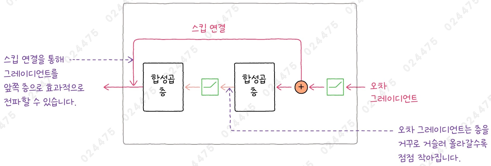
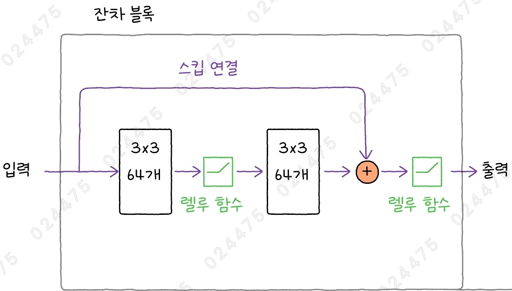
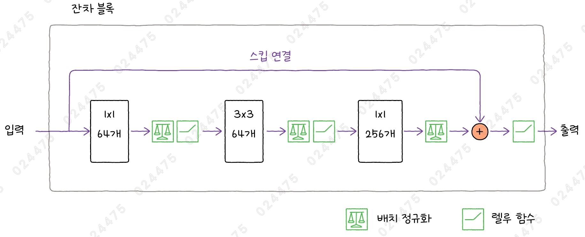
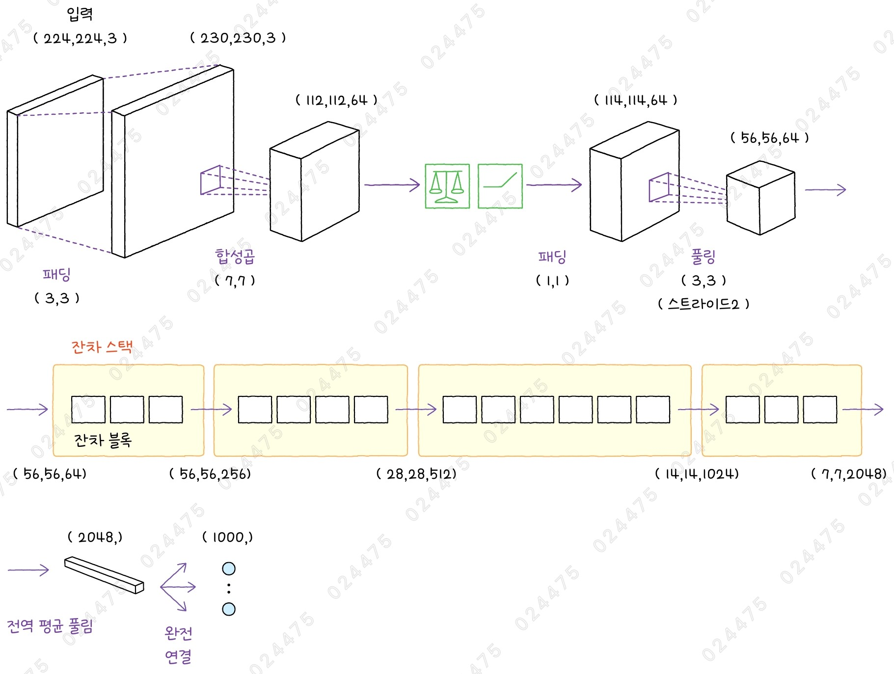
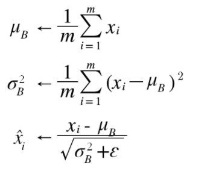
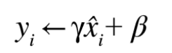
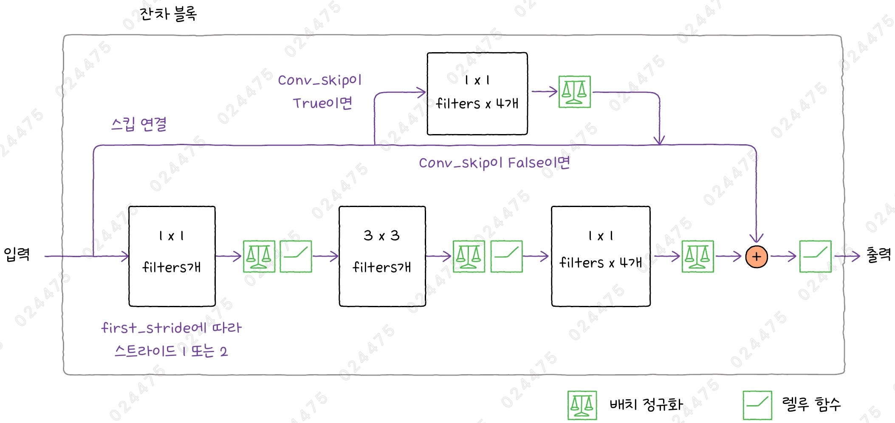
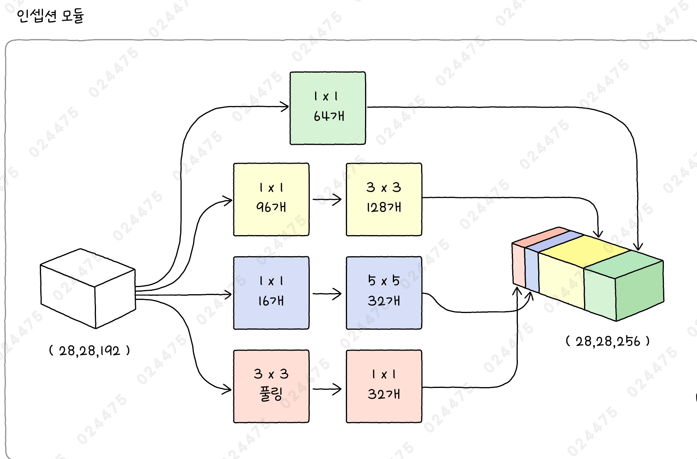

# ✔ 강아지와 고양이 사진 분류 모델의 성능 개선하기

> ['강아지와 고양이 사진 분류 모델의 성능 개선하기' 구글 코랩](https://colab.research.google.com/github/rickiepark/hm-dl/blob/main/02-3.ipynb)

## 1️⃣ 훈련 성능을 높이는 CNN 모델 - ResNet

- 마이크로소프트 연구원들이 만든 신경망으로, 2015년에 이미지넷 대회에서 우승을 차지함
- 잔차 블록과 배치 정규화를 사용하여 매우 깊은 층을 쌓은 신경망을 구성함

### 그레이디언트 소실 문제

- 딥러닝 모델은 경사 하강법으로 신경망을 훈련하며, 손실 함수를 통해 모델의 예측(출력)과 정답(타깃) 사이의 오차를 계산함
- 그리고 각 유닛이 이런 오차에 얼마나 기여하는지 모델의 끝에서부터 앞으로 누적하여 계산하는 역전파의 과정을 거치게 됨
- 역전파는 출력 값과 실제 값의 차이를 확인하는 과정에서 오차 발생의 원인을 찾고, 신경망의 가중치를 조정하여 예측을 점점 더 정확하게 만드는 역할을 함
- 딥러닝 모델은 신경망이 깊어질수록(층이 많아질수록) 이 가중치를 변경해 오차를 줄이는 (작은 실수 값인)그레이디언트가 점점 작아지기 때문에, 입력 부분에 가까운 층의 가중치가 잘 변경되지 않는 문제가 발생함

### 잔차 블록



- Residual Block
- 입력을 출력에 직접 연결하는 스킵 연결을 추가해, 그레이디언트 소실 문제를 완화함
- 따라서, 신경망의 층이 깊어지더라도 오차 그레이디언트가 잘 전파되어 신경망의 모든 층이 잘 훈련되는 효과를 낼 수 있음
- 스킵 연결을 사용하면 신경망 모델의 훈련 성능을 높일 수 있어 다른 신경망 구조에도 많이 적용되고 있음

### ResNet 모델의 잔차 블록

- ResNet 모델은 스킵 연결과 잔차 블록이라는 구조를 처음 도입한 신경망임
  - 마지막 출력 전 렐루 활성화 함수 이전에 스킵 연결이 더해짐
- ResNet 모델 종류
  - ResNet18: 18개 층을 쌓은 ResNet 모델
  - ResNet34: 34개 층을 쌓은 ResNet 모델
  - ResNet50: 50개 층을 쌓은 ResNet 모델
  - ResNet101: 101개 층을 쌓은 ResNet 모델
  - ResNet152: 152개 층을 쌓은 ResNet 모델

#### ResNet18, ResNet34의 잔차 블록



- 이 모델들의 잔차 블록에는 2개의 합성곱 신경망이 포함됨
- 각 합성곱 신경망은 3x3 크기의 필터 64개를 사용함
- 렐루 활성화 함수를 적용함

#### ResNet50, ResNet101, ResNet152의 잔차 블록



- 이 모델들의 잔차 블록에는 3개의 합성곱 신경망이 포함됨
- 배치 정규화와 렐루 활성화 함수를 적용함
- 이처럼 깊은 네트워크에서는 모델의 연산량을 줄이기 위해 3개의 합성곱층으로 구성된 병목 블록(bottleneck block)이 많이 사용됨
  - 첫 번째 합성곱층: 입력의 공간 방향 크기를 줄임
  - 두 번째 합성곱층: 입력 채널의 크기를 유지한 채 특징을 추출함
  - 세 번째 합성곱층: 채널 수를 확장함
- 병목 블록을 통해 스킵 연결의 채널 수를 맞추고, 보다 다양한 특징을 학습해 모델의 성능을 높일 수 있음

## 2️⃣ ResNet 모델 만들기



### 잔차 모듈

- Residual Module
- 스킵 연결을 통해 입력 데이터를 직접 다음 층으로 전달해 신경망이 더욱 깊어지더라도 학습이 가능하도록 돕는 잔차 블록과 그 잔차 블록이 모인 잔차 스택으로 구성된 구조
- 위 이미지는 ResNet50 모델 구조임

### 배치 정규화

- Batch Normalization
- 잔차 블록 내에서 학습의 속도를 높이고 모델의 안정성을 개선하기 위해 사용되는 기법
- 일반적으로 신경망의 입력은 표준화(standardization)를 통해 평균이 0, 표준편차가 1이 되도록 정규화함
- 하지만, 입력 데이터가 신경망의 여러 층을 통과하면서 이런 정규화가 틀어질 수 있음
- 배치 정규화는 각 층의 출력을 배치 단위로 다시 정규화 함으로써 훈련의 속도와 성능을 높일 수 있는 방법임

#### 배치 정규화 수식



- m: 배치에 있는 샘플 개수
- 입력에서 평균을 빼고 표준편차로 나누는 일반적인 표준화 공식과 거의 동일함
- 분산이 0일 경우 나눗셈 오류가 생기지 않도록 입실론이라는 작은 값을 분산에 더함
- 만약, 예측 시에 배치 데이터가 없다면 평균과 분산을 계산하지 못할 수 있음
- 그래서 훈련을 할 때는 배치의 평균과 분산에 대한 이동 평균을 계산하여 기록하고, 이렇게 기록해 놓은 평균과 분산을 예측에 사용해 배치 정규화를 수행함



- 만약 x를 그대로 사용하면 신경망 층의 표현력이 제한됨
- x는 거의 평균이 0이고 표준편차가 1이므로 대부분의 값이 시그모이드 곡선의 직선 부분에 위치함
- 따라서, 비선형 활성화 함수를 사용하는 효과가 줄어들기 때문에, 이를 위해 감마와 베타를 곱하여 평균과 값의 범위를 바꿔 줌
- 감마와 베타는 1과 0으로 초기화되고, 다른 모델의 파라미터와 마찬가지로 역전파를 통해 훈련됨

### ResNet50 모델 만들기

#### 1. 모델의 입력부터 배치 정규화 층까지 만들어 보자

```py
import keras
from keras import layers

inputs = layers.Input(shape=(224, 224, 3))
x = layers.ZeroPadding2D(padding=3)(inputs)
x = layers.Conv2D(64, 7, strides=2)(x)
x = layers.BatchNormalization(epsilon=1e-5)(x)
x = layers.Activation('relu')(x)
```

- `BatchNormalization()` 클래스: 배치 정규화층
- `epsilon` 매개변수: 입실론 값 지정
  - 기본값: 0.0001
- `Activation()` 클래스: 활성화 함수 적용

#### 2. 패딩 추가 및 최대 풀링을 적용하자

```py
x = layers.ZeroPadding2D(padding=1)(x)
x = layers.MaxPooling2D(3, strides=2)(x)
```

#### 3. 잔차 모듈을 만들어보자

```py
def build_stack(x):
    # 첫 번째 잔차 스택의 첫 번째 잔차 블록만 스트라이드 1을 사용합니다
    x = residual_stack(x, 3, 64, first_stride=1)
    # 두 번째~네 번째 잔차 스택을 만듭니다
    for blocks, filters in [(4, 128), (6, 256), (3, 512)]:
        x = residual_stack(x, blocks, filters, first_stride=2)
    return x
```

- 잔차 모듈은 4개의 잔차 스택으로 구성됨
- 각 잔차 스택은 3개, 4개, 6개, 3개의 잔차 블록으로 구성됨
- 각 잔차 스택에서 사용하는 주요 합성곱의 필터 수는 64개, 128개, 256개, 512개임
- 두 번째 ~ 네 번째 잔차 스택은 입력의 높이와 너비를 절반으로 줄이기 위해, 가장 먼저 등장하는 합성곱층의 스트라이드를 2로 설정함

#### 4. 잔차 스택을 만들어보자

```py
def residual_stack(x, blocks, filters, first_stride=2):
    # 첫 번째 잔차 블록은 합성곱 스킵 연결을 사용하고
    # 이 잔차 블록의 첫 번째 합성곱 스트라이드는 first_stride입니다.
    x = residual_block(x, filters, first_stride=first_stride, conv_skip=True)
    for _ in range(1, blocks):
        # 나머지 잔차 블록의 첫 번째 합성곱 스트라이드는 1입니다.
        x = residual_block(x, filters, first_stride=1, conv_skip=False)
    return x
```

- 첫 번째 잔차 스택에 있는 첫 번째 잔차 블록의 입력 크기는 (56, 56, 64)이고, 출력 크기는 (56, 56, 256)임
- 이렇게 채널 수가 다르면 스킵 연결을 통해 입력을 출력과 더할 수 없음
- 따라서, 첫 번째 잔차 블록의 스킵 연결에 합성곱층을 추가하여 채널 수를 256개로 맞춰 주어야 함 (합성곱 스킵 연결)
  - 크기가 1x1인 필터를 256개 사용하면 입력의 크기가 (56, 56, 256)으로 바뀜
  - 1x1 합성곱 (점별 합성곱): 공간 방향 차원을 유지하면서 채널 차원을 변경하기 위해 사용됨

#### 5. 잔차 블록을 만들어보자



```py
def residual_block(x, filters, first_stride=1, conv_skip=False):
    skip_conn = x
    # 합성곱과 배치 정규화, 렐루 활성화 함수를 반복합니다
    # 1x1, filters개 필터, 스트라이드는 first_stride에 따라 1 또는 2
    x = layers.Conv2D(filters=filters, kernel_size=1,
                      strides=first_stride)(x)
    x = layers.BatchNormalization(epsilon=1e-5)(x)
    x = layers.Activation('relu')(x)
    # 3x3, filters개 필터
    x = layers.Conv2D(filters=filters, kernel_size=3,
                      padding='same')(x)
    x = layers.BatchNormalization(epsilon=1e-5)(x)
    x = layers.Activation('relu')(x)
    # 1x1, filters*4개 필터
    x = layers.Conv2D(filters=filters*4, kernel_size=1)(x)
    x = layers.BatchNormalization(epsilon=1e-5)(x)
    # conv_skip이 True이면 1x1 합성곱을 사용해 채널 크기를 filters*4로 늘립니다
    if conv_skip == True:
        skip_conn = layers.Conv2D(filters=filters*4, kernel_size=1,
                                  strides=first_stride)(skip_conn)
        skip_conn = layers.BatchNormalization(epsilon=1e-5)(skip_conn)
    x = layers.Add()([skip_conn, x])
    x = layers.Activation('relu')(x)
    return x
```

#### 6. 잔차 스택을 모두 쌓은 후, 전역 평균 풀링층과 밀집층을 추가하자

```py
x = build_stack(x)
x = layers.GlobalAveragePooling2D()(x)
outputs = layers.Dense(1000, activation='softmax')(x)
```

- 전역 풀링층: 각각의 특성 맵을 하나의 값(평균값 또는 최댓값)으로 요약
- `GlobalAveragePooling2D()` 클래스: 전역 평균 풀링층

#### 7. 입력 inputs에서 출력 outputs까지 이어지는 신경망 모델을 만들자

```py
model = keras.Model(inputs, outputs)
```

### ResNet101 모델 만들기

#### ResNet101 모델의 잔차 모듈

```py
def build_stack101(x):
    # 첫 번째 잔차 스택의 첫 번째 잔차 블록만 스트라이드 1을 사용합니다
    x = residual_stack(x, 3, 64, first_stride=1)
    # 두 번째~네 번째 잔차 블록을 만듭니다
    for blocks, filters in [(4, 128), (23, 256), (3, 512)]:
        x = residual_stack(x, blocks, filters, first_stride=2)
    return x
```

- 세 번째 잔차 스택이 23번 반복되는 것 외에는 ResNet50과 동일함

### ResNet152 모델 만들기

#### ResNet152 모델의 잔차 모듈

```py
def build_stack152(x):
    # 첫 번째 잔차 스택의 첫 번째 잔차 블록만 스트라이드 1을 사용합니다
    x = residual_stack(x, 3, 64, first_stride=1)
    # 두 번째~네 번째 잔차 블록을 만듭니다
    for blocks, filters in [(8, 128), (36, 256), (3, 512)]:
        x = residual_stack(x, blocks, filters, first_stride=2)
    return x
```

- 두 번째 잔차 스택이 8번 반복되고, 세 번째 잔차 스택이 36번 반복되는 것 외에는 ResNet50과 동일함

## 3️⃣ 강아지와 고양이 사진 분류하기

- 케라스에는 이미지넷 데이터셋에서 사전 훈련된 ResNet 모델이 포함되어 있음

#### 1. 강아지와 고양이 이미지를 구글 드라이브에서 다운로드하고 압축을 해제하자

```
!gdown 1xGkTT3uwYt4myj6eJJeYtdEFgTi2Sj8C
!unzip cat-dog-images.zip
```

#### 2. 강아지 사진을 로드한 후, 전처리해보자

```py
from PIL import Image
import numpy as np
from keras.applications import resnet

dog_png = Image.open('images/dog.png')
resnet_prep_dog = resnet.preprocess_input(np.array(dog_png))
```

#### 3. ResNet50 모델을 로드한 후, 강아지 이미지를 예측해보자

```py
resnet50 = keras.applications.ResNet50()
predictions = resnet50.predict(resnet_prep_dog[np.newaxis,:])

resnet.decode_predictions(predictions)
"""
[[('n02099712', 'Labrador_retriever', np.float32(0.38535273)),
  ('n02099601', 'golden_retriever', np.float32(0.089699574)),
  ('n02100735', 'English_setter', np.float32(0.04212418)),
  ('n02106166', 'Border_collie', np.float32(0.03777442)),
  ('n02101388', 'Brittany_spaniel', np.float32(0.030700428))]]
"""
```

- 실행 결과, 약 38.5%의 확률로 '래브라도 리트리버'가 예측되었고, 그 다음 약 8.9%의 확률로 '골든 리트리버'가 예측됨
- VGG16 모델보다 조금 더 '래브라도 리트리버'에 대한 확신이 큼

#### 4. 고양이 사진을 로드해 전처리한 후, ResNet50 모델로 예측해보자

```py
cat_png = Image.open('images/cat.png')
resnet_prep_cat = resnet.preprocess_input(np.array(cat_png))
predictions = resnet50.predict(resnet_prep_cat[np.newaxis,:])

resnet.decode_predictions(predictions)
"""[[('n02123045', 'tabby', np.float32(0.8686101)),
  ('n02124075', 'Egyptian_cat', np.float32(0.050774965)),
  ('n02123159', 'tiger_cat', np.float32(0.042567052)),
  ('n07930864', 'cup', np.float32(0.0027631458)),
  ('n03443371', 'goblet', np.float32(0.0020991666))]]
"""
```

- 실행 결과, 약 86.9%의 확률로 '얼룩 고양이'를 예측했고, 0.51%의 확률로 '이집트 고양이'를 예측했음
- VGG16 모델보다 훨씬 높은 수준으로 '얼룩 고양이'라고 예측함

## cf) GoogLeNet

- 2014년 구글에서 발표해 이미지넷 대회에서 우승을 차지함
- 인셉션 모듈이라는 독특한 구조를 사용함
- 이후에 Inception v2(2015년), Inception v3(2015년), Inception v4(2016년), Inception-ResNet(2016년)을 발표함
- 케라스는 Inception v3와 Inception-ResNet v2를 InceptionV3() 클래스와 InceptionResNetV2() 클래스로 제공함
  - 두 모델은 (299, 299, 3) 크기의 입력을 기대함

### 인셉션 모듈



- Inception Module
- 다양한 크기의 합성곱을 병렬로 사용해 여러 스케일에서 특징을 추출하는 덕분에 보다 효율적으로 이미지를 분석할 수 있음
- 4개 갈래로 병렬 처리된 후 하나로 합쳐짐
- 모든 합성곱은 세임 패딩을 사용함
- 각 갈래의 출력을 채널 방향으로 차곡차곡 쌓아 인셉션 모듈의 출력을 만듦
- 층이 깊어질수록 높이와 너비 방향 크기는 줄어들지만, 인셉션 모듈에 있는 필터의 개수는 늘어남
- 본격적인 합성곱층 이전에 1x1 합성곱층을 두어 3x3이나 5x5 합성곱의 파라미터 개수를 줄이는 효과를 냄
- 각각의 합성곱층이 다양한 패턴을 감지할 수 있으므로 복잡한 패턴을 처리하는 능력이 뛰어남

### Inception v3 모델로 강아지와 고양이 사진 분류하기

#### 1. 강아지 이미지를 로드한 후, 전처리해보자

```py
from keras.utils import load_img
from keras.applications import inception_v3

dog_png = load_img("images/dog.png", target_size=(299, 299))
incep_prep_dog = inception_v3.preprocess_input(np.array(dog_png))
```

- `load_img()` 함수: 이미지를 로드하는 것 뿐만 아니라 이미지를 원하는 크기로 늘리거나 줄일 수도 있음

#### 2. Inception v3 모델을 로드한 후, 강아지 이미지를 예측해보자

```py
inception = keras.applications.InceptionV3()
predictions = inception.predict(incep_prep_dog[np.newaxis,:])
inception_v3.decode_predictions(predictions)
"""
[[('n02104029', 'kuvasz', np.float32(0.13835053)),
  ('n02099712', 'Labrador_retriever', np.float32(0.07777295)),
  ('n02106166', 'Border_collie', np.float32(0.07198329)),
  ('n02111500', 'Great_Pyrenees', np.float32(0.06614903)),
  ('n02099601', 'golden_retriever', np.float32(0.02838334))]]
"""
```

- 리트리버와 비슷하게 생긴 '쿠바츠'라고 오해하고 있음

#### 3. 고양이 사진을 로드해 전처리한 후, Inception v3 모델로 예측해보자

```py
cat_png = load_img("images/cat.png", target_size=(299, 299))
incep_prep_cat = inception_v3.preprocess_input(np.array(cat_png))
predictions = inception.predict(incep_prep_cat[np.newaxis,:])
inception_v3.decode_predictions(predictions)
"""
[[('n02124075', 'Egyptian_cat', np.float32(0.68673676)),
  ('n02123159', 'tiger_cat', np.float32(0.13263007)),
  ('n02123045', 'tabby', np.float32(0.04215029)),
  ('n04040759', 'radiator', np.float32(0.0016103369)),
  ('n02971356', 'carton', np.float32(0.0011297755))]]
"""
```

- 68.7%의 확률로 '이집트 고양이'를 예측함

### Inception-ResNet 모델로 강아지와 고양이 사진 분류하기

#### 1. 강아지 사진을 전처리한 후, Inception-ResNet 모델로 예측해보자

```py
from keras.applications import inception_resnet_v2 as incep_res_v2

incep_res_prep_dog = incep_res_v2.preprocess_input(np.array(dog_png))
inception_resnet = keras.applications.InceptionResNetV2()
predictions = inception_resnet.predict(incep_res_prep_dog[np.newaxis,:])
incep_res_v2.decode_predictions(predictions)
"""
[[('n02099712', 'Labrador_retriever', np.float32(0.6563314)),
  ('n02104029', 'kuvasz', np.float32(0.13956322)),
  ('n02099601', 'golden_retriever', np.float32(0.05594526)),
  ('n02111500', 'Great_Pyrenees', np.float32(0.048894893)),
  ('n02100735', 'English_setter', np.float32(0.0021178788))]]
"""
```

- 65.6%의 확률로 '래브라도 리트리버'를 예측함

#### 2. 고양이 사진을 전처리한 후, Inception-ResNet 모델로 예측해보자

```py
incep_res_prep_cat = incep_res_v2.preprocess_input(np.array(cat_png))
predictions = inception_resnet.predict(incep_res_prep_cat[np.newaxis,:])
incep_res_v2.decode_predictions(predictions)
"""
[[('n02123045', 'tabby', np.float32(0.4249481)),
  ('n02124075', 'Egyptian_cat', np.float32(0.25831026)),
  ('n02123159', 'tiger_cat', np.float32(0.1279524)),
  ('n02127052', 'lynx', np.float32(0.003448608)),
  ('n04525038', 'velvet', np.float32(0.0024461092))]]
"""
```

- 42.5%의 확률로 '얼룩 고양이'를 예측함
