# ✔ LlaMA 모델로 텍스트 생성하기

> ['LlaMA 모델로 텍스트 생성하기-llama2' 구글 코랩](https://colab.research.google.com/github/rickiepark/hm-dl/blob/main/05-2-llama2.ipynb)

> ['LlaMA 모델로 텍스트 생성하기-llama2_keras' 구글 코랩](https://colab.research.google.com/github/rickiepark/hm-dl/blob/main/05-2-llama2-keras.ipynb)

> ['LlaMA 모델로 텍스트 생성하기-llama3' 구글 코랩](https://colab.research.google.com/github/rickiepark/hm-dl/blob/main/05-2-llama3.ipynb)

> ['LlaMA 모델로 텍스트 생성하기-bllossom' 구글 코랩](https://colab.research.google.com/github/rickiepark/hm-dl/blob/main/05-2-bllossom.ipynb)

## 1️⃣ LlaMA 모델 이해하기

- Large Language Model Meta AI
- 메타 AI에서 만든 트랜스포머 디코더 기반의 대규모 언어 모델
- GPT-2보다 적은 파라미터로 높은 성능을 제공하도록 최적화됨

### LlaMA 시리즈

1. 라마-1

   - 2023년 2월에 출시
   - 1~1.4조 개의 토큰으로 훈련됨
   - 문맥 길이: 2,048개

2. 라마-2

   - 2조 개의 토큰으로 훈련됨
   - 문맥 길이: 4,096개
   - 70억, 130억, 700억 파라미터 버전이 있음

3. 라마-3
   - 2024년 4월에 출시
   - 15조 개의 토큰으로 훈련됨
   - 문맥 길이: 8,912
   - 80억, 700억 파라미터 버전이 있음

### LlaMA-2 구조

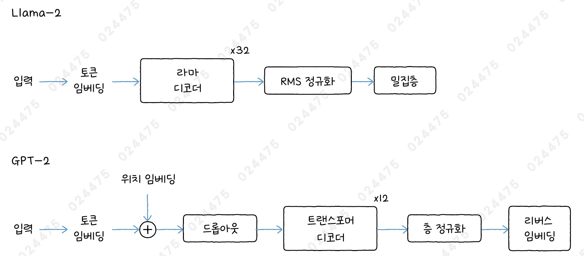

- 위는 70억 파라미터를 갖는 라마-2 모델의 구조임
- GPT-2 모델과 비교해 보면, 위치 임베딩과 드롭아웃이 없고, 트랜스포머 디코더가 라마 디코더로, 층 정규화도 RMS 정규화로 이름이 바뀜
- 라마-2는 위치 정보를 임베딩이 아니라 어텐션층에서 효과적으로 주입하기 위한 새로운 방법, 로터리 위치 임베딩(RoPE)을 사용함
- 라마-2와 같은 대규모 언어 모델은 엄청나게 많은 데이터로 훈련하기 때문에, 대부분의 모델들이 많은 수의 에포크를 훈련할 수 없음
  - 에포크가 적기 때문에 과대적합을 막기 위한 드롭아웃을 적용하지 않는 경우가 많음

### LlaMA 디코더

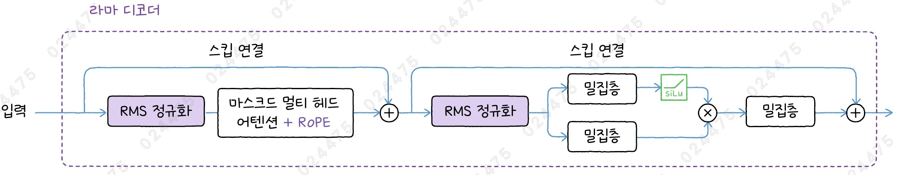

- 라마 디코더는 드롭아웃 층이 없고, 층 정규화가 RMS 정규화로 바뀜
- 마스크드 멀티 헤드 어텐션에 새로운 임베딩 기법인 RoPE를 사용함
- 피드 포워드 네트워크에 새로운 활성화 함수인 SiLU를 사용함

### 로터리 위치 임베딩 (RoPE)

- Rotary Positional Embedding
- 절대 위치 임베딩 (Absolute Positional Embedding): 토큰의 절대 위치를 기록
  - 지금까지 사용한 위치 임베딩이 절대 위치 임베딩임
- 상대 위치 임베딩 (Relative Positional Embedding): 토큰 사이의 상대적인 거리를 기록
  - 로터리 위치 임베딩은 상대 위치 임베딩의 한 종류임
- 토큰 임베딩의 두 원소를 2D 평면의 벡터라고 생각하고, 회전 각도로 토큰의 위치를 기록하는 방법
- 장점: 어텐션 메커니즘의 쿼리와 키를 점곱했을 때 회전 각도의 차이로 두 토큰의 상대적인 위치 정보를 고려할 수 있음

#### 로터리 위치 임베딩 수식

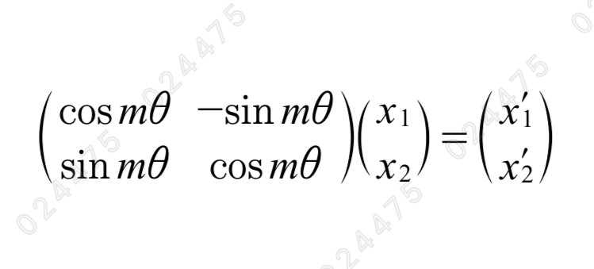

- m 번째 토큰 임베딩의 첫 두 원소를 $x_1$, $x_2$라고 해보자
- 두 원소로 이루어진 벡터를 평면의 원점을 기준으로 $mθ$의 각도만큼 회전시키자
- 이 벡터 변환은 위와 같은 회전변환 행렬을 사용해 나타낼 수 있음

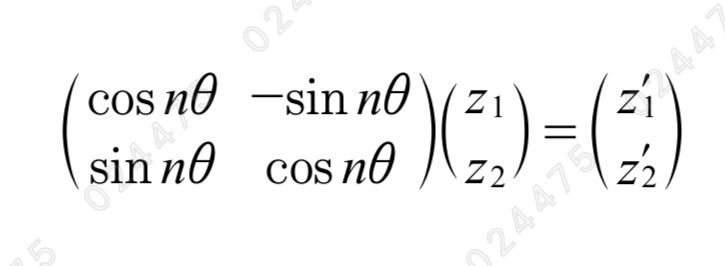

- 마찬가지로, n 번째 토큰 임베딩의 첫 두 원소를 $z_1$, $z_2$라고 해보자
- 두 원소로 이루어진 벡터를 평면의 원점을 기준으로 $nθ$의 각도만큼 회전시키자

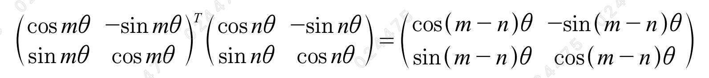

- 변환된 두 벡터를 점곱한다는 것은 결국 두 개의 회전변환 행렬을 점곱하는 결과와 같음
- 즉, 각기 다르게 회전시킨 두 토큰을 점곱하면 두 토큰 사이의 상대적인 회전 정보를 가지게 됨

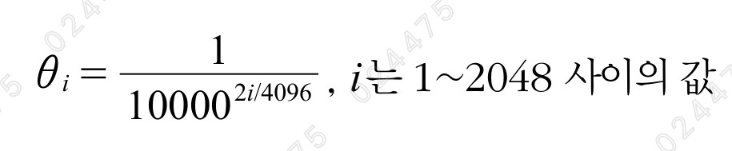

- 토큰의 임베딩에 있는 원소를 이렇게 두 개씩 회전시키면 $x_1$과 $x_2$는 $mθ_1$, $x_3$과 $x_4$는 $mθ_2$ 각도만큼 회전하게 됨
- 이런 식으로 임베딩 벡터의 원소에 대해 모두 회전 변환을 적용함
- 만약, 임베딩 벡터의 길이가 4,096라면 각도는 $mθ_1$부터 $mθ_{2048}$까지 필요하며, 각도는 위와 같은 공식으로 구할 수 있음

#### 1. 로터리 위치 임베딩 함수를 직접 구현해보자

```py
# 토큰 임베딩 크기
embed_dim = 4096

def rotary_position_embedding(inputs, token_pos):
    # theta 각도를 생성합니다.
    freqs = keras.ops.arange(0, embed_dim, 2, dtype='float32') / embed_dim
    inverse_freqs = 1 / (10000**freqs)
    # m * theta
    embedding = token_pos * inverse_freqs
    cos_emb = keras.ops.cos(embedding)
    sin_emb = keras.ops.sin(embedding)
    # 입력을 절반으로 나눕니다.
    x1, x2 = keras.ops.split(inputs, 2)
    # 회전 변환을 적용합니다.
    new_x1 = x1 * cos_emb - x2 * sin_emb
    new_x2 = x1 * sin_emb + x2 * cos_emb
    return keras.ops.concatenate((new_x1, new_x2))

# 가상의 토큰 임베딩
inputs = keras.ops.ones(embed_dim)
# 두 번째 위치에 있는 토큰에 로터리 위치 임베딩을 적용합니다.
rotary_position_embedding(inputs, 1)
"""
<tf.Tensor: shape=(4096,), dtype=float32, numpy=
array([-0.30116874, -0.2949654 , -0.28878427, ...,  1.0001013 ,
        1.0001009 ,  1.0001005 ], dtype=float32)>
"""
```

- 위에서는 두 개의 원소씩 회전한다고 설명했지만, 이 코드를 보면 토큰 임베딩의 절반을 나누고 각 절반에 있는 원소를 한 번에 회전하고 있음
- 그 이유는 원본 라마-2의 가중치를 허깅페이스 transformers로 포팅할 때 원본 가중치의 순서를 따르지 않고, 회전 변환의 절반을 모두 나열한 다음 나머지 절반을 나열했기 때문임
- 그래서 KerasNLP의 경우에도 허깅페이스 transformers를 따라 동일한 구현을 제공함

#### 2. KerasNLP에서 제공하는 RotaryEmbedding 클래스를 사용해 위치 임베딩을 적용해보자

```py
import keras
from keras import layers
import keras_nlp

rotary_embedding = keras_nlp.layers.RotaryEmbedding()
rotary_embedding(keras.ops.ones((1, 2, embed_dim)))
"""
<tf.Tensor: shape=(1, 2, 4096), dtype=float32, numpy=
array([[[ 1.        ,  1.        ,  1.        , ...,  1.        ,
          1.        ,  1.        ],
        [-0.30116874, -0.2949654 , -0.28878427, ...,  1.0001013 ,
          1.0001009 ,  1.0001005 ]]], dtype=float32)>
"""
```

- `RotaryEmbedding` 클래스: 로터리 위치 임베딩 층

### RMS 정규화

- Root Mean Square Normalization
- 층 정규화 공식에서 평균을 구하는 부분을 제외하면 RMS 정규화가 됨
- 중심을 원점에 맞추는 것이 불필요하다는 가정 하에 층 정규화에서 평균을 뺌
- 이러한 특징 덕분에 RMS 정규화는 모델의 성능을 유지하면서도 속도를 더 높일 수 있다고 알려져 있음

#### 층 정규화 공식

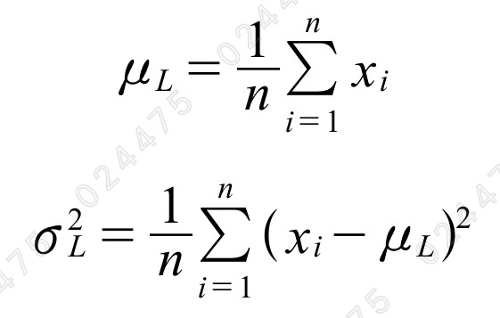
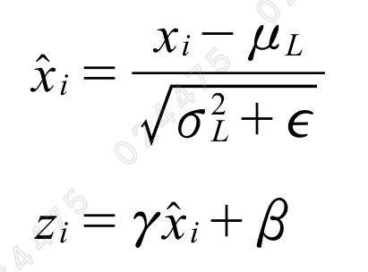

- 입력에서 평균을 빼고 분산의 제곱근, 즉 표준편차로 나눔
- 이때, 분모가 0이 되는 것을 막기 위해 작은 실숫값 입실론을 분산에 더함
- 마지막으로, 훈련되는 가중치 감마를 곱하고 베타를 더함

#### RMS 정규화 공식

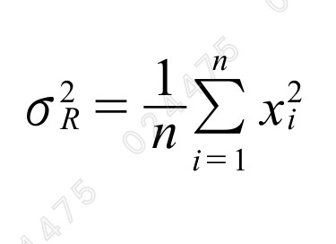
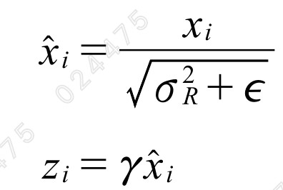

- 입력의 특성만으로 분산을 계산함
- 입력을 원점에 맞추지 않았기 때문에, 베타 파라미터를 따로 학습할 필요가 없음

#### 1. RMS 정규화 함수를 직접 구현해보자

```py
import numpy as np

def rms_norm(x):
    scale = 1.0     # 실제로는 훈련되는 가중치입니다.
    epsilon = 1e-6
    var = keras.ops.mean(keras.ops.power(x, 2), axis=-1, keepdims=True)
    return scale * x / keras.ops.sqrt(var + epsilon)

x = np.array([1, 2, 3])
rms_norm(x)
"""
<tf.Tensor: shape=(3,), dtype=float32, numpy=array([0.46291, 0.92582, 1.38873], dtype=float32)>
"""
```

#### 2. KerasNLP에서 제공하는 LlamaLayerNorm 클래스를 사용해 RMS 정규화를 적용해보자

```py
from keras_nlp.src.models.llama.llama_layernorm import LlamaLayerNorm

llama_norm = LlamaLayerNorm()
llama_norm(x)
"""
<tf.Tensor: shape=(3,), dtype=float32, numpy=array([0.46291, 0.92582, 1.38873], dtype=float32)>
"""
```

- `LlamaLayerNorm` 클래스: RMS 정규화 층

### SwiGLU 활성화 함수

- 스위시 함수를 GLU 함수에 적용한 것
- 라마-2의 디코더는 피드 포워드 네트워크에 SwiGLU 함수를 사용함

#### GLU 함수

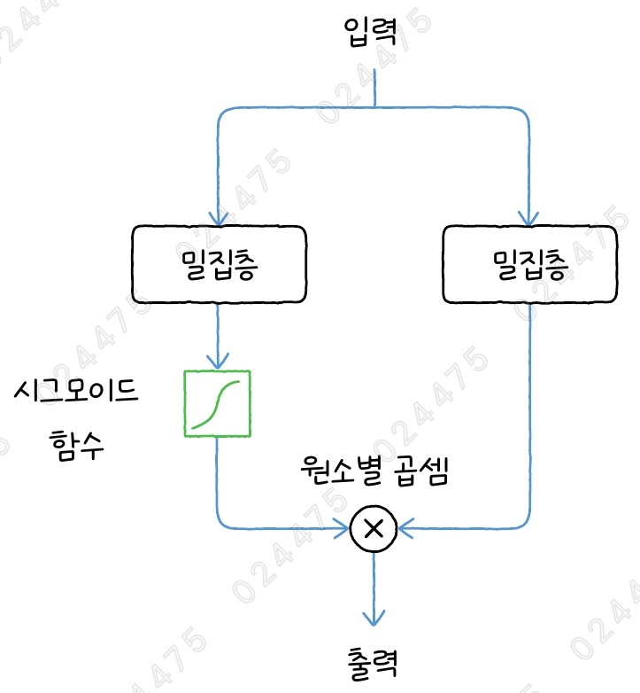

- Gated Linear Unit
- GLU 함수는 입력을 두 개의 밀집층에 통과시킨 후, 원소별 곱셈함
- 밀집층 중 하나는 시그모이드 활성화 함수를 사용하고, 나머지 하나는 활성화 함수를 사용하지 않음

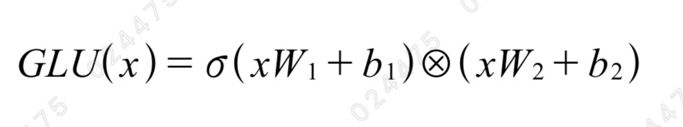

- $W_1$과 $b_1$, $W_2$과 $b_2$는 각각 밀집층의 가중치와 절편을 의미함
- $⊗$는 원소별 곱셈을 의미함

#### SwiGLU 함수

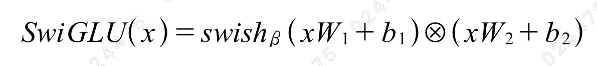

- SwiGLU 함수는 시그모이드 활성화 함수 대신 스위시 함수를 적용한 GLU 함수임

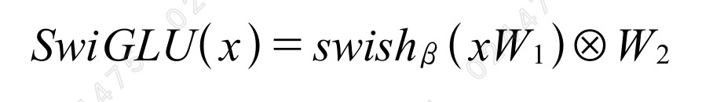

- SwiGLU 논문에서는 트랜스포머에 함수를 적용할 때 절편이 없는 방식을 제안했으며, 라마-2도 이러한 방식을 따름

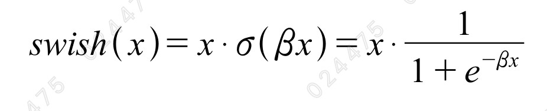

- 베타가 1일 때의 스위시 함수를 SiLU (Sigmoid Linear Unit) 함수라고도 부름
- 따라서, 라마-2 피드 포워드 네트워크의 활성화 함수를 SwiGLU 함수 또는 SiLU 함수라고도 함

#### 1. SiLU 함수를 구현해보자

```py
# 피드 포워드 네트워크의 입력 크기가 (10, 4096)이고,
# 유닛 개수는 11,008개, 임베딩 차원은 4,096이라고 가정합니다.
x = keras.ops.ones((10, 4096))
x1 = layers.Dense(11008, activation='silu', use_bias=False)(x)
x2 = layers.Dense(11008, use_bias=False)(x)
x = x1 * x2
x = layers.Dense(4096, use_bias=False)(x)
x
```

- Dense 클래스의 `activation` 매개변수에 'silu'라고 지정하면 케라스에서 간단히 SiLU 함수를 사용할 수 있음

## 2️⃣ KerasNLP로 Llama-2 모델 만들기

### 그룹 쿼리 어텐션

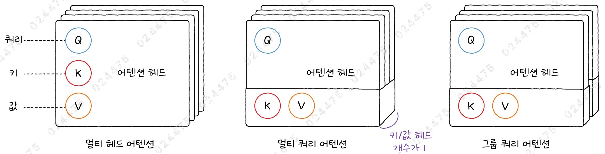

- Grouped Query Attention
- 멀티 헤드 어텐션: 어텐션 헤드마다 쿼리, 키, 값을 각각 만들어 사용
- 멀티 쿼리 어텐션: 모든 쿼리 헤드에서 키와 값을 그룹으로 묶어서 공유하여 사용함
  - 이를 통해 메모리를 절약하고 텍스트 생성 속도를 높일 수 있음
- 그룹 쿼리 어텐션: 멀티 헤드 어텐션과 멀티 쿼리 어텐션의 중간 단계로, 몇 개의 헤드마다 키와 값을 공유함
- 케라스는 그룹 쿼리 어텐션을 `GroupQueryAttention` 클래스로 제공하지만, 로터리 위치 임베딩이 없기 때문에 KerasNLP는 별도로 만든 `LlamaAttention` 층을 사용함

### LlaMA-2 버전

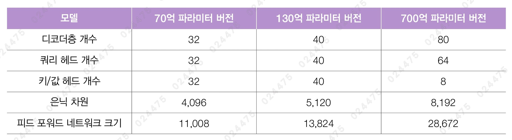

- 라마-2 모델의 70억 파라미터 버전과 130억 파라미터 버전은 쿼리 헤드의 개수와 키/값 헤드의 개수가 같기 때문에 멀티 헤드 어텐션을 사용함
- 하지만, 700억 파라미터 버전은 쿼리 헤드의 개수가 64개이고, 키/값 헤드의 개수가 8개인 그룹 쿼리 어텐션을 사용함

#### 1. 라마 디코더를 구현해보자

```py
from keras_nlp.src.models.llama.llama_attention import LlamaAttention

def llama_decoder(x, padding_mask, num_query_heads, num_key_value_heads,
                  interm_dim, hidden_dim):
    # 어텐션 마스크를 계산합니다.
    attention_mask = AttentionMask()(padding_mask)
    # 스킵 연결을 준비합니다.
    residual = x
    x = LlamaLayerNorm()(x)
    # 멀티 헤드 어텐션을 통과합니다.
    llama_attention = LlamaAttention(num_query_heads=num_query_heads,
                                     num_key_value_heads=num_key_value_heads,
                                     dropout=0.0)
    x = llama_attention(x, attention_mask)
    # 스킵 연결
    x = x + residual
    # 스킵 연결을 준비합니다.
    residual = x
    # 피드 포워드 네트워크
    x = LlamaLayerNorm()(x)
    x1 = layers.Dense(interm_dim, activation='silu', use_bias=False)(x)
    x2 = layers.Dense(interm_dim, use_bias=False)(x)
    x = x1 * x2
    x = layers.Dense(hidden_dim, use_bias=False)(x)
    # 스킵 연결
    x = x + residual
    return x
```

#### 2. 70억 파라미터 버전의 llama-2 모델을 위한 모델 파라미터를 정의하자

```py
# LLaMa 2
vocab_size = 32000
num_layers = 32
num_query_heads = 32
num_key_value_heads = 32
interm_dim = 11008
hidden_dim = 4096
```

#### 3. llama-2 모델을 만들자

```py
from keras_nlp.layers import ReversibleEmbedding

token_ids = keras.Input(shape=(None,))
padding_mask = keras.Input(shape=(None,))

token_embedding_layer = ReversibleEmbedding(vocab_size, hidden_dim,
                                            tie_weights=False)
x = token_embedding_layer(token_ids)

for _ in range(num_layers):
    x = llama_decoder(x, padding_mask, num_query_heads, num_key_value_heads,
                        interm_dim, hidden_dim)

x = LlamaLayerNorm()(x)
outputs = token_embedding_layer(x, reverse=True)
model = keras.Model(inputs=(token_ids, padding_mask),
                    outputs=(outputs))
```

- GPT-2에서는 마지막에 어휘사전에 있는 각 토큰의 로짓을 출력하기 위해 ReversibleEmbedding 층의 가중치를 뒤집어 재활용함
- 하지만, 라마-2는 마지막에 (embed, vocab_size) 크기의 밀집층을 별도로 추가하여 훈련함
- 이때, Dense 층을 추가하는 대신 `ReversibleEmbedding` 클래스의 `tie-weights=False`로 지정해 두 벌의 가중치를 훈련하도록 함
  - 이렇게 설정하면 토큰 아이디를 임베딩할 때와 거꾸로 임베딩을 각 토큰의 로짓으로 매핑할 때 다른 가중치를 사용함

#### 4. 모델의 구조를 확인해보자

```py
model.summary(line_length=100)
```


- 실행 결과를 보면, 약 67억 개의 모델 파라미터가 있음
- 라마-2는 GPT-2(1억 2천만 개)보다 모델 파라미터가 60배나 많음

## 3️⃣ Llama-2 모델로 텍스트 생성하기

- 라마 모델을 사용하려면 먼저 메타에 사용 허가를 요청해야함

### 모델 사용 허가 요청하기

- 메타에서 제공하는 별도 페이지를 통해 사용 허가 요청을 완료한 다음, 캐글에 알리면 됨
- 이때, 사용 허가를 요청하는 이메일 계정과 캐글 계정으로 가입한 이메일 주소가 같아야 함

### 캐글 사용자 인증하기

- 코랩이나 자신의 컴퓨터에서 캐글에 있는 라마-2 모델을 다운로드하려면 모델을 사용할 수 있는 캐글의 사용자임을 알려야 함
- KerasNLP는 캐글 로그인 기능을 제공하지는 않지만, 캐글에서 제공하는 API 토큰을 자동으로 인식하기 때문에 API 토큰을 생성해 인증할 수 있음
- 캐글의 [API] 섹션에서 [Create New Token]을 선택하면 새로운 토큰이 생성되고, 토큰이 포함된 kaggle.json 파일이 자동으로 다운로드 됨

#### 1. kaggle 디렉토리로 kaggle.json 파일을 옮기자

```
!mkdir ~/.kaggle/
!mv kaggle.json ~/.kaggle/
```

- 코랩에 업로드한 파일은 해당 노트북의 런타임이 종료되면 함께 사라짐
- 코랩의 [보안 비밀] 메뉴에 캐글 토큰을 저장하면 노트북 런타임이 종료되어도 파일이 사라지지 않고 다시 사용할 수 있음
- [보안 비밀]에 저장한 값은 구글 계정이 같을 경우 어떤 코랩 노트북에서도 참조할 수 있음

### Llama-2 모델로 텍스트 생성하기

#### 1. KerasNLP에서 llama2_7b 모델을 로드해보자

```py
import keras_nlp

llama2 = keras_nlp.models.LlamaCausalLM.from_preset('llama2_7b_en')
```

#### 2. 모델의 구조를 확인해보자

```py
llama2.summary()
```


#### 3. llama2_7b 모델을 사용해 텍스트를 생성해보자

```py
sampler = keras_nlp.samplers.TopPSampler(p=0.8, seed=42)
llama2.compile(sampler=sampler)
llama2.generate('stay hungry, stay', max_length=20)
"""
stay hungry, stay weird. It’s kind of what our philosophy is.\nWe
"""
```

### 텍스트 전처리하기 - 센텐스피스 토크나이저

- SentencePiece Tokenizer
- 라마-2는 센텐스피스 토크나이저를 사용해 텍스트를 토큰으로 나눔
- 센텐스피스는 알고리즘이자, 이를 구현한 라이브러리 이름이기도 함
- BPE 알고리즘과 유니그램 언어 모델을 지원함
- 문장을 유니코드 문자의 시퀀스로 다룸
- 장점
  - 영어 이외의 다양한 언어에도 사용할 수 있음
  - 토큰화 전에 공백으로 단어를 분리할 필요가 없기 때문에, 공백이 없는 중국어와 같은 언어에도 적용이 가능함
  - 매우 빠름

#### 1. llama2_7b 모델의 토크나이저를 로드해보자

```py
llama_tokenizer = keras_nlp.models.LlamaTokenizer.from_preset('llama2_7b_en')
```

#### 2. llama2_7b 모델의 토크나이저를 사용해 문자열을 전처리해보자

```py
token_ids = llama_tokenizer.tokenize('stay hungry, stay')
token_ids
"""
<tf.Tensor: shape=(5,), dtype=int32, numpy=array([ 7952,  9074, 14793, 29892,  7952], dtype=int32)>
"""
```

#### 3. 토큰 아이디를 토큰으로 변환해보자

```py
for ids in token_ids:
    print(llama_tokenizer.id_to_token(ids), end=' ')
# ▁stay ▁hun gry , ▁stay
```

- 센텐스피스는 기본적으로 문자의 첫 단어에도 공백을 추가함
  - 이유: 공백을 통해 문장의 첫 단어인 stay와 마지막 단어인 stay를 동일하게 취급하기 위함
- 또한, 기본적으로 대소문자를 구분하므로 Hello와 hello를 다른 토큰으로 취급함

#### 4. 토큰 아이디를 원본 문자열로 변환해보자

```py
llama_tokenizer.detokenize(token_ids)
# stay hungry, stay
```

## 4️⃣ Llama-3 모델로 텍스트 생성하기

### Llama-3 버전

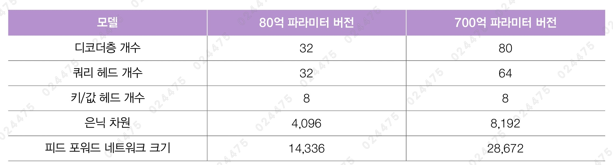

- 기본적인 구조는 라마-2와 거의 같음
- 어휘사전 크기는 128,256으로 라마-2보다 4배 늘어남
- 80억, 700억 파라미터 모델 모두 그룹 쿼리 어텐션을 사용함
- tiktoken 토크나이저를 사용

### 허깅페이스에 Llama-3 사용 허가 요청하기

- 메타에서 제공하는 별도 페이지를 통해 사용 허가 요청을 완료한 다음, 허깅페이스에서 사용자 정보를 입력하면 됨
- 이때, 사용 허가를 요청하는 이메일 계정과 허깅페이스 계정으로 가입한 이메일 주소가 같아야 함
- 허깅페이스 라마-3 모델을 사용하려면, 허깅페이스에서 액세스 토큰(Access Token)을 생성하고 코랩에서 이 토큰으로 모델을 다운로드해야 함

#### 1. 노트북에서 허깅페이스 로그인 시, 허깅페이스에서 발급받은 토큰 값을 입력하자

```py
from huggingface_hub import notebook_login

notebook_login()
```

- 코랩의 [보안 비밀]에 허깅페이스 토큰을 저장해 사용할 수도 있음
- 이렇게 저장된 허깅페이스의 액세스 토큰 값을 불러와 transformers 라이브러리의 클래스나 함수 호출 시에 token 매개변수로 전달하면 됨

### Llama-3와 미세 튜닝 모델 사용하기

#### 1. 허깅페이스에서 llama-3-8B 모델을 로드해보자

```py
from transformers import pipeline, set_seed

llama3_pipe = pipeline("text-generation", model="meta-llama/Meta-Llama-3-8B")
```

#### 2. 모델의 구조를 확인해보자

```py
llama3_pipe.model
```


- 32개의 라마 디코더가 있음
- 어텐션 메커니즘에 로터리 임베딩이 포함되어 있음
- 피드 포워드 네트워크 안에 SiLU 활성화 함수가 있음
- 어텐션층 이전과 이후에는 각각 RMS 정규화가 적용됨

```py
from torchinfo import summary

summary(llama3_pipe.model)
```


- `torchinfo` 라이브러리를 사용하면 케라스의 summary() 메서드처럼 파이토치 모델의 구조를 한눈에 보기 쉽게 출력할 수 있음

#### 3. llama-3-8B 모델을 사용해 텍스트를 생성해보자

```py
llama3_pipe.model.generation_config.pad_token_id = llama3_pipe.tokenizer.eos_token_id

set_seed(42)
llama3_pipe('stay hungry, stay', max_length=20, truncation=True)
"""
[{'generated_text': 'stay hungry, stay foolish, stay humble, stay motivated, stay curious, stay creative, stay'}]
"""
```

- 라마-3는 top-p 샘플링을 기본으로 사용하기 때문에, 항상 일정한 결과를 내기 위해 set_seed() 함수를 사용함

```py
set_seed(42)
llama3_pipe('봄이 오면', max_length=20, truncation=True)
"""
[{'generated_text': '봄이 오면, 봄에 맞는 음식이 나오는 것 같은데'}]
"""
```

#### 4. 블로썸 모델을 로드한 후, 한글 프롬프트를 넣어 텍스트를 생성해보자

```py
from transformers import pipeline, set_seed

llama3_bllossom = pipeline("text-generation", model="MLP-KTLim/llama-3-Korean-Bllossom-8B")

set_seed(42)
llama3_bllossom('봄이 오면', max_length=20, truncation=True)
"""
[{'generated_text': '봄이 오면 자연 속에서 다양한 색과 향을 만날 수 있다. 특히'}]
"""
```

- 블로썸(Bllossom): 약 100GB의 한글 데이터를 사용해 라마-3를 미세 튜닝한 모델

## cf) Llama-3.1과 Llama-3.2

- 라마-3는 문맥 길이를 더 길게 만들고, 다국어에 대한 지원을 강화했음

### Llama-3.1

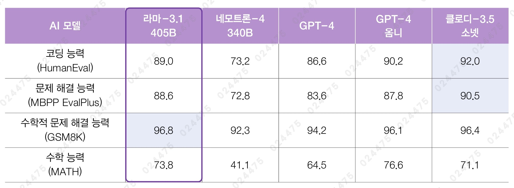

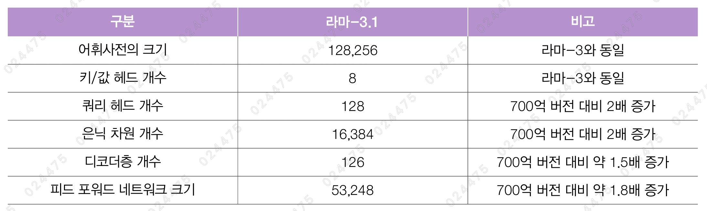

- 2024년 7월에 공개
- 80억, 700억, 4,050억 파라미터 버전의 모델이 있음
- 문맥 길이: 131,072(128K)
- 영어, 독일어, 프랑스어, 이탈리아어, 포르투갈어, 힌디어, 스페인어, 태국어를 지원하는 다국어 모델
- 4,050억 파라미터 버전은 수학과 코딩에서 뛰어난 능력을 보임

### Llama-3.2

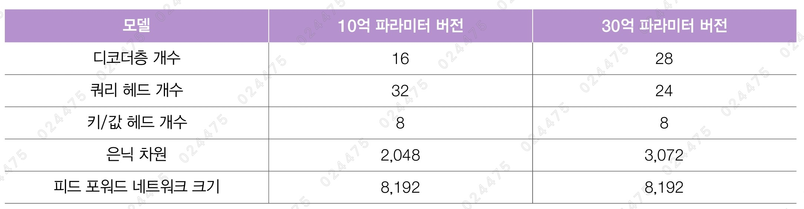

- 2024년 9월에 공개
- 10억, 30억, 110억, 900억 파라미터 버전의 모델이 있음
- 10억, 30억 파라미터 버전은 엣지(edge) 장치에서 활용할 가능성을 높인 소규모 언어 모델(Small Language Model, SLM)임
  - 모델의 크기를 줄였지만 높은 성능을 달성할 수 있는 이유는 가지치기(pruning)와 지식 정제(knowledge distillation) 기법을 사용했기 때문임
  - 가지치기를 적용해 모델의 크기를 먼저 줄인 다음, 3.1 버전의 80억과 700억 파라미터 버전의 출력을 활용해 지식 정제를 수행함
- 110억, 900억 파라미터 버전은 이미지 입력을 다룰 수 있는 라마 최초의 멀티 모달(multi-modal) 모델임
  - 멀티 모달: 다양한 형태의 데이터를 동시에 처리하는 기술로, 텍스트, 이미지, 음성 등을 한 모델에서 모두 이행하고 처리할 수 있음
  - 이미지 입력을 이미지 토큰으로 변환한 다음, 텍스트 토큰을 처리하는 디코더층에 있는 크로스 어텐션층에 주입함
  - 이런 과정을 통해 모델이 입력된 이미지를 이해하면서 텍스트 토큰을 생성할 수 있음

### Llama-3.3

- 2024년 12월에 공개
- 700억 파라미터 버전의 모델이 있음
- 4,050억 파라미터 버전의 라마-3.1 모델과 비슷한 수준의 성능을 발휘함
- 다국어 능력이 크게 향상됨
- 하이퍼파라미터
  - 쿼드 헤드의 개수: 64개
  - 은닉 차원의 크기: 8,192개
  - 디코더층의 개수: 80개
  - 피드 포워드 네트워크의 크기: 28,672개

### Llama-4

- 2025년 4월에 공개
- 라마-4는 모두 멀티 모달 모델임
- MoE(Mixture of Experts) 기법을 사용함
- 16개의 엑스퍼트(Expert)를 사용하는 스카우트(Scout), 128개의 엑스퍼트를 사용하는 매버릭(Maverick)이 공개됨
- 실제 추론 시에는 하나의 엑스퍼트가 활성화되므로, 스카우트와 매버릭은 각각 1,090억 개 파라미터와 4,000억 개 파라미터 중에 170억 개 파라미터를 사용하여 추론을 수행함
