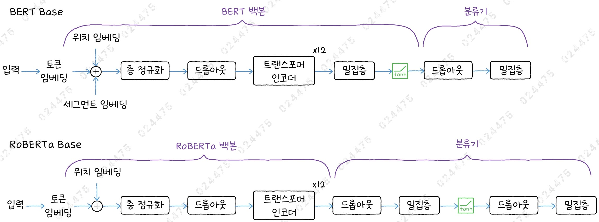
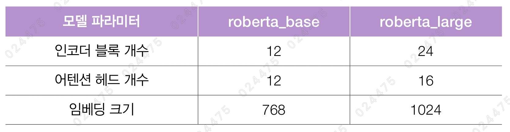
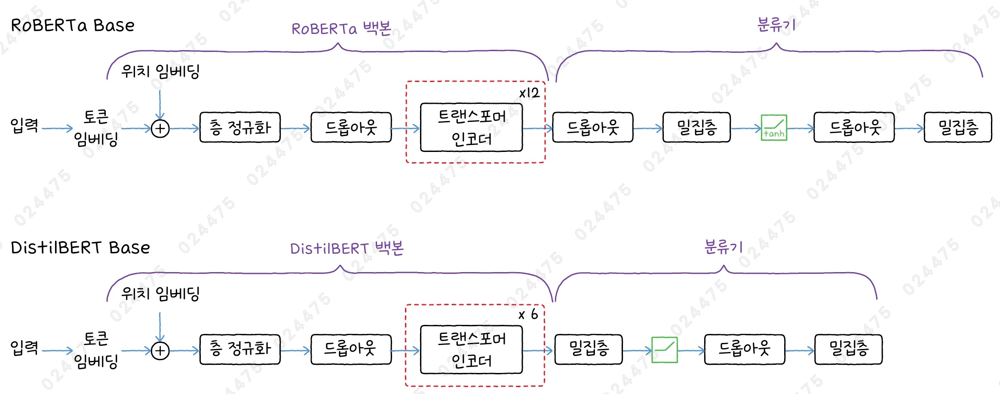
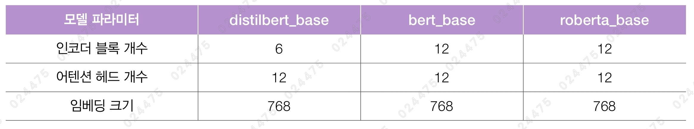

# ✔ BERT 후속 모델로 영화 리뷰 텍스트의 감성 분류하기

> ['BERT 후속 모델로 영화 리뷰 텍스트의 감성 분류하기' 구글 코랩](https://colab.research.google.com/github/rickiepark/hm-dl/blob/main/04-3.ipynb)

## 1️⃣ BERT의 성능 개선 모델 - RoBERTa

- A Robustly Optimized BERT Pretraining Approach
- 2019년 워싱턴 대학과 페이스북 AI 연구원들이 주도하여 만든 BERT 기반의 대규모 언어 모델

### BERT vs RoBERTa

| 차이점         | BERT                                           | RoBERTa                                       |
| -------------- | ---------------------------------------------- | --------------------------------------------- |
| 데이터 출처    | 위키피디아, 북코퍼스                           | 위키피디아, 북코퍼스, 뉴스 기사, 웹 크롤링 등 |
| 데이터 규모    | 16GB                                           | 160GB                                         |
| 사전 훈련 방식 | 다음 문장 예측(NSP), 마스크드 언어 모델링(MLM) | 마스크드 언어 모델링(MLM)                     |
| MLM 작업 방식  | 정적 마스킹                                    | 동적 마스킹                                   |
| 토크나이저     | 워드피스 토크나이저                            | 바이트 수준의 BPE 토크나이저                  |

- RoBERTa는 마스크드 언어 모델링(MLM)만 사용해 모델을 훈련했음
  - 따라서, 세그먼트 아이디가 필요 없음
- 정적 마스킹(Static Masking): 모든 에포크에서 마스킹하는 단어가 동일함
- 동적 마스킹(Dynamic Masking): 한 문장 안에서 에포크마다 다른 단어를 마스킹

### RoBERTa 구조



### RoBERTa 버전



- 하이퍼파라미터는 각각 bert_base, bert_large와 동일함
- 최대 입력 길이도 512로 BERT와 동일함
- 어휘사전 크기는 50,265로 30,522인 BERT보다 훨씬 큼

### KerasNLP로 RoBERTa 모델 만들기

#### 1. roberta_base 모델을 위한 모델 파라미터를 정의하자

```py
import keras
from keras import layers
import keras_nlp

# RoBERTa 백본
vocab_size = 50265
num_layers = 12
num_heads = 12
hidden_dim = 768
dropout = 0.1
activation = 'gelu'
max_seq_len = 512
```

#### 2. roberta_base 모델을 만들어보자

```py
token_ids = keras.Input(shape=(None,))
padding_mask = keras.Input(shape=(None,))

token_embedding = layers.Embedding(vocab_size, hidden_dim)(token_ids)
pos_embedding = keras_nlp.layers.PositionEmbedding(max_seq_len)(token_embedding)

x = layers.Add()((token_embedding, pos_embedding))
x = layers.LayerNormalization()(x)
x = layers.Dropout(dropout)(x)

for _ in range(num_layers):
   x = transformer_encoder(x, padding_mask, dropout, activation)

outputs = x
roberta_model = keras.Model(inputs=(token_ids, padding_mask),
                            outputs=(outputs))
```

#### 3. 모델의 구조를 확인해보자

```py
roberta_model.summary()
```


- 약 1억 2천만 개의 파라미터를 가지는데, 이는 bert_base에 비해 약 20% 정도의 모델 파라미터가 늘어난 것임
  - 이유: 모델의 어휘사전이 커졌기 때문

### KerasNLP로 RoBERTa 모델 로드하기

#### 1. KerasNLP에서 사전 훈련된 roberta_base 모델을 로드해보자

```py
roberta_classifier = keras_nlp.models.RobertaClassifier.from_preset(
    "roberta_base_en",
    num_classes=2
)

roberta_classifier.summary()
```


#### 2. RoBERTa 모델의 토크나이저로 샘플 텍스트를 변환해 보자

```py
roberta_tokenizer = roberta_classifier.preprocessor.tokenizer

token_ids = roberta_tokenizer.tokenize('"pandemonium" is a horror movie')
for id in token_ids:
    print(roberta_tokenizer.id_to_token(id), end=' ')
# " p and emonium " Ġis Ġa Ġhorror Ġmovie
```

- `tokenize()` 메서드: 텍스트를 토큰 아이디로 변환
- `id_to_token()` 메서드: 토큰 아이디를 토큰으로 변환
- BERT의 워드피스 토큰화 결과와 비교해보면, 'pandemonium' 단어를 다르게 나눈 것을 알 수 있음

### RoBERTa 모델 미세 튜닝하기

#### 1. 구글 드라이브에서 IMDB 데이터셋을 다운로드하고 압축을 해제하자

```
!gdown 15ZSv_07b3HCKKn08jSDLl4JO4EFy8t-t
!tar -xzf aclImdb_v1.tar.gz
# 비지도 학습에 사용하는 데이터는 삭제합니다.
!rm -r aclImdb/train/unsup
```

#### 2. aclImdb 폴더에 있는 데이터를 읽어와 훈련 세트, 검증 세트, 테스트 세트를 만들자

```py
train_ds, val_ds = keras.utils.text_dataset_from_directory('aclImdb/train',
                                                           subset='both',
                                                           validation_split=0.2,
                                                           seed=42)
test_ds = keras.utils.text_dataset_from_directory('aclImdb/test')
"""
Found 25000 files belonging to 2 classes.
Using 20000 files for training.
Using 5000 files for validation.
Found 25000 files belonging to 2 classes.
"""
```

#### 3. 기존 옵티마이저의 학습률을 낮추자

```py
roberta_classifier.optimizer.learning_rate.numpy()
# np.float32(5e-05)

roberta_classifier.optimizer.learning_rate.assign(5e-6)
```

- `optimize` 속성: 훈련에 사용한 옵티마이저 객체를 저장
- RobertaClassifier는 BertClassifier처럼 학습률이 5e-5인 Adam 옵티마이저를 사용함
- roberta_base 모델은 1억 개가 넘는 파라미터를 가지고 있어 상대적으로 작은 크기의 IMDB 데이터셋으로 미세 튜닝할 경우, 모델이 금방 과대적합할 가능성이 있음
- 따라서, 과대적합을 조금 완화하기 위해 학습률을 5e-6으로 설정함

#### 4. IMDB 데이터셋으로 roberta_base 모델을 미세 튜닝해보자

```py
early_stopping_cb = keras.callbacks.EarlyStopping(patience=5,
                                                  restore_best_weights=True)
hist = roberta_classifier.fit(train_ds, validation_data=val_ds, epochs=20,
                              callbacks=[early_stopping_cb])
```


- 훈련 결과를 보니, 검증 세트에 대한 정확도가 94%가 넘음

#### 5. 손실과 정확도 그래프를 그려보자

```py
import numpy as np
import matplotlib.pyplot as plt

epochs = np.array(hist.epoch) + 1
fig, axs = plt.subplots(1, 2, figsize=(12, 4))
axs[0].plot(epochs, hist.history['loss'], label='loss')
axs[0].plot(epochs, hist.history['val_loss'], label='val_loss')
axs[0].set_xticks(epochs)
axs[0].set_xlabel('epoch')
axs[0].set_ylabel('loss')
axs[0].legend()
axs[1].plot(epochs, hist.history['sparse_categorical_accuracy'],
            label='accuracy')
axs[1].plot(epochs, hist.history['val_sparse_categorical_accuracy'],
            label='val_accuracy')
axs[1].set_xticks(epochs)
axs[1].set_xlabel('epoch')
axs[1].set_ylabel('accuracy')
axs[1].legend()
plt.show()
```


#### 6. 테스트 세트를 사용해 미세 튜닝한 roberta_base 모델의 성능을 확인해보자

```py
roberta_classifier.evaluate(test_ds)
# [0.13070203363895416, 0.9545999765396118]
```

- bert_tiny 모델을 미세 튜닝한 것(87%)보다 더 좋은 성능(95%)을 냄

## 2️⃣ BERT의 경량화 모델 - DistilBERT

- A Distilled Version of BERT
- 허깅페이스 연구원들이 발표한 BERT의 경량화 모델
- 지식 정제 방법으로 훈련해 BERT의 구조를 간소화하여 더 작은 크기로 압축한 모델
- BERT보다 40% 작고, 60% 빠르지만 정확도는 97% 이상을 유지함

### DistilBERT 구조



- 6개의 트랜스포머 인코더층을 사용함
- DistilBERT가 RoBERTa보다 작고 가벼운 경량화 모델임을 알 수 있음

### BERT vs RoBERTa vs DistilBERT



- DistilBERT의 어휘사전 크기, 시퀀스 최대 길이는 BERT와 동일
- DistilBERT는 BERT와 같은 워드피스 토크나이저를 사용함

### 지식 정제

- Knowledge Distillation
- 더 큰 모델인 티처(teacher) 모델이 학습한 지식을 더 작은 모델인 스튜던트 모델에 전달하는 방법
  - ex) 티처 모델: BERT, 스튜던트 모델: DistilBERT
- 마스크드 언어 모델링 작업에서 스튜던트의 출력이 티처의 출력에 가까워지도록 스튜던트를 훈련하는 것이 지식 정제의 핵심임
- 정제 손실: 두 모델의 출력 차이로 인한 손실
- DistilBERT는 지식 정제를 사용해 BERT의 지식을 전달받는 과정에서 마스크드 언어 모델링을 활용함
- 즉, 티처 모델 BERT는 문장에서 빈칸(마스크)을 예측하는 문제를 통해 훈련되며, 스튜던트 모델 DistilBERT은 이 예측 결과를 모방하여 BERT의 지식을 압축하게 됨

### 티처 모델 이해하기 - MLM을 위한 BERT

- 이전에 만든 BERT 백본 모델은 분류 작업에 사용하는 경우를 가정한 것임
- 분류 작업에서는 트랜스포머 인코더에서 첫 번째로 출력되는 토큰만 사용하지만, 마스크드 언어 모델링에서는 트랜스포머 인코더에서 마지막에 출력되는 모든 토큰을 사용함

#### 1. bert_base 모델을 위한 모델 파라미터를 정의해보자

```py
# BERT 베이스 MLM
vocab_size = 30522
num_layers = 12
num_heads = 12
hidden_dim = 768
dropout = 0.1
activation = 'gelu'
max_seq_len = 512
```

#### 2. MLM을 위한 bert_base 모델을 만들어보자

```py
token_ids = keras.Input(shape=(None,))
segment_ids = keras.Input(shape=(None,))
padding_mask = keras.Input(shape=(None,))
mlm_position = keras.Input(shape=(None,))

token_embedding_layer = keras_nlp.layers.ReversibleEmbedding(vocab_size, hidden_dim)
token_embedding = token_embedding_layer(token_ids)

pos_embedding = keras_nlp.layers.PositionEmbedding(max_seq_len)(token_embedding)
seg_embedding = layers.Embedding(2, hidden_dim)(segment_ids)

x = layers.Add()((token_embedding, pos_embedding, seg_embedding))
x = layers.LayerNormalization()(x)
x = layers.Dropout(dropout)(x)

for _ in range(num_layers):
    x = transformer_encoder(x, padding_mask, dropout, activation)

mlm_position = keras.ops.expand_dims(mlm_position, axis=-1)
x = keras.ops.take_along_axis(x, mlm_position, axis=1)

x = layers.Dense(hidden_dim, activation='gelu')(x)
x = layers.LayerNormalization()(x)
outputs = token_embedding_layer(x, reverse=True)

model = keras.Model(inputs=(token_ids, segment_ids, padding_mask, mlm_position),
                    outputs=(outputs))
```

1. 입력 구성

   - `mlm_position`: MLM 작업을 위한 것으로, 입력 토큰 중 마스킹된 토큰의 인덱스를 저장함

2. 임베딩 처리

   - `ReversibleEmbedding` 층: 입력을 은닉 차원으로 바꾸는 보통의 임베딩 기능 외에 은닉 차원을 거꾸로 입력 차원으로 변환할 수 있음
   - 나중에 이 층을 사용해 어휘사전 크기의 출력을 만듦

3. 마스크 위치 출력

   - mlm_position의 크기는 (None,)인데, 입력 x의 차원과 맞추기 위해 (None, 1)로 만듦
   - `take_along_axis()` 함수: 입력 x에서 mlm_position에 있는 원소를 선택해 반환하는 함수로, 지정된 위치(마스킹된 단어의 위치)의 출력만 추출하게 됨

4. 마스크 토큰 예측
   - ReversibleEmbedding의 객체를 reverse=True로 호출하여 은닉 차원을 다시 어휘사전 크기로 변환함
   - 이로써, 마스킹된 위치에 들어갈 수 있는 단어(어휘사전에 속한 모든 토큰)에 대한 확률을 얻을 수 있음

#### 3. 모델의 구조를 확인해보자

```py
model.summary()
```


### 정제 손실 이해하기

- 손실 함수 종류
  1. 쿨백-라이블러 발산
  2. 크로스 엔트로피: 훈련 데이터의 타깃 값을 사용해 스튜던트 모델을 훈련하기 위한 손실 함수로, 스튜던트의 MLM 손실 함수라고도 부름
  3. 코사인 유사도: 티처 모델과 스튜던트 모델의 트랜스포머 블록의 마지막 출력이 같아지도록 도와주는 손실 함수로, 스튜던트의 코사인 임베딩 손실 함수라고도 부름

#### 쿨백-라이블러 발산 (Kullback-Leibler Diverenge) 손실

```
teacher_pred = softmax(teacher_output / temperature)
student_pred = softmax(student_output / temperature)
KLD_loss = teacher_pred * log(teacher_pred / student_pred)
```

- 티처 모델과 스튜던트 모델의 출력 값을 소프트맥스 함수에 통과시켜 확률분포로 변환한 뒤에 확률분포 간의 차이를 측정함
- 만약, 티처와 스튜던트의 출력 값이 같다면 KLD_loss는 0이 되고, 스튜던트 모델이 티처 모델을 완벽하게 모방한 상태를 의미함
- 소프트맥스 출력 값은 대개 특정 클래스에서 매우 높은 확률(0.99)이 나타나고 나머지 클래스에서 매우 낮은 확률(0.01)을 나타내는데, 이렇게 확률이 극단적으로 차이가 날 경우 큰 확률에만 맞추게 되므로 소프트맥스 함수에 통과하기 전 온도 파라미터를 적용하여 확률분포를 부드럽게 만듦
  - 부드러워진 확률분포를 사용하면 스튜던트 모델이 티처 모델의 미세한 확률 차이까지 학습할 수 있음
- 스튜던트 모델인 DistilBERT는 다른 손실과의 차원을 맞추기 위해, 정제 손실을 계산한 후 다시 온도 파라미터의 제곱을 곱해줌

#### 1. 1~7 사이의 값을 소프트맥스 함수에 통과시킨 후, 그 결괏값을 그래프로 그려보자

```py
from scipy.special import softmax

x = np.array([1, 2, 3, 4, 5, 6, 7])
pred = softmax(x)

plt.bar(x, pred)
plt.xlabel('x')
plt.ylabel('pred')
plt.show()
```


- 결과값을 확률처럼 생각하면 6과 7의 확률 차이는 0.3 이상임
- 여기서 랜덤하게 하나의 결과를 선택한다면 7이 선택될 확률이 높음

#### 2. 1~7 사이의 값을 5로 나누어 소프트맥스 함수에 통과시킨 후, 그 결괏값을 그래프로 그려보자

```py
pred = softmax(x/5)

plt.bar(x, pred)
plt.xlabel('x')
plt.ylabel('pred')
plt.show()
```


- 5로 나누어 소프트맥스 함수를 적용하면 1~7의 확률 값 차이가 줄어듦
- 여기서 랜덤하게 하나를 선택했을 때 7 외에 다른 숫자가 선택될 가능성이 큼
- 즉, 다양성이 증가함

#### 3. 1~7 사이의 값을 0.5로 나누어 소프트맥스 함수에 통과시킨 후, 그 결괏값을 그래프로 그려보자

```py
pred = softmax(x/0.5)

plt.bar(x, pred)
plt.xlabel('x')
plt.ylabel('pred')
plt.show()
```


- 온도 파라미터가 1이면 소프트맥스 출력과 같음
- 온도 파라미터가 1보다 크면 출력된 확률의 차이가 줄어들어 선택의 다양성이 올라감
- 온도 파라미터가 1보다 작으면 출력된 확률의 차이가 훨씬 커짐
- 여기서 랜덤하게 하나를 선택했을 때 7이 뽑힐 가능성이 매우 높음

### 스튜던트 모델 DistilBERT 사용하기

#### 1. KerasNLP에서 텍스트 분류 작업으로 미세튜닝하기 위해 distil_bert_base 모델을 로드해보자

```py
distilbert_classifier = keras_nlp.models.DistilBertClassifier.from_preset(
    'distil_bert_base_en_uncased',
    num_classes=2)
```

#### 2. 모델의 구조를 확인해보자

```py
distilbert_classifier.summary()
```


- 모델 파라미터 크기가 6천 6개만 개로, 1억 2천만 개인 BERT 모델보다 약 절반 가량이 적음

#### 3. 허깅페이스에서 마스킹된 토큰을 예측하는 distil_bert_base 모델을 로드해보자

```py
from transformers import pipeline

pipe = pipeline("fill-mask", device=0,
                model="distilbert/distilbert-base-uncased")

pipe('The goal of life is [MASK].')
"""
[{'score': 0.036191657185554504,
  'token': 8404,
  'token_str': 'happiness',
  'sequence': 'the goal of life is happiness.'},
 {'score': 0.030553549528121948,
  'token': 7691,
  'token_str': 'survival',
  'sequence': 'the goal of life is survival.'},
 {'score': 0.016977189108729362,
  'token': 12611,
  'token_str': 'salvation',
  'sequence': 'the goal of life is salvation.'},
 {'score': 0.016698457300662994,
  'token': 4071,
  'token_str': 'freedom',
  'sequence': 'the goal of life is freedom.'},
 {'score': 0.015267278999090195,
  'token': 8499,
  'token_str': 'unity',
  'sequence': 'the goal of life is unity.'}]
"""
```

- `[MASk]`로 표시된 부분에 채워질 단어를 예측함
- 실행 결과를 보면, 'happiness'가 가장 높은 확률(3.6%)로 예측됨

#### 4. 허깅페이스에서 텍스트의 감성 분석을 수행하는 미세 튜닝된 distil_bert_base 모델을 로드해보자

```py
pipe = pipeline(
    'text-classification', device=0,
    model='distilbert/distilbert-base-uncased-finetuned-sst-2-english'
    )

pipe('The movie is a bit boring and easy to guess')
"""
[{'label': 'NEGATIVE', 'score': 0.9997172951698303}]
"""
```

- SST-2: 로튼 토마토 리뷰로 구성된 감성 분석 데이터셋
- 이 모델은 SST-2에서 미세 튜닝된 distil_bert_base 모델임
- 실행 결과를 보면, 이 문장을 99.9%의 확률로 부정적으로 예측함

### DistilBERT로 IMDB 영화 리뷰 텍스트의 감성 분류하기

- 로튼 토마토 데이터셋에서 미세 튜닝된 distil_bert_base 모델을 IMDB 데이터셋에 적용해보자

#### 1. IMDB 영화 리뷰 데이터셋을 로드하자

```py
from datasets import load_dataset

ds = load_dataset("imdb")
print(ds)
"""
DatasetDict({
    train: Dataset({
        features: ['text', 'label'],
        num_rows: 25000
    })
    test: Dataset({
        features: ['text', 'label'],
        num_rows: 25000
    })
    unsupervised: Dataset({
        features: ['text', 'label'],
        num_rows: 50000
    })
})
"""
```

#### 2. 테스트 세트에서 1,000개의 샘플만 랜덤하게 추출하자

```py
test_slice = ds['test'].shuffle(seed=42).select(range(1000))
```

#### 3. 테스트 세트를 사용해 미세 튜닝된 distil_bert_base 모델을 평가해보자

```py
from evaluate import evaluator

task_evaluator = evaluator("text-classification")
task_evaluator.compute(
    model_or_pipeline=pipe,
    data=test_slice,
    metric="accuracy",
    input_column="text",
    label_column="label",
    label_mapping={"NEGATIVE": 0, "POSITIVE": 1}
    )
"""
{'accuracy': 0.881,
 'total_time_in_seconds': 6.420584699000074,
 'samples_per_second': 155.74905509084516,
 'latency_in_seconds': 0.006420584699000074}
"""
```

- `evaluator()` 함수: 모델을 평가
  - 작업을 지정하면 해당 작업에 맞는 Evaluator 클래스 객체를 반환해 줌
- Evaluator 클래스 객체에 `compute()` 메서드를 호출하면 원하는 작업에 대한 평가 수행이 가능함
- `model_or_pipeline` 매개변수: 모델이나 파이프라인 객체, 허깅페이스의 모델 경로를 전달
- `data` 매개변수: 평가할 데이터 지정
- `metric` 매개변수: 평가 지표 지정
- `input_column` 매개변수: 입력 데이터 지정
  - 기본값: 'text'
- `lable_column` 매개변수: 레이블 데이터 지정
  - 기본값: 'label'
- `label_mapping` 매개변수: 파이프라인의 출력과 데이터셋에 있는 레이블 값을 서로 연결해 주는 딕셔너리 지정
- 평가 결과를 보면, 88%의 정확도를 보여주고 있음

## cf) KerasNLP로 DistilBERT 모델 만들기

#### 1. distilbert_base 모델을 위한 모델 파라미터를 정의해보자

```py
import keras
from keras import layers
import keras_nlp

# DistilBERT 백본
vocab_size = 30522
num_layers = 6
num_heads = 12
hidden_dim = 768
dropout = 0.1
activation = 'gelu'
max_seq_len = 512
```

#### 2. distilbert_base 백본 모델을 만들어보자

```py
token_ids = keras.Input(shape=(None,))
padding_mask = keras.Input(shape=(None,))

token_embedding = layers.Embedding(vocab_size, hidden_dim)(token_ids)
pos_embedding = keras_nlp.layers.PositionEmbedding(max_seq_len)(token_embedding)

x = layers.Add()((token_embedding, pos_embedding))
x = layers.LayerNormalization()(x)
x = layers.Dropout(dropout)(x)

for _ in range(num_layers):
   x = transformer_encoder(x, padding_mask, dropout, activation)

outputs = x
distilbert_model = keras.Model(inputs=(token_ids, padding_mask),
                            outputs=(outputs))
```

#### 3. 모델의 구조를 확인해보자

```py
distilbert_model.summary()
```


