# ✔ T5 모델로 텍스트 요약하기

> ['T5 모델로 텍스트 요약하기' 구글 코랩](https://colab.research.google.com/github/rickiepark/hm-dl/blob/main/06-2.ipynb)

## 1️⃣ T5 모델 이해하기

- Text-to-Text Transfer Transformer
- 2019년 10월에 구글이 공개함
- 모든 문제를 텍스트 투 텍스트 프레임워크로 다룸
- 자연어 처리를 위한 모든 입력과 출력을 같은 방식(텍스트 → 텍스트)으로 변환하여 하나의 모델로 여러 작업을 수행할 수 있음
  - ex) 프롬프트 입력만 바꿔서 T5 하나로 문서를 번역하거나 요약하는 작업을 모두 수행할 수 있음
- 커먼 크롤(common crawl) 기반의 텍스트 데이터에 다양한 필터링을 적용하여 정제한 C4(colossal clean crawled corpus) 데이터셋을 사용해 훈련함 (약 800GB)
  - 커먼 크롤: 웹에서 공개된 방대한 양의 텍스트 데이터를 수집해 누구나 사용할 수 있도록 제공하는 비영리 데이터 저장소
- 센텐스피스 토크나이저를 사용함

### T5 인코더-디코더 구조

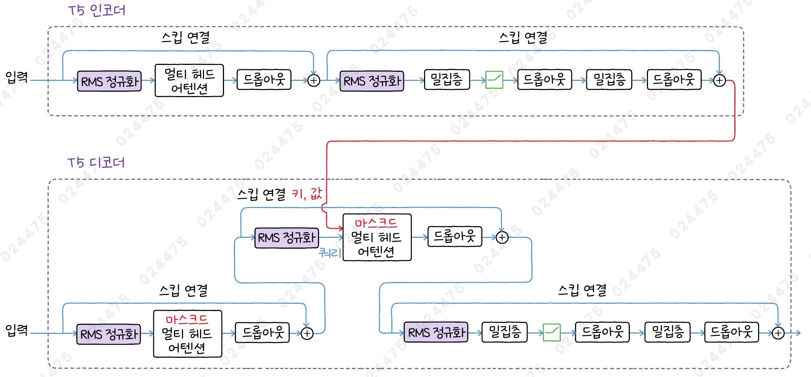

- RMS 정규화를 사용
- RMS 정규화는 스킵 연결이 시작하기 전에 등장함
- 피드 포워드 네트워크에서는 두 번째 밀집층 앞에도 드롭아웃이 있음

### T5 버전

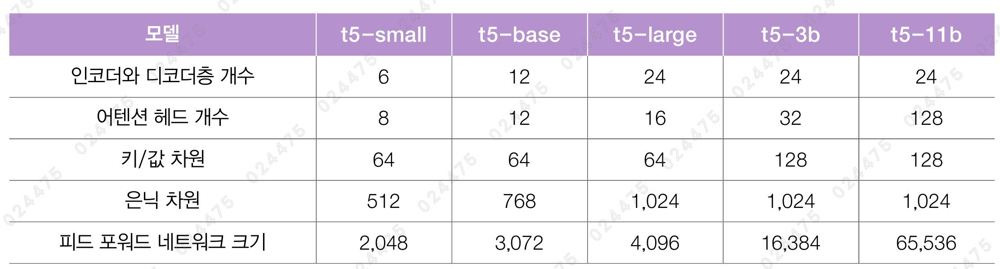

- 각각 6천만, 2.2억, 7.7억, 30억, 110억 개의 파라미터를 가짐
- small, base, large 모델의 키/값 차원은 은닉 차원을 헤드 개수로 나눈 값임
- 3b 모델부터는 헤드 개수가 훨씬 늘어남
- 3b, 11b 모델은 피드 포워드 네트워크 크기가 은닉 차원의 4배보다 훨씬 커짐
- 어휘사전 크기: 32,128

### T5 구조

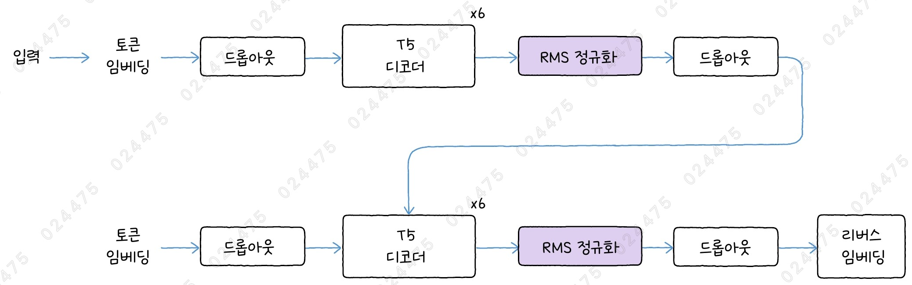

- T5 모델은 절대 위치 임베딩이 아닌 상대 위치 임베딩을 사용함

### 상대 위치 임베딩

- 쿼리 벡터와 키 벡터의 점곱 결과에 어떤 가중치를 더하는 것이 전부임
- 이 가중치는 모델의 훈련 과정에서 학습되며, 쿼리와 키의 거리 차이에 따라 달라짐
- 어텐션 편향(attention bias): 가중치
- 어텐션 버킷(attention bucket): 어텐션 편향을 담고 있는 배열
  - 입력된 토큰을 상대적인 거리에 따라 그룹(버킷)으로 나눠 어텐션 편향을 적용함

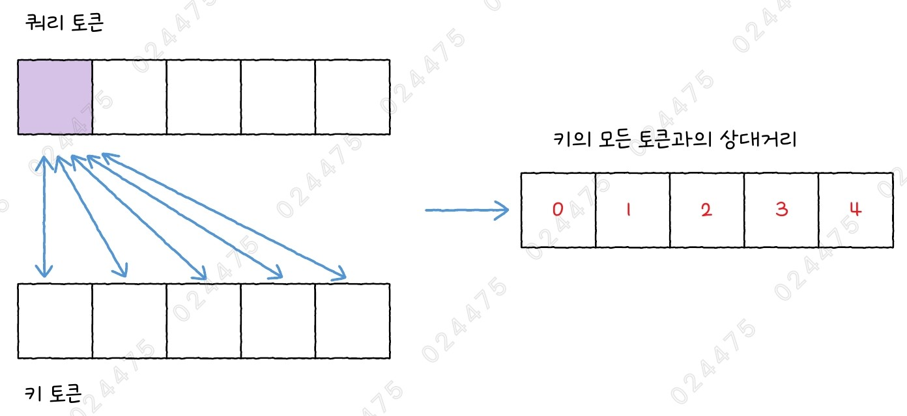
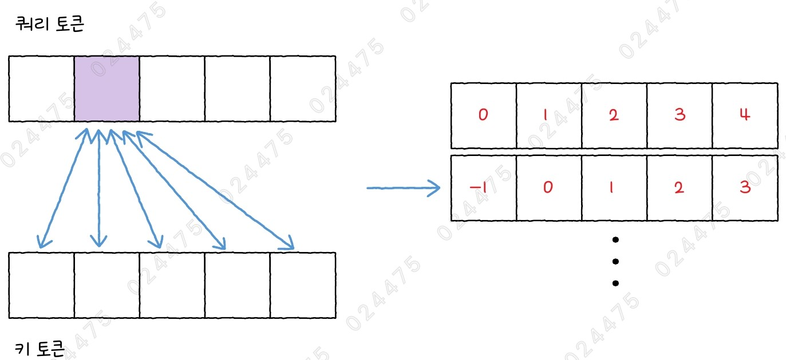

- 쿼리와 키의 길이가 각각 5라고 가정해보자
- 첫 번째 토큰과 키의 모든 토큰과의 상대 거리, 두 번째 토큰과 키의 모든 토큰과의 상대 거리는 위와 같음

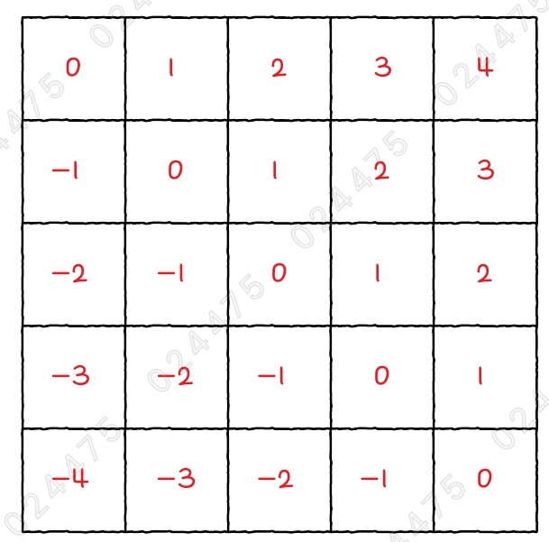

- 쿼리에 있는 모든 토큰에 대해 같은 작업을 반복하면 위와 같은 행렬을 얻을 수 있음
- 이 행렬의 절댓값이 바로 어텐션 버킷의 인덱스임
- 다만, 현재 쿼리 토큰보다 키 토큰이 앞에 있는지에 따라 다른 가중치를 사용함
- 이를 위해, 버킷 개수의 절반은 행렬의 주 대각선 아래에 해당하고, 나머지 버킷 개수의 절반의 주 대각선 위에 할당함

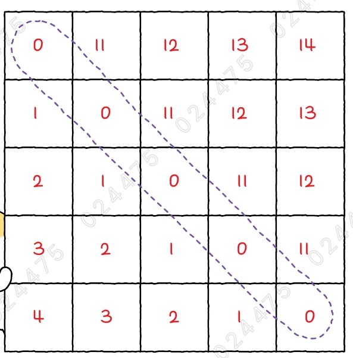

- 어텐션 버킷의 크기가 20이라고 하면, 위처럼 대략 절반에 해당하는 1~10까지의 인덱스는 주 대각선 아래, 11~19까지의 인덱스는 주 대각선 위에 할당됨
- 버킷을 좀 더 효율적으로 사용하기 위해, 전체 버키의 개수 절반까지는 쿼리와 키 토큰 사이의 거리에 따라 순서대로 할당하고, 나머지는 로그에 비례하여 할당함

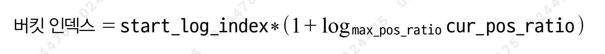

- 만약 버킷의 개수가 20개라면, 주 대각선 아래에 할당될 버킷 10개 중 4개까지는 토큰의 거리 1~4에 순서대로 할당되고, 그 다음부터는 위와 같은 식에 따라 할당됨
- start_log_index: 로그에 비례하여 할당하기 시작할 버킷 인덱스
- max_pos_ratio: 토큰 사이의 최대 거리를 start_log_index로 나눈 값
- cur_pos_ratio: 현재 상대 거리를 start_log_index로 나눈 값

#### 1. 토큰 상대 거리가 6, 7, 8일 때의 버킷 인덱스를 구해보자

```py
import numpy as np

int(5 * (1 + np.emath.logn(20/5, 6/5)))  # 5
int(5 * (1 + np.emath.logn(20/5, 7/5)))  # 6
int(5 * (1 + np.emath.logn(20/5, 8/5)))  # 6
```

- 아래 상황을 가정한 경우, 위와 같은 식으로 버킷 인덱스를 구할 수 있음
  - start_log_index: 5
  - 토큰 사이의 최대 거리: 20
- 토큰 상대 거리가 늘어나도 버킷 인덱스는 더디게 증가함
- 버킷 인덱스는 이런 식으로 토큰 사이의 최대 거리인 20에 도달할 때까지 증가하며, 토큰 사이의 최대 거리를 넘어간 다음에는 마지막 버킷 인덱스를 할당함
  - ex) 주 대각선 아래쪽에서 토큰 사이의 거리가 20 이상이 되면 마지막 버킷 인덱스인 10이 사용되고, 주 대각선 위쪽에서 토큰 사이의 거리가 20 이상이 되면 마지막 버킷 인덱스인 19가 사용됨

#### 2. 상대 위치 임베딩 함수를 만들어보자

```py
# 상대 위치 임베딩을 위한
def relpos_bucket_index(query_key_len, num_buckets,
                        max_pos, bidirectional):
    query_pos = np.arange(query_key_len).reshape(-1, 1)
    key_pos = np.arange(query_key_len).reshape(1, -1)
    # 쿼리와 키의 상대 위치를 나타내는 (len, len) 크기의 배열을 만듭니다.
    # 주대각선 위는 양수이고 아래에는 음수입니다.
    rel_pos = (key_pos - query_pos)
    # 양방향 셀프 어텐션은 주대각선 위와 아래를 위해 버킷을 절반으로 나눕니다.
    if bidirectional:
        num_buckets //= 2
    # 마스크드 셀프 어텐션은 주대각선 위의 값을 모두 삭제합니다.
    else:
        rel_pos = np.minimum(rel_pos, 0)
    # 상대 거리를 모두 양수로 바꿉니다.
    rel_pos = np.abs(rel_pos)
    # 버킷의 절반부터는 로그 스케일로 인덱스를 할당합니다.
    start_log_index = num_buckets // 2
    # 로그 인덱스 부분을 표시한 행렬을 만듭니다.
    is_log_index = rel_pos >= start_log_index
    # 로그 인덱스를 생성합니다.
    base = max_pos/start_log_index
    value = rel_pos/start_log_index
    # 로그 계산 log_{base}(value)를 ln(value)/ln(base)로 바꿉니다.
    log_index = start_log_index * \
                (1 + np.log(value, where=(value!=0))/np.log(base))
    log_index = log_index.astype('int')
    # 로그 인덱스가 전체 버킷 개수를 넘어가면 마지막 버킷 인덱스를 사용합니다.
    log_index = np.minimum(log_index, num_buckets - 1)
    # start_log_index부터는 로그 인덱스를 사용하고,
    # 그 이전은 상대 위치를 버킷 인덱스로 사용합니다.
    rel_pos = np.where(is_log_index, log_index, rel_pos)
    # 양방향 셀프 어텐션일 경우 주대각선 위의 값은 버킷의 중간부터 사용합니다.
    if bidirectional:
        upper_indexes = np.triu_indices(query_key_len, 1)
        rel_pos[upper_indexes] += num_buckets
    return rel_pos
```

- 디코더에 있는 마스크드 멀티 헤드 어텐션의 경우에는, 미래 토큰에 대해 마스킹되므로 주 대각선 위의 상대 거리를 고려할 필요가 없음
  - 따라서, 모든 버킷을 주 대각선 아래에 할당함

#### 3. 쿼리와 키의 길이가 10, 버킷 개수는 20, 최대 토큰 거리가 20일 때 상대 위치 임베딩을 위한 버킷 인덱스를 구해보자

```py
relpos_bucket_index(10, 20, 20, True)
"""
array([[ 0, 11, 12, 13, 14, 15, 15, 16, 16, 17],
       [ 1,  0, 11, 12, 13, 14, 15, 15, 16, 16],
       [ 2,  1,  0, 11, 12, 13, 14, 15, 15, 16],
       [ 3,  2,  1,  0, 11, 12, 13, 14, 15, 15],
       [ 4,  3,  2,  1,  0, 11, 12, 13, 14, 15],
       [ 5,  4,  3,  2,  1,  0, 11, 12, 13, 14],
       [ 5,  5,  4,  3,  2,  1,  0, 11, 12, 13],
       [ 6,  5,  5,  4,  3,  2,  1,  0, 11, 12],
       [ 6,  6,  5,  5,  4,  3,  2,  1,  0, 11],
       [ 7,  6,  6,  5,  5,  4,  3,  2,  1,  0]])
"""
```

- T5 모델이 사용하는 버킷의 개수는 32개이고, 최대 토큰 거리는 128임
- 인코더와 디코더의 첫 번째 층에서 상대 거리에 대한 가중치를 구한 후, 나머지 층에서는 단순하게 이 가중치를 재사용함
- 또한, 디코더의 크로스 어텐션에서는 상대 위치 임베딩을 사용하지 않음

## 2️⃣ T5 모델로 텍스트 요약하기

### T5 인코더/디코더 모듈 만들기

#### 1. T5 인코더 만들기

```py
import keras
import keras_nlp
from keras import layers
from keras_nlp.src.models.t5.t5_layer_norm import T5LayerNorm
from keras_nlp.src.models.t5.t5_multi_head_attention import T5MultiHeadAttention

def t5_encoder(x, position_bias,
               padding_mask, dropout, activation='relu'):
    residual = x
    x = T5LayerNorm()(x)
    # position_bias가 None이면 use_relative_attention_bias을 True로 지정합니다.
    if position_bias is None:
        use_relative_attention_bias = True
    else:
        use_relative_attention_bias = False
    # use_relative_attention_bias로 position_bias를 재사용할지 결정합니다.
    self_attention = T5MultiHeadAttention(
        is_decoder=False, hidden_dim=hidden_dim,
        key_value_dim=key_value_dim, num_heads=num_heads,
        use_relative_attention_bias=use_relative_attention_bias,
        dropout=dropout
        )
    padding_mask = keras.ops.expand_dims(padding_mask, axis=1)
    x, position_bias = self_attention(x, mask=padding_mask,
                                      position_bias=position_bias)
    x = layers.Dropout(dropout)(x)
    # 스킵 연결
    x = x + residual
    # 스킵 연결을 준비합니다.
    residual = x
    # 위치별 피드 포워드 네트워크
    x = T5LayerNorm()(x)
    x = layers.Dense(intermediate_dim, activation=activation, use_bias=False)(x)
    x = layers.Dropout(dropout)(x)
    x = layers.Dense(hidden_dim, use_bias=False)(x)
    x = layers.Dropout(dropout)(x)
    # 스킵 연결
    x = x + residual
    # 다음 층에서 재사용할 수 있도록 어텐션 편향을 반환합니다.
    return x, position_bias
```

- T5 모델의 어텐션층 안에 상대 위치 임베딩이 구현되어 있기 때문에, 케라스에서 제공하는 T5 어텐션층을 사용하면 손쉽게 구현할 수 있음
- position_bias는 어텐션 편향을 저장하고 있는 배열로, 크기가 (1, num_heads, seq_len, key_len)임
- position_bias가 None이면 첫 번째 인코더이므로 어텐션 편향을 계산하도록 use_relative_attention_bias를 True로 지정함
- 두 번째 인코더부터는 position_bias를 재사용하므로 use_relative_attention_bias가 False가 됨
- T5MultiHeadAttention 층은 인코더와 디코더에 사용될 때 어텐션 편향을 구하는 방식이 다르므로 is_decoder 매개변수로 인코더/디코더 여부를 전달함

#### 2. T5 디코더 만들기

```py
def t5_decoder(x, encoder_output, position_bias,
               padding_mask, encoder_padding_mask, dropout, activation='relu'):
    # 어텐션 마스크를 계산합니다.
    attention_mask = AttentionMask()(padding_mask)
    # 스킵 연결을 준비합니다.
    residual = x
    x = T5LayerNorm()(x)
    # position_bias가 None이면 use_relative_attention_bias을 True로 지정합니다.
    if position_bias is None:
        use_relative_attention_bias = True
    else:
        use_relative_attention_bias = False
    # use_relative_attention_bias로 position_bias를 재사용할지 결정합니다.
    self_attention = T5MultiHeadAttention(
        is_decoder=True, hidden_dim=hidden_dim,
        key_value_dim=key_value_dim, num_heads=num_heads,
        use_relative_attention_bias=use_relative_attention_bias,
        dropout=dropout
        )
    x, position_bias = self_attention(x, mask=attention_mask,
                                      position_bias=position_bias)
    x = layers.Dropout(dropout)(x)
    # 스킵 연결
    x = x + residual
    # 스킵 연결을 준비합니다.
    residual = x
    x = T5LayerNorm()(x)
    # 크로스 어텐션에는 상대 위치 임베딩을 적용하지 않으므로
    # use_relative_attention_bias를 False로 지정합니다.
    cross_attention = T5MultiHeadAttention(
        is_decoder=True, hidden_dim=hidden_dim,
        key_value_dim=key_value_dim, num_heads=num_heads,
        use_relative_attention_bias=False,
        dropout=dropout
        )
    encoder_padding_mask = keras.ops.expand_dims(encoder_padding_mask, axis=1)
    x, _ = cross_attention(x, key_value_states=encoder_output,
                           mask=encoder_padding_mask)
    x = layers.Dropout(dropout)(x)
    # 스킵 연결
    x = x + residual
    # 스킵 연결을 준비합니다.
    residual = x
    # 위치별 피드 포워드 네트워크
    x = T5LayerNorm()(x)
    x = layers.Dense(intermediate_dim, activation=activation, use_bias=False)(x)
    x = layers.Dropout(dropout)(x)
    x = layers.Dense(hidden_dim, use_bias=False)(x)
    x = layers.Dropout(dropout)(x)
    # 스킵 연결
    x = x + residual
    # 다음 층에서 재사용할 수 있도록 어텐션 편향을 반환합니다.
    return x, position_bias
```

### T5 인코더-디코더 모델 만들기

#### 1. T5 small 모델을 위한 모델 파라미터를 정의하자

```py
# T5
vocab_size = 32128
num_layers = 6
num_heads = 8
key_value_dim = 64
hidden_dim = 512
intermediate_dim = 2048
dropout = 0.1
activation = 'relu'
```

#### 2. T5 small 모델을 만들자

```py
encoder_token_ids = keras.Input(shape=(None,))
encoder_padding_mask = keras.Input(shape=(None,))
decoder_token_ids = keras.Input(shape=(None,))
decoder_padding_mask = keras.Input(shape=(None,))

token_embedding_layer = keras_nlp.layers.ReversibleEmbedding(vocab_size, hidden_dim)
encoder_token_embedding = token_embedding_layer(encoder_token_ids)
x = layers.Dropout(dropout)(encoder_token_embedding)

# 어텐션 편향 배열을 초기화합니다.
position_bias = None
for i in range(num_layers):
    # 첫 번째 층에서만 어텐션 편향을 계산하고 다른 층은 맨 처음 계산하여 구한 값을 재사용합니다.
    x, position_bias = t5_encoder(
        x, position_bias=position_bias,
        padding_mask=encoder_padding_mask, dropout=dropout)
x = T5LayerNorm()(x)
x = layers.Dropout(dropout)(x)
encoder_output = x

decoder_token_embedding = token_embedding_layer(decoder_token_ids)
x = layers.Dropout(dropout)(decoder_token_embedding)

# 어텐션 편향 배열을 초기화합니다.
position_bias = None
for i in range(num_layers):
    # 첫 번째 층에서만 어텐션 편향을 계산하고 다른 층은 맨 처음 계산하여 구한 값을 재사용합니다.
    x, position_bias = t5_decoder(
        x, encoder_output=encoder_output,
        position_bias=position_bias,
        padding_mask=decoder_padding_mask,
        encoder_padding_mask=encoder_padding_mask, dropout=dropout)
x = T5LayerNorm()(x)
x = layers.Dropout(dropout)(x)
decoder_output = token_embedding_layer(x, reverse=True)

model = keras.Model(inputs=(encoder_token_ids, encoder_padding_mask,
                            decoder_token_ids, decoder_padding_mask),
                    outputs=(encoder_output, decoder_output))
```

#### 3. 모델의 구조를 확인해보자

```py
model.summary()
```


- 출력 결과를 보면, 모델 파라미터 개수가 약 6천 만개임

### 사전 훈련된 T5 모델로 텍스트 요약하기

#### 1. 허깅페이스에서 t5-large 모델을 로드해보자

```py
from transformers import pipeline, set_seed

t5_pipe = pipeline("summarization", model="google-t5/t5-small")
```

#### 2. t5-large 모델의 파라미터 개수를 확인해보자

```py
total_params = sum(p.numel() for p in t5_pipe.model.parameters())
print(total_params)  # 60506624
```

- torchinfo 라이브러리를 사용할 수 있지만, 이 패키지는 재사용된 가중치를 고려하지 못함
- 파이토치 모델은 모든 층의 파라미터를 파이썬 제너레이터 형식으로 반환하는 parameters() 메서드를 제공함
- `numel()` 메서드: 텐서에 담긴 원소의 개수를 반환함

#### 3. t5-large 모델을 사용해 텍스트를 요약해보자

```py
ENG_TEXT = """
Voyager 1 is a space probe launched by NASA on September 5, 1977, as part of the Voyager program to study the outer Solar System and the interstellar space beyond the Sun's heliosphere. It was launched 16 days after its twin, Voyager 2. It communicates through the NASA Deep Space Network (DSN) to receive routine commands and to transmit data to Earth. Real-time distance and velocity data are provided by NASA and JPL. At a distance of 162.7 AU (24.3 billion km; 15.1 billion mi) from Earth as of May 2024, it is the most distant humanmade object from Earth.
"""

set_seed(42)
t5_pipe(ENG_TEXT, max_length=70, do_sample=True, top_k=10, temperature=3.0)
"""
[{'summary_text': 'Voyager was launched 16 days after its twin . it communicates through the NASA Deep Space Network . It is a distance of 162.7 AU (24.3 billion km; 15.1 billion mi) from Earth as of May 2024 .'}]
"""
```

## 3️⃣ T5-1.1 모델로 텍스트 요약하기

### T5-1.1 인코더-디코더 구조

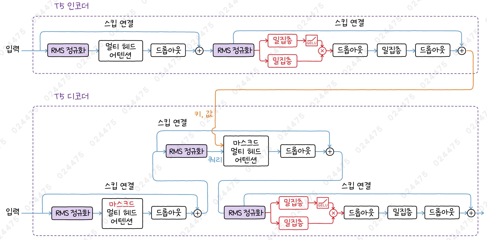

- 피드 포워드 네트워크에 ReLU 함수 대신 GeGLU 활성화 함수를 사용함
- C4 데이터셋에서 사전 훈련을 했고, 훈련할 때 드롭아웃을 사용하지 않음
  - 하지만, 미세 튜닝할 때는 드롭아웃을 사용해야 함

### T5-1.1 구조

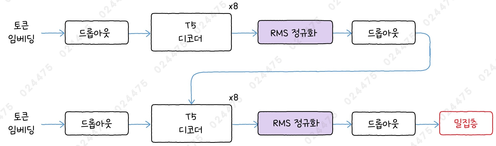

- 토큰에 대한 로짓 출력을 위한 마지막 층에서 임베딩층의 가중치를 재사용하지 않고, 별도의 밀집층을 둠

### T5-1.1 버전

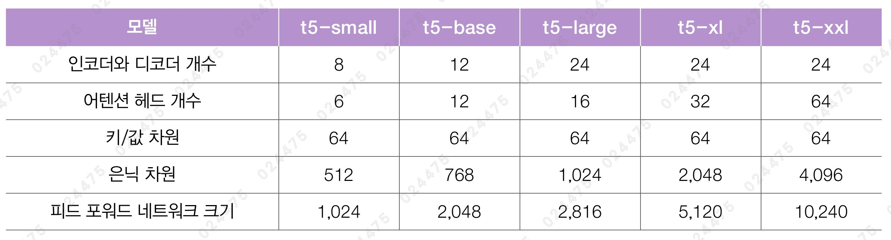

#### 1. 허깅페이스에서 mT5 모델을 로드해보자

```py
t5_ko_pipe = pipeline("summarization", model="csebuetnlp/mT5_multilingual_XLSum")
```

- `mT5` 모델: 다국어 데이터셋인 mC4 데이터셋에서 학습된 모델
  - T5-1.1 버전의 구조와 매우 비슷함
  - 어휘사전 크기를 350,112개로 늘림
- `mT5_multilingual_XLSum` 모델: 45개 언어로 구성된 XLSum 다국어 데이터셋에서 미세 튜닝한 모델

#### 2. mT5 모델을 사용해서 텍스트를 요약해보자

```py
KOR_TEXT = """
2023-2024년 쉰드흐누퀴르 분화는 2023년 12월 18일 저녁 아이슬란드 그린다비크에 있는 쉰드흐누퀴르 분화구에서 화산 폭발이 발생해 지상에 있는 열극에서 용암이 분출한 사건이다. 용암 분출과 뒤따른 지진 활동 빈도는 다음 날인 2023년 12월 19일부터 감소했으나 새로 열린 열극의 양쪽에서 용암이 옆으로 넓게 퍼져나갔다. 이번 분화는 2021년 분화 시작 이래 쉬뒤르네스에서 일어난 가장 큰 분화로 최대 100 m 높이의 용암 분수가 관측되었으며 분화지에서 약 42 km 떨어진 아이슬란드의 수도 레이캬비크에서도 화산 분화 장면을 볼 수 있었다. 화산 분화는 2023년 12월 21일 화산 상공 관측 결과 더 이상의 용암 분출이 보이지 않아 종료되었으나 아이슬란드 기상청은 "분화 종식을 선언하기에는 너무 이르다"며 지속적으로 관측하겠다고 말했다. 쉰드흐누퀴르는 현재 화산지대이자 쉬뒤르네스 열곡대의 활성 열극에 속한다.
"""

set_seed(42)
t5_ko_pipe(KOR_TEXT, max_length=70)
"""
[{'summary_text': '아이슬란드에서 화산 폭발로 일어난 최대 용암 분화가 사실상 종식됐다.'}]
"""
```

## cf) T5-1.1 small 모델 만들기

### T5-1.1 인코더/디코더 모듈 만들기

#### 1. T5-1.1 인코더 만들기

```py
def t5_1_1_encoder(x, position_bias,
                   padding_mask, dropout):
    residual = x
    x = T5LayerNorm()(x)
    # position_bias가 None이면 use_relative_attention_bias을 True로 지정합니다.
    if position_bias is None:
        use_relative_attention_bias = True
    else:
        use_relative_attention_bias = False
    # use_relative_attention_bias로 position_bias를 재사용할지 결정합니다.
    self_attention = T5MultiHeadAttention(
        is_decoder=False, hidden_dim=hidden_dim,
        key_value_dim=key_value_dim, num_heads=num_heads,
        use_relative_attention_bias=use_relative_attention_bias,
        dropout=dropout
        )
    padding_mask = keras.ops.expand_dims(padding_mask, axis=1)
    x, position_bias = self_attention(x, mask=padding_mask,
                                      position_bias=position_bias)
    x = layers.Dropout(dropout)(x)
    # 스킵 연결
    x = x + residual
    # 스킵 연결을 준비합니다.
    residual = x
    # 위치별 피드 포워드 네트워크
    x = T5LayerNorm()(x)
    x1 = layers.Dense(intermediate_dim, activation='gelu', use_bias=False)(x)
    x2 = layers.Dense(intermediate_dim, use_bias=False)(x)
    x = x1 * x2
    x = layers.Dropout(dropout)(x)
    x = layers.Dense(hidden_dim, use_bias=False)(x)
    x = layers.Dropout(dropout)(x)
    # 스킵 연결
    x = x + residual
    # 다음 층에서 재사용할 수 있도록 어텐션 편향을 반환합니다.
    return x, position_bias
```

#### 2. T5-1.1 디코더 만들기

```py
def t5_1_1_decoder(x, encoder_output, position_bias,
                   padding_mask, encoder_padding_mask, dropout):
    # 어텐션 마스크를 계산합니다.
    attention_mask = AttentionMask()(padding_mask)
    # 스킵 연결을 준비합니다.
    residual = x
    x = T5LayerNorm()(x)
    # position_bias가 None이면 use_relative_attention_bias을 True로 지정합니다.
    if position_bias is None:
        use_relative_attention_bias = True
    else:
        use_relative_attention_bias = False
    # use_relative_attention_bias로 position_bias를 재사용할지 결정합니다.
    self_attention = T5MultiHeadAttention(
        is_decoder=True, hidden_dim=hidden_dim,
        key_value_dim=key_value_dim, num_heads=num_heads,
        use_relative_attention_bias=use_relative_attention_bias,
        dropout=dropout
        )
    x, position_bias = self_attention(x, mask=attention_mask,
                                      position_bias=position_bias)
    x = layers.Dropout(dropout)(x)
    # 스킵 연결
    x = x + residual
    # 스킵 연결을 준비합니다.
    residual = x
    x = T5LayerNorm()(x)
    # 크로스 어텐션에는 상대 위치 임베딩을 적용하지 않으므로
    # use_relative_attention_bias를 False로 지정합니다.
    cross_attention = T5MultiHeadAttention(
        is_decoder=True, hidden_dim=hidden_dim,
        key_value_dim=key_value_dim, num_heads=num_heads,
        use_relative_attention_bias=False,
        dropout=dropout
        )
    encoder_padding_mask = keras.ops.expand_dims(encoder_padding_mask, axis=1)
    x, _ = cross_attention(x, key_value_states=encoder_output,
                           mask=encoder_padding_mask)
    x = layers.Dropout(dropout)(x)
    # 스킵 연결
    x = x + residual
    # 스킵 연결을 준비합니다.
    residual = x
    # 위치별 피드 포워드 네트워크
    x = T5LayerNorm()(x)
    x1 = layers.Dense(intermediate_dim, activation='gelu', use_bias=False)(x)
    x2 = layers.Dense(intermediate_dim, use_bias=False)(x)
    x = x1 * x2
    x = layers.Dropout(dropout)(x)
    x = layers.Dense(hidden_dim, use_bias=False)(x)
    x = layers.Dropout(dropout)(x)
    # 스킵 연결
    x = x + residual
    # 다음 층에서 재사용할 수 있도록 어텐션 편향을 반환합니다.
    return x, position_bias
```

### T5-1.1 인코더-디코더 모델 만들기

#### 1. T5-1.1 small 모델을 위한 모델 파라미터를 정의하자

```py
# T5 1.1
vocab_size = 32128
num_layers = 8
num_heads = 6
key_value_dim = 64
hidden_dim = 512
intermediate_dim = 1024
dropout = 0.1
```

#### 2. T5-1.1 small 모델을 만들자

```py
encoder_token_ids = keras.Input(shape=(None,))
encoder_padding_mask = keras.Input(shape=(None,))
decoder_token_ids = keras.Input(shape=(None,))
decoder_padding_mask = keras.Input(shape=(None,))

token_embedding_layer = keras_nlp.layers.ReversibleEmbedding(
    vocab_size, hidden_dim,
    tie_weights=False)
encoder_token_embedding = token_embedding_layer(encoder_token_ids)
x = layers.Dropout(dropout)(encoder_token_embedding)

# 어텐션 편향 배열을 초기화합니다.
position_bias = None
for i in range(num_layers):
    # 첫 번째 층에서만 어텐션 편향을 계산하고 다른 층은 맨 처음 계산하여 구한 값을 재사용합니다.
    x, position_bias = t5_1_1_encoder(
        x, position_bias=position_bias,
        padding_mask=encoder_padding_mask, dropout=dropout)
x = T5LayerNorm()(x)
x = layers.Dropout(dropout)(x)
encoder_output = x

decoder_token_embedding = token_embedding_layer(decoder_token_ids)
x = layers.Dropout(dropout)(decoder_token_embedding)

# 어텐션 편향 배열을 초기화합니다.
position_bias = None
for i in range(num_layers):
    # 첫 번째 층에서만 어텐션 편향을 계산하고 다른 층은 맨 처음 계산하여 구한 값을 재사용합니다.
    x, position_bias = t5_1_1_decoder(
        x, encoder_output=encoder_output,
        position_bias=position_bias,
        padding_mask=decoder_padding_mask,
        encoder_padding_mask=encoder_padding_mask, dropout=dropout)
x = T5LayerNorm()(x)
x = layers.Dropout(dropout)(x)
decoder_output = token_embedding_layer(x, reverse=True)

model = keras.Model(inputs=(encoder_token_ids, encoder_padding_mask,
                            decoder_token_ids, decoder_padding_mask),
                    outputs=(encoder_output, decoder_output))
```

#### 3. 모델의 구조를 확인해보자

```py
model.summary()
```


