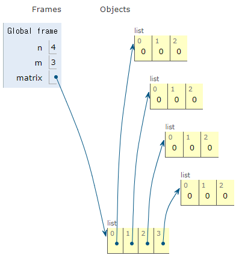
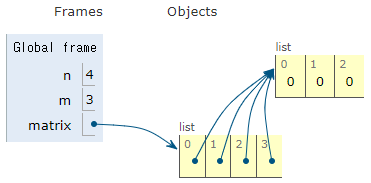

# ✔ 2차원 리스트
- 리스트를 원소로 가지는 리스트
- 2차원 리스트는 행렬(matrix)과 동일
  
  ```python
  # 3 x 4 행렬
  matrix = [[1, 2, 3, 4], [5, 6, 7, 8], [9, 10, 11, 12]]
  matrix = [
    [1, 2, 3, 4],
    [5, 6, 7, 8],
    [9, 10, 11, 12]
  ]
  ```

> 특정 값으로 초기화된 2차원 리스트 만들기
1. 직접 작성
   
   ```python
   # 4 x 3 행렬
   matrix = [[0, 0, 0], [0, 0, 0], [0, 0, 0], [0, 0, 0]]
   ```
2. 반복문으로 작성
   
   ```python
   # 4 x 3 행렬
   matrix = []
   for _ in range(4):
      matrix.append([0] * 3)
   ```
3. 리스트 컴프리헨션으로 작성
   
   ```python
   # 4 x 3 행렬
   matrix = [[0] * 3 for _ in range(4)]
   ```

> 주의) 리스트 컴프리헨션 vs 리스트 곱셈 연산
1. 리스트 컴프리헨션으로 행렬 작성
  
   ```python
   # n x m 행렬
   n = 4
   m = 3
   matrix = [[0] * m for _ in range(n)]
   
   print(matrix)   # [[0, 0, 0], [0, 0, 0], [0, 0, 0], [0, 0, 0]]

   # 원소값 변경 시
   matrix[0][0] = 1
   print(matrix)   # [[1, 0, 0], [0, 0, 0], [0, 0, 0], [0, 0, 0]]
   ```

   

2. 리스트 곱셈 연산으로 행렬 작성
   
   ```python
   # n x m 행렬
   n = 4
   m = 3
   matrix = [[0] * m] * n
   
   print(matrix)   # [[0, 0, 0], [0, 0, 0], [0, 0, 0], [0, 0, 0]]
   
   # 원소값 변경 시
   matrix[0][0] = 1
   print(matrix)   # [[1, 0, 0], [1, 0, 0], [1, 0, 0], [1, 0, 0]]
   ```

   


> 2차원 리스트 입력 받기
1. 행렬의 크기가 미리 주어지는 경우
   
   ```python
   # 3 x 2 크기의 행렬
   # 1) 숫자 + 공백으로 주어지는 경우
   '''
   1 2 
   3 4
   5 6
   '''
   matrix = [list(map(int, input().split())) for _ in range(3)]

   # 2) 문자열로 주어지는 경우
   '''
   AB
   CD
   EF
   '''
   matrix = [list(input()) for _ in range(3)]
   ```

2. 행렬의 크기가 입력으로 주어지는 경우
   
   ```python
   # M x N 크기의 행렬
   matrix = [list(map(int, input().split())) for _ in range(M)]
   ```

> 2차원 리스트 순회
1. 이중 for문을 이용한 행 우선 순회
   
   ```python
   # 3 x 4 행렬
   matrix = [
      [1, 2, 3, 4],
      [5, 6, 7, 8],
      [9, 0, 1, 2]
   ]

   for r in range(3):
      for c in range(4):
         print(matrix[r][c], end=' ')
      print()
   
   # 1 2 3 4
   # 5 6 7 8
   # 9 0 1 2
   ```

2. 이중 for문을 이용한 열 우선 순회
   
   ```python
   # 3 x 4 행렬
   matrix = [
      [1, 2, 3, 4],
      [5, 6, 7, 8],
      [9, 0, 1, 2]
   ]

   for c in range(4):
      for r in range(3):
         print(matrix[r][c], end=' ')
      print()
   
   # 1 5 9
   # 2 6 0
   # 3 7 1
   # 4 8 2
   ```

> 2차원 리스트 전치
- 전치(transpose): 행렬의 행과 열을 서로 맞바꾸는 것을 의미
  
  ```python
  # 3 x 4 행렬
  matrix = [
   [1, 2, 3, 4],
   [5, 6, 7, 8],
   [9, 0, 1, 2]
   ]

   transposed_matrix = [[0] * 3 for _ in range(4)]

   for c in range(4):
      for r in range(3):
         transposed_matrix[c][r] = matrix[r][c]
   
   # transposed_matrix = [
   #   [1, 5, 9],
   #   [2, 6, 0],
   #   [3, 7, 1],
   #   [4, 8, 2]
   # ]
   ```

> 2차원 리스트 회전
1. 왼쪽으로 90도 회전하기
   
   ```python
   # 3 x 3 행렬
   matrix = [
      [1, 2, 3],
      [4, 5, 6],
      [7, 8, 9]
   ]

   rotated_matrix = [[0] * 3 for _ in range(3)]
   
   for c in range(3):
      for r in range(3):
         rotated_matrix[c][r] = matrix[r][3 - c - 1]
   
   # rotated_matrix = [
   #   [3, 6, 9],
   #   [2, 5, 8],
   #   [1, 4, 7]
   # ]
   ```

2. 오른쪽으로 90도 회전하기
   
   ```python
   # 3 x 3 행렬
   matrix = [
      [1, 2, 3],
      [4, 5, 6],
      [7, 8, 9]
   ]

   rotated_matrix = [[0] * 3 for _ in range(3)]

   for c in range(3):
      for r in range(3):
         rotated_matrix[c][r] = matrix[3 - r - 1][c]
   
   # rotated_matrix = [
   #   [7, 4, 1],
   #   [8, 5, 2],
   #   [9, 6, 3]
   # ]
   ```

> cf) pythonic하게 2차원 리스트 문제 해결하는 방법
- 2차원 리스트 총합 구하기
  
  ```python
  # 3 x 4 행렬
  matrix = [
   [1, 1, 1, 1],
   [1, 1, 1, 1],
   [1, 1, 1, 1]
   ]

  # 방법1) 행 우선 순회를 이용한 방법
  total = 0
  for r in range(3):
      for c in range(4):
         total += matrix[r][c]
   
   # 방법2) pythonic한 방법
   total = sum(map(sum, matrix))
   ```

- 2차원 리스트의 최대값 구하기
  
  ```python
  # 3 x 4 행렬
  matrix = [
   [1, 2, 3, 4],
   [5, 6, 7, 8],
   [9, 0, 1, 2]
   ]

  # 방법1) 행 우선 순회를 이용한 방법
  max_val = 0
  for r in range(3):
      for c in range(4):
         if matrix[r][c] > max_val:
            max_val = matrix[r][c]
   
   # 방법2) pythonic한 방법
   max_val = max(map(max, matrix))
   ```