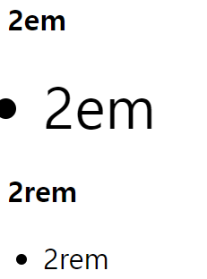

# ✔ CSS 구조 및 정의

> CSS 기본 구조


- CSS 구문은 선택자를 통해 스타일을 지정할 HTML 요소를 선택
- 중괄호 안에서는 속성과 값, 하나의 쌍으로 이루어진 선언을 진행
- 각 쌍은 선택한 요소의 속성, 속성에 부여할 값을 의미
  - 속성 (Property): 어떤 스타일 기능을 변경할지 결정
  - 값 (Value): 어떻게 스타일 기능을 변경할지 결정

> CSS 정의 방법

1. 인라인(inline) CSS 정의 
   
   ```html
   <body>
      <h1 style="color: blue; font-size: 100px;">Hello</h1>
   </body>
   ```

2. 내부(embedding) CSS 정의
   
   - `<style></style>` 태그 이용
   
   ```html
   <head>
      <style>
        h1 {
          color: black;
          font-size: 100px;
        }
      </style>
   </head>
   ```

3. 외부(link) CSS 정의
   - 분리된 CSS 파일의 링크를 연결

   ```css
   /* style.css 파일 */
   h1 {
      color: black;
      font-size: 100px;
   }
   ```

   ```html
   <!-- main.html 파일 -->
   <head>
      <link href="style.css" rel="stylesheet">
   </head>
   ```


# ✔ CSS 기본 단위

> 크기 단위

1. 절대 크기 - `픽셀 (px)`

   - 모니터 해상도의 한 화소인 픽셀 기준
   - 픽셀의 크기는 변하지 않기 때문에 고정적인 단위

2. 백분율 - `%`

   - 가변적인 레이아웃에서 자주 사용

   ```html
   <!-- HTML -->
   <body>
     <div class="box1">box1</div>
     <div class="box2">box2</div>
   </body>
   ```
 
   ```css
   /* CSS */
   .box1 { 
       width: 100px;
       height: 50px;
       background-color: blue;
     }
 
   .box2 {
     width: 50%;
     height: 50px;
     background-color: red;
   }
   ```

   

3. 상대 크기 - `em`, `rem`

   - `em`
  
     - (바로 위, **부모 요소**에 대한) 상속의 영향을 받음
     - 배수 단위, 요소에 지정된 사이즈에 상대적인 사이즈를 가짐

   - `rem`
  
     - (바로 위, 부모 요소에 대한) 상속의 영향을 받지 않음
     - **최상위 요소**(html)의 사이즈를 기준(16px)으로 배수 단위를 가짐

   ```html
   <!-- HTML -->
   <body>
     <h2 class="em">2em</h2>     <!-- 16px(루트) x 2 -->
     <ul class="em">
       <li class="em">2em</li>     <!-- 16px(루트) x 2 x 2-->
     </ul>
  
     <h2 class="rem">2rem</h2>     <!-- 16px(루트) x 2 -->
     <ul class="rem">
       <li class="rem">2rem</li>     <!-- 16px(루트) x 2 -->
     </ul>
   </body>
   ```

   ```css
   /* CSS */
   .em {
      font-size: 2em;
    }

   .rem {
     font-size: 2rem;
   }
   ```

   

> viewport에 따른 크기 단위
- viewport: 웹 페이지를 방문한 유저에게 바로 보이게 되는 웹 컨텐츠의 영역 (디바이스 화면)
- 디바이스의 viewport를 기준으로 상대적인 사이즈가 결정됨

1. `vw`, `vh`
  
2. `vmin`, `vmax`

> 색상 단위

1. 색상 키워드
   - 대소문자를 구분하지 않음
   - red, blue, black과 같은 특정 색을 직접 글자로 나타냄

   ```css
   /* CSS */
   p { 
     color: black; 
   }
   ```

2. RGB 색상
   - 16진수 표기법 혹른 함수형 표기법을 사용해서 특정 색을 표현하는 방식
     - 16진수 표기법: `# + 16진수`
     - 함수형 표기법: `rgb(red, green, blue)` 또는 `rgba(red, green, blue, 투명도)`

   ```css
   /* CSS */
   p { 
     color: #000; 
   }
 
   p { 
     color: #000000; 
   }
 
   p { 
     color: rgb(0, 0, 0); 
   }
 
   p { 
     color: rgba(0, 0, 0, 0.5); 
   }
   ```
 
3. HSL 색상
   - 색상, 채도, 명도를 통해 특정 색을 표현하는 방식
     - 함수형 표기법: `hsl(색상, 채도, 명도)` 또는 `hsla(색상, 채도, 명도, 투명도)`

   ```css
   /* CSS */
   p { 
     color: hsl(120, 100%, 0); 
   }
 
   p { 
     color: hsla(120, 100%, 50%, 0.5);
   }
   ```