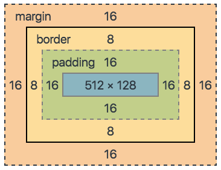

# ✔ Box model
> CSS normal flow
- 모든 요소는 네모(박스모델)임
- 모든 요소는 위에서부터 아래로, 왼쪽에서 오른쪽으로 쌓임 (좌측 상단에 배치)
  
  

> Box model
- 모든 HTML 요소는 box 형태로 되어있음
- 하나의 박스는 네 부분(영역)으로 이루어짐
  - margin, border, padding, content

  

1. `margin` 속성

   - 테두리 바깥의 외부 여백
   - 배경색을 지정할 수 없음

2. `border` 속성
   
   - 테두리 영역

3. `padding` 속성
   
   - 테두리 안쪽의 내부 여백
   - 요소에 적용된 배경색, 이미지는 padding까지 적용됨

4. `content` 속성
   
   - 글이나 이미지 등 요소의 실제 내용

> box-sizing
- 기본적으로 모든 요소의 box-sizing은 content-box 기준
  - 즉, padding을 제외한 순수 contents 영역만을 box로 지정
- 다만, 우리가 일반적으로 영역을 볼 때는 border까지의 너비를 100px 보는 것을 원함
  - 그 경우 box-sizing을 border-box로 설정