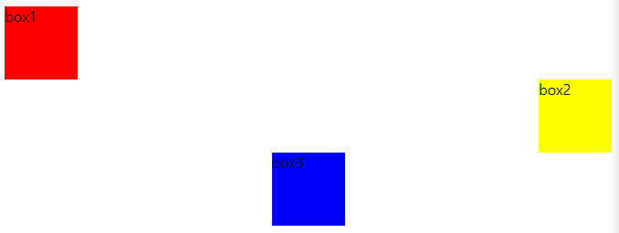
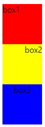

# ✔ CSS display

> CSS 기본 원칙
- display에 따라 크기와 배치가 달라짐

> 블록 레벨 요소 vs 인라인 레벨 요소
1. 블록 레벨 요소
   - div, ul, ol, li, p, hr, form 등
   - 수평 정렬 방법: margin 속성 이용

   ```html
   <!-- HTML -->
   <body>
     <div class="box1">box1</div>
     <div class="box2">box2</div>
     <div class="box3">box3</div>
   </body>
   ```

   ```css
   /* 왼쪽 정렬 */
   .box1 {
       width: 5rem;
       height: 5rem;
       background-color: red;
       margin-right: auto;
   }
   /* 오른쪽 정렬 */
   .box2 {
     width: 5rem;
     height: 5rem;
     background-color: yellow;
     margin-left: auto;
   }
   /* 중앙 정렬 */
   .box3 {
     width: 5rem;
     height: 5rem;
     background-color: blue;
     margin: 0px auto;
   }
   ```

   

2. 인라인 레벨 요소
   - span, a, img, input, label, b, em, i, strong 등
   - 수평 정렬 방법: text-align 속성 이용


   ```html
   <!-- HTML -->
   <body>
     <div class="box1">box1</div>
     <div class="box2">box2</div>
     <div class="box3">box3</div>
   </body>
   ```

   ```css
   /* 왼쪽 정렬 */
   .box1 {
       width: 5rem;
       height: 5rem;
       background-color: red;
       text-align: left;
   }
   /* 오른쪽 정렬 */
   .box2 {
     width: 5rem;
     height: 5rem;
     background-color: yellow;
     text-align: right;
   }
   /* 중앙 정렬 */
   .box3 {
     width: 5rem;
     height: 5rem;
     background-color: blue;
     text-align: center;
   }
   ```

   

> display 속성

```css
선택자 {
  display: none | block | inline | inline-block;
}
```
  
1. `none`
   
   - 해당 요소를 화면에 표시하지 않고, 공간조차 부여되지 않음
   
   - 이와 비슷한 `visibility: hidden`은 해당 요소가 공간은 차지하나 화면에 표시만 하지 않음
   
2. `block`

   - 줄 바꿈이 일어나는 요소
   - **화면 크기 전체**의 가로 폭을 차지함 
     - block의 기본 너비는 가질 수 있는 너비의 100%
     - 화면 크기 전체 100%의 너비를 가질 수 없다면 자동으로 margin이 부여됨
   - 블록 레벨 요소 안에 인라인 레벨 요소가 들어갈 수 있음

3. `inline`
   
   - 줄 바꿈이 일어나지 않는 행의 일부 요소
   - **content 너비**만큼 가로 폭을 차지함
   - width, height, margin-top, margin-bottom을 지정할 수 없음
   - 상하 여백은 line-height로 지정 가능

4. `inline-block`
   
   - 블록과 인라인 레벨 요소의 특징을 모두 가짐
     - 인라인처럼 한 줄에 표시 가능
     - 블록처럼 width, height, margin 속성을 모두 지정할 수 있음