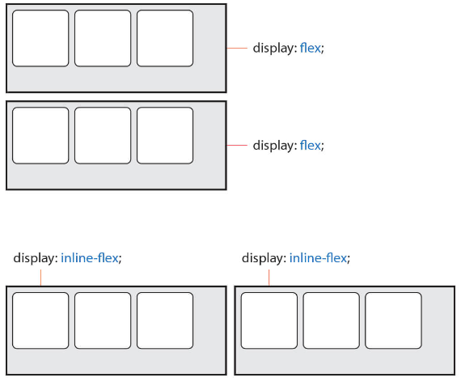
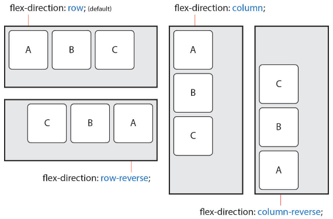
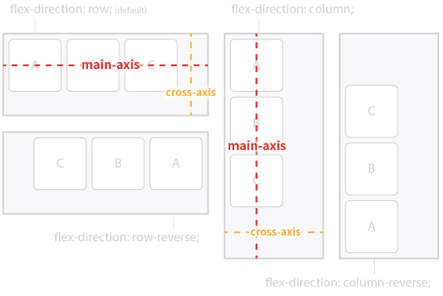
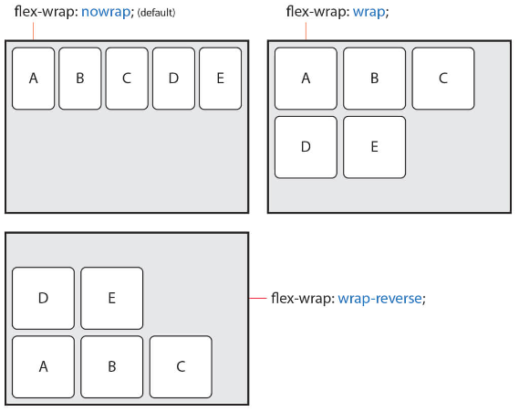
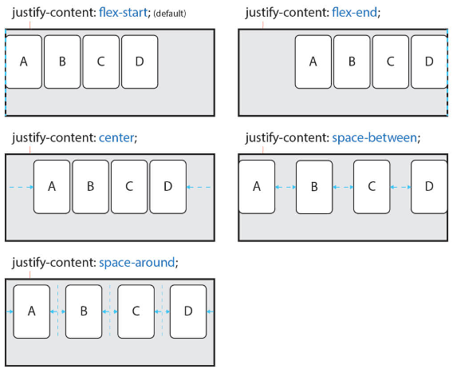
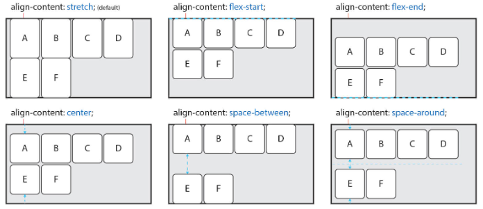
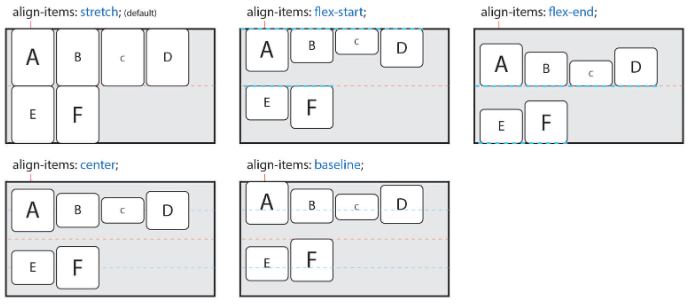
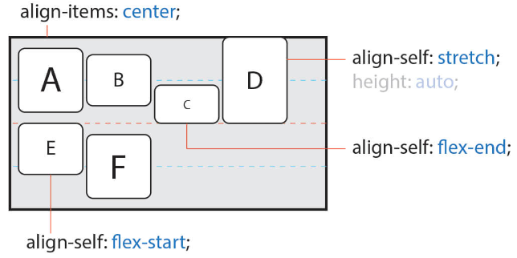
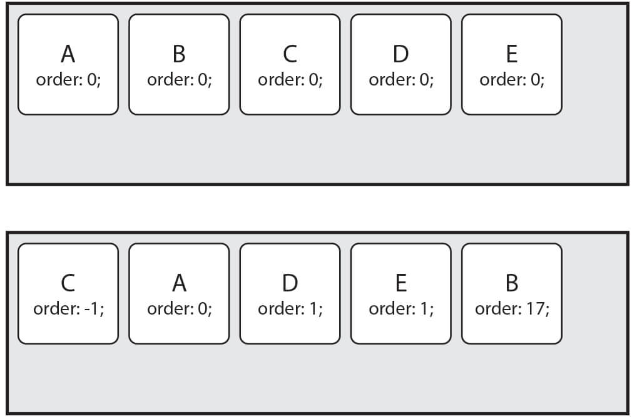
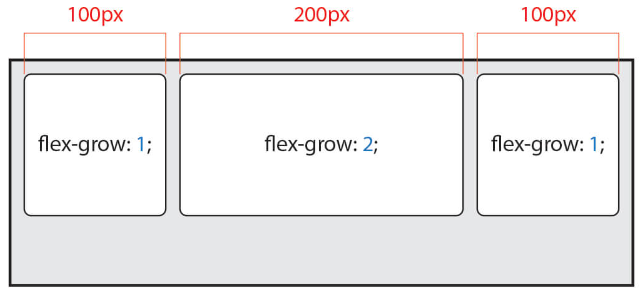

# ✔ CSS flexbox
- 행과 열 형태로 아이템들을 배치하는 1차원 레이아웃 모델
- 축: main axis (메인축), cross axis (교차축)
- 구성 요소: Flex Container (부모 요소), Flex Item (자식 요소)

  

- flexbox의 장점
  - 수동 값 부여 없이 수직 정렬
  - 아이템의 너비와 높이 혹은 간격을 동일하게 배치
- flex 속성
  - 배치 설정: flex-direction, flex-wrap
  - 공간 나누기: justify-content, align-content
  - 정렬: align-items, align-self

> Flexbox 구성요소
1. Flex Container (부모 요소)
   - flexbox 레이아웃을 형성하는 가장 기본적인 모델
   - Flex Item들이 놓여있는 영역
   - **부모 요소에 display 속성**을 flex 혹은 inline-flex로 지정
  
   ```css
   .flex-container {
     display: flex;
   }
   ```

   
   (참고자료: [https://heropy.blog/2018/11/24/css-flexible-box/]())

2. Flex Item (자식 요소)
   - 컨테이너에 속해 있는 컨텐츠 (박스)

> flex-direction 속성
- Main axis 기준 방향 설정
- 역방향의 경우 HTML 태그 선언 순서와 시각적으로 다르니 유의 (웹 접근성에 영향)

```css
선택자 {
  flex-direction: row | row-reverse | column | column-reverse;
}
```

1. `row` (기본값)
   
2. `row-reverse`
   
3. `column`
   
4. `column-reverse`
 
   
 
   
 
> flex-wrap 속성
- 아이템이 컨테이너를 벗어나는 경우, 해당 영역 내에 배치되도록 설정
- 요소들이 강제로 한 줄에 배치 되게 할 것인지 여부 설정
- 즉, 기본적으로 컨테이너 영역을 벗어나지 않도록 함

```css
선택자 {
  flex-wrap: nowrap | wrap | wrap-reverse;
}
```

1. `nowrap` (기본값) 
  
   - 한 줄에 배치

2. `wrap` 
  
   - 넘치면 그 다음 줄로 배치

   


> flex-flow 속성
- flex-direction 과 flex-wrap 의 shorthand
- flex-direction과 flex-wrap에 대한 설정 값을 차례로 작성

```css
선택자 {
  flex-flow: <flex-direction> <flex-wrap>;
}
```

> justify-content 속성
- Main axis를 기준으로 공간 배분

```css
선택자 {
  justify-content: flex-start | flex-end | center | space-between | space-around | space-evenly;
}
```

1. `flex-start` (기본값)
   - 아이템들을 axis 시작점으로

2. `flex-end`
   - 아이템들을 axis 끝 쪽으로

3. `center`
   - 아이템들을 axis 중앙으로

4. `space-between`
   - 아이템 사이의 간격을 균일하게 분배

5. `space-around`
   - 아이템을 둘러싼 영역을 균일하게 분배 (가질 수 있는 영역을 반으로 나눠서 양쪽에)

6. `space-evenly`
   - 전체 영역에서 아이템 간 간격을 균일하게 분배

   

> align-content 속성
- Cross axis를 기준으로 공간 배분 (아이템이 한 줄로 배치되는 경우 확인할 수 없음)

```css
선택자 {
  align-content: stretch | flex-start | flex-end | center | space-between | space-around | space-evenly;
}
```

1. `stretch` (기본값)

2. `flex-start`

3. `flex-end`

4. `center`

5. `space-between`

6. `space-around`

7. `space-evenly`

   

> align-items 속성
- 모든 아이템을 Cross axis를 기준으로 정렬

```css
선택자 {
  align-items: stretch | flex-start | flex-end | center | baseline;
}
```

1. `stretch` (기본값)
   - 컨테이너를 가득 채움

2. `flex-start`

3. `flex-end`

4. `center`

5. `baseline`
  - 텍스트 baseline에 기준선을 맞춤

   

> align-self 속성
- 개별 아이템을 Cross axis 기준으로 정렬
- 주의) 해당 속성은 컨테이너에 적용하는 것이 아니라 개별 아이템에 적용
  
```css
선택자 {
  align-self: stretch | flex-start | flex-end | center;
}
```

1. `stretch` (기본값)

2. `flex-start`

3. `flex-end`

4. `center`

   

> order 속성
- item의 순서를 결정
- item에 숫자를 지정하고 숫자가 클수록 순서가 밀림 (음수도 가능)

```css
선택자 {
  order: <숫자>;
}
```



> flex-grow 속성
- item의 증가 너비 비율을 설정
- 숫자가 크면 더 많은 너비를 가짐
- 기본값: 0

```css
선택자 {
  flex-grow: <증가너비>;
}
```




# ✔ flexbox 예시
> 수직 수평 가운데 정렬
1. 방법1) 컨테이너 설정

   ```css
   .container {
     display: flex;
     justify-content: center;
     align-items: center;
   }
   ```

2. 방법2) 아이템 설정

   ```css
   .container {
     display: flex;
   }
   .item {
     margin: auto;
   }
   ```