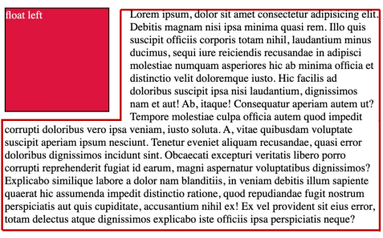

# ✔ CSS float
- 박스를 왼쪽 또는 오른쪽으로 이동시켜 텍스트를 포함 인라인요소들이 주변을 wrapping 하도록 함
- 요소가 Normal flow를 벗어나도록 함

> float 속성

```css
선택자 {
  float: none | left | right;
}
```

1. `none`

2. `left`

3. `right`
  


# ✔ float 속성 예시

- 박스의 오른쪽으로 텍스트 위치시키기

  ```html
  <!-- HTML -->
  <body>
    <div class="box left">float left</div>
    <p>lorem300</p>
  </body>
  ```

  ```css
  /* CSS */
  box {
    width: 150px;
    height: 150px;
    border: 1px solid black;
    background-color: crimson;
    color: white;
    margin-right: 30px;
  }
  .left {
    float: left;
  }
  ```

  