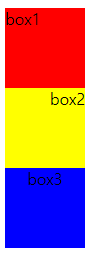

# ✔ CSS layout
> CSS layout 기술들
- Normal Flow
- [Display](https://github.com/hyejinny97/TIL/blob/master/CSS/display.md)
- [Position](https://github.com/hyejinny97/TIL/blob/master/CSS/position.md)
- [Float (1996)](https://github.com/hyejinny97/TIL/blob/master/CSS/float.md)
- [Flexbox (2012)](https://github.com/hyejinny97/TIL/blob/master/CSS/flexbox.md)
- [Grid (2017)](https://github.com/hyejinny97/TIL/blob/master/CSS/grid.md)
- 기타: Responsive Web Design(2010), Media Queries (2012)

  


# ✔ 수평 정렬
> 인라인 레벨 요소
- 인라인 레벨 요소: span, a, img, input, label, b, em, i, strong 등
- 수평 정렬 방법: **text-align 속성** 이용

  ```html
  <!-- HTML -->
  <body>
    <div class="box1">box1</div>
    <div class="box2">box2</div>
    <div class="box3">box3</div>
  </body>
  ```

  ```css
  /* 왼쪽 정렬 */
  .box1 {
      width: 5rem;
      height: 5rem;
      background-color: red;
      text-align: left;
  }
  /* 오른쪽 정렬 */
  .box2 {
    width: 5rem;
    height: 5rem;
    background-color: yellow;
    text-align: right;
  }
  /* 중앙 정렬 */
  .box3 {
    width: 5rem;
    height: 5rem;
    background-color: blue;
    text-align: center;
  }
  ```

  

> 블록 레벨 요소

- 블록 레벨 요소: div, ul, ol, li, p, hr, form 등
- 수평 정렬 방법: **margin 속성** 이용

  ```html
  <!-- HTML -->
  <body>
    <div class="box1">box1</div>
    <div class="box2">box2</div>
    <div class="box3">box3</div>
  </body>
  ```

  ```css
  /* 왼쪽 정렬 */
  .box1 {
      width: 5rem;
      height: 5rem;
      background-color: red;
      margin-right: auto;
  }
  /* 오른쪽 정렬 */
  .box2 {
    width: 5rem;
    height: 5rem;
    background-color: yellow;
    margin-left: auto;
  }
  /* 중앙 정렬 */
  .box3 {
    width: 5rem;
    height: 5rem;
    background-color: blue;
    margin: 0px auto;
  }
  ```

  