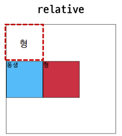
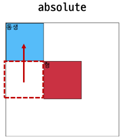

# ✔ CSS position
- 문서 상에서 요소의 위치를 지정

> position 속성

```css
선택자 {
  position: static | relative | absolute | fixed | sticky;
}
```

1. `static` (기본값)
  
   - 모든 태그의 기본 값 (기본 위치)
   - 일반적인 요소의 배치 순서에 따름 (normal flow)
   - 부모 요소 내에서 배치될 때는 부모 요소의 위치를 기준으로 배치 됨

2. `relative`
   
   - 상대 위치
   - **자기 자신의 static 위치를 기준**으로 이동 (**normal flow 유지**)
   - 레이아웃에서 요소가 차지하는 공간은 static일 때와 같음 (normal position 대비 offset)

3. `absolute`

   - 절대 위치
   - 요소를 일반적으로 문서 흐름에서 제거 후 레이아웃에 공간을 차지하지 않음 (**normal flow에서 벗어남**)
   - static이 아닌 가장 가까이 있는 **부모/조상 요소의 position을 기준**으로 이동 (없는 경우 브라우저 화면 기준으로 이동)

4. `fixed`
   
   - 고정 위치
   - 요소를 일반적인 문서 흐름에서 제거 후 레이아웃에 공간을 차지하지 않음 (**normal flow에서 벗어남**)
   - 부모 요소와 관계없이 **viewport를 기준**으로 이동
     - 따라서, 스크롤 시에도 항상 같은 곳에 위치함

5. `sticky`

   - 스크롤에 따라 static ⇒ fixed로 변경
   - 속성을 적용한 박스는 평소에 문서 안에서 `position: static`상태와 같이 normal flow에 따르지만, 스크롤 위치가 임계점에 이르면 `position: fixed`와 같이 박스를 화면에 고정할 수 있는 속성
     - 일반적으로 Navigation Bar에서 사용됨

> 요소의 위치 지정 (left, right, top, bottom)

```css
선택자 {
  position: relative | absolute | fixed | sticky;

  left: <절대 크기> | <상대 크기> | <백분율>;
  right: <절대 크기> | <상대 크기> | <백분율>;
  top: <절대 크기> | <상대 크기> | <백분율>;
  bottom: <절대 크기> | <상대 크기> | <백분율>;
}
```


# ✔ position 속성 예시

> `relative` vs `absolute`

- 형과 동생 박스를 만들어 두 속성값 차이 비교
  
  ```html
  <!-- HTML -->
  <body>
    <div class="parent">
      <div class="relative">형</div>
      <div class="sibling">동생</div>
    </div>
    <div class="parent">
      <div class="absolute">형</div>
      <div class="sibling">동생</div>
    </div>
  </body>
  ```

  ```css
  /* CSS */

  /* 공통 스타일링 */
  div {
    box-sizing: border-box;
    width: 100px;
    height: 100px;
    border: 1px solid black;
  }
  .parent {
    position: relative;
    width: 300px;
    height: 300px;
  }

  /* 차이점 */
  .relative {
    position: relative;
    top: 100px;
    left: 100px;
    background-color: crimson;
  }
  .absolute {
    position: absolute;
    top: 100px;
    left: 100px;
    background-color: crimson;
  }
  .sibling {
    background-color: deepskyblue;
  }
  ```

- relative 결과
  
  

  - 요소가 차지하는 공간 유지 (normal flow 유지)
  - 즉, 뒤 블록 요소의 위치 그대로 유지

- absolute 결과

  

  - 요소가 차지하는 공간에서 벗어남 (normal flow에서 벗어남)
  - 즉, 다음 블록 요소가 좌측 상단으로 붙음