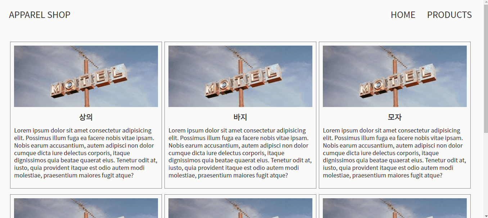

# HTML/CSS 실습
- [README.pdf](https://github.com/hyejinny97/TIL/blob/master/CSS/practice/practice_04/README.pdf) 파일에서 완성본 이미지 볼 수 있음


## 과정
- [준비 사항](#준비-사항)
- [요구사항](#요구-사항)
- [프로젝트 결과 완성본](#프로젝트-결과-완성본)


## 준비 사항
> 공통 설정

- `_reset.css` 를 적용하여 브라우저 기본 스타일을 제거합니다.
- `style.css` 를 활용하여 필요한 CSS를 작성합니다.
- 모든 이미지는 `assets` 폴더 안에 있습니다.
- 단위는 가급적이면 rem으로 작성하며, 적절한 margin 및 padding을 이용합니다.
- body 기본 설정은 아래와 같습니다.

  ```css
  @import url('https://fonts.googleapis.com/css2?family=Noto+Sans+KR&display=swap');
  /* 기본 글꼴 설정 */
  body {
  font-family: 'Noto Sans KR', sans-serif;
  min-width: 1280px;
  color: #333333;
  }
  ```


## 요구 사항
> 메인 페이지 (index.html)

1. Navigation bar

   - 좌측 로고는 `h1` 태그를 활용합니다.
   - 우측 목록은 각각 `a` 태그로 링크되어야 합니다.
     - HOME : index.html
     - PRODUCTS : products.html
   - 우측 목록은 hover시 색상이 변화하도록 합니다.
   - Navigation bar는 브라우저 화면 기준 항상 상단에 붙어있도록 합니다.

2. Banner
   
   - 주어진 섹션의 높이는 700px입니다.
   - 배경 이미지 설정을 합니다.
     - background-repeat 과 background-size 를 활용합니다.

3. 본문 영역

   - `About` 과 `More` 로 구성된 본문 영역은 너비가 1280px인 컨테이너 자식 요소 입니다.
   - 위치는 수평 가운데 정렬을 합니다
   - `About`
     - 좌측에는 이미지를 배치하고 너비는 500px입니다.
     - 우측에는 텍스트를 작성합니다.
       - h2 태그를 활용하여 제목을 작성합니다.
       - p 태그를 활용해 소개 문구를 작성합니다. (lorem을 활용합니다.)
   - `More`
     - 이미지와 내용은 모두 세로로 배치합니다.
     - 이미지는 모두 가로 세로 64px입니다.

4. Top Button

   - 브라우저 화면 기준 우측 하단에 배치합니다.


> 프로덕트 페이지 (product.html)

1. Navigation bar
   
   - 네비게이션 바의 구성은 동일합니다.

2. 상품 목록

   - 상품 목록으로 구성된 본문 영역은 너비가 1280px인 컨테이너 자식 요소 입니다.
   - 위치는 수평 가운데 정렬을 합니다.
   - 이미지는 아래의 코드로 임시 이미지로 활용합니다.
    
     ```html
     
     ```

   - 상품 목록은 한 줄에 3개씩 배치합니다


## 실습 결과 완성본
> 메인 페이지 (index.html)


> 프로덕트 페이지 (product.html)

