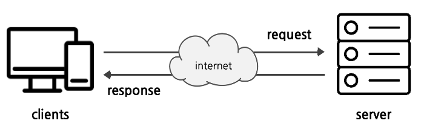

# ✔ WEB 기초
> IP vs 도메인
- IP는 Internet Protocol로 IP 주소는 컴퓨터의 고유한 주소를 나타냄
  - 네트워크에 연결된 모든 컴퓨터는 서로 다른 IP 주소를 가짐
  - 점으로 구분 된 네 개의 숫자로 구성됨
  - 예) 구글의 IP 주소: `173.194.121.32`
- 도메인은 사람이 읽을 수 있는 IP 주소의 이름을 뜻함
  - '도메인 이름'은 'IP주소'보다 사용하기 쉬움
  - 예) 구글의 도메인 주소: `google.com`

> 인터넷 vs 웹
- 인터넷은 수십억 대의 컴퓨터를 모두 연결하는 기술 인프라
  - 인터넷을 이용한다는 건, 전세계의 컴퓨터가 연결되어 있는 하나의 인프라를 이용하는 것
- 웹은 인터넷이라는 인프라 기반 위에 구축된 서비스
  - 인터넷 위에 구축된 서비스: 웹, 이메일, IRC 등
  - WWW (World Wide Web): 전 세계에 퍼져 있는 거미줄 같은 연결망
- 전 세계는 아주 두껍고 튼튼한 해저테이블로 연결되어 있어 인터넷으로 손쉽게 지구 반대편 소식을 알 수 있음
  - 유선 연결의 한계로 정보의 빈곤이 발생하는 곳이 있음
    - 오지(히말라야 정상, 아마존 밀림)에서는 케이블을 깔기 어려움
    - 개발 도상국 같은 나라에서 충분한 인프라를 기대하기 어려움
- Space X의 스타링크 프로젝트: 지구를 아주 많은 소형 위성으로 감싸서, 케이블이 아닌 위성끼리 데이터를 교환하게끔 함
  - 스타링크 프로젝트의 문제점
    - Starlink Train
    - 우주 쓰레기

> 클라이언트(client) - 서버(server)
- 오늘날 우리가 사용하는 대부분의 웹 서비스는 클라이언트-서버 구조를 기반으로 동작
- 클라이언트와 서버 역시 하나의 컴퓨터이며, 클라이언트가 서버로 요청(requests)를 보내면 서버가 파일을 보내줌으로써 반응(response)을 함

  

1. 클라이언트
  
   - 웹 사용자의 인터넷에 연결된 장치
   - Chrome 또는 Firefox와 같은 웹 브라우저
   - 서비스를 요청(request)하는 주체

2. 서버

   - 웹 페이지, 사이트 또는 앱을 저장하는 컴퓨터
   - 클라이언트가 웹 페이지에 접근하려고 할 때 서버에서 클라이언트 컴퓨터로 웹 페이지 데이터를 응답해 사용자의 웹 브라우저에 표시됨
   - 요청에 대해 서비스를 응답(response)하는 주체

> 웹 페이지 (Web Page)
- 웹에 있는 문서
- 우리가 보는 화면 각각 한 장 한 장이 웹 페이지
- 웹 페이지 종류: 정적 웹 페이지, 동적 웹 페이지

1. 정적 웹 페이지 (Static Web page)

   - 있는 그대로를 제공하는 것(served as-is)을 의미
   - HTML 파일의 내용이 변하지 않고 **모든** 사용자에게 **동일한** 모습으로 전달되는 것
     -  서버에 미리 저장된 HTML 파일 그대로 전달된 웹 페이지
     -  같은 상황에서 모든 사용자에게 동일한 정보를 표시
   
2. 동적 웹 페이지 (Dynamic Web page)

   - 사용자의 요청에 따라 웹 페이지에 추가적인 수정이 되어 클라이언트에게 전달되는 웹 페이지
   - 서버에서 동작하고 있는 프로그램(ex) Django)이 파일을 요청하는 사용자에 따라 다르게 웹 페이지를 변경해줌
     - 다양한 서버 사이드 프로그래밍 언어(python, java, c++ 등) 사용 가능
     - 데이터베이스와의 상호작용이 이루어짐

> 웹 브라우저 (Web Browser)
- 웹에서 페이지를 찾아 보여주고, 사용자가 하이퍼링크를 통해 다른 페이지로 이동할 수 있도록 하는 프로그램 (즉, 웹 페이지는 브라우저를 통해 동작함)
- 웹 페이지 파일을 우리가 보는 화면으로 바꿔주는(렌더링, rendering) 프로그램
  - HTML / CSS / JS 등의 코드를 읽어 실제 사람이 볼 수 있는 화면으로 만들어 줌
- 종류: 구글 Chrome, MS Edge, 모질라 Firefox, 애플 Safari, 네이버 웨일 등
- 브라우저마다 동작이 약간씩 달라서 문제가 생기는 경우가 많음(파편화)
  - 해결책으로 웹 표준 등장
  
> 웹 표준
- 웹에서 표준적으로 사용되는 기술이나 규칙
- 어떤 브라우저든 웹 페이지가 동일하게 보이도록 함(크로스 브라우징)
- 웹 표준 정의 기관 및 모임: [World Wide Web Consortium (W3C)](https://www.w3.org/), [WHATWG](https://html.spec.whatwg.org/multipage/)
- 브라우저별 호환성 체크 사이트: [Caniuse](https://caniuse.com/)

> 웹 사이트의 구성 요소
1. HTML ⇒ 구조
2. CSS ⇒ 표현
3. Javascript ⇒ 동작

# ✔ 웹 프론트엔드 개발 환경 설정

> Text editor - Visual Studio Code
- HTML/CSS 코드 작성을 위한 VS code 추천 확장 프로그램
  - Open in browser
  - Auto Rename Tag
  - Auto Close Tag
  - Intellisense for CSS class names in HTML
  - HTML CSS Support

> 크롬 개발자 도구
- 웹 브라우저 크롬에서 제공하는 개발과 관련된 다양한 기능을 제공
- 주요 기능
  - Elements: DOM 탐색 및 CSS 확인 및 변경
    - Styles: 요소에 적용된 CSS 확인
    - Computed: 스타일이 계산된 최종 결과
    - Event Listeners: 해당 요소에 적용된 이벤트(JS)
  - Sources, Network, Performance, Application, Security, Audits 등

# ✔ 웹 접근성
- 정보통신접근성 (Web 접근성)은 「지능정보화기본법」에 따라 장애인이나 고령자분들이 웹 사이트에서 제공하는 정보를 비장애인과 동등하게 접근하고 이용 할 수 있도록 보장하는 것

> 저시력 시각장애
- 시각 장애인의 90%는 저시력 장애임
- 저시력 장애는 시력저하, 시야장애, 적록색맹, 전색맹 등의 유형이 있음
- 저시력 장애인은 잘 보이지 않은 웹 화면을 이용하기 위해 화면 확대, 고대비 기능을 필요
  - 4.5:1 이상의 명도대비 필요
- 색맹의 경우 색상만으로 콘텐츠를 구분하기 어려우므로, 색상 외에 다양한 방식으로 정보를 표현
  - 색상 이외의 모양,패턴,밑줄,텍스트 등으로 정보 제공 필요

> 전맹 장애
- 전맹은 시력이 ‘0’이며 빛을 지각하지 못 하는 시각장애로, 앞이 전혀 보이지 않음
- 눈으로 화면을 볼 수 없는 전맹 시각장애인은 더욱 발달된 다른 감각(청각/촉각)으로 웹을 이용
  - 음성과 점자가 출력되는 웹 환경이 필요
  - 스크린 리더: 웹에 보이는 모든 글씨를 음성으로 읽어주는 소프트웨어
  - 점자 정보 단말기: 컴퓨터가 읽어주는 음성을 점자로 출력
- 대체 텍스트를 통해 이미지로 된 콘텐츠를 텍스트로 읽을 수 있게 개발적으로 처리해 줘야 함
- 자동 가입 방지용 보안문자 등을 시각뿐 아니라 음성으로도 인지할 수 있게 지원해야 함

> 손 운동 장애
- 손 운동 장애는 손을 자유롭게 사용할 수 없는 장애를 말함
- 일반적인 마우스와 키보드를 사용하기 힘듦
- 손 운동 장애는 손 떨림 장애, 한 손 장애 등의 유형이 있음
- 다양한 보조 기기를 이용해 단순한 손동작만으로도 웹을 조작해야 함
  - 한 손 키보드, 트랙볼
  - 키보드나 마우스 휠로 편리하게 웹을 사용할 수 있도록 다양한 조작방식을 제공

> 중증 운동장애
- 중증 운동장애는 몸을 마음대로 움직일 수 없는 상태를 말함
- 손을 이용해서 마우스와 키보드를 사용하기 힘듦
- 중증 운동 장애인은 움직일 수 있는 신체 일부분을 적극적으로 활용하여 웹을 이용
  - 헤드 포인터 스틱을 머리에 고정하고, 자판이 큼직한 빅키 키보드로 타이핑을 대신함
  - 마우스를 사용하기 어려운 환경을 위해 키보드만으로도 모든 기능을 사용할 수 있도록 지원