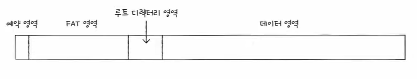
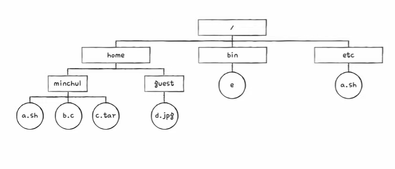
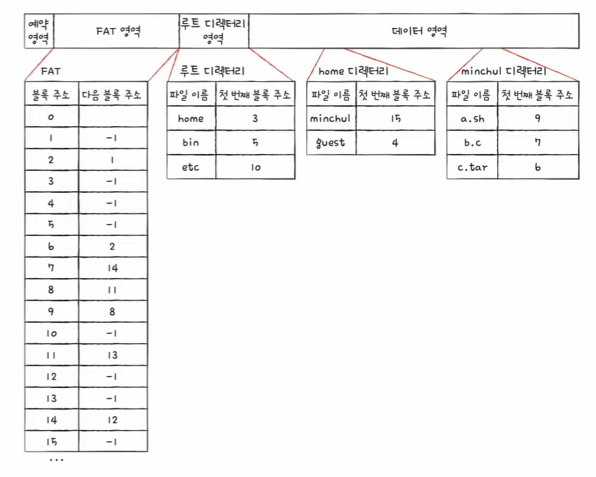
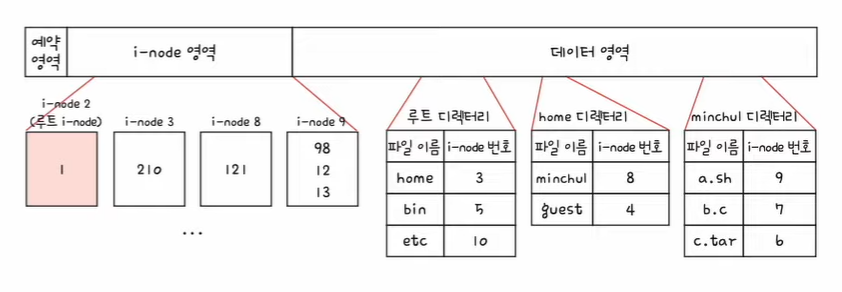

# ✔ 파일 시스템

## 1️⃣ 파일과 디렉터리

- 파일과 디렉터리는 모두 운영체제 내부 파일 시스템이 관리함

### 파일

- 하드 디스크나 SSD와 같은 보조기억장치에 저장된 관련 정보의 집합
- 의미 있고 관련 있는 정보를 모은 논리적 단위
- 파일 속성(또는 메타데이터): 파일 관련 부가 정보
  - 파일 형식, 위치, 크기 등

#### 파일 속성

| 속성 이름        | 의미                                                            |
| ---------------- | --------------------------------------------------------------- |
| 유형             | 운영체제가 인지하는 파일의 종류를 나타냄                        |
| 크기             | 파일의 현재 크기와 허용 가능한 최대 크기를 나타냄               |
| 보호             | 어떤 사용자가 해당 파일을 읽고, 쓰고, 실행할 수 있는지를 나타냄 |
| 생성 날짜        | 파일이 생성된 날짜를 나타냄                                     |
| 마지막 접근 날짜 | 파일에 마지막으로 접근한 날짜를 나타냄                          |
| 마지막 수정 날짜 | 파일에 마지막으로 수정한 날짜를 나타냄                          |
| 생성자           | 파일을 생성한 사용자를 나타냄                                   |
| 소유자           | 파일을 소유한 사용자를 나타냄                                   |
| 위치             | 파일의 보조기억장치상의 현재 위치를 나타냄                      |

#### 파일 유형

- 파일 유형을 알리기 위해 가장 흔히 사용하는 방식은 파일 이름 뒤에 붙는 확장자를 이용하는 것임

| 파일 유형          | 대표적인 확장자           |
| ------------------ | ------------------------- |
| 실행 파일          | 없는 경우, exe, com, bin  |
| 목적 파일          | obj, o                    |
| 소스 코드 파일     | c, cpp, cc, java, asm, py |
| 워드 프로세서 파일 | xml, rtf, doc, docx       |
| 라이브러리 파일    | lib, a, so, dll           |
| 멀티미디어 파일    | mpeg, mov, mp3, mp4, avi  |
| 백업/보관 파일     | rar, zip, tar             |

#### 파일 연산을 위한 시스템 호출

- 파일을 다루는 모든 작업은 운영체제에 의해 이루어짐
- 운영체제는 아래와 같은 파일 연산을 위한 시스템 호출을 제공함
  1. 파일 생성
  2. 파일 삭제
  3. 파일 열기
  4. 파일 닫기
  5. 파일 읽기
  6. 파일 쓰기

### 디렉터리

- 파일들을 일목요연하게 관리
- 트리 구조 디렉터리: 최상위 디렉터리(루트 디렉터리)가 있고 그 아래에 여러 서브 디렉터리(자식 디렉터리)가 있을 수 있음
- 경로: 디렉터리를 이용해 파일 위치, 나아가 파일 이름을 특정 짓는 정보

#### 절대 경로와 상대 경로

- 절대 경로: 루트 디렉터리부터 시작하는 경로
- 상대 경로: 현재 디렉터리부터 시작하는 경로

#### 디렉터리 연산을 위한 시스템 호출

- 운영체제는 아래와 같은 디렉터리 연산을 위한 시스템 호출을 제공함
  1. 디렉터리 생성
  2. 디렉터리 삭제
  3. 디렉터리 열기
  4. 디렉터리 닫기
  5. 디렉터리 읽기

#### 디렉터리 엔트리

- 많은 운영체제에서는 디렉터리를 그저 '특별한 형태의 파일'로 간주함
  - 즉, 디렉터리도 파일임
- 디렉터리는 보조기억장치에 테이블 형태의 정보로 저장됨
- 디렉터리 엔트리(행)에 공통으로 포함되는 정보
  1. 디렉터리에 포함된 대상의 이름
  2. 그 대상이 보조기억장치 내에 저장된 위치를 유추할 수 있는 정보
- 파일 시스템에 따라 디렉터리 엔트리에는 파일 속성을 명시하는 경우도 있음

## 2️⃣ 파일 시스템

- 파일과 디렉터리를 보조기억장치에 일목요연하게 저장하고 접근할 수 있게 하는 운영체제 내부 프로그램

### 파티셔닝과 포매팅

- 보조기억장치를 사용하려면 파티션을 나누는 작업(파티셔닝)과 포맷 작업(포매팅)을 거쳐야 함
- 파티셔닝(partitioning): 저장 장치의 논리적인 영역을 구획하는 작업
  - 파티션(partition): 파티셔닝 작업을 통해 나누어진 영역 하나하나
- 포매팅(formatting): 파일 시스템을 설정하여 어떤 방식으로 파일을 저장하고 관리할 것인지를 결정하고, 새로운 데이터를 쓸 준비를 하는 작업
  - 포매팅할 때 파일 시스템이 결정됨
- 파일 시스템에는 여러 종류가 있고, 파티션마다 다른 파일 시스템을 설정할 수도 있음

### 파일 할당 방법

- 운영체제는 파일과 디렉터리를 블록 단위로 읽고 씀
  - 즉, 하나의 파일이 보조기억장치에 저장될 때는 하나 이상의 블록에 걸쳐 저장됨
- 파일을 보조기억장치에 할당하는 방법
  1. 연속 할당
  2. 불연속 할당
     1. 연결 할당
     2. 색인 할당

#### 연속 할당

- 보조기억장치 내 연속적인 블록에 파일을 저장하는 방식
- 디렉터리 엔트리에 포함되는 정보
  1. 파일 이름
  2. 첫 번째 블록 주소
  3. 블록 단위의 길이
- 장점
  - 구현이 단순함
- 단점
  - 외부 단편화를 야기함

#### 연결 할당

- 각 블록 일부에 다음 블록의 주소를 저장하여 각 블록이 다음 블록을 가리키는 형태로 할당하는 방식
- 파일을 이루는 데이터를 연결 리스트로 관리함
- 불연속 할당의 일종이기에 파일이 여러 블록에 흩어져 저장됨
- 디렉터리 엔트리에 포함되는 정보
  1. 파일 이름
  2. 첫 번째 블록 주소
  3. 블록 단위의 길이
- 장점
  - 외부 단편화 문제를 해결함
- 단점
  - 반드시 첫 번째 블록부터 하나씩 차례대로 읽어야 함
    - 따라서, 파일 내 임의의 위치에 접근하는 속도, 즉, 임의 접근 속도가 매우 느림
    - 이는 성능 면에서 상당히 비효율적임
  - 하나의 블록 안에 파일 데이터와 다음 블록 주소가 모두 포함되어 있다 보니, 하드웨어 고장이나 오류 발생 시 해당 블록 이후 블록은 접근할 수 없음
- 연결 할당을 변형한 대표적인 파일 시스템이 오늘날까지도 많이 사용하는 FAT 파일 시스템임

#### 색인 할당

- 파일의 모든 블록 주소를 색인 블록이라는 하나의 블록에 모아 관리하는 방식
- 디렉터리 엔트리에 포함하는 정보
  1. 파일 이름
  2. 색인 블록 주소
- 장점
  - 외부 단편화 문제를 해결함
  - 연결 할당과는 달리 파일 내 임의의 위치에 접근하기 쉬움
- 색인 할당을 기반으로 만든 파일 시스템이 유닉스 파일 시스템임

### 파일 시스템 살펴보기

- FAT 파일 시스템: USB 메모리, SD 카드 등의 저용량 저장 장치에서 사용됨
- 유닉스 파일 시스템: 유닉스 계열 운영체제에서 사용됨

#### FAT 파일 시스템

- 연결 할당의 단점을 보완한 파일 시스템
- 각 블록에 포함된 다음 블록의 주소들을 한데 모아 테이블 형태로 관리함 (파일 할당 테이블, File Allocation Table, FAT)
- 따라서, 파일의 첫 번쨰 블록 주소만 알면 파일의 데이터가 담긴 모든 블록에 접근 가능함
- FAT 파일 시스템은 버전에 따라 FAT12, FAT16, FAT32가 있음
  - FAT 뒤에 오는 숫자는 블록을 표현하는 비트 수를 의미함
- FAT가 메모리에 적재된 채 실행되면 임의 접근의 성능이 개선됨

##### FAT 파일 시스템을 사용하는 파티션의 도식도

- FAT는 파티션의 앞부분에 만들어짐
- FAT 영역에 FAT가 저장되고, 뒤이어 루트 디렉터리가 저장되는 영역이 있으며, 그 뒤에 서브 디렉터리와 파일들을 위한 영역이 있음

##### FAT 파일 시스템의 디렉터리 엔트리에 포함되는 정보

1. 파일 이름
2. 파일의 첫 번쨰 블록 주소(시작 블록 주소)
3. 확장자
4. 속성
   - 해당 파일이 읽기 전용 파일인지, 숨김 파일인지, 시스템 파일인지, 일반 파일인지, 디렉터리인지 등을 식별하기 위한 항목
5. 예약 영역
6. 생성 시간
7. 마지막 접근 시간
8. 마지막 수정 시간
9. 파일 크기

##### 예시

#### 유닉스 파일 시스템

- 색인 할당 기반의 파일 시스템
- 유닉스 파일 시스템에서는 색인 블록을 i-node(index-node)라고 부름
- i-node에는 파일 속성 정보와 열다섯 개의 블록 주소가 저장될 수 있음
  - FAT 파일 시스템에서는 디렉터리 엔트리에 파일 속성 정보가 표현되는 것과 달리, 유닉스 파일 시스템에서는 i-node에 파일 속성 정보가 표현됨

##### 유닉스 파일 시스템을 사용하는 파티션의 도식도

- 파일마다 i-node가 있고, i-node마다 번호가 부여되어 있음
- i-node 영역에 i-node들이 있고, 데이터 영역에 디렉터리와 파일들이 있음

##### 유닉스 파일 시스템의 디렉터리 엔트리에 포함되는 정보

1. 파일 이름
2. i-node 번호

##### i-node에 블록을 저장하는 방법

- i-node 하나는 열다섯 개의 블록 주소를 저장할 수 있음
- i-node가 가리킬 수 있는 열다섯 개의 블록 주소 중 처음 열두 개에는 파일 데이터가 저장된 블록 주소가 직접적으로 명시됨
  - 직접 블록: 파일 데이터가 저장된 블록
- 열두 개의 블록 주소로 모든 블록을 가리킬 수 없다면 i-node의 열세 번째 블록 주소를 이용해 단일 간접 블록의 주소를 저장함
  - 단일 간접 블록: 파일 데이터가 저장된 블록이 아닌 파일 데이터를 저장한 블록 주소가 저장된 블록을 의미
- 열세 개의 블록 주소로 모든 블록을 가리킬 수 없다면 i-node의 열네 번째 블록 주소를 이용해 이중 간접 블록의 주소를 저장함
  - 이중 간접 블록: 데이터 블록 주소를 저장하는 블록 주소가 저장된 블록을 의미 (단일 간접 블록들의 주소를 저장하는 블록)
- 열네 개의 블록 주소로 모든 블록을 가리킬 수 없다면 i-node의 열다섯 번째 블록 주소를 이용해 삼중 간접 블록의 주소를 저장함
  - 삼중 간접 블록: 이중 간접 블록 주소가 저장된 블록
