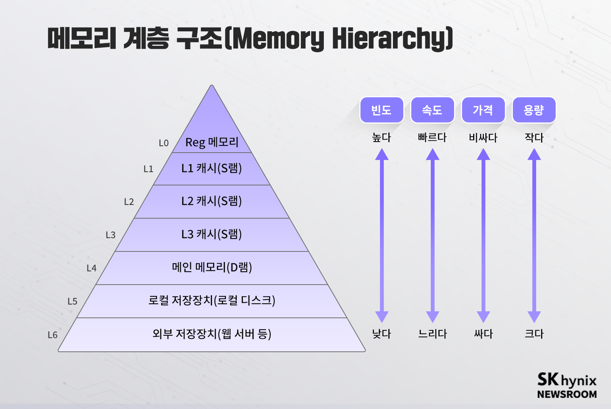

# ✔ 메모리와 캐시 메모리

## 1️⃣ RAM의 특징과 종류

### RAM의 특징

- RAM에는 실행할 프로그램의 명령어와 데이터가 저장됨
- 휘발성 저장 장치: 전원을 끄면 저장된 내용이 사라지는 저장 장치
  - RAM
- 비휘발성 저장 장치: 전원이 꺼져도 저장된 내용이 유지되는 저장 장치
  - 하드 디스크, SSD, CD-ROM, USB 메모리
- 따라서, 보조기억장치인 비휘발성 저장 장치에는 '보관할 대상'을 저장하고, 휘발성 저장 장치인 RAM에는 '실행할 대상'을 저장함

### RAM의 용량과 성능

- RAM 용량이 크면 많은 프로그램을 동시에 빠르게 실행하는 데 유리함
- 하지만, 용량이 필요 이상으로 커지면 프로그램 실행 속도는 그에 비례하여 증가하지는 않음

### RAM의 종류

#### DRAM

- Dynamic RAM
- 시간이 지나면 저장된 데이터가 점차 사라짐
- 주로, 주기억장치(RAM)로 사용됨
- 장점
  - 소비 전력이 낮음
  - 저렴함
  - 집적도가 높아 대용량 설계에 용이함
- 단점
  - 데이터의 소멸을 막기 위해 일정 주기로 데이터를 재활성화(다시 저장)해야 함
  - SRAM보다 속도가 느림

#### SRAM

- Static RAM
- 시간이 지나도 저장된 데이터는 사라지지 않음
- 주로, 캐시 메모리로 사용됨
- 장점
  - (전원이 공급되는 상태이면) 데이터는 사라지지 않음
  - DRAM보다 일반적으로 속도가 빠름
- 단점
  - 소비 전력이 큼
  - 비쌈
  - 접적도가 낮음

#### SDRAM

- Synchronous Dynamic RAM
- 클럭 신호와 동기화된, 발전된 형태의 DRAM
- 클럭에 맞춰 동작하며 클럭마다 CPU와 정보를 주고 받음

#### DDR SDRAM

- Double Date Rate SDRAM
- 대역폭(데이터를 주고받는 길의 너비)을 넓혀 속도를 빠르게 만든 SDRAM
- 두 배의 대역폭으로 한 클럭당 두 번씩 CPU와 데이터를 주고받을 수 있음
- 따라서, 전송 속도가 두 배가량 빠름
- DDR2 SDRAM: DDR SDRAM보다 대역폭이 두 배 넓은 SDRAM
- DDR3 SDRAM: DDR2 SDRAM보다 대역폭이 두 배 넓은 SDRAM
- DDR4 SDRAM: DDR3 SDRAM보다 대역폭이 두 배 넓은 SDRAM

## 2️⃣ 메모리의 주소 공간

### 물리 주소와 논리 주소

- 메모리에 저장된 정보는 시시각각 변하기 때문에, CPU와 메모리에 저장되어 실행 중인 프로그램은 메모리 몇 번지에 무엇이 저장되어 있는지 다 알지 못함
- 물리 주소: 메모리 하드웨어 상의 주소
- 논리 주소: CPU와 실행 중인 프로그램이 사용하는 주소로, 실행 중인 프로그램 각각에게 부여된 0번지부터 시작되는 주소
- CPU가 메모리와 상호작용하려면 논리 주소와 물리 주소 간의 변환이 이루어져야 함
- 메모리 관리 장치(MMU): CPU와 주소 버스 사이에 위치해, 논리 주소와 물리 주소 간의 변환을 해주는 하드웨어
- MMU는 CPU가 발생시킨 논리 주소에 베이스 레지스터 값을 더하여 논리 주소를 물리 주소로 변환함
  - 베이스 레지스터: 프로그램의 가장 작은 물리 주소 (즉, 프로그램의 첫 물리 주소를 저장)
  - 논리 주소: 프로그램의 시작점으로부터 떨어진 거리와 같음

### 메모리 보호 기법

- 논리 주소 범위를 벗어나는 명령어 실행을 방지하고 실행 중인 프로그램이 다른 프로그램에 영향을 받지 않도록 보호할 필요가 있음
- 한계 레지스터: 논리 주소의 최대 크기를 저장
- 즉, 프로그램의 물리 주소 범위 = (베이스 레지스터 값) ~ (베이스 레지스터 값 + 한계 레지스터 값)
- CPU가 접근하려는 논리 주소는 한계 레지스터가 저장한 값보다 커서는 안됨
- 따라서, CPU는 메모리에 접근하기 전에 접근하고자 하는 논리 주소가 한계 레지스터보다 작은지를 항상 검사하고, 만약 크다면 인터랩트(트랩)을 발생시켜 실행을 중단함

## 3️⃣ 캐시 메모리

### 저장 장치 계층 구조

- 컴퓨터가 사용하는 저장 장치들은 CPU에 얼마나 가까운가를 기준으로 계층적으로 나타낼 수 있음
- 저장 장치 계층 구조 특징
  1. CPU와 가까운 저장 장치는 빠르고, 멀리 있는 저장 장치는 느리다.
  2. 속도가 빠른 저장 장치는 저장 용량이 작고, 가격이 비싸다.

### 캐시 메모리

- CPU와 메모리 사이에 위치
- 레지스터보다 용량이 크고 메모리보다 빠른 SRAM 기반의 저장 장치
- 메모리에서 CPU가 사용할 일부 데이터를 미리 캐시 메모리로 가지고 와서 활용함
- CPU의 연산 속도와 메모리 접근 속도의 차이를 조금이나마 줄여줌
- 컴퓨터 내부에는 여러 개의 캐시 메모리가 있고, CPU(코어)와 가까운 순서대로 L1 캐시, L2 캐시, L3 캐시가 위치함
  - 용량: L1 < L2 < L3
  - 속도: L1 > L2 > L3
  - 가격: L1 > L2 > L3
- CPU는 우선 L1 캐시에 해당 데이터가 있는지 알아보고, 없다면 L2, L3 캐시 순으로 데이터를 검색하게 됨
- 일반적으로 L1 캐시, L2 캐시는 코어 내부에 위치하고 L3 캐시는 코어 외부에 위치함
  - L1 캐시, L2 캐시는 코어마다 고유한 캐시 메모리로 할당되고, L3 캐시는 여러 코어가 공유하는 형태로 사용됨

### 참조 지역성의 원리

- 캐시 메모리는 CPU가 사용할 법한 대상을 예측하여 메모리의 일부를 복사하여 저장함
- 캐시 히트: 자주 사용될 것으로 예측한 데이터가 실제로 들어맞아 캐시 메모리 내 데이터가 CPU에서 활용된 상황
- 캐시 미스: 예측이 틀려 메모리에서 필요한 데이터를 직접 가져와야 하는 상황
- 캐시 적중률 = 캐시 히트 횟수 / (캐시 히트 횟수 + 캐시 미스 횟수)
- 참조 지역성의 원리를 바탕으로 캐시 적중률을 높일 수 있음

#### 1. CPU는 최근에 접근했던 메모리 공간에 다시 접근하려는 경향이 있다.

- 시간 지역성: 최근에 접근했던 메모리 공간에 다시 접근하려는 경향

#### 2. CPU는 접근한 메모리 공간 근처를 접근하려는 경향이 있다.

- CPU가 실행하려는 프로그램은 보통 관련 데이터들끼지 한데 모여 있음
- 공간 지역성: 접근한 메모리 공간 근처를 접근하려는 경향
