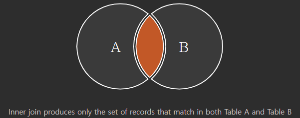
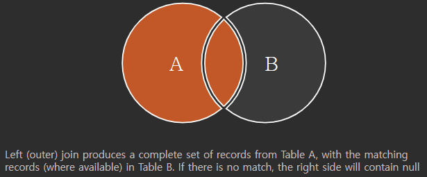
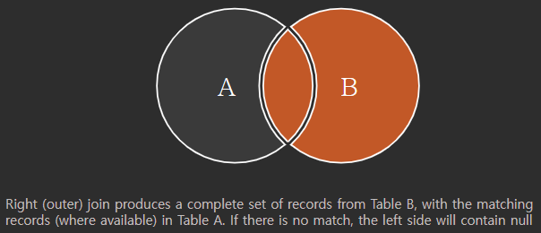
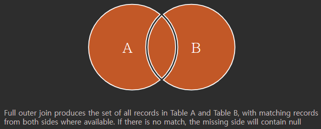
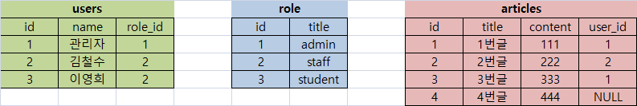

# ✔ JOIN
- 관계형 데이터베이스의 가장 큰 장점이자 핵심적인 기능
- 일반적으로 데이터베이스에는 하나의 테이블에 많은 데이터를 저장하는 것이 아니라 여러 테이블로 나눠 저장하게 되며, 여러 테이블을 결합(Join)하여 출력하는 방식으로 활용
- 일반적으로 레코드는 기본키(Primary Key, PK)나 외래키(Foriegn Key, FK) 값의 관계에 의해 결합함

> JOIN의 대표 종류

1. INNER JOIN
   - 두 테이블에 모두 일치하는 행만 반환

2. OUTER JOIN
   - 동일한 값이 없는 행도 반환
   - `[LEFT|RIGHT|FULL] OUTER JOIN`

3. CROSS JOIN
   - 모든 데이터의 조합

> INNER JOIN
- 조건에 일치하는 (동일한 값이 있는) 행만 반환
- `INNER` 생략 가능

  ```sql
  SELECT *
  FROM 테이블1 [INNER] JOIN 테이블2
    ON 테이블1.컬럼명 = 테이블2.컬럼명;
  ```

- INNER JOIN 그래프

  

  참고 링크: [SQL Joins Visualizer](https://sql-joins.leopard.in.ua/)

> OUTER JOIN
- 동일한 값이 없는 데이터도 반환할 때 사용 (NULL로 반환)
- 기준이 되는 테이블에 따라 LEFT/RIGHT/FULL을 지정
- `OUTER` 생략 가능

  ```sql
  SELECT * 
  FROM 테이블1 [LEFT|RIGHT|FULL] OUTER JOIN 테이블2
    ON 테이블1.칼럼명 = 테이블2.칼럼명;
  ```
- LEFT OUTER JOIN 그래프 

  

- RIGHT OUTER JOIN 그래프 

  

- FULL OUTER JOIN 그래프 

  

> CROSS JOIN
- 모든 가능한 경우의 수의 Join

  ```sql
  SELECT *
  FROM 테이블1 CROSS JOIN 테이블2;
  ```

> JOIN 실습
- 실습용 테이블 생성
  
  

- INNER JOIN
  
  ```sql
  -- ex) 사용자(users)와 각각의 역할을 출력
  SELECT * 
  FROM users INNER JOIN role
    ON users.role_id = role.id;
  ```

  ```
  id  name  role_id  id  title
  --  ----  -------  --  -----
  1   관리자   1      1   admin
  2   김철수   2      2   staff
  3   이영희   2      2   staff
  ```

  ```sql
  -- ex) staff(2) 사용자(users)를 역할과 함께 출력
  SELECT * 
  FROM users JOIN role
    ON users.role_id = role.id
  WHERE role.id = 2;
  ```

  ```
  id  name  role_id  id  title
  --  ----  -------  --  -----
  2   김철수   2      2   staff
  3   이영희   2      2   staff
  ```

  ```sql
  -- ex) 사용자(users)와 각각의 역할을 이름의 내림차순으로 출력
  SELECT * 
  FROM users JOIN role
    ON users.role_id = role.id
  ORDER BY users.name DESC;
  ```

  ```
  id  name  role_id  id  title
  --  ----  -------  --  -----
  3   이영희   2      2   staff
  2   김철수   2      2   staff
  1   관리자   1      1   admin
  ```
  
- OUTER JOIN
  
  1. LEFT OUTER JOIN
   
      ```sql
      -- ex) 모든 게시글을 사용자 정보와 함께 출력
      SELECT *
      FROM articles LEFT OUTER JOIN users
        ON aricles.user_id = users.id;
      ```
      
      ```
      id  title  content  user_id  id  name  role_id
      --  -----  -------  -------  --  ----  -------
      1   1번글    111      1        1   관리자   1
      2   2번글    222      2        2   김철수   2
      3   3번글    333      1        1   관리자   1
      4   4번글    444
      ```

      ```sql
      -- ex) 작성자가 있는 게시글만 사용자 정보와 함께 출력
      SELECT *
      FROM articles LEFT JOIN users
        ON aricles.user_id = users.id;
      WHERE articles.user_id IS NOT NULL;
      ```

      ```
      id  title  content  user_id  id  name  role_id
      --  -----  -------  -------  --  ----  -------
      1   1번글    111      1        1   관리자   1
      2   2번글    222      2        2   김철수   2
      3   3번글    333      1        1   관리자   1
      ```
  2. RIGHT OUTER JOIN
   
      ```sql
      -- ex) 모든 사용자 정보를 게시글과 함께 출력
      SELECT *
      FROM articles RIGHT OUTER JOIN users
        ON users.id = articles.user_id;
      ```

      ```
      id  title  content  user_id  id  name  role_id
      --  -----  -------  -------  --  ----  -------
      1   1번글    111      1       1   관리자   1
      2   2번글    222      2       2   김철수   2
      3   3번글    333      1       1   관리자   1
                                    3   이영희   2
      ```

  3. FULL OUTER JOIN
   
      ```sql
      -- ex) 모든 게시글과 모든 사용자 정보를 출력
      SELECT *
      FROM articles FULL OUTER JOIN users
        ON articles.user_id = users.id;
      ```

      ```
      id  title  content  user_id  id  name  role_id
      --  -----  -------  -------  --  ----  -------
      1   1번글    111      1        1   관리자   1
      2   2번글    222      2        2   김철수   2
      3   3번글    333      1        1   관리자   1
      4   4번글    444
                                     3   이영희   2
      ```

- CROSS JOIN
  
  ```sql
  -- ex) users table과 role table의 CROSS JOIN 결과를 출력
  SELECT * 
  FROM users CROSS JOIN role;
  ```

  ```
  id  name  role_id  id  title
  --  ----  -------  --  -------
  1   관리자   1        1   admin
  1   관리자   1        2   staff
  1   관리자   1        3   student
  2   김철수   2        1   admin
  2   김철수   2        2   staff
  2   김철수   2        3   student
  3   이영희   2        1   admin
  3   이영희   2        2   staff
  3   이영희   2        3   student
  ```

- 3개의 테이블 조인
  
  ```sql
  -- ex) articles table/users table/role table을 INNER JOIN한 결과를 출력
  SELECT *
  FROM articles 
    JOIN users
      ON articles.user_id = users.id
    JOIN role
      ON users.role_id = role.id;
  ```

  ```
  id  title  content  user_id  id  name  role_id  id  title
  --  -----  -------  -------  --  ----  -------  --  -----
  1   1번글    111      1       1   관리자   1     1   admin
  2   2번글    222      2       2   김철수   2     2   staff
  3   3번글    333      1       1   관리자   1     1   admin
  ```