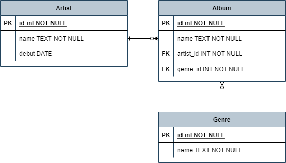

# ✔ ORM 확장 - 1:N 관계
- 일대다 관계의 테이블을 파이썬으로 조작하는 ORM

> ORM 모델 설계 및 반영

1. ERD 설계
   
   

2. 클래스를 생성하여 내가 원하는 DB의 구조를 만듦
  
   ```python
   from django.db import models
 
   class Genre(models.Model):
     name = models.CharField(max_length=30)

   class Artist(models.Model):
      name = models.CharField(max_length=30)
      debut = models.DateField()

   class Album(models.Model):
      name = models.CharField(max_length=30)
      genre = models.ForeignKey('Genre', on_delete=models.CASCADE)
      artist = models.ForeignKey('Artist', on_delete=models.CASCADE)
   ```

3. 클래스의 내용으로 데이터베이스에 반영하기 위한 마이그레이션 파일을 자동 생성함
   
   ```bash
   $ python manage.py makemigrations
   ```

4. DB에 migrate 함
   
   ```bash
   $ python manage.py migrate
   ```

> Foreign Key (외래키)
- 키를 사용하여 부모 테이블의 유일한 값을 참조 (참조 무결성)
- 데이터베이스 관계 모델에서 관련된 2개의 테이블 간의 일관성
- 외래 키의 값이 반드시 부모 테이블의 기본 키일 필요는 없지만 **유일한 값**이어야 함
- models.ForeignKey()를 쓰면 지정한 변수명에 자동으로 `_id`가 붙어서 테이블의 컬럼명이 결정됨

> models.ForeignKey 필드

- 2개의 필수 위치 인자: 참조하는 모델의 `클래스명`, `on_delete` 
- `on_delete`: 외래 키가 참조하는 객체가 삭제되었을 때 처리 방식    
  
  1. `CASCADE`: 부모 객체(참조된 객체)가 삭제되었을 때 이를 참조하는 객체도 삭제
     - ex) 게시글을 지우면 그 글에 달린 댓글도 지움
  
  2. `PROTECT`: 삭제되지 않음
     - ex) 댓글이 하나라도 달렸으면 게시글을 지우지 못함
  
  3. `SET_NULL`: NULL 설정
  
  4. `SET_DEFAULT`: 기본 값 설정


# ✔ 1:N 관계 ORM 기본 조작 (CRUD)

> 데이터 생성 (Create)

- 외래 키에 해당하는 컬럼의 데이터는 **객체**(인스턴스)로 저장

  ```python
  album = Album()
  album.name = '꽃'
  album.genre = Genre.objects.get(id=1)
  album.artist = Artist.objects.get(id=1)
  album.save()
  ```

> 데이터 조회 (Read)

1. 참조 (N ⇒ 1)
   - 현 모델(N)에서 외래 키로 참조하고 있는 다른 모델(1)의 인스턴스를 조회

      ```python
      album = Album.objects.get(id=1)
      album.genre
      # <Genre: Genre object (1)>
      album.artist
      # <Artist: Artist object (1)>
      ```

2. 역참조 (1 ⇒ N)
   - 자신(1)을 참조하고 있는 모델(N)의 인스턴스를 조회
   - `클래스명_set` (클래스명은 전부 소문자로 적어야 함)
  
      ```python
      genre = Genre.objects.get(id=1)
      genre.album_set.all()
      # <QuerySet [<Album: Album object (1)>, <Album: Album object (2)>]>
      ```