# ✔ AWS RDS

- AWS는 잘못된 사용을 할 경우 많은 과금이 발생할 수도 있음
  
  - 주의) 두 개 이상의 RDS 인스턴스를 생성하면 과금이 발생할 수 있음
  - 주의) 지역 설정: 서울
  - 주의) 다른 지역에서 생성한 RDS는 모두 삭제해야함
  
    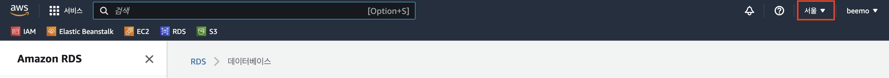

## ✅ RDS - PostgreSQL

- AWS RDS
  
  - `S3`가 파일을 저장하는 `클라우드 파일 스토리지` 서비스라면
  
  - `RDS`는 데이터를 저장하는 `클라우드 데이터베이스` 서비스
  
  - 주의) 2개 이상(타 지역 포함)의 데이터베이스를 생성할 경우 과금이 발생

> 데이터베이스 생성

  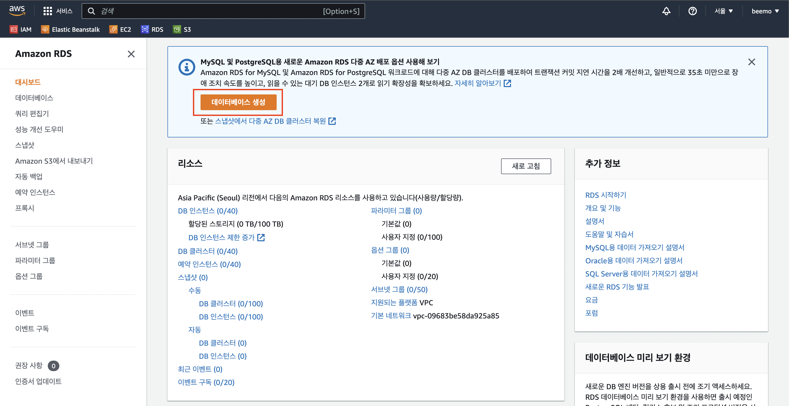
 
- 주의) `엔진 옵션 - PostgreSQL`

- 주의) `템플릿 - 프리 티어`

  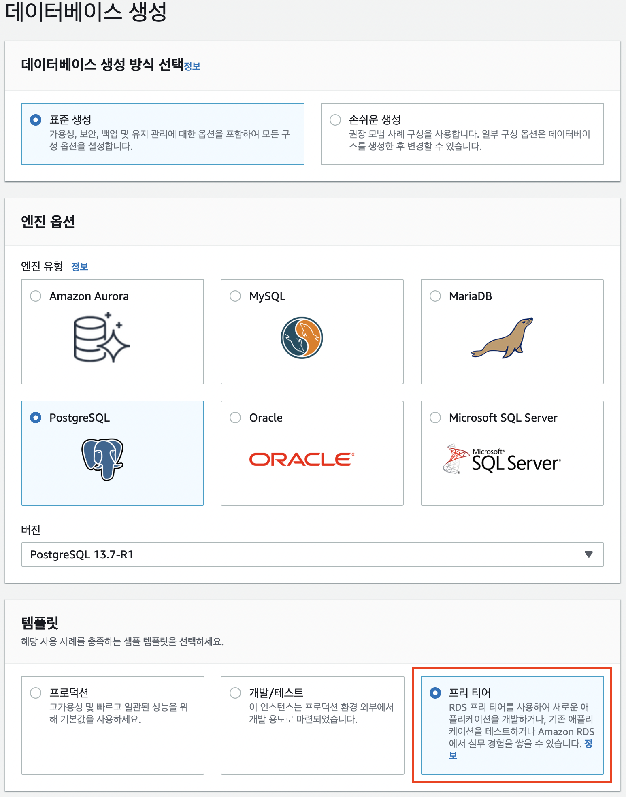

- DB 인스턴스 식별자 - 자유 입력

- 마스터 암호 / 암호 확인 - 자유 입력 (패스워드 기록)

  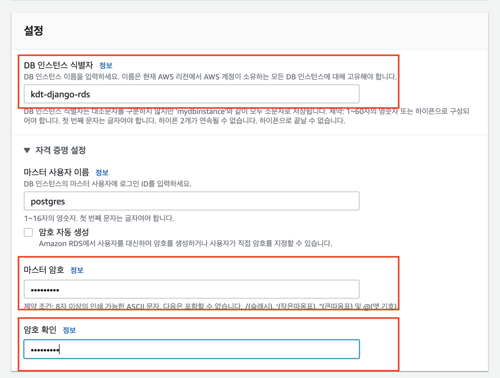

- 스토리지 자동 조정 활성화 - 해제

  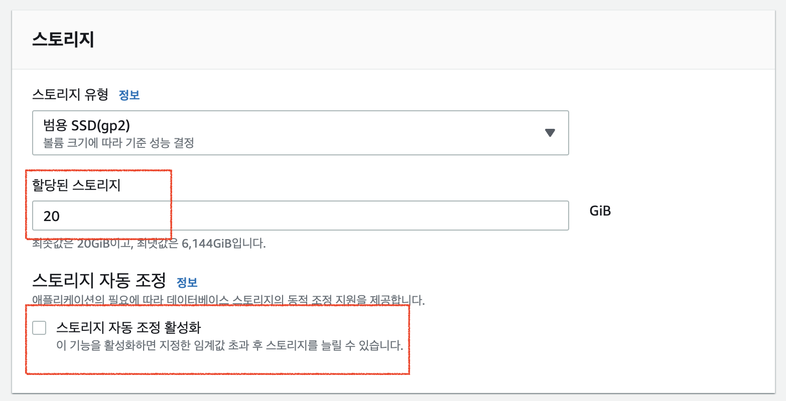

- 퍼블릭 액세스 - 예 선택

- VPC 보안 그룹 새로 생성

- 새 VPC 보안 그룹 입력 - 자유 입력

  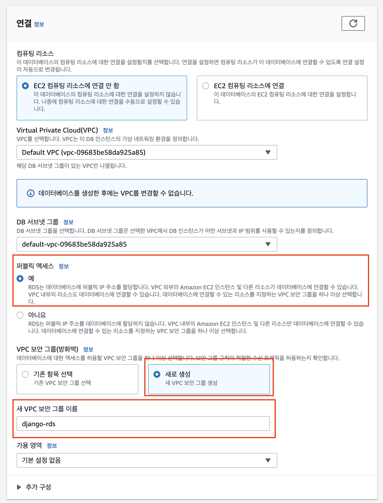

- 성능 인사이트 켜기 - 해제

  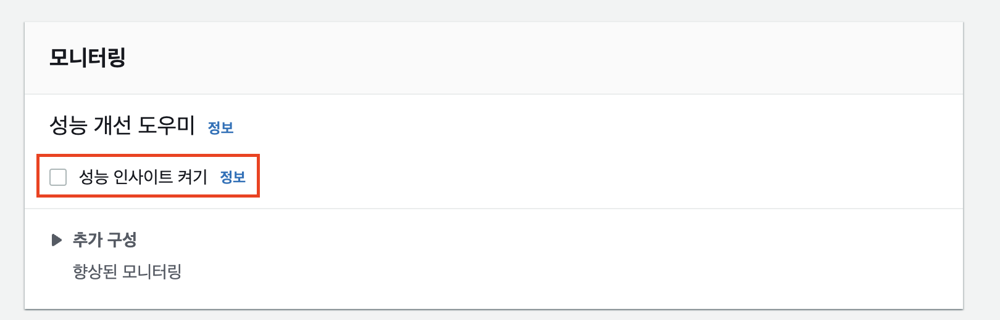

- 초기 데이터베이스 이름 - 데이터베이스 이름 자유 입력

- 자동 백업을 활성화합니다. - 해제

  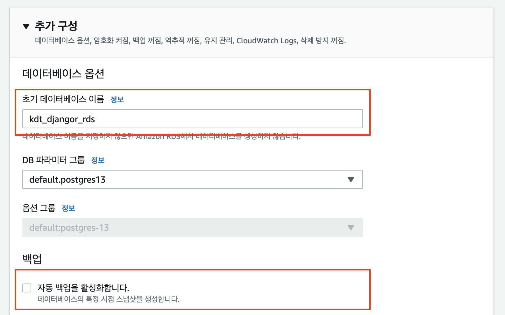

- 데이터베이스 생성
  - 생성까지 약 10분의 시간이 필요합니다.

  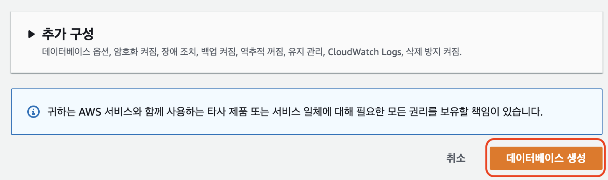

> 보안 그룹 설정

- 생성한 데이터베이스 클릭 → 생성한 VPC 보안 그룹 클릭

  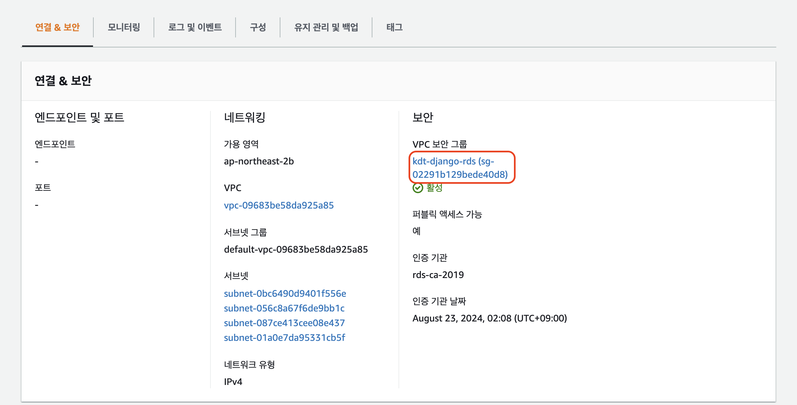

- 인바운드 규칙 편집

  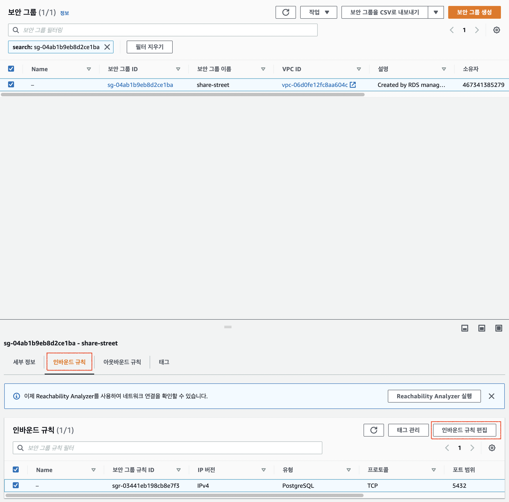

- 규칙 추가
  - 1️⃣ PostgreSQL - Anywhere-IPv4
  - 2️⃣ PostgreSQL - Anywhere-IPv6
  - 3️⃣ 규칙 저장

  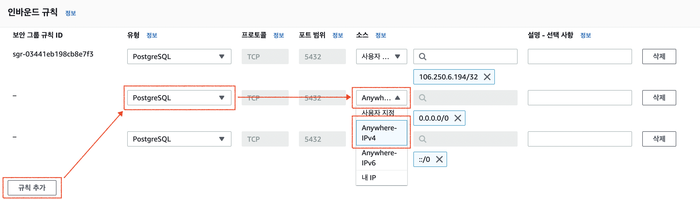

## ✅ 장고 설정

> RDS 연결 테스트

- 개발 환경(로컬)에서 RDS 연결 테스트
  
  ```bash
  # postgresql 관리 패키지 설치
  pip install psycopg2-binary
  pip freeze > requirements.txt
  ```

  ```python
  # settings.py 작성

  """
  기존 DATABASES 주석 처리
  """
  # DATABASES = {
  #     'default': {
  #         'ENGINE': 'django.db.backends.sqlite3',
  #         'NAME': BASE_DIR / 'db.sqlite3',
  #     }
  # }

    
  DATABASES = {
      "default": {
          "ENGINE": "django.db.backends.postgresql",
          "NAME": "[데이터베이스 이름]", # 코드 블럭 아래 이미지 참고하여 입력
          "USER": "postgres",
          "PASSWORD": "[패스워드]", # 데이터베이스 생성 시 작성한 패스워드
          "HOST": "[엔드포인트]", # 코드 블럭 아래 이미지 참고하여 입력
          "PORT": "5432",
      }
  }
  ```

- 데이터베이스 이름

  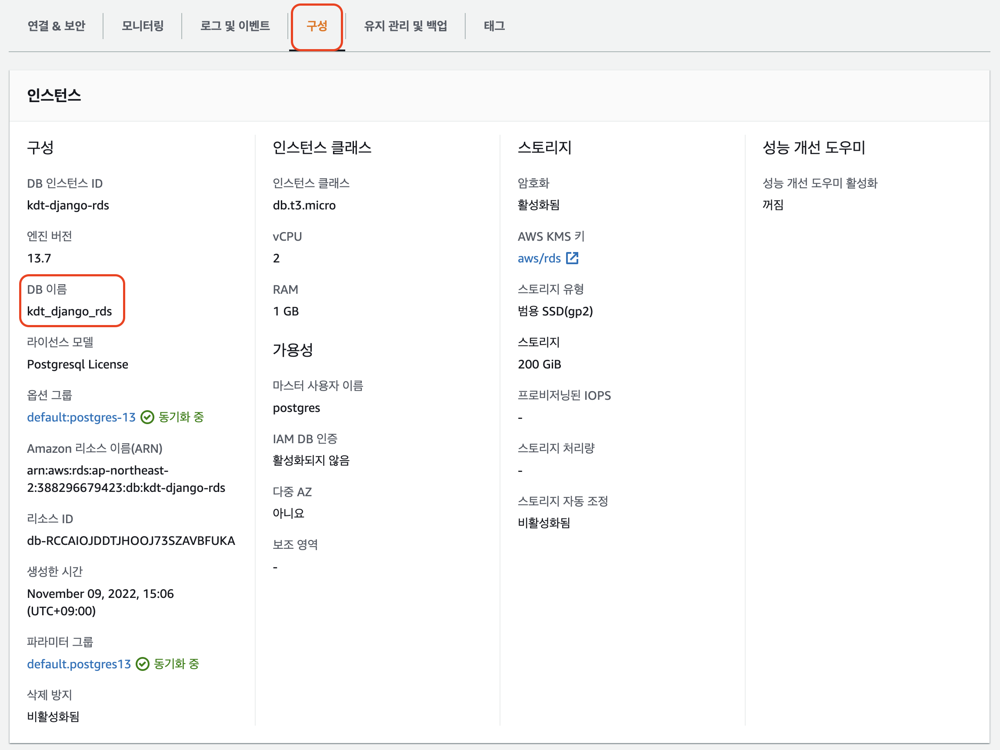

- 엔드포인트

  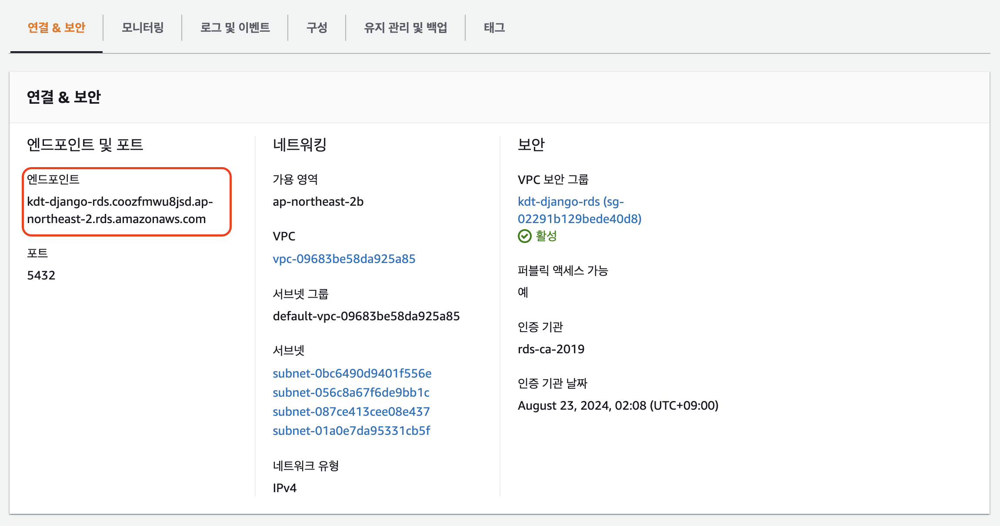

- 마이그레이트

  ```bash
  python manage.py makemigrations
  python manage.py migrate
  ```

> 환경 분리

- 개발 환경(sqlite) / 배포 환경(postgresql) 설정 분리
  
  ```bash
  # dotenv 패키지 설치
  pip install python-dotenv
  ```

  ```python
  # settings.py

  """
  최상단에 아래 세 줄 추가
  """
  from dotenv import load_dotenv
  import os
  load_dotenv()

  # ------------------------------
  """
  기존 DATABASES 설정 삭제
  DATABASES = {
      "default": {
          "ENGINE": "django.db.backends.postgresql",
          "NAME": "[데이터베이스 이름]", # 코드 블럭 아래 이미지 참고하여 입력
          "USER": "postgres",
          "PASSWORD": "[패스워드]", # 데이터베이스 생성 시 작성한 패스워드
          "HOST": "[엔드포인트]", # 코드 블럭 아래 이미지 참고하여 입력
          "PORT": "5432",
      }
  }
  """

  DEBUG = os.getenv("DEBUG") == "True"

  if DEBUG == True: # 개발(로컬) 환경
      DATABASES = {
          'default': {
              'ENGINE': 'django.db.backends.sqlite3',
              'NAME': BASE_DIR / 'db.sqlite3',
          }
      }
      """
      # 기타 개발 환경 설정 작성
      # ...
      """

  else: # 배포(원격, 클라우드) 환경
      DATABASES = {
          "default": {
              "ENGINE": "django.db.backends.postgresql",
              "NAME": os.getenv("DATABASE_NAME"), # .env 파일에 value 작성
              "USER": "postgres",
              "PASSWORD": os.getenv("DATABASE_PASSWORD"), # .env 파일에 value 작성
              "HOST": os.getenv("DATABASE_HOST"), # .env 파일에 value 작성
              "PORT": "5432",
          }
      }
      """
      # 기타 배포 환경 설정 작성
      # ...
      """
  ```

- `manage.py` 파일과 동일한 위치에 `.env` 파일 생성 및 내용 작성

  ```
  # .env
  # 각 key에 해당하는 value 작성
  DATABASE_HOST = [엔드포인트]
  DATABASE_PASSWORD = [패스워드]
  DATABASE_NAME = [데이터베이스 이름]
  DEBUG = True
  ```

## ✅ VScode PostgreSQL 데이터베이스 연결

- 확장프로그램 - PostgreSQL 설치
  
  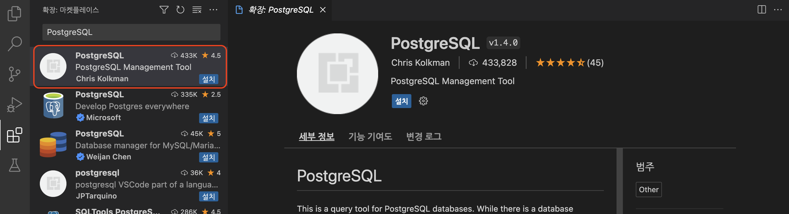

- 데이터베이스 연결

  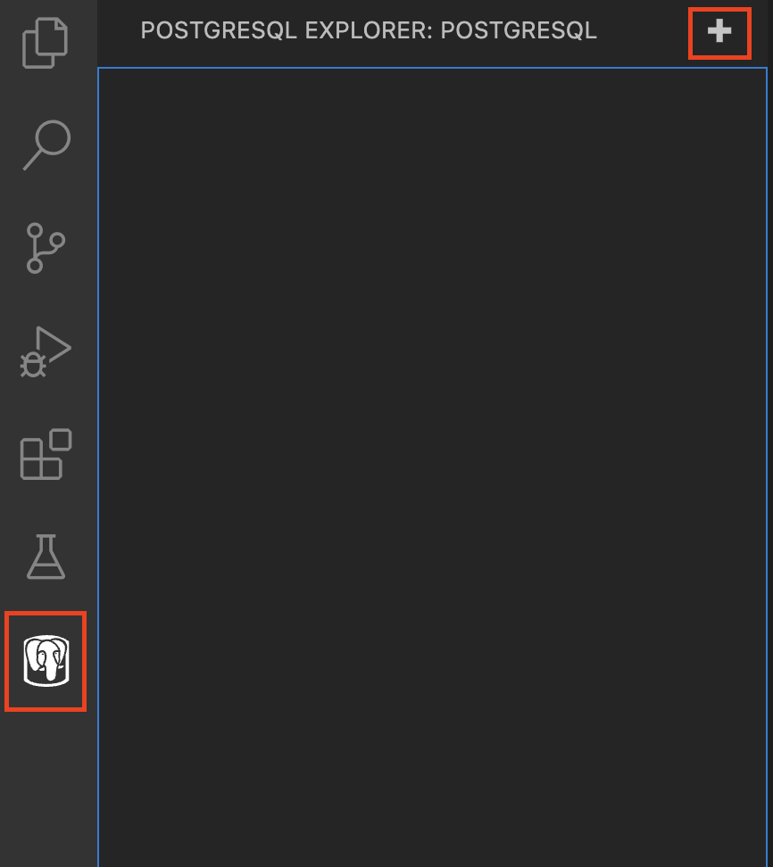

  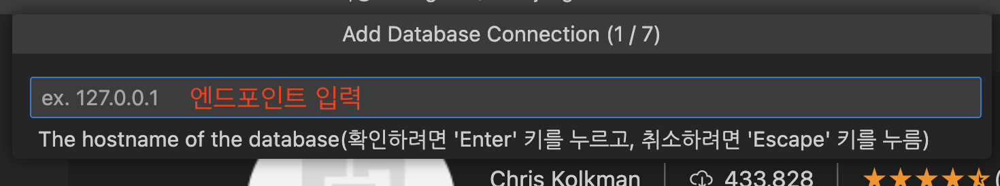

  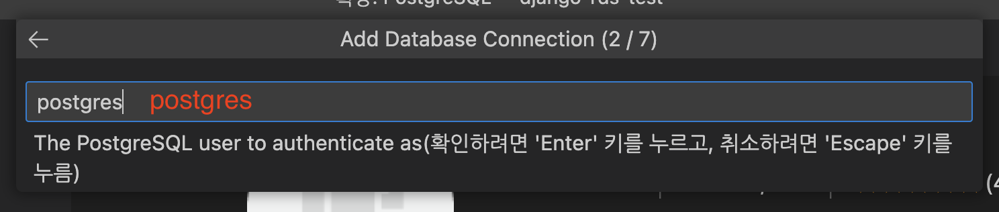

  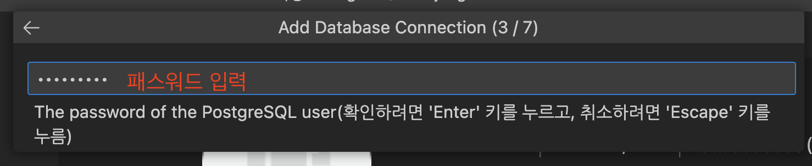

  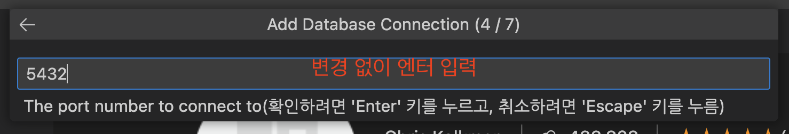

  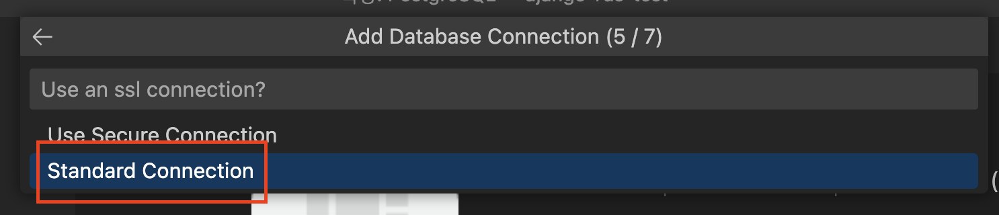

  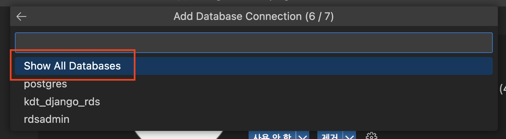

  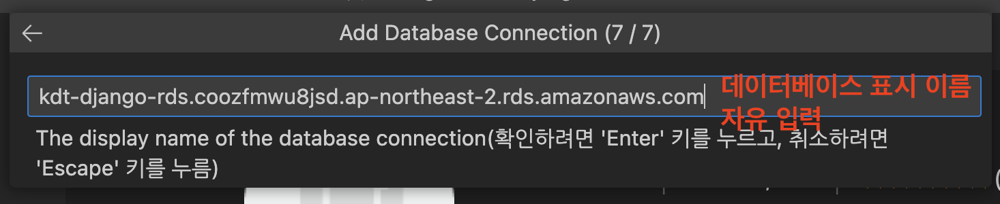

- 데이터베이스 연결 확인
  - 각 테이블을 오른쪽 클릭하면 데이터 조회(SELECT) 가능

  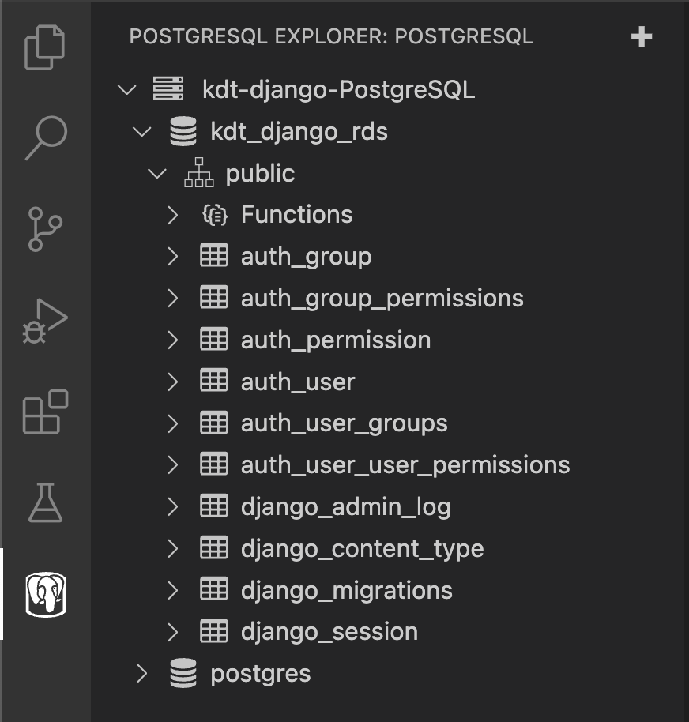