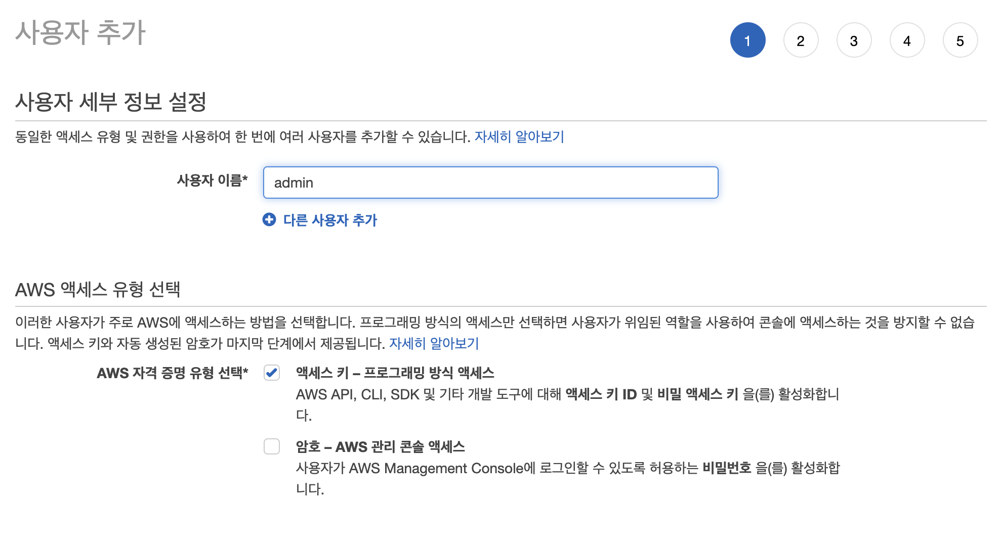
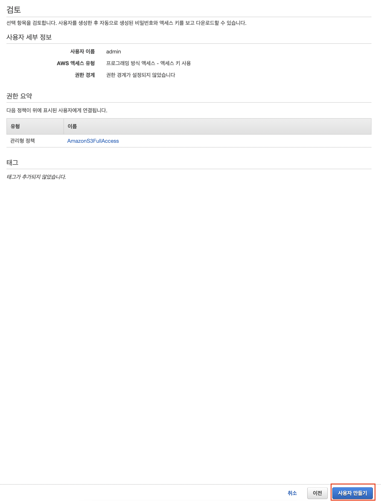
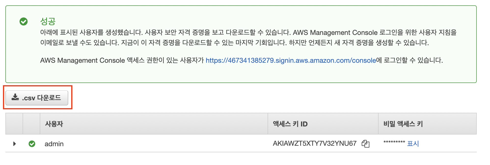
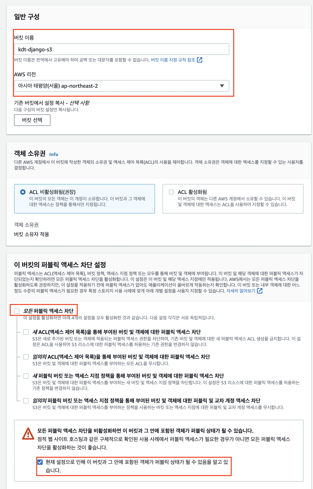

# ✔ Django - S3 연결 가이드
> AWS S3
- Simple Storage Service의 약자이며 인터넷 스토리지 서비스
- 사용량만큼 비용을 지불하며 프리티어에서의 제한은 아래와 같음
  - 5GB까지 무료
  - GET 요청 20000건 → 읽기 제한
  - PUT 요청 2000건 → 쓰기 제한
- 즉, 1년 동안 5GB까지 무료로 저장할 수 있고, 1년 동안 20000건의 조회 요청, 1년 동안 2000건의 쓰기 요청 가능

> IAM
- AWS 서비스 접근을 위한 사용자를 추가

1. 사용자 추가

   - AWS 좌측 상단 검색창에 IAM 을 입력해서 IAM 페이지 이동 - 사용자 메뉴 클릭
   - 사용자 추가 버튼을 클릭해서 사용자 추가를 시작합니다
   - MFA
     - AWS의 이중보안 시스템
     - 게임 로그인 시 아이디 / 비밀번호 외에 OTP를 요구하는 시스템
   
     

2. 사용자 세부 정보 설정

   - 사용자 이름을 작성 / AWS 자격 증명 유형 - 액세스 키 선택
 
     

3. 권한 설정

   - 기존 정책 직접 연결 - `AmazonS3FullAccess` 검색 후 선택
 
     

4. 검토

   - 사용자 만들기 클릭
 
     

5. 액세스 정보(.csv) 다운로드

   

> S3 
1. 버킷 추가

   - S3 검색 - 페이지 진입 - 버킷 만들기 클릭
 
     

2. 버킷 설정

   - 버킷 이름 작성
   - AWS 리전 선택
   - 모든 퍼블릭 액세스 차단 해제 - 해제 확인
   - 버킷 생성
 
     

3. 버킷 정책 생성

   - 생성한 버킷 클릭 - 권한 탭 이동
   - 버킷 정책 편집 - 정책 생성기
 
     
 
     
 
     ```
     *Select Type of Policy - S3 Bucket Policy
     Effect - Allow
     Principal - *
     Actions 
     - DeleteObject
     - GetObject
     - GetObjectAcl
     - PutObject
     - PutObjectAcl
     Amazon Resource Name
     - arn:aws:s3:::[버킷이름]/*
 
     - 예시) arn:aws:s3:::kdt-django-s3/*
     ```
 
   - Generate Policy 클릭 - 생성된 정책을 정책 편집 페이지에 복사 후 변경사항 저장
 
     
 
     

> Django S3

1. 패키지 설치

   ```bash
   pip install python-dotenv
   pip install django-storages
   pip install boto3
   pip freeze > requirements.txt
   ```

2. settings.py 설정

   ```
   BASE_DIR(manage.py가 있는 폴더)에 .env 파일 생성 후 아래 값 작성
 
   AWS_ACCESS_KEY_ID = [IAM 사용자 Access key ID]
   AWS_SECRET_ACCESS_KEY = [IAM 사용자 Secret access key]
   AWS_STORAGE_BUCKET_NAME = [S3 버킷 이름]
 
 
   # 예시
   AWS_ACCESS_KEY_ID = 21390ujskladjlask
   AWS_SECRET_ACCESS_KEY = 21oi3uqwjd09asoi
   AWS_STORAGE_BUCKET_NAME = kdt-django-s3
   ```
 
   ```python
   # 최상단에 아래 3줄을 추가.
   from dotenv import load_dotenv
   import os
   load_dotenv() # .env 파일에서 환경 변수를 불러옵니다.
 
 
   INSTALLED_APPS = [
     "storages", # storages 추가
     # ... 이하 생략
   ]
 
   """
   기존 MEDIA 설정 주석
   MEDIA_ROOT = ...
   MEDIA_URL = ...
   """
 
   # 아래 코드 추가
   DEFAULT_FILE_STORAGE = "storages.backends.s3boto3.S3Boto3Storage"
 
   AWS_ACCESS_KEY_ID = os.getenv("AWS_ACCESS_KEY_ID")
   AWS_SECRET_ACCESS_KEY = os.getenv("AWS_SECRET_ACCESS_KEY")
   AWS_STORAGE_BUCKET_NAME = os.getenv("AWS_STORAGE_BUCKET_NAME")
 
   AWS_REGION = "ap-northeast-2"
   AWS_S3_CUSTOM_DOMAIN = "%s.s3.%s.amazonaws.com" % (
       AWS_STORAGE_BUCKET_NAME,
       AWS_REGION,
   )
   ```

3. 테스트

   - 로컬 서버에서 미디어 파일이 정상적으로 업로드 및 조회가 되는지 확인합니다.

4. 개발 & 배포 환경 분리

   - 개발 환경에서는 기존 설정(MEDIA_URL / MEDIA_ROOT)이 작동하도록 배포 환경에서는 S3 설정이 작동하도록 설정을 분리합니다.
 
   ```
   .env에 DEBUG 값 추가
 
   DEBUG = True
   ```
 
   ```python
   # settings.py
 
   """
   기타 환경에 따라 설정 분리가 필요한 경우 코드를 분리해서 추가로 작성합니다. 
   """
 
   DEBUG = os.getenv("DEBUG") == "True"
 
   if DEBUG: 
       MEDIA_URL = "/media/"
       MEDIA_ROOT = BASE_DIR / "media"
 
   else:   
       DEFAULT_FILE_STORAGE = "storages.backends.s3boto3.S3Boto3Storage"
 
       AWS_ACCESS_KEY_ID = os.getenv("AWS_ACCESS_KEY_ID")
       AWS_SECRET_ACCESS_KEY = os.getenv("AWS_SECRET_ACCESS_KEY")
       AWS_STORAGE_BUCKET_NAME = os.getenv("AWS_STORAGE_BUCKET_NAME")
 
       AWS_REGION = "ap-northeast-2"
       AWS_S3_CUSTOM_DOMAIN = "%s.s3.%s.amazonaws.com" % (
           AWS_STORAGE_BUCKET_NAME,
           AWS_REGION,
       )
   ```

5. 헤로쿠 배포 시 환경변수 설정

   - 헤로쿠로 배포할 경우 S3에 대한 환경 변수를 추가로 설정합니다.
 
     
 
6. 배포 후 이미지 업로드 테스트

   - 문제 없이 이미지 업로드 및 출력이 되는지 확인합니다.