# ✔ AWS Elastic Beanstalk + Github Actions

- AWS는 잘못된 사용을 할 경우 많은 과금이 발생할 수도 있음
- 주의) 두 개 이상의 Beanstalk 애플리케이션을 생성하면 과금이 발생할 수 있음
- 이 가이드는 S3 와 RDS 설정 후 진행할 수 있음
- 지역 설정: 서울
- 주의) 다른 지역에서 생성한 Beanstalk 애플리케이션은 모두 삭제해아

  

## ✅ IAM

- 기존 IAM 사용자에 `AdministratorAccess-AWSElasticBeanstalk` 권한 추가

  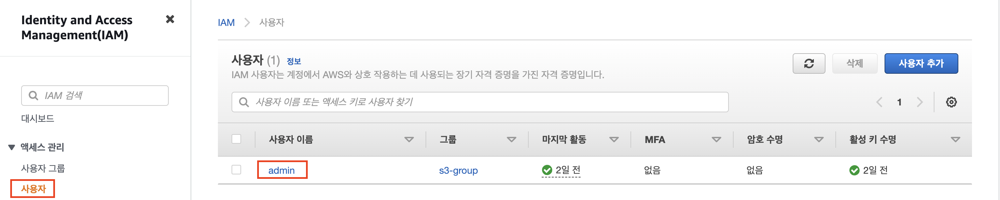

  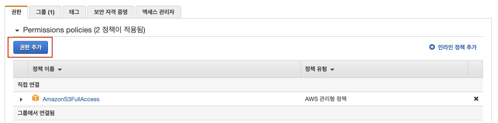

  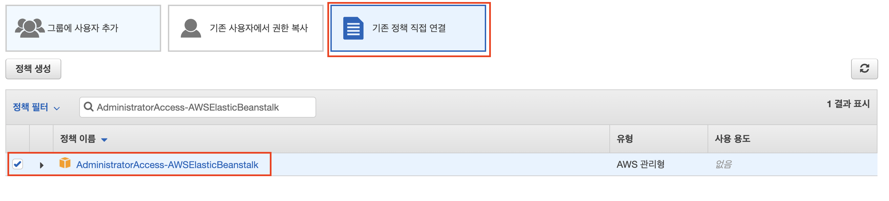

## ✅ Elastic Beanstalk

> 애플리케이션 생성

- 검색창 `Elastic Beanstalk` 검색 - 페이지 이동

- 애플리케이션 생성

  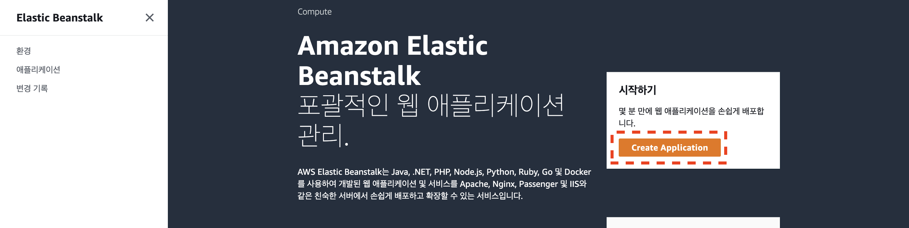

  

- 애플리케이션 및 환경 생성이 끝날 때까지 기다린다

- 환경 상태가 `OK`가 되면 생성이 끝난 상태임

  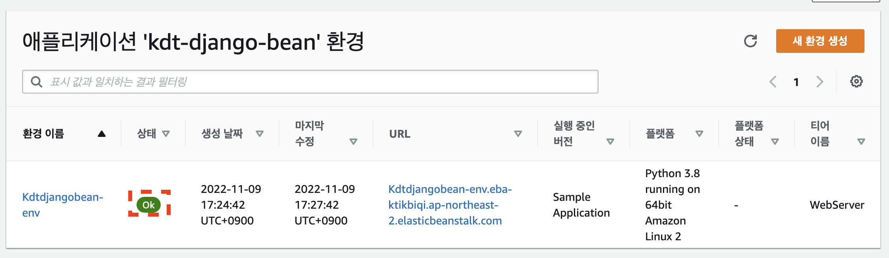

> Elastic Bean 환경 변수 설정

- 환경 - 구성 - 소프트웨어 - 편집
  
  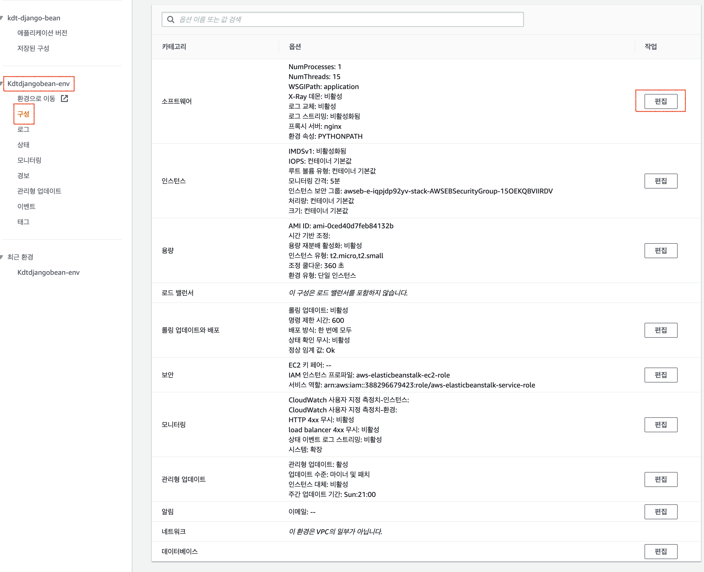

- 배포 환경에 필요한 환경 변수를 등록
  - DEBUG : False
  - PYTHONPATH : 기존에 작성되어 있는 값 수정하지 말것.
  - Django 시크릿 키를 분리한 경우 시크릿키도 작성.
  - 필수 환경 변수
    - AWS_ACCESS_KEY_ID : AWS IAM 액세스 키
    - AWS_SECRET_ACCESS_KEY : AWS IAM 시크릿 키
    - AWS_STORAGE_BUCKET_NAME : AWS S3 버킷 이름
    - DATABASE_HOST : AWS RDS 데이터베이스 엔드포인트
    - DATABASE_NAME : AWS RDS 접속 데이터베이스 이름
    - DATABASE_PASSWORD : AWS RDS 접속 데이터베이스 패스워드

  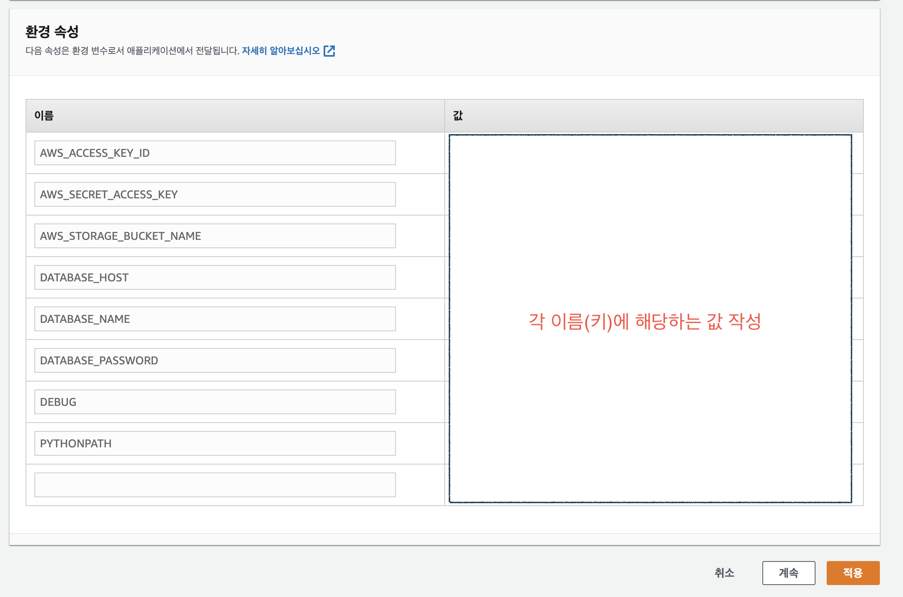

## ✅ 장고

> ALLOWED_HOSTS

- settings.py `ALLOWED_HOSTS` 수정
  
  ```python
  ALLOWED_HOSTS = [
      # "Elastic Beanstalk URL",
      "sharestreet-env.eba-xqbmviyc.ap-northeast-2.elasticbeanstalk.com", # 예시입니다. 본인 URL로 해주세요.
      "127.0.0.1",
      "localhost",
  ]
  ```

  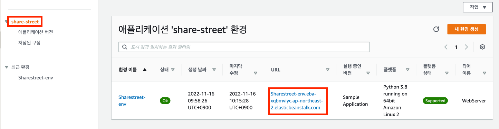

> .ebextensions

- manage.py가 위치한 폴더에 `.ebextensions` 폴더 생성
- `.ebextensions` 안에 `django.config` 파일 생성

  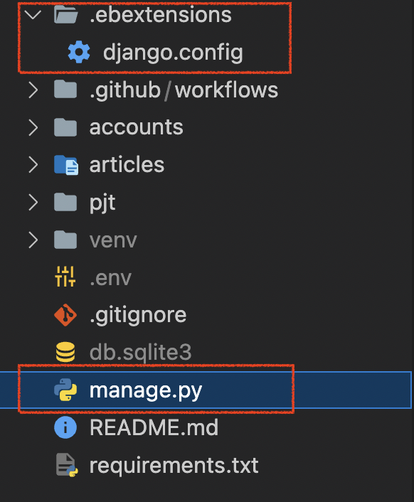

- `django.config` 파일 내용 작성
- 아래 [프로젝트명] [STATIC_URL] [STATIC_ROOT]를 수정

  ```
  option_settings:
    aws:elasticbeanstalk:container:python:
      WSGIPath: [프로젝트명].wsgi:application
    
    aws:elasticbeanstalk:environment:proxy:staticfiles:
      /[STATIC_URL]: [STATIC_ROOT]

  container_commands:
    01_migrate:
      command: "source /var/app/venv/*/bin/activate && python3 manage.py migrate"
      leader_only: true
    02_collectstatic:
      command: "source /var/app/venv/*/bin/activate && python3 manage.py collectstatic --noinput"
  ```

  - 예시
  
  ```python
  # settings.py
  # STATIC_ROOT 속성이 없을시에 추가
  STATIC_URL = '/static/'
  STATIC_ROOT = 'staticfiles'
  ```

  ```
  option_settings:
    aws:elasticbeanstalk:container:python:
      WSGIPath: config.wsgi:application
    
    aws:elasticbeanstalk:environment:proxy:staticfiles:
      /static: staticfiles


  container_commands:
    01_migrate:
      command: "source /var/app/venv/*/bin/activate && python3 manage.py migrate"
      leader_only: true
    02_collectstatic:
      command: "source /var/app/venv/*/bin/activate && python3 manage.py collectstatic --noinput"
  ```

## ✅ Github Actions

- Github Actions는 Github에서 제공하는 **CI**(Continuous Integration, 지속 통합)/ **CD**(Continuous Deployment, 지속 배포) 서비스
- 특정 이벤트(Push, Pull Request)에 반응하여 **자동**으로 특정 작업을 실행시킬 수 있는 서비스
- 이 가이드에서는 이벤트에 반응하여 Elastic Beanstalk 배포 작업을 실행하게 할 것임

> Gthub Actions workflow 작성

- manage.py가 위치한 폴더에 `.github` 폴더 생성

- `.github` 폴더 안에 `workflows` 폴더 생성
  
  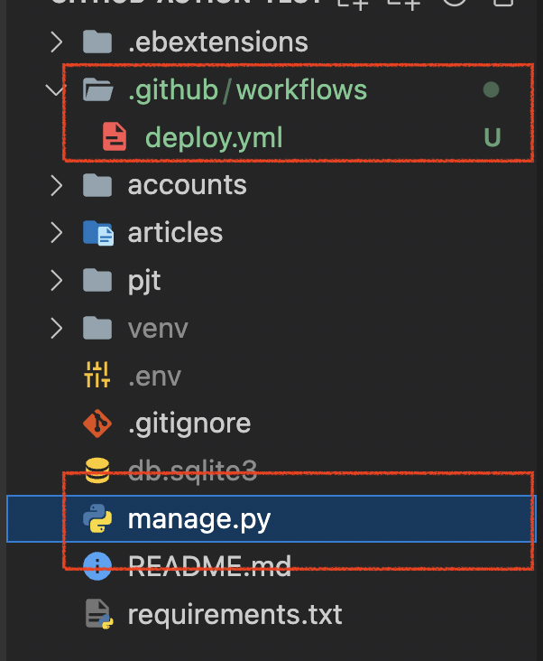

- `workflows` 폴더 안에 `deploy.yml` 파일 생성

- `deploy.yml` 파일 내용 작성(주석은 삭제할 것 총 8줄)

- 색이 다른 코드만 수정(예시를 잘 볼 것)
  
  ```yaml
  name: EB_Deploy

  on:
    push:
      branches: [팀 내 default 브랜치이름]
      # 예시
      # branches: [main]

  jobs: 
    deploy: 
        runs-on: ubuntu-latest

        steps:
        - name: Checkout source code
          uses: actions/checkout@v2

        - name: Generate deployment package
          run: zip -r deploy.zip . -x '*.git*'
        
        - name: Get timestamp
          uses: gerred/actions/current-time@master
          id: current-time

        - name: Run string replace
          uses: frabert/replace-string-action@master
          id: format-time
          with:
            pattern: '[:\.]+'
            string: "${{ steps.current-time.outputs.time }}"
            replace-with: '-'
            flags: 'g'
        - name: Deploy to EB
          uses: einaregilsson/beanstalk-deploy@v20
          with:
            aws_access_key: ${{ secrets.AWS_ACCESS_KEY_ID }}
            aws_secret_key: ${{ secrets.AWS_SECRET_ACCESS_KEY }}
            application_name: [Beanstalk 애플리케이션 이름]
            # 예시
            # application_name: "kdt-django-bean"
            environment_name: [Beanstalk 환경 이름]
            # 예시
            # environment_name: "Kdtdjangobean-env"
            version_label: "python-${{ steps.format-time.outputs.replaced }}"
            region: "ap-northeast-2"
            deployment_package: deploy.zip
  ```

  

- GitHub Repo - 아래 두 가지 secrets 생성
  - AWS_ACCESS_KEY_ID
  - AWS_SECRET_ACCESS_KEY

  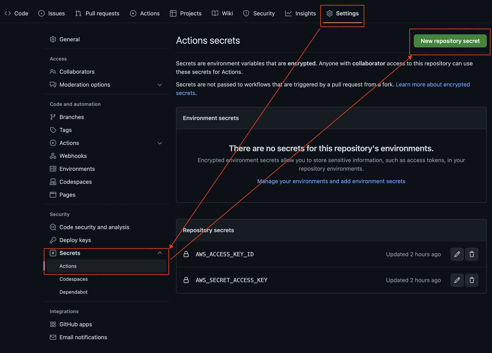

  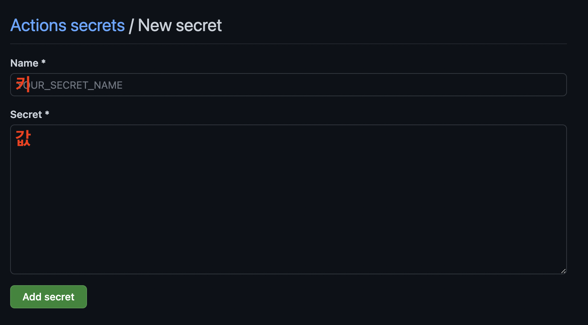

> Github Action 작동 확인

- Push 후 Action이 정상적으로 작동하는지 확인 
- 이후에는 이벤트(Push or Pull Request)가 실행될 때 자동으로 배포가 진행됨
- 개발 중 환경 변수가 추가되면 Elastic Beanstalk 환경 구성에 환경 변수를 추가해야함

> 에러 상황 시 Elastic Beanstalk 로그 확인

- 1️⃣ 생성한 AWS Elastic Beanstalk 페이지 진입
- 2️⃣ 왼쪽 메뉴 중 로그 클릭
- 3️⃣ 화면 중 로그 요청 클릭 - 마지막 100줄 클릭
- 4️⃣ 다운로드 눌러서 확인