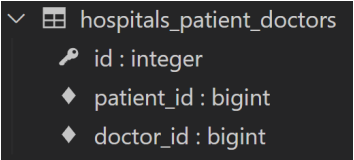
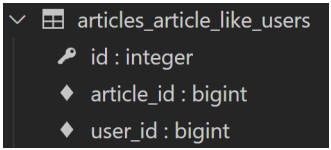
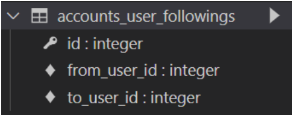

# ✔ Many to many relationship

> 중개 모델

- 의사와 환자간 예약 시스템을 구현하고자, **별도의 예약 모델**을 새로 작성
  
  - 예약 모델은 의사와 환자에 각각 N:1 관계를 가짐
  
  ```python
  # hospitals/models.py
  
  # 의사
  class Doctor(models.Model):
    name = models.TextField()
  
    def __str__(self):
      return f'{self.pk}번 의사 {self.name}'
  
  # 환자
  class Patient(models.Model):
    name = models.TextField()
  
    def __str__(self):
      return f'{self.pk}번 환자 {self.name}'
  
  # 예약 (중개모델 작성)
  class Reservation(models.Model):
    doctor = models.ForeignKey(Doctor, on_delete=models.CASCADE)
    patient = models.ForeignKey(Patient, on_delete=models.CASCADE)
  
    def __str__(self):
      return f'{self.doctor_id}번 의사의 {self.patient_id}번 환자'
  ```

- Migration 진행 및 shell_plus 실행
  
  ```bash
  $ python manage.py makemigrations
  $ python manage.py migrate
  
  $ python manage.py shell_plus
  ```

- 의사와 환자 생성 후 예약 만들기
  
  ```python
  doctor1 = Doctor.objects.create(name='alice')
  patient1 = Patient.objects.create(name='carol')
  
  Reservation.objects.create(doctor=doctor1, patient=patient1)
  ```

- DB 확인 (`hospitals_reservation` 테이블)
  
  | id  | doctor_id | patient_id |
  |:---:|:---------:|:----------:|
  | 1   | 1         | 1          |

- 예약 정보 조회
  
  ```python
  # 의사 -> 예약 정보 찾기
  doctor1.reservation_set.all()
  # <QuerySet [<Reservation: 1번 의사의 1번 환자>]>
  
  # 환자 -> 예약 정보 찾기
  patient1.reservation_set.all()
  # <QuerySet [<Reservation: 1번 의사의 1번 환자>]>
  ```

> Django `ManyToManyField`

- Django는 **ManyToManyField를 통해 중개 테이블을 자동으로 생성**함
  
  - 환자 모델에 Django `ManyToManyField` 작성
    
    - Django의 ManyToManyField는 M:N 관계를 가진 모델 어디에 위치해도 상관 없음
    - 대신 필드 작성 위치에 따라 참조와 역참조 방향을 주의할 것
  
  - Reservation Class는 주석 처리
  
  ```python
  # hospitals/models.py
  
  # 의사
  class Doctor(models.Model):
    name = models.TextField()
  
    def __str__(self):
      return f'{self.pk}번 의사 {self.name}'
  
  # 환자
  class Patient(models.Model):
    doctors = models.ManyToManyField(Doctor)   # ManyToManyField 작성
    name = models.TextField()
  
    def __str__(self):
      return f'{self.pk}번 환자 {self.name}’
  ```

- Migration 진행 및 shell_plus 실행
  
  ```bash
  $ python manage.py makemigrations
  $ python manage.py migrate
  
  $ python manage.py shell_plus
  ```

- 생성된 중개 테이블 `hospitals_patient_doctors` 확인

- 의사 1명과 환자 2명 생성 
  
  ```python
  doctor1 = Doctor.objects.create(name='alice')
  patient1 = Patient.objects.create(name='carol')
  patient2 = Patient.objects.create(name='dane')
  ```

- 예약 생성 (환자가 의사에게 예약)
  
  - `add` 메서드를 통해 환자가 의사 지정 가능
  
  ```python
  # patient1이 doctor1에게 예약
  patient1.doctors.add(doctor1)
  
  # patient1 - 자신이 예약한 의사목록 확인
  patient1.doctors.all()
  # <QuerySet [<Doctor: 1번 의사 alice>]>
  
  # doctor1 - 자신의 예약된 환자목록 확인
  doctor1.patient_set.all()
  # <QuerySet [<Patient: 1번 환자 carol>]>
  ```

- 예약 생성 (의사가 환자를 예약)

  - `add` 메서드를 통해 의사가 환자 지정 가능
  
  ```python
  # doctor1이 patient2을 예약
  doctor1.patient_set.add(patient2)
  
  # doctor1 - 자신의 예약 환자목록 확인
  doctor1.patient_set.all()
  # <QuerySet [<Patient: 1번 환자 carol>, <Patient: 2번 환자 dane>]>
  
  # patient1, 2 - 자신이 예약한 의사목록 확인
  patient1.doctors.all()
  # <QuerySet [<Doctor: 1번 의사 alice>]>
  patient2.doctors.all()
  # <QuerySet [<Doctor: 1번 의사 alice>]>
  ```

- DB 확인 (`hospitals_patient_doctors` 테이블)

  | id  | patient_id | doctor_id |
  |:---:|:----------:|:---------:|
  | 1   | 1          | 1         |
  | 2   | 2          | 1         |

- 예약 취소하기 (삭제)
  
  - `remove()` 메서드를 사용해 데이터 삭제

  ```python
  # doctor1이 patient1 진료 예약 취소

  doctor1.patient_set.remove(patient1)
  
  doctor1.patient_set.all()
  # <QuerySet [<Patient: 2번 환자 harry>]>
  
  patient1.doctors.all()
  # <QuerySet []>
  ```

  ```python
  # patient2가 doctor1 진료 예약 취소

  patient2.doctors.remove(doctor1)

  patient2.doctors.all()
  # <QuerySet []>

  doctor1.patient_set.all()
  # <QuerySet []>
  ```

> Django `ManyToManyField`의 `related_name` 속성

- target model이 source model을 **참조**할 때 사용할 manager name

- related_name을 설정하면 기존 `_set` manager는 사용할 수 없음

- `ForeignKey()`의 related_name과 동일

  ```python
  class Patient(models.Model):
    # ManyToManyField - related_name 작성
    doctors = models.ManyToManyField(Doctor, related_name='patients')
    name = models.TextField()
  
    def __str__(self):
      return f'{self.pk}번 환자 {self.name}'
  ```

- Migration 진행 및 shell_plus 실행

  ```bash
  $ python manage.py makemigrations
  $ python manage.py migrate

  $ python manage.py shell_plus
  ```

- `related_name` 설정 값 확인하기

  ```python
  # 1번 의사 조회하기
  doctor1 = Doctor.objects.get(pk=1)

  # 에러 발생 (related_name 을 설정하면 기존 _set manager는 사용할 수 없음)
  doctor1.patient_set.all()
  # AttributeError: 'Doctor' object has no attribute 'patient_set'

  # 변경 후
  doctor1.patients.all()
  # <QuerySet []>
  ```

> Django `ManyToManyField`의 `through` 속성

- **중개 테이블을 수동으로 지정**하려는 경우 `through` 옵션을 사용하여, 사용하려는 중개 테이블을 나타내는 Django 모델을 지정할 수 있음
- 가장 일반적인 용도는 중개테이블에 추가 데이터를 사용해 다대다 관계와 연결하려는 경우

- through 설정 및 Reservation Class 수정
  - 이제는 예약 정보에 증상과 예약일이라는 추가 데이터가 생김

  ```python
  # hospitals/models.py
  
  # 의사
  class Doctor(models.Model):
    name = models.TextField()
  
    def __str__(self):
      return f'{self.pk}번 의사 {self.name}'
  
  # 환자
  class Patient(models.Model):
    doctors = models.ManyToManyField(Doctor, through='Reservation')
    name = models.TextField()
    
    def __str__(self):
      return f'{self.pk}번 환자 {self.name}'

  # 예약
  class Reservation(models.Model):
    doctor = models.ForeignKey(Doctor, on_delete=models.CASCADE)
    patient = models.ForeignKey(Patient, on_delete=models.CASCADE)
    symptom = models.TextField()
    reserved_at = models.DateTimeField(auto_now_add=True)
    
    def __str__(self):
      return f'{self.doctor.pk}번 의사의 {self.patient.pk}번 환자'
  ```


# ✔ Django ManyToManyField

- `ManyToManyField(to, **options)`

- 다대다 (M:N, many-to-many) 관계 설정 시 사용하는 모델 필드
- 하나의 필수 위치인자(M:N 관계로 설정할 모델 클래스)가 필요
- 모델 필드의 `RelatedManager`를 사용하여 관련 개체를 추가, 제거 또는 만들 수 있음
  - `add()`, `remove()`, `create()`, `clear()` 등

> 데이터베이스에서의 표현

- Django는 다대다 관계를 나타내는 중개 테이블을 만듦
- 테이블 이름은 ManyToManyField 이름과 이를 포함하는 모델의 테이블 이름을 조합하여 생성됨
- `db_table` arguments을 사용하여 중개 테이블의 이름을 변경할 수도 있음

> `ManyToManyField`의 속성

1. `related_name`

   - target model이 source model을 참조할 때 사용할 manager name
   - ForeignKey의 related_name과 동일

2. `through`

   - 중개 테이블을 직접 작성하는 경우, through 옵션을 사용하여 중개 테이블을 나타내는 Django 모델을 지정
   - 일반적으로 중개 테이블에 추가 데이터를 사용하는 다대다 관계와 연결하려는 경우(extra data with a many-to-many relationship)에 사용됨

3. `symmetrical`

   - 기본 값: True
   - ManyToManyField가 **동일한 모델**(on self)을 가리키는 정의에서만 사용
  
   1. `symmetrical=True`일 경우
   
      - `_set` 매니저를 추가 하지 않음
      - source 모델의 인스턴스가 target 모델의 인스턴스를 참조하면 자동으로 target 모델 인스턴스도 source 모델 인스턴스를 자동으로 참조하도록 함(대칭)
  
   2. `symmetrical=False`일 경우

      - 대칭을 원하지 않는 경우 False로 설정
      - 예) Follow 기능 구현 시


   ```python
   class Person(models.Model):
     friends = models.ManyToManyField('self')
     # friends = models.ManyToManyField('self', symmetrical=False)
   ```

> Related Manager

- `N:1` 혹은 `M:N` 관계에서 사용 가능한 문맥(context)

- Django는 모델 간 N:1 혹은 M:N 관계가 설정되면 역참조시에 사용할 수 있는 manager를 생성
  
  - 우리가 이전에 모델 생성 시 objects 라는 매니저를 통해 queryset api를 사용했던 것처럼 related manager를 통해 queryset api를 사용할 수 있게 됨

- 같은 이름의 메서드여도 각 관계(N:1, M:N)에 따라 다르게 사용 및 동작됨
  
  - `N:1`에서는 target 모델 객체만 사용 가능
  
  - `M:N` 관계에서는 관련된 두 객체에서 모두 사용 가능

- 메서드 종류
  
  - `add()`, `remove()`, `create()`, `clear()`, `set()` 등

1. `add()` 메서드

   - 지정된 객체를 관련 객체 집합에 추가
   - 이미 존재하는 관계에 사용하면 관계가 복제되지 않음
   - 모델 인스턴스, 필드 값(PK)을 인자로 허용

2. `remove()` 메서드

   - 관련 객체 집합에서 지정된 모델 개체를 제거
   - 내부적으로 `QuerySet.delete()`를 사용하여 관계가 삭제됨
   - 모델 인스턴스, 필드 값(PK)을 인자로 허용

> 중개 테이블 필드 생성 규칙

- 소스(source model) 및 대상(target model) 모델이 다른 경우
  - id
  - <containing_model>_id
  - <other_model>_id

  

- ManyToManyField가 동일한 모델을 가리키는 경우
  - id
  - from_<model>_id
  - to_<model>_id


# ✔ M:N 관계 (Article - User 간의 LIKE)
> 모델 관계 설정
- ManyToManyField 작성

  ```python
  # articles/models.py

  class Article(models.Model):
    user = models.ForeignKey(settings.AUTH_USER_MODEL, on_delete=models.CASCADE)
    like_users = models.ManyToManyField(settings.AUTH_USER_MODEL)
    title = models.CharField(max_length=10)
    content = models.TextField()
    created_at = models.DateTimeField(auto_now_add=True)
    updated_at = models.DateTimeField(auto_now=True)
  ```

- Migration 진행 후 에러 확인
  
  - `like_users` 필드 생성 시 자동으로 역참조에는 `.article_set` 매니저가 생성됨
  
  - 그러나 이전 N:1(Article-User) 관계에서 이미 해당 매니저를 사용 중
    
    - user.article_set.all() → 해당 유저가 작성한 모든 게시글 조회
    
    - user가 작성한 글들(user.article_set)과 user가 좋아요를 누른 글(user.article_set)을 구분할 수 없게 됨
  
  - 해결책: user와 관계된 ForeignKey 혹은 ManyToManyField 중 하나에 `related_name`을 작성해야 함


  ```bash
  $ python manage.py makemigrations
  ```

  ```bash
  ERRORS:
  articles.Article.like_users: (fields.E304) Reverse accessor for 'Article.like_users' clashes with reverse accessor for 'Article.user'.
  HINT: Add or change a related_name argument to the definition for 'Article.like_users' or 'Article.user'.
  articles.Article.user: (fields.E304) Reverse accessor for 'Article.user' clashes with reverse accessor for 'Article.like_users'.
  HINT: Add or change a related_name argument to the definition for 'Article.user' or 'Article.like_users'.
  ```

- ManyToManyField에 `related_name` 작성 후 Migration

  ```python
  # articles/models.py

  class Article(models.Model):
    user = models.ForeignKey(settings.AUTH_USER_MODEL, on_delete=models.CASCADE)
    like_users = models.ManyToManyField(settings.AUTH_USER_MODEL, related_name='like_articles')
    title = models.CharField(max_length=10)
    content = models.TextField()
    created_at = models.DateTimeField(auto_now_add=True)
    updated_at = models.DateTimeField(auto_now=True)
  ```

  ```bash
  $ python manage.py makemigrations
  $ python manage.py migrate
  ```

- 생성된 중개 테이블 확인

  

- User - Article간 사용 가능한 `related manager` 정리
  
  - `article.user`: 게시글을 작성한 유저 - `N:1`
  
  - `user.article_set`: 유저가 작성한 게시글(역참조) - `N:1`
  
  - `article.like_users`: 게시글을 좋아요한 유저 - `M:N`
  
  - `user.like_articles`: 유저가 좋아요한 게시글(역참조) - `M:N`

> LIKE 구현

- url 및 view 함수 작성

  - `exists()` 메서드
    
    - QuerySet에 결과가 포함되어 있으면 True를 반환하고 그렇지 않으면 False를 반환
    - 특히 큰 QuerySet에 있는 특정 개체의 존재와 관련된 검색에 유용

  ```python
  # articles/urls.py
  
  urlpatterns = [
    ...
    path('<int:article_pk>/likes/', views.likes, name='likes'),
  ]
  ```

  ```python
  # articles/views.py

  def likes(request, article_pk):
    article = Article.objects.get(pk=article_pk)
    
    if article.like_users.filter(pk=request.user.pk).exists():
    # if request.user in article.like_users.all():
      article.like_users.remove(request.user)
    else:
      article.like_users.add(request.user)
    
    return redirect('articles:index')
  ```

- index 템플릿에서 각 게시글에 좋아요 버튼 출력하기

  ```django
  <!-- articles/index.html -->

  

  
    …
    
      …
      <div>
        <form action="" method="POST">
          
          
            <input type="submit" value="좋아요 취소">
          
            <input type="submit" value="좋아요">
          
        </form>
      </div>
      <a href="">DETAIL</a>
      <hr>
    
  
  ```

> Profile 구현 

- url 및 view 함수 작성

  ```python
  # accounts/urls.py

  urlpatterns = [
    …
    path('profile/<username>/', views.profile, name='profile'),
  ]
  ```

  ```python
  # accounts/views.py

  from django.contrib.auth import get_user_model

  def profile(request, username):
    User = get_user_model()
    person = User.objects.get(username=username)
    
    context = {
      'person': person,
    }

    return render(request, 'accounts/profile.html', context)
  ```

- profile 템플릿 작성

  ```django
  <!-- accounts/profile.html -->

  

  
    <h1>{{ person.username }}님의 프로필</h1>
    <hr>
    <h2>{{ person.username }}'s 게시글</h2>
    
      <div>{{ article.title }}</div>
    
    <hr>
    …
    <h2>{{ person.username }}'s 댓글</h2>
    
      <div>{{ comment.content }}</div>
    
    <hr>
    <h2>{{ person.username }}'s 좋아요한 게시글</h2>
    
      <div>{{ article.title }}</div>
    
    <hr>
    <a href="">back</a>
  
  ```

- Profile 템플릿으로 이동할 수 있는 하이퍼 링크 작성

  ```django
  <!-- base.html -->

  <body>
    <div class="container">
    
      <h3>Hello, {{ user }}</h3>
      <a href="">내 프로필</a>
    …
  ```

  ```django
  <!-- articles/index.html -->

  <p>
    <b>작성자 : <a href="">{{ article.user }}</a></b>
  </p>
  ```


# ✔ M:N 관계 (User - User 간의 FOLLOW)
> 모델 관계 설정 

- ManyToManyField 작성

  ```python
  # accounts/models.py

  class User(AbstractUser):
    followings = models.ManyToManyField('self', symmetrical=False, related_name='followers')
  ```

- Migration 진행

  ```bash
  $ python manage.py makemigrations
  $ python manage.py migrate
  ```

- 생성된 중개 테이블 확인

  

> Follow 구현

- url 및 view 함수 작성

  ```python
  # accounts/urls.py

  urlpatterns = [
    ...,
    path('<int:user_pk>/follow/', views.follow, name='follow'),
  ]
  ```

  ```python
  # accounts/views.py

  def follow(request, user_pk):
    User = get_user_model()
    person = User.objects.get(pk=user_pk)
    
    if person != request.user:
      if person.followers.filter(pk=request.user.pk).exists():
      # if request.user in person.followers.all():
        person.followers.remove(request.user)
      else:
        person.followers.add(request.user)
    
    return redirect('accounts:profile', person.username)
  ```

- 프로필 유저의 팔로잉, 팔로워 수 & 팔로우, 언팔로우 버튼 작성
  
  ```django
  <!-- accounts/profile.html -->

  

  
    <h1>{{ person.username }}님의 프로필</h1>
    <div>
      <div>
        팔로잉 : {{ person.followings.all|length }} / 팔로워 : {{ person.followers.all|length }}
      </div>
      
        <div>
          <form action="" method="POST">
            
            
              <input type="submit" value="Unfollow">
            
              <input type="submit" value="Follow">
            
          </form>
        </div>
      
    </div>
  ...
  ```

- 데코레이터 및 `is_authenticated` 추가

  ```python
  # accounts/views.py

  @require_POST
  def follow(request, user_pk):
    if request.user.is_authenticated:
      User = get_user_model()
      person = User.objects.get(pk=user_pk)
      
      if person != request.user:
        if person.followers.filter(pk=request.user.pk).exists():
        # if request.user in person.followers.all():
          person.followers.remove(request.user)
        else:
          person.followers.add(request.user)
      
      return redirect('accounts:profile', person.username)
    
    return redirect('accounts:login')
  ```