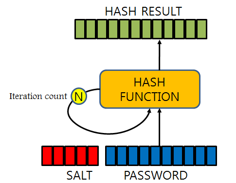
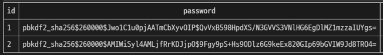
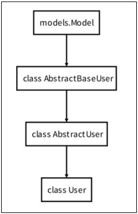
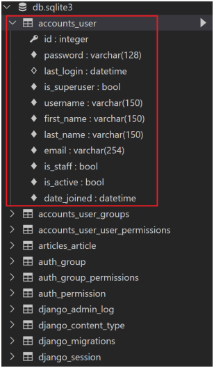

# ✔ Django Auth
- Django authentication system(인증 시스템)은 **인증**(Authentication)과 **권한**(Authorization) 부여를 함께 제공(처리)하고 있음
  - User
  - 권한 및 그룹
  - 암호 해시 시스템
  - Form 및 View 도구
  - 기타 적용가능한 시스템

- 필수 구성은 settings.py의 INSTALLED_APPS에서 확인 가능
  - `django.contrib.auth`

1. Authentication (인증)
   - 신원 확인
   - 사용자가 자신이 누구인지 확인하는 것

2. Authorization (권한, 허가)
   - 권한 부여
   - 인증된 사용자가 수행할 수 있는 작업을 결정

> 암호 관리
- 회원은 가입시 일반적으로 암호(password)를 저장이 필수적이며, 별도의 처리가 필요
- Django에서는 기본으로 PBKDF2(Password-Based Key Derivation Function)를 사용하여 저장
  - 단방향 해시함수를 활용하여 비밀번호를 다이제스트로 암호화하며, 이는 복호화가 불가능함
  - 단방향 해시함수는 MD5, SHA-1, SHA-256 등이 존재하며, Django는 **SHA256** 활용
  - 단방향 해시함수의 경우 레인보우 공격 및 무차별 대입 공격 등의 문제가 발생 가능함
  - 이를 보완하기 위하여 아래의 기법을 추가적으로 활용함
    - 솔팅(Salting): 패스워드에 임의의 문자열인 salt를 추가하여 다이제스트를 생성
    - 키 스트레칭(Key Stretching): 해시를 여러 번 반복하여 시간을 늘림

    

    ```
    <algorithm>$<iterations>$<salt>$<hash>
    ```

    

- [NAVER D2 - 안전한 패스워드 저장](https://d2.naver.com/helloworld/318732)
- [Password management in Django](https://docs.djangoproject.com/en/3.2/topics/auth/passwords/)

> 사전 설정
- accounts app 생성 및 등록

  ```bash
  $ python manage.py startapp accounts
  ```

  ```python
  # settings.py

  INSTALLED_APPS = [
    'articles',
    'accounts',
    ...
  ]
  ```

  - auth와 관련한 경로나 키워드들을 Django 내부적으로 accounts라는 이름으로 사용하고 있기 때문에 되도록 accounts로 지정하는 것을 권장
  - 다른 이름으로 설정해도 되지만 나중에 추가 설정을 해야 할 일들이 생기게 됨

- url 분리 및 매핑

  ```python
  # pjt/urls.py

  urlpatterns = [
    ...,
    path('accounts/', include('accounts.urls')),
  ]
  ```

  ```python
  # accounts/urls.py

  from django.urls import path
  from . import views

  app_name = 'accounts'
  urlpatterns = [
  ]
  ```


# ✔ Django User Model
- Django는 기본적인 인증 시스템과 여러 가지 필드가 포함된 User Model을 제공, 대부분의 개발 환경에서 **기본 User Model을 Custom User Model로 대체**함
  
  - Django는 새 프로젝트를 시작하는 경우 비록 기본 User 모델이 충분 하더라도 커스텀 User 모델을 설정하는 것을 강력하게 권장(highly recommended)
  
  - 커스텀 User 모델은 기본 User 모델과 동일하게 작동 하면서도 필요한 경우 나중에 맞춤 설정할 수 있기 때문
  
  - **단, User 모델 대체 작업은 프로젝트의 모든 migrations 혹은 첫 migrate를 실행하기 전에 이 작업을 마쳐야 함**
  
  - 프로젝트 진행 중에 User 모델 대체 작업을 할 경우, [참고자료](https://docs.djangoproject.com/en/4.1/topics/auth/customizing/#changing-to-a-custom-user-model-mid-project)

- 개발자들이 작성하는 일부 프로젝트에서는 django에서 제공하는 built-in User model의 기본 인증 요구사항이 적절하지 않을 수 있음
  
  - 예를 들어, 내 서비스에서 회원가입 시 username 대신 email을 식별 값으로 사용하는 것이 더 적합한 사이트인 경우, Django의 User Model은 기본적으로 username를 식별 값으로 사용하기 때문에 적합하지 않음

- Django는 현재 프로젝트에서 사용할 User Model을 결정하는 `AUTH_USER_MODEL` 설정 값으로 Default User Model을 재정의(override)할 수 있도록 함

> AUTH_USER_MODEL
- 프로젝트에서 User를 나타낼 때 사용하는 모델
- **프로젝트가 진행되는 동안 (모델을 만들고 마이그레이션 한 후) 변경할 수 없음**
- 프로젝트 시작 시 설정하기 위한 것이며, 참조하는 모델은 첫 번째 마이그레이션에서 사용할 수 있어야 함
  - 즉, 첫번째 마이그레이션 전에 확정 지어야 하는 값
- 기본 값: `auth.User`
  
  ```python
  # settings.py

  AUTH_USER_MODEL = 'auth.User'
  ```

  - AUTH_USER_MODEL은 실제 settings.py에서 보이지 않지만, settings.py가 상속받는 [global_settings.py](https://github.com/django/django/blob/main/django/conf/global_settings.py#L516)에 지정되어 있음

> User Model
- User 모델 상속 관계
  
  

1. `User 클래스`
  
   - [GitHub > Django/contrib/auth/models.py > User 클래스](https://github.com/django/django/blob/main/django/contrib/auth/models.py#L405)

   ```python
   # Django/contrib/auth/models.py
 
   class User(AbstractUser):
       """
       Users within the Django authentication system are represented by this
       model.
       Username and password are required. Other fields are optional.
       """
 
       class Meta(AbstractUser.Meta):
           swappable = "AUTH_USER_MODEL"
   ```

2. `AbstractUser 클래스`

   - [GitHub > Django/contrib/auth/models.py > AbstractUser 클래스](https://github.com/django/django/blob/main/django/contrib/auth/models.py#L334)
   - 지정 컬럼: username, first_name, last_name, email, is_staff, is_active, date_joined

   ```python
   # Django/contrib/auth/models.py
 
   from django.contrib.auth.base_user import AbstractBaseUser
 
   class AbstractUser(AbstractBaseUser, PermissionsMixin):
       """
       An abstract base class implementing a fully featured User model with
       admin-compliant permissions.
       Username and password are required. Other fields are optional.
       """
 
       username_validator = UnicodeUsernameValidator()
 
       username = models.CharField(
           _("username"),
           max_length=150,
           unique=True,
           help_text=_(
               "Required. 150 characters or fewer. Letters, digits and @/./+/-/_ only."
           ),
           validators=[username_validator],
           error_messages={
               "unique": _("A user with that username already exists."),
           },
       )
       first_name = models.CharField(_("first name"), max_length=150, blank=True)
       last_name = models.CharField(_("last name"), max_length=150, blank=True)
       email = models.EmailField(_("email address"), blank=True)
       is_staff = models.BooleanField(
           _("staff status"),
           default=False,
           help_text=_("Designates whether the user can log into this admin site."),
       )
       is_active = models.BooleanField(
           _("active"),
           default=True,
           help_text=_(
               "Designates whether this user should be treated as active. "
               "Unselect this instead of deleting accounts."
           ),
       )
       date_joined = models.DateTimeField(_("date joined"), default=timezone.now)

       objects = UserManager()
       
       ...

       def get_full_name(self):
           """
           Return the first_name plus the last_name, with a space in between.
           """
           full_name = "%s %s" % (self.first_name, self.last_name)
           return full_name.strip()
       
       ...
      
       def email_user(self, subject, message, from_email=None, **kwargs):
           """Send an email to this user."""
           send_mail(subject, message, from_email, [self.email], **kwargs)      
   ```

3. `AbstractBaseUser 클래스`
   
   - [GitHub > Django/contrib/auth/base_user.py > AbstractUser 클래스](https://github.com/django/django/blob/f30c7e381c94f41d361877d8a3e90f8cfb391709/django/contrib/auth/base_user.py#L56)
   - 지정 컬럼: password, last_login

   ```python
   # Django/contrib/auth/base_user.py
 
   from django.db import models
 
   class AbstractBaseUser(models.Model):
       password = models.CharField(_("password"), max_length=128)
       last_login = models.DateTimeField(_("last login"), blank=True, null=True)
       
       ...

       def get_username(self):
           """Return the username for this User."""
           return getattr(self, self.USERNAME_FIELD)
      
       @property
       def is_anonymous(self):
           """
           Always return False. This is a way of comparing User objects to
           anonymous users.
           """
           return False
 
       @property
       def is_authenticated(self):
           """
           Always return True. This is a way to tell if the user has been
           authenticated in templates.
           """
           return True
 
       def set_password(self, raw_password):
           self.password = make_password(raw_password)
           self._password = raw_password
      
       ...
   ```

> Custom User Model 생성하기

- 중요) User 모델 대체 작업은 프로젝트의 모든 migrations 혹은 첫 migrate를 실행하기 전에 이 작업을 마쳐야 함

1. Custom User 클래스 작성
  
   - `AbstractUser`를 상속받는 Custom User 클래스 작성
   - 기존 User 클래스도 AbstractUser를 상속받기 때문에 Custom User 클래스도 완전히 같은 모습을 가지게 됨

      ```python
      # accounts/models.py
    
      from django.contrib.auth.models import AbstractUser
    
      class User(AbstractUser):
          pass
      ```

2. AUTH_USER_MODEL 변경
   
   - Django 프로젝트에서 User를 나타내는데 사용하는 모델을 방금 생성한 Custom User 모델로 지정
  
      ```python
      # settings.py

      AUTH_USER_MODEL = 'accounts.User'
      ```

3. Migrations 진행
  
   ```bash
   $ python mange.py makemigrations
   ```
 
   ```bash
   $ python mange.py migrate
   ```

   - 이제 auth_user 테이블이 아니라 accounts_user 테이블을 사용하게 됨

     

> admin.py에 Custom User 모델 등록
- 기본 User 모델이 아니기 때문에 등록하지 않으면 admin site에 출력되지 않음

  ```python
  # accounts/admin.py

  from django.contrib import admin
  from django.contrib.auth.admin import UserAdmin
  from .models import User

  admin.site.register(User, UserAdmin)
  ```

> `get_user_model()` 

- 현재 프로젝트에서 활성화된 사용자 모델(active user model)을 반환

  ```python
  # settings.py

  AUTH_USER_MODEL = 'accounts.User'
  ```

- Django에서는 User 클래스는 커스텀을 통해 변경 가능하여, 직접 참조하는 대신 get_user_model()을 사용할 것을 권장함
  
  ```python
  # 기존
  from .models import User 

  user = User.objects.get(pk=2)

  # get_user_model 사용
  from django.contrib.auth import get_user_model

  user = get_user_model().objects.get(pk=2)
  ```


# ✔ Django AnonymousUser Model
> AnonymousUser Model
- [GitHub > Django/contrib/auth/models.py > AnonymousUser 클래스](https://github.com/django/django/blob/main/django/contrib/auth/models.py#L417)
  
  ```python
  class AnonymousUser:
      id = None
      pk = None
      username = ""
      is_staff = False
      is_active = False
      is_superuser = False
      _groups = EmptyManager(Group)
      _user_permissions = EmptyManager(Permission)

      def __str__(self):
          return "AnonymousUser"

      ...

      @property
      def is_anonymous(self):
          return True

      @property
      def is_authenticated(self):
          return False

      def get_username(self):
          return self.username
  ```


# ✔ Django UserCreationForm
> UserCreationForm
- 주어진 username과 password로 권한이 없는 새 user를 생성하는 **ModelForm**
- [GitHub > Django/contrib/auth/forms.py > UserCreationForm 클래스](https://github.com/django/django/blob/stable/3.2.x/django/contrib/auth/forms.py#L75)
- 3개의 필드를 가짐
  - username (from the **User model**)
  - password1
  - Password2

  ```python
  # Django/contrib/auth/forms.py
  
  from django import forms

  class UserCreationForm(forms.ModelForm):
      """
      A form that creates a user, with no privileges, from the given username and
      password.
      """
      error_messages = {
          'password_mismatch': _('The two password fields didn’t match.'),
      }
      password1 = forms.CharField(
          label=_("Password"),
          strip=False,
          widget=forms.PasswordInput(attrs={'autocomplete': 'new-password'}),
          help_text=password_validation.password_validators_help_text_html(),
      )
      password2 = forms.CharField(
          label=_("Password confirmation"),
          widget=forms.PasswordInput(attrs={'autocomplete': 'new-password'}),
          strip=False,
          help_text=_("Enter the same password as before, for verification."),
      )

      class Meta:
          model = User
          fields = ("username",)
          field_classes = {'username': UsernameField}

      ...

      def save(self, commit=True):
          user = super().save(commit=False)
          user.set_password(self.cleaned_data["password1"])
          if commit:
              user.save()
          return user
  ```

> Custom UserCreationForm 생성하기
- 기존 UserCreationForm을 상속받아 Custom User Form 재정의
  
  ```python
  # accounts/forms.py

  from django.contrib.auth import get_user_model
  from django.contrib.auth.forms import UserCreationForm

  class CustomUserCreationForm(UserCreationForm):
    
    class Meta(UserCreationForm.Meta):
      model = get_user_model()
  ```


# ✔ Django UserChangeForm
> UserChangeForm

- [GitHub > Django/contrib/auth/forms.py > UserChangeForm 클래스](https://github.com/django/django/blob/main/django/contrib/auth/forms.py#L147)
  
  ```python
  # Django/contrib/auth/forms.py

  from django import forms

  class UserChangeForm(forms.ModelForm):
      password = ReadOnlyPasswordHashField(
          label=_("Password"),
          help_text=_(
              "Raw passwords are not stored, so there is no way to see this "
              "user’s password, but you can change the password using "
              '<a href="{}">this form</a>.'
          ),
      )

      class Meta:
          model = User
          fields = "__all__"
          field_classes = {"username": UsernameField}

      def __init__(self, *args, **kwargs):
          super().__init__(*args, **kwargs)
          password = self.fields.get("password")
          if password:
              password.help_text = password.help_text.format("../password/")
          user_permissions = self.fields.get("user_permissions")
          if user_permissions:
              user_permissions.queryset = user_permissions.queryset.select_related(
                  "content_type"
              )
  ```


# ✔ Django SetPasswordForm
> SetPasswordForm

- [GitHub > Django/contrib/auth/forms.py > SetPasswordForm 클래스](https://github.com/django/django/blob/main/django/contrib/auth/forms.py#L353)

  ```python
  # Django/contrib/auth/forms.py

  from django import forms
  
  class SetPasswordForm(forms.Form):
      """
      A form that lets a user change set their password without entering the old
      password
      """

      error_messages = {
          "password_mismatch": _("The two password fields didn’t match."),
      }
      new_password1 = forms.CharField(
          label=_("New password"),
          widget=forms.PasswordInput(attrs={"autocomplete": "new-password"}),
          strip=False,
          help_text=password_validation.password_validators_help_text_html(),
      )
      new_password2 = forms.CharField(
          label=_("New password confirmation"),
          strip=False,
          widget=forms.PasswordInput(attrs={"autocomplete": "new-password"}),
      )

      def __init__(self, user, *args, **kwargs):
          self.user = user
          super().__init__(*args, **kwargs)

      def clean_new_password2(self):
          password1 = self.cleaned_data.get("new_password1")
          password2 = self.cleaned_data.get("new_password2")
          if password1 and password2:
              if password1 != password2:
                  raise ValidationError(
                      self.error_messages["password_mismatch"],
                      code="password_mismatch",
                  )
          password_validation.validate_password(password2, self.user)
          return password2

      def save(self, commit=True):
          password = self.cleaned_data["new_password1"]
          self.user.set_password(password)
          if commit:
              self.user.save()
          return self.user
  ```


# ✔ Django AuthenticationForm
> AuthenticationForm
- 로그인을 위한 built-in form
  - 로그인 하고자 하는 사용자 정보를 입력 받음(username, password)
  - ModelForm이 아닌 일반 **Form**을 상속 받고 있으며, request를 첫번째 인자로 취함
- [GitHub > Django/contrib/auth/forms.py > AuthenticationForm 클래스](https://github.com/django/django/blob/main/django/contrib/auth/forms.py#L174)

  ```python
  # Django/contrib/auth/forms.py

  from django import forms

  class AuthenticationForm(forms.Form):
      """
      Base class for authenticating users. Extend this to get a form that accepts
      username/password logins.
      """

      username = UsernameField(widget=forms.TextInput(attrs={"autofocus": True}))
      password = forms.CharField(
          label=_("Password"),
          strip=False,
          widget=forms.PasswordInput(attrs={"autocomplete": "current-password"}),
      )

      ...

      def __init__(self, request=None, *args, **kwargs):
          """
          The 'request' parameter is set for custom auth use by subclasses.
          The form data comes in via the standard 'data' kwarg.
          """
          self.request = request
          self.user_cache = None
          super().__init__(*args, **kwargs)

          ...

      def clean(self):
          username = self.cleaned_data.get("username")
          password = self.cleaned_data.get("password")

          if username is not None and password:
              self.user_cache = authenticate(
                  self.request, username=username, password=password
              )
              if self.user_cache is None:
                  raise self.get_invalid_login_error()
              else:
                  self.confirm_login_allowed(self.user_cache)

          return self.cleaned_data

      ...

      def get_user(self):
          return self.user_cache
  ```

- `get_user()`
  - AuthenticationForm의 인스턴스 메서드
  - 유효성 검사를 통과했을 경우, 로그인한 사용자 객체를 반환