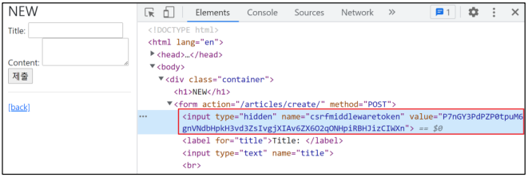

# ✔ HTTP (HyperText Transfer Protocol)
- W3 상에서 정보를 주고받을 수 있는 프로토콜
- 클라이언트와 서버 사이에 이루어지는 요청/응답(request/response) 프로토콜
- 클라이언트인 웹 브라우저가 HTTP를 통하여 서버로부터 웹페이지(HTML)나 그림 정보를 요청하면, 서버는 이 요청에 응답하여 필요한 정보를 해당 사용자에게 전달

> HTTP response status code
- 클라이언트에게 특정 HTTP 요청이 성공적으로 완료되었는지 여부를 알려줌
- 응답은 5개의 그룹으로 나뉘어짐

1. `Informational responses (1xx)`
   - 정보 교환

2. `Successful responses (2xx)`
   - 데이터 전송이 성공적으로 이루어졌거나, 이해되었거나, 수락되었음

3. `Redirection messages (3xx)`
   - 자료의 위치가 바뀌었음

4. `Client error responses (4xx)`
   - 클라이언트 측의 오류. 주소를 잘못 입력하였거나 요청이 잘못 되었음

5. `Server error responses (5xx)`
   - 서버 측의 오류로 올바른 요청을 처리할 수 없음

> HTTP request method
- HTTP는 request method를 정의하여, 주어진 리소스에 수행하길 원하는 행동을 나타냄

1. `GET`
 
   - 특정 리소스를 가져오도록 요청할 때 사용 (단순 조회하려는 경우)
   - 반드시 **데이터를 가져올 때만 사용**해야 함
   - DB에 변화를 주지 않음
   - GET은 query string parameter로 데이터를 보내기 때문에 **url을 통해 데이터를 보냄**
   - CRUD에서 **R** 역할을 담당
     - 예) 검색에서 사용, 특정 페이지를 조회 요청 시 사용
     - 검색은 서버에 영향을 미치는 것이 아닌 특정 데이터를 조회만 하는 요청이기 때문
     - 특정 페이지를 조회하는 요청을 보내는 HTML의 a tag 또한 GET을 사용

2. `POST`

   - 서버로 **데이터를 전송할 때 사용** (서버나 DB에 변경을 요청하는 경우)
   - 서버에 변경사항을 만듦
   - 리소스를 생성/변경하기 위해 데이터를 HTTP body에 담아 전송
   - GET의 query string parameter와 다르게 **URL로 데이터를 보내지 않음**
   - CRUD에서 **C/U/D** 역할을 담당
     - 예) 로그인에서 사용


# ✔ READ
> 사전 준비
- project 'crud'의 urls.py

  ```python
  # crud/urls.py

  from django.contrib import admin
  from django.urls import path, include

  urlpatterns = [
    path('admin/', admin.site.urls),
    path('articles/', include('articles.urls')),
  ]
  ```

- app 'articles'의 urls.py

  ```python
  # articles/urls.py

  from django.urls import path
  from . import views

  app_name = 'articles'
  urlpatterns = [
    path('', views.index, name='index'),
  ]
  ```

- app 'articles'의 views.py
  
  ```python
  # articles/views.py

  def index(request):
    return render(request, 'articles/index.html')
  ```

- app 'articles'의 index.html

  ```html
  <!-- templates/articles/index.html -->

  

  
    <h1>Articles</h1>
  
  ```

> READ (articles/index.html)
- index 페이지에서는 전체 게시글을 조회해서 출력
  
  ```python
  # articles/views.py

  from .models import Article

  def index(request):
    articles = Article.objects.all()
    context = {
      'articles': articles,
    }
    return render(request, 'articles/index.html', context)
  ```

  ```html
  <!--templates/articles/index.html-->

  

  
    <h1>Articles</h1>
    <hr>
    
      <p>글 번호: {{ article.pk }}</p>
      <p>글 제목: {{ article.title }}</p>
      <p>글 내용: {{ article.content }}</p>
      <hr>
    
  
  ```

> READ (articles/detail.html)
- 개별 게시글 상세 페이지 제작
- Variable Routing 활용

  ```html
  <!--templates/articles/index.html-->

  

  
    <h1>Articles</h1>
    <hr>
    
      ...
      <a href="">[detail]</a>
      <hr>
    
  
  ```

  ```python
  # articles/urls.py

  urlpatterns = [
    ...
    path('<int:pk>/', views.detail, name='detail'),
  ]
  ```

  ```python
  # articles/views.py

  def detail(request, pk):
    article = Article.objects.get(pk=pk)
    
    context = {
      'article': article,
    }

    return render(request, 'articles/detail.html', context)
  ```

  ```html
  <!-- templates/articles/detail.html -->

  

  
    <h2>DETAIL</h2>
    <h3>{{ article.pk }} 번째 글</h3>
    <hr>
    <p>제목: {{ article.title }}</p>
    <p>내용: {{ article.content }}</p>
    <p>작성 시각: {{ article.created_at }}</p>
    <p>수정 시각: {{ article.updated_at }}</p>
    <hr>
    <a href="">[back]</a>
  
  ```


# ✔ CREATE
> CREATE (articles의 'new' view 함수)
- 사용자의 입력을 받을 페이지를 렌더링 하는 함수
- articles/index 페이지에서 articles/new 페이지로 이동할 수 있는 하이퍼 링크 작성
  
  ```html
  <!-- templates/articles/index.html -->

  

  
    <h1>Articles</h1>
    <a href="">NEW</a>
    <hr>
    ...
  
  ```

  ```python
  # articles/urls.py

  urlpatterns = [
    path('', views.index, name='index'),
    path('new/', views.new, name='new'),
  ]
  ```

  ```python
  # articles/views.py

  def new(request):
    return render(request, 'articles/new.html')
  ```

  ```html
  <!-- templates/articles/new.html -->

  

  
    <h1>NEW</h1>
    <form action="" method="GET">
      <label for="title">Title: </label>
      <input type="text" name="title"><br>
      <label for="content">Content: </label>
      <textarea name="content"></textarea><br>
      <input type="submit">
    </form>
    <hr>
    <a href="">[back]</a>
  
  ```

> CREATE (articles의 'create' view 함수)
- 사용자가 입력한 데이터를 전송 받아 DB에 저장하는 함수

  ```python
  # articles/urls.py

  urlpatterns = [
    ...
    path('create/', views.create, name='create'),
  ]
  ```

  ```python
  # articles/views.py

  from django.shortcuts import render, redirect

  def create(request):
    title = request.GET.get('title')
    content = request.GET.get('content')

    article = Article(title=title, content=content)
    article.save()
    
    return redirect('articles:detail', article.pk)
  ```

> `redirect()` 함수

- Django shortcut functions 중 하나
- 인자에 작성된 곳으로 요청을 보냄
- 사용 가능한 인자
  - view name (URL pattern name) - `redirect('articles:index')`
  - absolute or relative URL - `redirect('/articles/')`

- 게시글 작성 후 터미널 로그 확인하기
  
  ```bash
  [06/Jun/2022 18:43:37] "GET /articles/create/?title=11&content=22 HTTP/1.1" 302 0
  [06/Jun/2022 18:43:37] "GET /articles/ HTTP/1.1" 200 1064
  ```

- 동작 원리
  
  1. 클라이언트가 `create url`로 요청을 보냄
  2. `create view 함수`의 redirect 함수가 302 status code를 응답
  3. 응답 받은 브라우저는 redirect 인자에 담긴 주소(index)로 사용자를 이동시키기 위해 `index url`로 Django에 재요청
  4. index page를 정상적으로 응답 받음 (200 status code)

- 참고) 302 Found
  - HTTP response status code 중 하나
  - 해당 상태 코드를 응답 받으면 브라우저는 사용자를 해당 URL의 페이지로 이동 시킴

> HTTP method - GET 재검토
- 현재는 게시글이 작성될 때 `/articles/create/?title=11&content=22`와 같은 URL로 요청이 보내짐
- GET은 **query string parameter**로 데이터를 보내기 때문에 url을 통해 데이터를 보냄
- 하지만 현재 요청은 데이터를 조회하는 것이 아닌 작성을 원하는 요청
- 따라서, 이때는 GET method가 아닌 **POST method**를 적용하는 것이 옳음

  ```html
  <!-- templates/articles/new.html -->

  

  
    <h1 class="text-center">NEW</h1>
    <form action="" method="POST">
    ...
    </form>
    <hr>
    <a href="">[back]</a>
  
  ```

  ```python
  # articles/views.py

  def create(request):
    title = request.POST.get('title')
    content = request.POST.get('content')

    article = Article(title=title, content=content)
    article.save()

    return render(request, 'articles/create.html')
  ```

- POST method로 변경하면 URL에서 query string parameter가 없어진 것을 확인할 수 있음
- 게시글 작성 후 터미널 로그 확인하기
  
  ```bash
  Forbidden (CSRF cookie not set.): /articles/create/
  [06/Jun/2022 19:27:28] "POST /articles/create/ HTTP/1.1" 403 2870
  ```

- 참고) 403 Forbidden
  - 서버에 요청이 전달되었지만, 권한 때문에 거절되었다는 것을 의미
  - 서버에 요청은 도달했으나 서버가 접근을 거부할 때 반환됨
  - 즉, 게시글을 작성할 권한이 없다 → Django 입장에서는 “작성자가 누구인지 모르기 때문에 함부로 작성할 수 없다”라는 의미
  - 모델(DB)을 조작하는 것은 단순 조회와 달리 최소한의 신원 확인이 필요하기 때문

> CSRF
- Cross-Site-Request-Forgery (사이트 간 요청 위조)
- 사용자가 자신의 의지와 무관하게 공격자가 의도한 행동을 하여 특정 웹 페이지를 보안에 취약하게 하거나 수정, 삭제 등의 작업을 하게 만드는 공격 방법
- 실제 사례 - “2008년 옥X 개인정보 해킹 사건”
  - 해커가 옥X 운영자에게 CSRF 코드가 포함된 가짜 사이트가 담긴 이메일을 보냄
  - 관리자는 해당 사이트에 정보를 입력하여 관련 정보가 해커에게 보내졌고, 해커는 옥X 사이트의 관리자 권한을 얻어냄 (당시 1860만건 유출)

> CSRF 공격 방어
- Security Token 사용 방식 (CSRF Token)
  - 사용자의 데이터에 임의의 난수 값(token)을 부여해 매 요청마다 해당 난수 값을 포함시켜 전송 시키도록 함
  - 이후 서버에서 요청을 받을 때마다 전달된 token 값이 유효한지 검증
  - 일반적으로 데이터 변경이 가능한 **POST, PATCH, DELETE Method** 등에 적용
  - Django는 DTL에서 **csrf_token 템플릿 태그**를 제공

- csrf_token 템플릿 태그 - ``
  - csrf_token 은 해당 POST 요청이 내가 보낸 것 인지를 검증하는 것
  - 해당 태그가 없다면 Django 서버는 요청에 대해 403 forbidden으로 응답
  - 템플릿에서 **내부 URL로 향하는 Post form**을 사용하는 경우에 사용
  - 외부 URL로 향하는 POST form에 대해서는 CSRF 토큰이 유출되어 취약성을 유발할 수 있기 때문에 사용해서는 안됨

    ```html
    <!-- templates/articles/new.html -->

    

    
      <h1>NEW</h1>
      <form action="" method="POST">
        
      ...
      </form>
      <hr>
      <a href="">[back]</a>
    
    ```

  - input type이 hidden으로 작성되며 value는 Django에서 생성한 hash 값으로 설정

    


# ✔ DELETE
> DELETE (articles의 'delete' view 함수)
- DB에 영향을 미치기 때문에 **POST method**를 사용

  ```html
  <!-- articles/detail.html -->

  

  
    ...
    <form action="" method="POST">
      
      <input type="submit" value="DELETE">
    </form>
    <a href="">[back]</a>
  
  ```

- 모든 글을 삭제 하는 것이 아니라 삭제하고자 하는 특정 글을 조회 후 삭제해야 함
  
  ```python
  # articles/urls.py

  urlpatterns = [
    ...
    path('<int:pk>/delete/', views.delete, name='delete'),
  ]
  ```

  ```python
  # articles/views.py

  def delete(request, pk):
    article = Article.objects.get(pk=pk)
    article.delete()
    
    return redirect('articles:index')
  ```