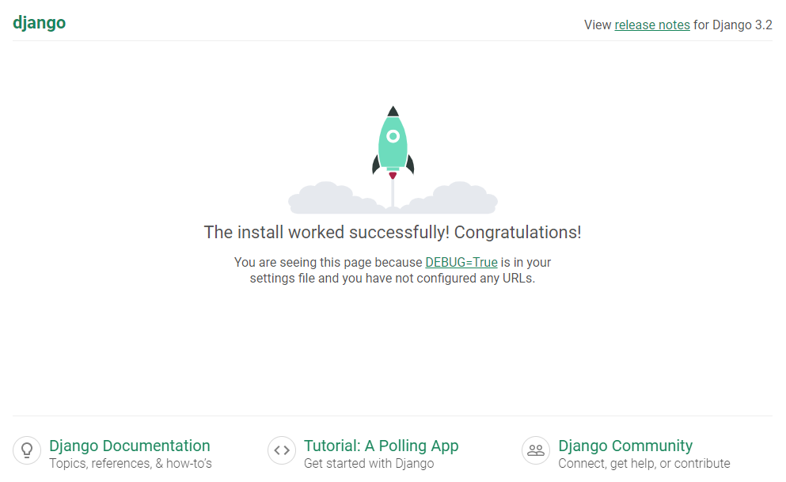
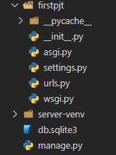
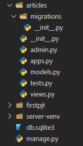

# ✔ Django 개발 환경
- Django 설치 전, 가상환경 설정 및 활성화 필수 
- 전반적인 Django 개발 환경 설정 과정
  
  1. `$ mkdir [폴더명]`: 프로젝트를 진행할 폴더 만들기
  2. `$ python -m venv [가상환경 폴더명]`: 폴더 안에 가상환경 만들기
  3. `$ source [가상환경 폴더명]/Scripts/activate`: 가상환경 실행
  4. `$ pip install django==[버전]`: 가상환경 내에서 설치하고자 하는 특정 버전의 장고 설치
  5. `$ django-admin startproject [프로젝트명] [시작경로]`: 장고 프로젝트 시작
  6. `$ python manage.py runserver`: 프로젝트 서버 실행
  7. 웹 브라우저 열어서 `localhost:8000` URL로 들어가면 장고 설치 성공 페이지가 뜸 
  8. `$ python manage.py startapp [애플리케이션명]`: 장고 앱 생성
  9. `$ deactivate`: 가상 환경 종료

> Django 설치

```bash
$ pip install django==3.2.13
```

- Django 4.0 릴리즈로 인해 3.2(LTS) 버전을 **명시**해서 설치
  - 주의) 버전을 명시하지 않으면 최신 버전이 설치됨
- LTS(Long Term Support, 장기 지원 버전)
  - 일반적인 경우보다 장기간에 걸쳐 지원하도록 고안된 소프트웨어의 버전
  - 컴퓨터 소프트웨어의 제품 수명주기 관리 정책
  - 배포자는 LTS 확정을 통해 장기적이고 안정적인 지원을 보장함

> Django 프로젝트 생성

```bash
$ django-admin startproject firstpjt .
```

- Project 이름에는 Python이나 Django에서 사용 중인 키워드 및 `-`(하이픈) 사용 불가
- `.`(dot)을 붙이지 않을 경우 현재 디렉토리에 프로젝트 디렉토리를 새로 생성하게 됨

> 서버 실행

```bash
$ python manage.py runserver
```

- 서버 실행 후 메인 페이지 확인
  
  

> Django 애플리케이션(앱) 생성

```bash
$ python manage.py startapp articles
```

- 일반적으로 애플리케이션 이름은 ‘복수형’으로 작성하는 것을 권장
- 프로젝트에서 앱을 사용하기 위해서는 반드시 `settings.py` 파일에서 **INSTALLED_APPS** 리스트에 생성한 앱의 이름을 추가해야 함
  - INSTALLED_APPS: Django installation에 활성화 된 모든 앱을 지정하는 문자열 목록
  
  ```python
  # settings.py
  
  INSTALLED_APPS = [
    # Local apps
    'articles',
    # Third party apps
    'haystack',
    # Django apps
    'django.contrib.admin',
    'django.contrib.auth',
    'django.contrib.contenttypes',
    'django.contrib.sessions',
    'django.contrib.sites',
  ]
  ```

> Project & Application

1. Project
  
   - 프로젝트는 앱의 집합 (collection of apps)
   - 프로젝트에는 여러 앱이 포함될 수 있고, 앱은 여러 프로젝트에 있을 수 있음

2. Application

   - 앱은 실제 요청을 처리하고 페이지를 보여주는 등의 역할을 담당
   - 일반적으로 앱은 하나의 역할 및 기능 단위로 작성하는 것을 권장함


# ✔ Django 프로젝트 구조



1. `__init__.py`

   - Python에게 이 디렉토리를 하나의 Python 패키지로 다루도록 지시
   - 별도로 추가 코드를 작성하지 않음

2. `asgi.py`

   - Asynchronous Server Gateway Interface
   - Django 애플리케이션이 비동기식 웹 서버와 연결 및 소통하는 것을 도움
   - 추후 배포 시에 사용하며 개발 시작 단계에서는 수정하지 않음

3. `settings.py`
   
   - Django 프로젝트 설정을 관리

4. `urls.py`

   - 사이트의 url과 적절한 views의 연결을 지정

5. `wsgi.py`

   - Web Server Gateway Interface
   - Django 애플리케이션이 웹서버와 연결 및 소통하는 것을 도움
   - 추후 배포 시에 사용하며 개발 시작 단계에서는 수정하지 않음

5. `manage.py`

   - Django 프로젝트와 다양한 방법으로 상호작용 하는 커맨드라인 유틸리티
  
     ```bash
     $ python manage.py <command> [options]
     ```


# ✔ Django 애플리케이션(앱) 구조



1. `admin.py`
   
   - 관리자용 페이지를 설정 하는 곳

2. `apps.py`

   - 앱의 정보가 작성된 곳
   - 별도로 추가 코드를 작성하지 않음

3. `models.py`

   - 애플리케이션에서 사용하는 Model을 정의하는 곳
   - MTV 패턴의 M에 해당

4. `tests.py`

   - 프로젝트의 테스트 코드를 작성하는 곳

5. `views.py`

   - view 함수들이 정의 되는 곳
   - MTV 패턴의 V에 해당