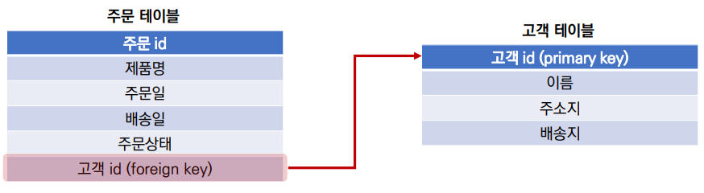
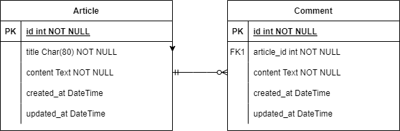
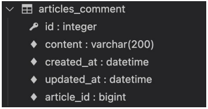
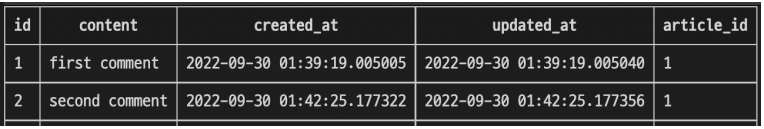

# ✔ one-to-many relationship
> RDB(관계형 데이터베이스)
- 데이터를 테이블, 행, 열 등으로 나누어 구조화하는 방식
- RDB의 모든 테이블에는 행에서 고유하게 식별 가능한 기본 키라는 속성이 있으며, 외래 키를 사용하여 각 행에서 서로 다른 테이블 간의 관계를 만드는 데 사용할 수 있음
  - 외래 키(Foreign Key, FK): 관계형 데이터베이스에서 다른 테이블의 행을 식별할 수 있는 필드(키)

  

1. `1:1` 관계

   - One-to-one relationships
   - 한 테이블의 레코드 **하나**가 다른 테이블의 레코드 **단 한 개**와 관련된 경우
   - 예) user - profil

2. `1:N` 관계

   - one-to-many relationships
   - 한 테이블의 **0개 이상**의 레코드가 다른 테이블의 레코드 **한 개**와 관련된 경우
   - 예) article - comment

3. `M:N` 관계

   - Many-to-many relationships
   - 한 테이블의 **0개 이상**의 레코드가 다른 테이블의 **0개 이상**의 레코드와 관련된 경우
   - 양쪽 모두에서 1:N 관계를 가짐

> Django Relationship fields 종류

1. `OneToOneField()`
   
   - A one-to-one relationship

2. `ForeignKey()`

   - A one-to-many relationship

3. `ManyToManyField()`

   - A many-to-many relationship

> Foreign Key

- 외래 키(외부 키)

- 관계형 데이터베이스에서 다른 테이블의 행을 식별할 수 있는 키

- 참조되는 테이블의 기본 키(Primary Key)를 가리킴

- 참조하는 테이블의 행 1개의 값은, 참조되는 측 테이블의 행 값에 대응됨
  
  - 이 때문에 참조하는 테이블의 행에는, 참조되는 테이블에 나타나지 않는 값을 포함할 수 없음

- 참조하는 테이블 행 여러 개가, 참조되는 테이블의 동일한 행을 참조할 수 있음
  
1. 키를 사용하여 부모 테이블의 유일한 값을 참조 (참조 무결성)

   - 참조 무결성: 데이터베이스 관계 모델에서 관련된 2개의 테이블 간의 일관성
   
   - 외래 키가 선언된 테이블의 외래 키 속성(열)의 값은 해당 테이블의 기본 키 값으로 존재

2. 외래 키의 값이 반드시 부모 테이블의 기본 키 일 필요는 없지만 유일한 값이어야 함

> `ForeignKey(to, on_delete, **options)`

- A one-to-many relationship을 담당하는 [Django의 모델 필드 클래스](https://docs.djangoproject.com/en/3.2/ref/models/fields/#foreignkey)
- Django 모델에서 관계형 데이터베이스의 외래 키 속성을 담당
- 2개의 필수 위치 인자가 필요
  
  - 참조하는 `model class`
  
  - `on_delete` 옵션

- on_delete 옵션

  - 외래 키가 참조하는 객체가 사라졌을 때, 외래 키를 가진 객체를 어떻게 처리할 지를 정의
  - 데이터 무결성을 위해서 매우 중요한 설정
  - on_delete 옵션 값
    - CASCADE, PROTECT, SET_NULL, SET_DEFAULT 등 여러 옵션 값들이 존재
    - CASCADE: 부모 객체(참조된 객체)가 삭제 됐을 때 이를 참조하는 객체도 삭제


# ✔ 1:N 관계 (Article - Comment)
> 모델 관계 설정
- 게시판의 게시글와 1:N 관계를 나타낼 수 있는 댓글 구현
- 1:N 관계에서 댓글을 담당할 Article 모델은 1, Comment 모델은 N이 될 것
  - 게시글은 댓글을 0개 이상 가진다.
  - 댓글은 반드시 하나의 게시글에 속한다.

  

> Comment 모델 정의
- 외래 키 필드는 ForeignKey 클래스를 작성하는 위치와 관계없이 필드의 마지막에 작성됨
- ForeignKey() 클래스의 인스턴스 이름은 참조하는 모델 클래스 이름의 단수형(소문자)으로 작성하는 것을 권장 (이유는 이어지는 모델 참조에서 확인 예정)

  ```python
  # articles/models.py

  class Comment(models.Model):
    article = models.ForeignKey(Article, on_delete=models.CASCADE)
    content = models.CharField(max_length=200)
    created_at = models.DateTimeField(auto_now_add=True)
    updated_at = models.DateTimeField(auto_now=True)
    
    def __str__(self):
      return self.content
  ```

- Migration 과정 진행

  ```bash
  $ python manage.py makemigrations
  $ python manage.py migrate
  ```

- migrate 후 Comment 모델 클래스로 인해 생성된 테이블 확인
  - ForeignKey 모델 필드로 인해 작성된 컬럼의 이름이 `article_id`인 것을 확인
  - 만약 ForeignKey 인스턴스를 article이 아닌 abcd로 생성 했다면 abcd_id로 만들어짐
    - 이처럼 명시적인 모델 관계 파악을 위해 참조하는 클래스 이름의 소문자(단수형)로 작성하는 것이 권장 되었던 이유

    

> shell_plus를 이용해 댓글 생성해보기
- shell_plus 실행

  ```bash
  $ python manage.py shell_plus 
  ```

- 댓글 생성

  ```python
  # 게시글 생성
  article = Article.objects.create(title='title', content='content')

  # 댓글 2개 생성
  comment1 = Comment.objects.create(content='first content', article=article)
  comment2 = Comment(content='second comment', article=article) 
  comment2.save()

  # 댓글 속성 값 확인
  comment1.content      # 'first comment'
  comment1.article      # <Article: title>
  comment1.article_id   # 1

  # comment 인스턴스를 통한 article 값 접근하기
  comment1.article.pk        # 1
  comment1.article.content   # 'content'
  ```

- 작성된 댓글 확인

  

> 관계 모델 참조 

- 역참조
  
  - 나를 참조하는 테이블(나를 외래 키로 지정한)을 참조하는 것
  
  - 즉, 본인을 외래 키로 참조 중인 다른 테이블에 접근하는 것
  
  - 1:N 관계에서는 1이 N을 참조하는 상황
    - 외래 키를 가지지 않은 1이 외래 키를 가진 N을 참조

- `Related manager`
  
  - Related manager는 1:N 혹은 M:N 관계에서 사용 가능한 문맥(context)
  
  - Django는 모델 간 1:N 혹은 M:N 관계가 설정되면 역참조할 때에 사용할 수 있는 manager를 생성
  
  - 우리가 이전에 모델 생성 시 objects라는 매니저를 통해 queryset api를 사용했던 것처럼 **related manager를 통해 queryset api를 사용**할 수 있게 됨
  
  - 1:N 관계에서 생성되는 Related manger의 이름은 `참조하는 모델명_set` 이름 규칙으로 만들어짐
  
  - [Related objects reference](https://docs.djangoproject.com/en/3.2/ref/models/relations/)

- 예) Article 모델이 Comment 모델을 역참조할 때 사용하는 매니저
  
  ```python
  article.comment_set.method()
  ```

  - article.comment 형식으로는 댓글 객체를 참조 할 수 없음
  
  - 대신 Django가 역참조 할 수 있는 comment_set manager를 자동으로 생성해 `article.comment_set` 형태로 댓글 객체를 참조할 수 있음
  
  - 반면 참조 상황(Comment → Article)에서는 실제 ForeignKey 클래스로 작성한 인스턴스가 Comment 클래스의 클래스 변수이기 때문에 `comment.article` 형태로 작성 가능

- ForeignKey arguments – `related_name` 옵션
  
  - ForeignKey 클래스의 선택 옵션
  
  - 역참조 시 사용하는 매니저 이름(model_set manager)을 변경할 수 있음
  
  - 작성 후, migration 과정이 필요
  
  - 아래와 같이 변경 하면 기존 `article.comment_set`은 더 이상 사용할 수 없고, `article.comments`로 대체됨

  ```python
  # articles/models.py
  
  class Comment(models.Model):
    article = models.ForeignKey(Article, on_delete=models.CASCADE,related_name='comments')
    ...
  ```

> shell_plus를 이용해 역참조 연습하기
- shell_plus 실행

  ```bash
  $ python manage.py shell_plus 
  ```

- `dir()` 함수를 사용해 클래스 객체가 사용할 수 있는 메서드를 확인

  ```python
  article = Article.objects.get(pk=1)
  
  dir(article)
  '''
  [
    ...
    'comment_set',
    'content',
    'created_at',
    'date_error_message',
    'delete',
    'from_db',
    'full_clean',
    ...
  ]
  '''
  ```

- 1번 게시글에 작성된 모든 댓글 조회하기 (역참조)

  ```python
  article.comment_set.all()
  # <QuerySet [<Comment: first comment>, <Comment: second comment>]>
  ```

> admin site 등록
- 새로 작성한 Comment 모델을 admin site에 등록하기

  ```python
  # articles/admin.py

  from .models import Article, Comment

  admin.site.register(Article)
  admin.site.register(Comment)
  ```


# ✔ Comment 구현
> 댓글 생성 - `CREATE`

- 사용자로부터 댓글 데이터를 입력 받기 위한 CommentForm 작성

  ```python
  # articles/forms.py

  from .models import Article, Comment
  
  class CommentForm(forms.ModelForm):
    
    class Meta:
      model = Comment
      fields = ('article',)
  ```

- detail 페이지에서 CommentForm 출력 (view 함수)
  
  - 외래 키 필드는 사용자의 입력으로 받는 것이 아니라 view 함수 내에서 받아 별도로 처리되어 저장되어야 함
  
  - 댓글의 외래 키 데이터에 필요한 정보가 바로 게시글의 pk 값

  ```python
  # articles/views.py

  from .forms import ArticleForm, CommentForm

  def detail(request, pk):
    article = Article.objects.get(pk=pk)
    comment_form = CommentForm()
    
    context = {
      'article': article,
      'comment_form': comment_form,
    }

    return render(request, 'articles/detail.html', context)
  ```

- detail 페이지에서 CommentForm 출력 (템플릿)

  ```django
  <!-- articles/detail.html -->

  

  
    ...
    <a href="">back</a>
    <hr>
    <form action=""" method="POST">
      
      {{ comment_form }}
      <input type="submit">
    </form>
  
  ```

- comment 작성 후 저장버튼 클릭 시 연결해줄 url 설정

  ```python
  # articles/urls.py

  urlpatterns = [
    ...,
    path('<int:pk>/comments/', views.comments_create, name='comments_create'),
  ]
  ```

- 입력한 comment의 유효성 검증 및 저장하는 함수 작성
  
  - `save(commit=False)`

    - save() 메서드는 데이터베이스에 저장하기 전에 객체에 대한 추가적인 작업을 진행할 수 있도록 인스턴스만을 반환해주는 옵션 값을 제공
    
    - 아직 데이터베이스에 저장되지 않은 인스턴스를 반환
    
    - 저장하기 전에 객체에 대한 사용자 지정 처리를 수행할 때 유용하게 사용

  - save 메서드의 commit 옵션을 사용해 DB에 저장되기 전 article 객체 저장하기

  ```python
  # articles/views.py

  def comments_create(request, pk):
    article = Article.objects.get(pk=pk)
    comment_form = CommentForm(request.POST)
    if comment_form.is_valid():
      comment = comment_form.save(commit=False)
      comment.article = article
      comment_form.save()
    
    return redirect('articles:detail', article.pk)
  ```

> 댓글 목록 - `READ`

- 작성한 댓글 목록 출력하기
- 방법1) 특정 article에 있는 모든 댓글을 가져온 후 context에 추가

  ```python
  # articles/views.py

  from .models import Article, Comment

  def detail(request, pk):
    article = Article.objects.get(pk=pk)
    comment_form = CommentForm()
    comments = article.comment_set.all()
    
    context = {
      'article': article,
      'comment_form': comment_form,
      'comments': comments,
    }

    return render(request, 'articles/detail.html', context)
  ```

  ```django
  <!-- articles/detail.html -->

  

  
    ...
    <a href="">back</a>
    <hr>
    <h4>댓글 목록</h4>
    <ul>
      
        <li>{{ comment.content }}</li>
      
    </ul>
    <hr>
    ...
  
  ```

- 방법2) 템플릿 태그를 이용해 바로 댓글 목록 출력

  ```django
  <!-- articles/detail.html -->

  

  
    ...
    <a href="">back</a>
    <hr>
    <h4>댓글 목록</h4>
    <ul>
      
        <li>{{ comment.content }}</li>
      
    </ul>
    <hr>
    ...
  
  ```

> 댓글 삭제 - `DELETE`

- comment 삭제 버튼 클릭 시 연결해줄 url 설정

  ```python
  # articles/urls.py

  urlpatterns = [
    ...,
    path('<int:article_pk>/comments/<int:comment_pk>/delete/', views.comments_delete, name='comments_delete'),
  ]
  ```

- comment 삭제를 처리하는 함수 작성

  ```python
  # articles/views.py

  def comments_delete(request, article_pk, comment_pk):
    comment = Comment.objects.get(pk=comment_pk)
    comment.delete()

    return redirect('articles:detail', article_pk)
  ```

- 댓글을 삭제할 수 있는 버튼을 각각의 댓글 옆에 출력 될 수 있도록 함

  ```django
  <!-- articles/detail.html -->

  
    ...
    <h4>댓글 목록</h4>
    <ul>
    
      <li>
        {{ comment.content }}
        <form action="" method="POST">
          
          <input type="submit" value="DELETE">
          </form>
      </li>
    
    </ul>
    <hr>
    ...
  
  ```

> 댓글 개수 출력

- 댓글 개수 출력하는 방법
  
  1. DTL filter - `length` 사용

     ```django
     {{ comments|length }}
     {{ article.comment_set.all|length }}
     ```

  2. Queryset API - `count()` 사용

     ```django
     {{ comments.count }}
     {{ article.comment_set.count }}
     ```

- detail 템플릿에 작성하기

  ```django
  <!-- articles/detail.html -->

  <h4>댓글 목록</h4>
  
    <p><b>{{ comments|length }}개의 댓글이 있습니다.</b></p>
  
  ```

> 댓글이 없는 경우 대체 컨텐츠 출력

- [DTL `for empty`](https://docs.djangoproject.com/en/4.1/ref/templates/builtins/#for-empty) 활용하기

  ```django
  <!-- articles/detail.html -->

  
    <li>
      {{ comment.content }}
      <form action="" method="POST">
        
        <input type="submit" value="DELETE">
      </form>
    </li>
  
    <p>댓글이 없어요..</p>
  
  ```


# ✔ 1:N 관계 (User - Comment)

> 모델 관계 설정
- User(1) - Comment(N)
- 0개 이상의 댓글은 1개의 회원에 의해 작성 될 수 있음

> Comment 모델 재정의
- Comment 모델에 User 모델을 참조하는 외래 키 작성

  ```python
  # articles/models.py

  class Comment(models.Model):
    article = models.ForeignKey(Article, on_delete=models.CASCADE)
    user = models.ForeignKey(settings.AUTH_USER_MODEL, on_delete=models.CASCADE)
    ...
  ```

- Migration 진행 
  - 기본적으로 모든 컬럼은 NOT NULL 제약조건이 있기 때문에 데이터가 없이는 새로 추가되는 외래 키 필드 user_id가 생성되지 않음
  - 따라서 기본값을 어떻게 작성할 것인지 선택해야 함

> 댓글 생성 - `CREATE`

- 인증된 회원의 댓글 작성 구현
  - 따라서 작성하기 전 로그인을 먼저 진행한 상태로 진행해야함

  ```python
  # articles/views.py

  @login_required
  def comments_create(request, pk):
    ...
  ```

- 댓글 작성 시 작성자 정보가 함께 저장될 수 있도록 save의 `commit` 옵션을 활용

  ```python
  # articles/views.py

  def comments_create(request, pk):
    article = Article.objects.get(pk=pk)
    comment_form = CommentForm(request.POST)
    if comment_form.is_valid():
      comment = comment_form.save(commit=False)
      comment.article = article
      comment.user = request.user
      comment.save()
    
    return redirect('articles:detail', article.pk)
  ```

> 댓글 목록 - `READ`

- detail 템플릿에서 각 게시글의 작성자 출력

  ```django
  <!-- articles/detail.html -->

  

  
    ...
    <h4>댓글 목록</h4>
    ...
    <ul>
      
      <li>
        {{ comment.user }} - {{ comment.content }}
        <form action="" method="POST">
          
          <input type="submit" value="DELETE">
        </form>
    ...
  ```

> 댓글 삭제 - `DELETE`

- 이제 댓글에는 작성자 정보가 함께 들어있기 때문에 현재 삭제를 요청하려는 사람과 댓글을 작성한 사람을 비교하여 본인의 댓글만 삭제 할 수 있도록 함

  ```python
  # articles/views.py

  def comments_delete(request, article_pk, comment_pk):
    comment = Comment.objects.get(pk=comment_pk)
    if request.user == comment.user:
      comment.delete()
    
    return redirect('articles:detail', article_pk)
  ```

- 추가로 해당 댓글의 작성자가 아니라면, 삭제 버튼을 출력하지 않도록 함

  ```django
  <!-- articles/detail.html -->

  

  
    ...
    <ul>
      
      <li>
        {{ comment.user }} - {{ comment.content }}
        
          <form action="" method="POST">
            
            <input type="submit" value="DELETE">
          </form>
        
        ...
  ```